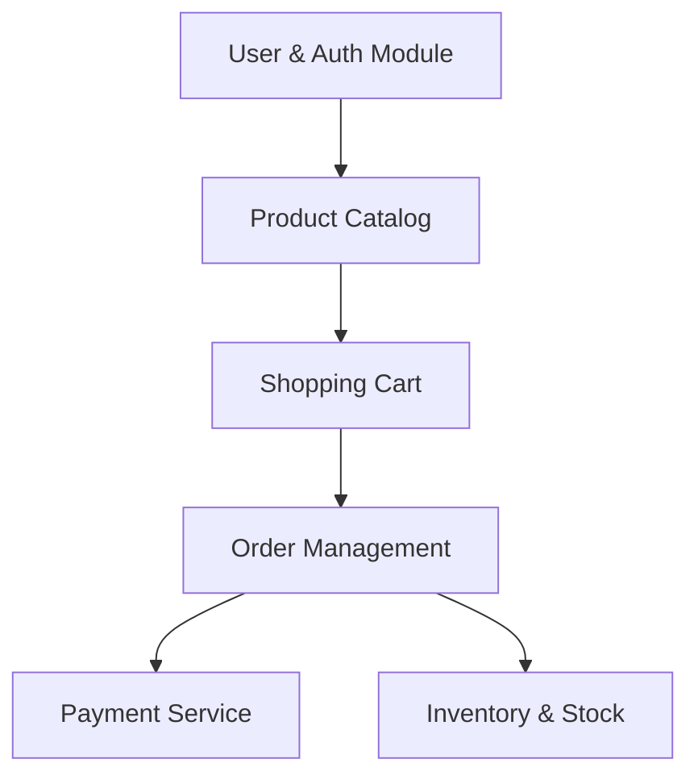

# E-commerce System Architecture & Roadmap

This document outlines the high-level functional ideas and system architecture for the E-commerce system, serving as a roadmap for development.

---

## 1. System Modules (Domain Areas)

To build a robust and scaleable E-commerce platform, we divide it into key functional modules:

### Module Breakdown

This table is the **target scope**. What exists today is in the phases below and, in detail, in the
[saga roadmap](./saga-orchestration-roadmap.md).

| Module | Core Features | Key Entities |
| :--- | :--- | :--- |
| **User & Auth** | Registration, login, role-based access, JWT validation, refresh tokens. | `User`, `Role`, `RefreshToken` |
| **Product Catalog** | Categories, product management, search, filtering, price, dynamic attributes. | `Product`, `Category`, `ProductImage` |
| **Cart & Ordering** | Adding items to cart, checkout, order summary, tracking, order history. | `Cart`, `CartItem`, `Order`, `OrderItem` |
| **Payment** | Checkout integration (Stripe, PayPal), webhook handling, transaction logging. | `Payment`, `Transaction` |
| **Inventory** | Stock tracking, reservations during checkout, low stock alerts. | `Inventory`, `StockMovement` |

---

## 2. Technical Stack & Patterns

- **Framework**: .NET 10.0 (ASP.NET Core Web API)
- **Database**: PostgreSQL (relational database suited for transaction consistency)
- **Messaging**: RabbitMQ via MassTransit, with a transactional outbox and inbox
- **Gateway**: YARP, fronting all services on port 5000
- **Service-to-service calls**: asynchronous messages everywhere except checkout, which makes two
  synchronous reads over **gRPC** (h2c, on a second port) — the cart from Cart and the prices from
  Catalog. See [How Services Talk to Each Other](./service-to-service-communication.md)
- **Packaging**: one container image per service, configured entirely from the environment. Since
  2026-09-17 the system runs either fully in containers or, as before, with the services on the
  developer's machine and infrastructure in Docker — see
  [Getting Started](../guides/getting-started.md) and
  [Runtime Topology](./microservices-design.md#45-runtime-topology--how-the-services-actually-run)
- **Architecture**: Clean Architecture (Domain-Centric)
- **Design Patterns**:
  - **CQRS (Command Query Responsibility Segregation)**: Separating write operations (Commands) from read operations (Queries) using **MediatR**.
  - **Repository Pattern**: Abstracting data access.
  - **Fluent Validation**: For request validation in the Application layer.
  - **Mapping by hand**: handlers build response records directly; no mapping library is used.

---

## 3. Recommended Roadmap & Approach

We will build the system iteratively using a feature-first approach within each Clean Architecture layer:

### Phase 1: Core Foundation & Auth (Completed)
- [x] Bootstrapping Clean Architecture project structure.
- [x] Spin up local PostgreSQL container using Docker.
- [x] Create User, Role, and RefreshToken domain entities.
- [x] Configure Entity Framework Core with Fluent API configurations.
- [x] Implement UserRepository and configure Dependency Injection.
- [x] Create and apply initial EF Core database migration.
- [x] Implement Password Hashing and JWT Token services.
- [x] Implement User Registration and Login flow ([Auth Design Guide](../features/auth/db-design.md)).

### Phase 2: Product & Catalog
- [x] Database schema for Products and Categories.
- [x] Create endpoints for the catalog (Admin).
- [ ] Update and delete endpoints — **not built**; a product or category cannot be edited after
  creation.
- [x] Search and filter endpoints (Customer): paging, category, search term, sort.

### Phase 3: Cart & Checkout
- [x] Database-backed shopping cart, as its own service
  ([specs/010](../../specs/010-customer-cart/)).
- [x] Order creation priced by Catalog, not by the client
  ([specs/009](../../specs/009-catalog-owns-price/)).
- [x] Order status driven by the saga: `Submitted` → `Completed` or `Failed`.
- [ ] Totals broken down into subtotal, shipping and tax —
  [#21](https://github.com/jessiicamaru/e-commerce-asp-dotnet-practice/issues/21).
- [ ] Delivery address and shipping —
  [#20](https://github.com/jessiicamaru/e-commerce-asp-dotnet-practice/issues/20).

### Phase 4: Payments & External Integrations
- [x] Payment service in the saga, with a **stub** gateway that approves without moving money.
- [ ] A real payment provider and its webhooks — deliberately deferred.
