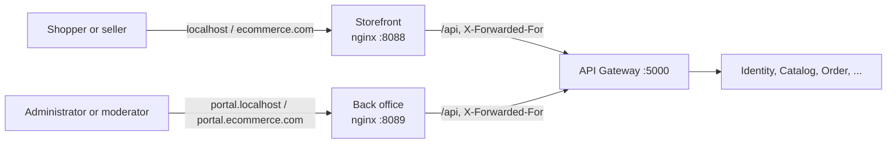

# Back office

The web app where staff - administrators and moderators - run the shop, apart from the
[storefront](storefront.md) where people shop and sell. Why it is a separate app, on an origin of its own, is
[ADR-003](adr-003-storefront-and-back-office.md). This page describes how it is built and how it fits the system.

**State:** the console lives here (specs/137, #277). Every page staff used at `/admin/...` in the storefront is at the
same path without the prefix, and the storefront sends its old addresses here. **Staff roles exist only here**
(specs/138, #278): a session made on the storefront never carries `Admin` or `Moderator`, whatever the person verified
with.

**Reading older pages:** a feature page that names a console page as `/admin/x` means the back office's `/x`. The old
address still works, because the storefront redirects it here, query and all.

## Place in the system

- **The same API.** The back office talks only to the gateway, through its own nginx (or Vite's proxy in
  development), exactly like the storefront. It has no endpoint of its own and needs no CORS.
- **Its own session.** Identity's refresh cookie is host-only, so the back office's cookie belongs to `portal.*` and
  the storefront's to the shop's host. A person signed in to both has two sessions, and signing out of one leaves the
  other.
- **The only place staff are staff** (specs/138). Identity records which app made each session
  (`refresh_tokens.Client`, from the request's `Origin` against `BackOffice:Origins`) and writes staff roles only into a
  back-office session verified with a code. On the storefront the same person is a customer, and `staffAccount` on the
  auth response is what draws their link here. **Every service checks it again** (specs/139): a back-office token's
  audience is `EcommerceBackOffice`, and `AddJwtAuthentication` drops the staff roles from any other token. How it works:
  [two-factor sign-in, section 7](../features/auth/totp-two-factor.md#7-how-this-project-uses-it).
- **Trusted like the storefront.** The gateway reads `X-Forwarded-For` only from known proxies (specs/062). The back
  office's nginx is one of them, at `172.30.10.11` on the `edge` network. Without that, every member of staff would
  share one address, and the sign-in rate limit would refuse them all together.

## Signing in

The form is the storefront's own, `SignInForm` in `packages/core/src/components/sign-in-form`. There is one form so
that the two apps cannot word a refusal differently. The steps:

1. **Password.** A staff account always answers with a two-factor challenge (specs/110).
2. **Code** from the authenticator app, or a recovery code. A dead challenge (five minutes, or five wrong codes)
   restarts from the password.
3. **The guard** (`RequireStaff`) decides what is drawn. Every request is still decided by the server.
   - Signed out: sent to sign in, then back to the page they asked for.
   - Staff: let in.
   - A staff account without two-factor sign-in: told to set it up from their account on the storefront. The server
     gives such a session no staff role.
   - Anybody else: told the back office is for staff, and offered only signing out.

The storefront's extras are left out on purpose: no "create an account", because staff accounts are not made by
sign-up, and no "forgot your password", because that is done from the storefront.

## Development and containers

| | Development | Compose |
| :-- | :-- | :-- |
| Address | `http://portal.localhost:5174` (`npm run dev:back-office` in `client/`) | `http://portal.localhost:8089` |
| Image | - | `ecommerce-back-office`, built from `client/Dockerfile` with `APP=back-office` |

⚠️ **Use `portal.localhost`, not `localhost:5174`.** Cookies are scoped by host, not by port. On one host the two
apps' `refreshToken` cookies would be the same cookie, and signing in to one would sign the other out. Browsers send
every `*.localhost` name to this machine and treat it as a secure context, so Identity's `Secure` cookie still works
over plain HTTP.

## Code

`client/apps/back-office` (see the [client README](../../client/README.md)):

| Path | Holds |
| :-- | :-- |
| `src/routes` | `/sign-in`, and the console behind `RequireStaff`; `RequireRole` keeps a moderator off an administrator's pages (specs/043) |
| `src/components/require-staff` | The guard above |
| `src/layouts/back-office-layout` | The frame: name, who is signed in, sign out |
| `src/layouts/admin-layout` | The console's grouped menu with what is waiting (specs/129), moved from the storefront |
| `src/pages/admin-*` | The 21 console pages, folder names kept so history follows them (specs/137 D2) |
| `src/components/close-shop` | Closing a shop, offered on an approved application and on a seller's row in People |
| `src/pages/sign-in` | Signing in |

It shares the kit and the theme (`packages/ui`, `theme.css`) and the core: session, services and translations. The
36 components the console shares with the storefront (order rows, parcel actions, the insights panels, the voucher
pages...) live in `packages/core/src/components` (specs/137 D1).

## Between the two apps

| What | How |
| :-- | :-- |
| Each app knows the other's address | `core/config/apps`, from `window.__APP_CONFIG__`. In a container nginx serves it at `/app-config.js` from `STOREFRONT_URL` and `BACK_OFFICE_URL`. In development each app's `public/app-config.js` is empty, so the defaults apply: `localhost:5173` and `portal.localhost:5174`. |
| An old `/admin/...` address on the storefront | `ToBackOffice` sends the browser to the same path in the back office, query and all. |
| A notice whose link is `/admin/...` | `openNoticeLink` opens it in the back office. Identity stores staff notices that way, and the stored ones need the mapping as much as new ones. |
| Staff on the storefront | "Management platform" in the header and on the account page, a full navigation (`followDestination`): a router asked to go to an absolute address would treat it as a path. |
| A console link to a product | `ProductLink`: the storefront's address in a new tab, so the console stays where it was. |

## Tests

| Where | Proves |
| :-- | :-- |
| Vitest `apps/back-office` | The guard's four answers. The sign-in goes on to the code and back where the person was. A refusal is worded as on the storefront. Neither sign-up nor a forgotten password is offered. Every console page's own tests, moved. A moderator opening `/` lands on `/moderation`. A shop is closed from an approved application, and from a seller's row only. |
| Vitest `packages/core` | The app addresses and the mapping of old console addresses; notice links into the console; `ProductLink` in each app. |
| Vitest `apps/storefront` | `/admin/...` redirects to the same page in the back office. The user menu opens the back office as another application. The shop page offers staff no action. |
| Playwright `e2e/back-office.spec.ts` | Against compose, at `portal.localhost:8089`: a moderator signs in with a code, lands on `/moderation`, stays signed in on a reload, and signs out; a customer is told it is for staff. |
| Playwright `e2e/flows.spec.ts` | The moderator approves a waiting product in the back office (specs/137). |
| `verify-storefront-image.sh <image> back-office` | The image serves the app, deep links and `/api`, with the right cache headers. |
