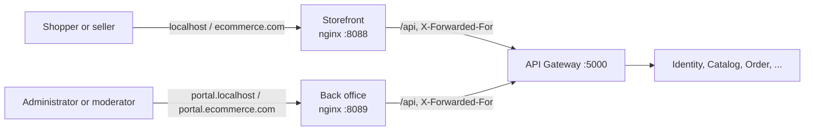

# Back office

The web app where staff - administrators and moderators - run the shop, apart from the
[storefront](storefront.md) where people shop and sell. Why it is a separate app, on an origin of its own, is
[ADR-003](adr-003-storefront-and-back-office.md). This page describes how it is built and how it fits the system.

**State:** the app exists, staff sign in to it, and it ships as an image (specs/136, #276). The console's pages are
still in the storefront and move here in #277. #278 then keeps staff roles out of storefront sessions.

## Place in the system

- **The same API.** The back office talks only to the gateway, through its own nginx (or Vite's proxy in
  development), exactly like the storefront. It has no endpoint of its own and needs no CORS.
- **Its own session.** Identity's refresh cookie is host-only, so the back office's cookie belongs to `portal.*` and
  the storefront's to the shop's host. A person signed in to both has two sessions, and signing out of one leaves the
  other.
- **Trusted like the storefront.** The gateway reads `X-Forwarded-For` only from known proxies (specs/062). The back
  office's nginx is one of them, at `172.30.10.11` on the `edge` network. Without that, every member of staff would
  share one address, and the sign-in rate limit would refuse them all together.

## Signing in

The form is the storefront's own, `SignInForm` in `packages/core/src/components/sign-in-form`. There is one form so
that the two apps cannot word a refusal differently. The steps:

1. **Password.** A staff account always answers with a two-factor challenge (specs/110).
2. **Code** from the authenticator app, or a recovery code. A dead challenge (five minutes, or five wrong codes)
   restarts from the password.
3. **The guard** (`RequireStaff`) decides what is drawn. Every request is still decided by the server.
   - Signed out: sent to sign in, then back to the page they asked for.
   - Staff: let in.
   - A staff account without two-factor sign-in: told to set it up from their account on the storefront. The server
     gives such a session no staff role.
   - Anybody else: told the back office is for staff, and offered only signing out.

The storefront's extras are left out on purpose: no "create an account", because staff accounts are not made by
sign-up, and no "forgot your password", because that is done from the storefront.

## Development and containers

| | Development | Compose |
| :-- | :-- | :-- |
| Address | `http://portal.localhost:5174` (`npm run dev:back-office` in `client/`) | `http://portal.localhost:8089` |
| Image | - | `ecommerce-back-office`, built from `client/Dockerfile` with `APP=back-office` |

⚠️ **Use `portal.localhost`, not `localhost:5174`.** Cookies are scoped by host, not by port. On one host the two
apps' `refreshToken` cookies would be the same cookie, and signing in to one would sign the other out. Browsers send
every `*.localhost` name to this machine and treat it as a secure context, so Identity's `Secure` cookie still works
over plain HTTP.

## Code

`client/apps/back-office` (see the [client README](../../client/README.md)):

| Path | Holds |
| :-- | :-- |
| `src/routes` | `/sign-in`, and everything else behind `RequireStaff` |
| `src/components/require-staff` | The guard above |
| `src/layouts/back-office-layout` | The frame: name, who is signed in, sign out |
| `src/pages/sign-in`, `src/pages/home` | Signing in; the greeting |

It shares the kit and the theme (`packages/ui`, `theme.css`), and the core: session, services and translations, in
the `backOffice` namespace.

## Tests

| Where | Proves |
| :-- | :-- |
| Vitest `apps/back-office` | The guard's four answers. The sign-in goes on to the code and back where the person was. A refusal is worded as on the storefront. Neither sign-up nor a forgotten password is offered. |
| Playwright `e2e/back-office.spec.ts` | Against compose, at `portal.localhost:8089`: a moderator signs in with a code, stays signed in on a reload, and signs out; a customer is told it is for staff. |
| `verify-storefront-image.sh <image> back-office` | The image serves the app, deep links and `/api`, with the right cache headers. |
