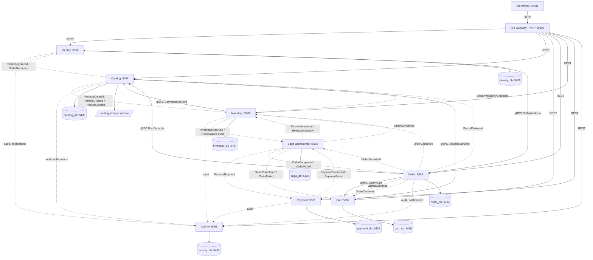

# E-Commerce Microservices Architecture Design

This document describes the service boundaries, databases and communication patterns of the system
**as built**. It began as a proposal; where the proposal and the code parted ways, the section says
so, and ideas that were never built are listed under [Proposed, not built](#6-proposed-not-built).

The exhaustive lists are generated from the code and are not repeated here: every endpoint in
[reference/api.md](../reference/api.md), every table in
[reference/data-model.md](../reference/data-model.md), every message with its publisher and consumers
in [reference/messages.md](../reference/messages.md), every gRPC method in
[reference/grpc.md](../reference/grpc.md) and every gateway route in
[reference/gateway.md](../reference/gateway.md).

---

## 1. System Topology (Mermaid)

Nine processes: the gateway and eight services. Solid arrows are HTTP (REST through the gateway,
gRPC between services); dotted arrows are messages, every one of which travels through RabbitMQ and
leaves its publisher through the transactional outbox. RabbitMQ itself is left out of the picture so
that each message can be drawn from the service that publishes it to the service that consumes it.



Every database is PostgreSQL, one per service, and no service reads another's. The Orchestrator has
no controllers; the gateway routes one address to it, its `/health` (specs/071).

---

## 2. Microservice Module Breakdown

Each microservice is self-contained: it owns its business logic and its database, and is reached by
other services only through its published interface (REST, gRPC or messages). The tables below name
the main ones; the columns are in [reference/data-model.md](../reference/data-model.md). Every
database that publishes or consumes also holds MassTransit's `InboxState`, `OutboxMessage` and
`OutboxState`.

### 2.1 Identity (`Ecommerce.Identity`)
* **Responsibility**: accounts, sign-in, token signing (access token plus an HttpOnly refresh
  cookie), and roles - `Admin`, `Customer`, `Seller`, `Moderator`, seeded at startup together with the
  first administrator. It also owns:
  * **delivery addresses** (feature 011) - several per customer, exactly one default, served to Order
    as `AddressReading.GetMyAddress` over gRPC, identifying the customer from the forwarded token;
  * **sellers** (specs/027) - a `SellerProfile` with the shop name, announced to Catalog as
    `SellerRegisteredEvent` / `SellerRenamedEvent` through Identity's own outbox;
  * **shop applications** (specs/044) - `register-seller` creates a customer plus a pending
    application, and a moderator or administrator approves or rejects it;
  * **staff moderation** (specs/043) - an administrator grants or revokes `Moderator`; staff lock
    accounts, and an administrator bans them.
* **Database**: `ecommerce_identity_db` (port `5435`). Tables: `users`, `roles`, `user_roles`,
  `refresh_tokens`, `delivery_addresses`, `seller_profiles`, `shop_applications`.
* **Emails** are compared case-insensitively through a unique index on `lower("Email")` (#49).

### 2.2 Catalog (`Ecommerce.Catalog`)
* **Responsibility**: categories and products. A product is sold in **variants** (specs/020): the
  variant carries the SKU, the options, the price per currency (specs/022) and its own availability;
  **the first variant reuses the product's id**. Product and category text is translated
  (specs/021, 026). Photographs for products and for single variants (specs/019, 032) live on the
  `catalog_images` volume behind `IProductImageStore`.
* **The owner of price**: checkout asks Catalog over gRPC (`CatalogPricing.PriceVariants`) and
  freezes the answer onto the order line. A variant not priced in the requested currency has no price
  and cannot be bought - there is no conversion.
* **The owner of who sells what** (specs/027): `products.SellerId`, null for the shop's own goods.
  Inventory asks it live over gRPC (`CatalogOwnership.GetVariantOwners`) before letting a seller set
  stock (specs/031).
* **Moderation and reviews**: a seller's product is `Pending` until staff approve it
  (`products.ReviewStatus`, specs/045); only a customer whose parcel was delivered may review a product
  (`review_eligibility`, fed by `ParcelDeliveredEvent`, specs/046). Product views are counted per day
  for the administrator's overview (specs/047).
* **Read models, for display only**: `Availability` (`InStock` / `OutOfStock`, fed by Inventory - see
  [Stock ownership](#stock-ownership)) and `sellers` (shop names, fed by Identity).
* **Database**: `ecommerce_catalog_db` (port `5433`). Tables: `products`, `product_variants`,
  `variant_options`, `variant_prices`, `product_translations`, `variant_option_translations`,
  `categories`, `category_translations`, `sellers`, `product_reviews`, `review_eligibility`,
  `product_views`.

### 2.3 Cart (`Ecommerce.Cart`)
* **Responsibility**: one cart per signed-in customer, outliving a session. **Stores no price** - it
  asks Catalog (`DescribeVariants`) when read, and renders with prices marked unavailable when Catalog
  does not answer. Serves `CartReading.GetMyCart` to Order at checkout, identifying the customer from
  the forwarded token, and removes ordered lines when the order **completes**.
* **Database**: `ecommerce_cart_db` (port `5439`). Tables: `carts`, `cart_lines`, `checkout_outcomes`.
* Publishes nothing, so it has no outbox. Design and the out-of-order event handling:
  [specs/010](../../specs/010-customer-cart/).

### 2.4 Order (`Ecommerce.Order`)
* **Checkout**: reads the caller's cart from Cart, the delivery address from Identity and the prices
  from Catalog, prices delivery from its own options, computes tax for the destination, and writes
  the order with a frozen copy of all of it - the total in named parts
  ([ADR-002](./adr-002-tax-exclusive-prices.md)), the language and currency it was placed in, the
  seller and shop name of each line, and the marketplace commission rate. It then publishes
  `OrderSubmittedEvent`. `GET /api/orders/quote` prices a checkout through the same code
  (`CheckoutPricing`) and places nothing.
* **After the saga**: settles the order to `Paid` or `Failed` on the saga's outcome. Fulfilment is
  **per seller** (specs/035): one `order_shipments` row per seller per order plus one for the shop's own
  goods, each moved `Preparing` -> `Shipped` by its seller (or by staff, for the shop's part), and
  delivered when the customer confirms it or `DeliveryConfirmationSweeper` does so 7 days after
  shipping (specs/040). A paid order can be **cancelled** until the first parcel ships (specs/039),
  which publishes `OrderCancelledEvent`.
* **Money owed to sellers** (specs/037): each part freezes its goods total, commission and delivery
  share at checkout; a delivered part is due, and an administrator records a `payout` that claims it.
* **Reads**: a customer's own orders, a seller's own sales (their lines only, specs/034), the staff
  fulfilment queue and the administrator's revenue and top-product insights (specs/038, 047).
* **Database**: `ecommerce_order_db` (port `5434`). Tables: `orders`, `order_items`,
  `order_shipments`, `payouts`.

### 2.5 Saga Orchestrator (`Ecommerce.Orchestrator`)
* **Responsibility**: the MassTransit `OrderStateMachine` that coordinates checkout - reserve stock,
  take payment, release stock when payment fails - and publishes `OrderCompletedEvent` or
  `OrderFailedEvent`. It ends at payment; nothing after that (fulfilment, cancellation, delivery)
  passes through it. See the [saga roadmap](./saga-orchestration-roadmap.md).
* **Database**: `ecommerce_saga_db` (port `5436`). Table: `order_state_data`. Its `DbContext` lives
  in the WebApi project.
* No controllers. `/health` (since specs/071, #115) reports the saga database and the broker, and the gateway
  routes `/api/orchestrator/health` to it - its only route.

### 2.6 Inventory (`Ecommerce.Inventory`)
* **Responsibility**: the sole authority on sellable quantity, per **variant** (its `ProductId`
  columns hold a variant id since specs/020). Reserves stock for the saga, releases it on
  compensation, confirms it on `OrderCompletedEvent`, puts a cancelled order's units back on
  `OrderCancelledEvent` (specs/039), and returns abandoned holds with `ReservationExpirySweeper`.
  Sellers and administrators set stock through `PUT /api/stock/{variantId}`; for a seller, Inventory
  first asks Catalog who owns the variant (specs/031).
* **Database**: `ecommerce_inventory_db` (port `5437`). Tables: `stock_items`, `stock_reservations`.
  A reservation locks **one aggregated row per variant** with `SELECT … FOR UPDATE`, taken in id
  order so two orders cannot deadlock. No Redis. The unit-pool alternative is in
  [concepts](../concepts/shopify-inventory-skip-locked-pattern.md), studied and not adopted.

### 2.7 Payment (`Ecommerce.Payment`)
* **Responsibility**: answers the saga's `ProcessPaymentCommand`, and records a refund for a
  cancelled order (specs/039). **A stub**: it approves (or, with `PAYMENT_OUTCOME=Reject`, refuses)
  without contacting any provider and moves no money, and says so on every row (`Provider = "Stub"`),
  in its startup log and in `/health`.
* **Database**: `ecommerce_payment_db` (port `5438`). Tables: `payments` (one per order) and
  `refunds` (one per order).

### 2.8 Activity (`Ecommerce.Activity`)
* **Responsibility**: the **audit log** (specs/041) and **in-app notifications** (specs/042). It
  consumes `AuditEntryRecorded` and `UserNotificationRequested`, which Identity, Catalog, Order,
  Inventory and Payment publish through `Ecommerce.Shared` (`IAuditTrail`, `INotifier`) and their own
  outboxes. It stores each once, keyed by the id the publisher minted, and computes an audit entry's
  field-level diff when it arrives. Reads: `/api/audit` (Admin; `/api/audit/mine` for staff) and
  `/api/notifications` (the caller's own only).
* **Database**: `ecommerce_activity_db` (port `5440`). Tables: `audit_entries`, `notifications`.
* Nothing calls it synchronously except the gateway.

### 2.9 API Gateway (`Ecommerce.ApiGateway`)
* YARP on port `5000`, the only address the storefront and Bruno use - see [§4](#4-api-gateway-configuration-yarp).
* Limits how fast one client may call the anonymous auth endpoints (specs/062) - see
  [security §4.7](../features/auth/security-best-practices.md).

---

## 3. Communication Patterns

### 3.1 Asynchronous Event-Driven & Saga Orchestration (Broker: RabbitMQ)
Used when a service needs to trigger actions in other services without waiting for a response. Every
message is published through the publisher's transactional outbox and every consumer is idempotent
([reliable messaging](./reliable-messaging-and-outbox-pattern.md)). The full list of 20 messages is
in [reference/messages.md](../reference/messages.md).

```text
Order (checkout)
      │
      ▼ (OrderSubmittedEvent via Transactional Outbox)
RabbitMQ Broker ──► Saga Orchestrator (OrderStateMachine)
                          │
         ┌────────────────┴────────────────┐
         ▼                                 ▼
[ReserveInventoryCommand]        [ProcessPaymentCommand]
         │                                 │
         ▼                                 ▼
  [Inventory Service]              [Payment Service]
 (Reserve Bounded Stock)          (Stub: approve or refuse)
         │                                 │
         └─────────────┬───────────────────┘
                       ▼ (payment refused)
         [ReleaseInventoryCommand] ──► Rollback Inventory
```

Outside the saga, messages carry four other kinds of fact:

| Fact | Publisher | Consumers |
| :--- | :--- | :--- |
| A product or variant exists, or was deleted | Catalog | Inventory registers or drops its stock rows |
| Stock availability changed | Inventory | Catalog's `Availability` read model |
| A seller registered or renamed their shop | Identity | Catalog's `sellers` read model |
| A paid order was cancelled | Order | Inventory puts the units back; Payment records a refund |
| A parcel was delivered | Order | Catalog records who may review which product |
| Something worth auditing happened; somebody should be told | Identity, Catalog, Order, Inventory, Payment | Activity |

### 3.2 Synchronous calls (gRPC)
Four gRPC services, five caller-to-callee edges, all reads:

| Caller | Callee | RPC | Why it cannot be a message |
| :--- | :--- | :--- | :--- |
| Order | Cart | `CartReading.GetMyCart` | what is being bought has to be known before the order exists |
| Order | Identity | `AddressReading.GetMyAddress` | where the order goes is copied onto it at the moment of sale (feature 011) |
| Order | Catalog | `CatalogPricing.PriceVariants` | the price is a decision about money, taken at the moment of sale |
| Cart | Catalog | `CatalogPricing.DescribeVariants` | showing today's name and price; the cart renders without it if Catalog is down |
| Inventory | Catalog | `CatalogOwnership.GetVariantOwners` | whether a seller may stock a variant is a permission, and a permission must not be eventually consistent (specs/031) |

`CatalogPricing` still serves `GetPrices` and `DescribeProducts`, the product-level methods from
before variants, so that an older Order or Cart image keeps working during a rollback; nothing in the
current code calls them.

They run over **h2c on a second port** because one plaintext port cannot serve both HTTP/1.1 and
HTTP/2: `5156` (Identity), `5157` (Catalog) and `5162` (Cart) when started with `start-dev`; `8081`
inside a container, published on the host as `6056`, `6057` and `6062`. The cost is real: Catalog,
Cart or Identity being down stops checkout (`503`), and Catalog being down stops a seller setting
stock (`503`). The reasoning and the measurements are in
[How Services Talk to Each Other](./service-to-service-communication.md).

**Order does not ask Inventory whether something is in stock.** An answer read before the
reservation is already stale by the time it is acted on; the only check that counts is the
reservation itself, taken under a row lock inside the saga.

---

## 4. API Gateway Configuration (YARP)

We use Microsoft's **YARP (Yet Another Reverse Proxy)** library in
[`Ecommerce.ApiGateway`](../../server/src/ApiGateway/Ecommerce.ApiGateway/) on **port `5000`**.

The routes live in [`appsettings.json`](../../server/src/ApiGateway/Ecommerce.ApiGateway/appsettings.json),
which is the source of truth; the generated table of all of them is
[reference/gateway.md](../reference/gateway.md). There are seven clusters - Identity, Catalog, Cart,
Order, Inventory, Payment and Activity - and each `/api/<svc>/health` route rewrites to that service's
`/health`. A path prefix without a route is the usual reason a new endpoint answers 404 through the
gateway and 200 directly; `/api/sellers` was exactly that when specs/027 added it.

### Route mappings (excerpt)

```json
  "ReverseProxy": {
    "Routes": {
      "identity-route": {
        "ClusterId": "identity-cluster",
        "Match": { "Path": "/api/auth/{**catch-all}" }
      },
      "catalog-products-route": {
        "ClusterId": "catalog-cluster",
        "Match": { "Path": "/api/products/{**catch-all}" }
      },
      "order-route": {
        "ClusterId": "order-cluster",
        "Match": { "Path": "/api/orders/{**catch-all}" }
      },
      "notifications-route": {
        "ClusterId": "activity-cluster",
        "Match": { "Path": "/api/notifications/{**catch-all}" }
      }
    },
    "Clusters": {
      "identity-cluster": {
        "Destinations": { "destination1": { "Address": "http://localhost:5056/" } }
      },
      "catalog-cluster": {
        "Destinations": { "destination1": { "Address": "http://localhost:5057/" } }
      },
      "order-cluster": {
        "Destinations": { "destination1": { "Address": "http://localhost:5059/" } }
      },
      "activity-cluster": {
        "Destinations": { "destination1": { "Address": "http://localhost:5063/" } }
      }
    }
  }
```

The gateway ignores a client's `traceparent`, so every trace starts there
([observability](../guides/observability.md)).

### Rate limits (specs/062)

Six routes are more specific than `/api/auth/{**catch-all}` and carry a `RateLimiterPolicy`: `sign-in`
for login, both registrations and reset-password, `email` for forgot-password, and `session` for refresh.
`app.UseRateLimiter()` runs after routing and before `MapReverseProxy()`, and counts per client IP. The
IP is the connection's, or the last hop a proxy in `GATEWAY_TRUSTED_PROXIES` wrote. Details and numbers
are in [security §4.7](../features/auth/security-best-practices.md).

---

## 4.5 Runtime Topology — How the Services Actually Run

Changed on 2026-09-17 ([spec 005](../../specs/005-containerise-services/)). Until then the design
described above only ever ran in one place: a developer's own machine. Every connection string
hardcoded `Host=localhost`, every service pinned `app.Run("http://localhost:PORT")`, and there was
no artifact at all — running the system elsewhere meant copying the source and building it again.

### The shift: configuration moves out of the code

| | Before | After |
| :--- | :--- | :--- |
| Database address | `Host=localhost` in six `Program.cs` | `DB_HOST`, defaulting to `localhost` |
| Listen address | `app.Run("http://localhost:5057")` | `ASPNETCORE_URLS`, falling back to the pinned address |
| Settings precedence | `.env` **overrode** the environment | environment **overrides** `.env` |
| Artifact | none | one image per service |
| Schema creation | `dotnet ef` from the host, only | that, or `RUN_MIGRATIONS_ON_STARTUP` in a container |

The precedence inversion is the one that mattered architecturally. A settings file that wins over
the environment makes an image unconfigurable: whatever a container is told at run time would be
overridden by a file inside it, and the same image would behave identically everywhere. Fixing it is
what made "build once, run anywhere with different settings" possible at all.

### Two run modes, deliberately both supported

```text
docker compose up -d                          infrastructure only  -> start-dev.sh, debugger attached
  + -f docker-compose.app.yml                 everything           -> one command, nothing on the host
```

The services live in an **overlay** file rather than in `docker-compose.yml`. Merging them would
force every contributor down the container path; keeping them apart means the existing workflow is
untouched. That is why every new setting defaults to today's local value rather than to a container
value.

### What each service looks like now

- One [Dockerfile](../../server/Dockerfile) builds every service, selected by a `PROJECT` build
  argument. One file per service would drift — a fix applied to all but one is invisible and nothing
  fails. It copies each `.csproj` by name, so a new project needs a line there too.
- Inside its container a service binds `8080` (and Identity, Catalog and Cart also `8081` for gRPC);
  compose maps that to the port it has always used on the host, so the gateway routes, the port table
  and every guide stay true.
- The gateway is the only service whose configuration genuinely differs between the two modes,
  because it is the only one that needs to know where the *others* are.
- Services wait for their dependencies through `depends_on: condition: service_healthy` plus a
  connection retry. Containers start in parallel; a service reaching its database a moment early is
  normal, not a failure.

### What came later

Spec 005 made images and ran them locally. Publishing them came next: a merge to `main` whose checks
pass publishes one image per service - nine, the gateway included - to GHCR, tagged `sha-<short-sha>`
and never overwritten ([specs/006](../../specs/006-release-and-rollback/),
[specs/008](../../specs/008-immutable-release-tags/)).

Rolling back an image does **not** undo a migration. Dropping `products.StockQuantity` meant any
Catalog build from before that change failed against the schema. Expand/contract is now a rule in the
[constitution](../../.specify/memory/constitution.md), and a `schema-compatibility` CI job comments on
any pull request whose migration drops, renames or narrows a column. That rule is why several later
features added **no** new enum value a rolled-back image could not parse (delivery is columns on
`order_shipments`, not a `Delivered` status; a cancelled order reuses the existing `Cancelled`).

Operational detail lives in [Running in Containers](../infrastructure/running-in-containers.md);
step-by-step startup is in [Getting Started](../guides/getting-started.md).

---

## 5. Key Patterns

All are in place:
1. **Saga Pattern (Orchestration)**: a dedicated orchestrator coordinates reservation, payment and
   compensation — [saga roadmap](./saga-orchestration-roadmap.md).
2. **API Gateway (YARP)**: one entry point on port `5000`.
3. **Transactional Outbox**: every service that publishes writes the row and the message in one
   transaction — [reliable messaging](./reliable-messaging-and-outbox-pattern.md).
4. **Database per service**, with read models for display (availability, shop names) and live
   synchronous questions for decisions (price, ownership).
5. **Freeze at the moment of sale**: an order line keeps its price, name, options, seller and shop
   name, and the order its address, language, currency and commission rate, so that later changes to
   the catalogue do not rewrite a record of a purchase.

## 6. Proposed, not built

The original proposal included these. None exists; each is listed so that a reader does not look for
it in the code.

- **An e-mail notification service** (registration, invoices, shipment). What exists instead is
  **in-app** notifications in Activity (specs/042); nothing sends e-mail.
- **MongoDB for Catalog**, and **brands / dynamic product attributes**. Variant options
  (`Kit: Body only · Colour: Black`) are the only product attributes.
- **Redis** — as a Catalog cache, or for inventory locking.
- **Order asking Inventory for stock over gRPC** — replaced by reservation inside the saga (§3.2).
- **A real payment provider.** Payment is a stub that moves no money, and a seller payout is a ledger
  entry, not a transfer.
- **Object storage for images.** Images are a directory on one volume, which assumes one Catalog
  instance; `IProductImageStore` is the seam a bucket would replace.

---

## Stock ownership

**Inventory is the sole authority on sellable quantity.** It learns a variant exists from
`ProductCreatedEvent` or `ProductVariantCreatedEvent`, registers it at zero, and a seller (for their
own variants) or an administrator sets quantities through Inventory. `GET /api/stock/{id}` - the id is
a variant id - is where a real number comes from; it is public.

Catalog holds `Availability` — a **read model**, fed by `StockAvailabilityChangedEvent` from
Inventory, exposed as `"InStock"` / `"OutOfStock"` and never as a count. Nothing sells against it:
checkout reserves under `FOR UPDATE` against Inventory's row, and it must stay that way, because a
read model fed by messages is seconds behind by design.

### What this section used to say, and why it was wrong

It used to say `Product.StockQuantity` was "descriptive only", that the field was not removed
because "that would be a breaking API change", and that "nothing may read it for an availability
decision".

The first two were accurate. The third was not enforceable, and in practice was false: the field was
returned by `GET /api/products`, which is `[AllowAnonymous]`, so every shopper read it while deciding
whether to buy. **A shopper's decision to buy is an availability decision** — the most important one
there is. Meanwhile the number could never change: Catalog had no update command and consumed no
messages, so it stayed at whatever was typed at creation. Measured on 2026-09-17, one product read
50 in the catalogue while Inventory went from 10 to 8.

Filed as [#4](https://github.com/jessiicamaru/e-commerce-asp-dotnet-practice/issues/4) and fixed in
[specs/004-stock-single-source](../../specs/004-stock-single-source/). The breaking change was taken:
there was no frontend in the repository at the time, so a caller that broke would find out
immediately, whereas a caller reading a stale number never does.

The lesson worth keeping is not about stock. It is that **"nothing may read this" is a wish, not a
constraint.** A duplicated value that is reachable will be read. See
[constitution.md](../../.specify/memory/constitution.md) principle I.
