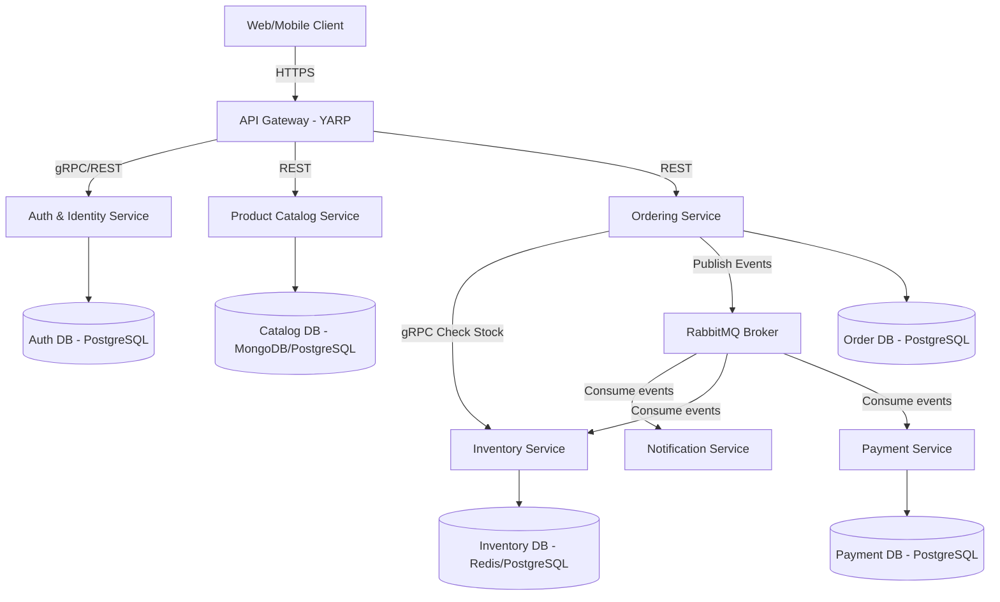

# E-Commerce Microservices Architecture Design

This document details the microservices architecture proposal for the other modules of the E-commerce platform. It outlines service boundaries, database design principles, and service communication patterns (gRPC vs. RabbitMQ).

---

## 1. System Topology (Mermaid)



---

## 2. Microservice Module Breakdown

Each microservice is fully self-contained, owning its business logic, database, and scaling profile.

### 2.1 Identity & Auth Service (Present)
* **Responsibility**: User management, authentication, role assignment, token validation (Access + Refresh tokens).
* **Database**: `ecommerce-identity-db` (Postgres).
* **Key Entities**: `User`, `Role`, `RefreshToken`.

### 2.2 Product Catalog Service
* **Responsibility**: Managing brands, categories, dynamic product specifications, pricing, search indexes, and media.
* **Database**: `ecommerce-catalog-db` (Document database like **MongoDB** is recommended due to the schema-less, polymorphic nature of dynamic product attributes; otherwise Postgres with JSONB columns).
* **Key Entities**: `Product`, `Category`, `Brand`, `ProductAttribute`.
* **Caching**: Highly read-heavy. Uses Redis cache to serve catalog endpoints under 10ms.

#### 2.3 Ordering Service (Implemented: `Ecommerce.Order`)
* **Responsibility**: Shopping cart persistence, checkout validation, price calculations, order creation, and publishing `OrderSubmittedEvent`.
* **Database**: `ecommerce-order-db` (Port `5434`, Postgres, due to strong transactional ACID requirements).
* **Key Entities**: `Order`, `OrderItem`.

### 2.4 Saga Orchestrator Service (Implemented: `Ecommerce.Orchestrator`)
* **Responsibility**: Standalone microservice running MassTransit `OrderStateMachine` Saga to coordinate multi-service distributed transactions (Inventory reservation, Payment processing, and Compensating Transactions).
* **Database**: `ecommerce-orchestrator-db` (Port `5436`, Postgres, storing `order_state_data` Saga state).
* **Key Entities**: `OrderStateData`.

### 2.5 Inventory Service
* **Responsibility**: Real-time stock counting, reserving items during checkout, updating stock levels on new shipments, and resolving low stock alerts.
* **Database**: `ecommerce-inventory-db` (Postgres or Redis for ultra-fast distributed locking of inventory to prevent double-selling).
* **Key Entities**: `Inventory`, `StockReservation`, `StockMovement`.

### 2.6 Payment Service
* **Responsibility**: Initiating transactions, interfacing with Stripe, PayPal, VNPay API, and processing payment gateway webhooks securely.
* **Database**: `ecommerce-payment-db` (Postgres, audit trail of transactions).
* **Key Entities**: `PaymentTransaction`, `Refund`.

### 2.7 Notification Service
* **Responsibility**: Decoupled worker service that listens to events and dispatches customer emails (registration confirmation, invoice PDF, order shipment tracking).
* **Database**: None or tiny audit database.
* **Communication**: 100% Event-driven (never calls other services synchronously).

---

## 3. Communication Patterns

### 3.1 Asynchronous Event-Driven & Saga Orchestration (Broker: RabbitMQ)
Used when a service needs to trigger actions in other services without waiting for a response, ensuring high resilience, eventual consistency, and compensation rollback.

```text
Ordering Service (Submit Order)
      │
      ▼ (OrderSubmittedEvent via Transactional Outbox)
RabbitMQ Broker ──► Saga Orchestrator (OrderStateMachine)
                          │
         ┌────────────────┴────────────────┐
         ▼                                 ▼
[ReserveInventoryCommand]        [ProcessPaymentCommand]
         │                                 │
         ▼                                 ▼
[Catalog/Inventory Service]      [Payment Service]
 (Reserve Bounded Stock)          (Process Charge)
         │                                 │
         └─────────────┬───────────────────┘
                       ▼ (Failure Compensation)
         [ReleaseInventoryCommand] ──► Rollback Inventory
```

### 3.2 Synchronous RPC (Protocol: gRPC)
Used for fast, low-latency, strongly-typed internal service-to-service queries where a real-time response is required before proceeding.

* **Example**: During Checkout, the `Ordering Service` must query the `Inventory Service` to confirm if products are still in stock before creating the order record.
* **Protocol**: **gRPC (HTTP/2 Protocol Buffers)** instead of standard REST. gRPC is up to **8x faster** and consumes significantly less network bandwidth due to binary serialization.

---

## 4. API Gateway Configuration (YARP)

We use Microsoft's official **YARP (Yet Another Reverse Proxy)** library running in [`Ecommerce.ApiGateway`](file:///d:/Code/CSharp/e-commerce/server/src/ApiGateway/Ecommerce.ApiGateway/) on **Port `5000`**.

### Route Mappings in `appsettings.json`

```json
  "ReverseProxy": {
    "Routes": {
      "identity-route": {
        "ClusterId": "identity-cluster",
        "Match": { "Path": "/api/auth/{**catch-all}" }
      },
      "catalog-categories-route": {
        "ClusterId": "catalog-cluster",
        "Match": { "Path": "/api/categories/{**catch-all}" }
      },
      "catalog-products-route": {
        "ClusterId": "catalog-cluster",
        "Match": { "Path": "/api/products/{**catch-all}" }
      },
      "order-route": {
        "ClusterId": "order-cluster",
        "Match": { "Path": "/api/orders/{**catch-all}" }
      }
    },
    "Clusters": {
      "identity-cluster": {
        "Destinations": { "destination1": { "Address": "http://localhost:5056/" } }
      },
      "catalog-cluster": {
        "Destinations": { "destination1": { "Address": "http://localhost:5057/" } }
      },
      "order-cluster": {
        "Destinations": { "destination1": { "Address": "http://localhost:5059/" } }
      }
    }
  }
```

---

## 4.5 Runtime Topology — How the Services Actually Run

Changed on 2026-09-17 ([spec 005](../../specs/005-containerise-services/)). Until then the design
described above only ever ran in one place: a developer's own machine. Every connection string
hardcoded `Host=localhost`, every service pinned `app.Run("http://localhost:PORT")`, and there was
no artifact at all — running the system elsewhere meant copying the source and building it again.

### The shift: configuration moves out of the code

| | Before | After |
| :--- | :--- | :--- |
| Database address | `Host=localhost` in six `Program.cs` | `DB_HOST`, defaulting to `localhost` |
| Listen address | `app.Run("http://localhost:5057")` | `ASPNETCORE_URLS`, falling back to the pinned address |
| Settings precedence | `.env` **overrode** the environment | environment **overrides** `.env` |
| Artifact | none | one image per service |
| Schema creation | `dotnet ef` from the host, only | that, or `RUN_MIGRATIONS_ON_STARTUP` in a container |

The precedence inversion is the one that mattered architecturally. A settings file that wins over
the environment makes an image unconfigurable: whatever a container is told at run time would be
overridden by a file inside it, and the same image would behave identically everywhere. Fixing it is
what made "build once, run anywhere with different settings" possible at all.

### Two run modes, deliberately both supported

```text
docker compose up -d                          infrastructure only  -> start-dev.sh, debugger attached
  + -f docker-compose.app.yml                 everything           -> one command, nothing on the host
```

The services live in an **overlay** file rather than in `docker-compose.yml`. Merging them would
force every contributor down the container path; keeping them apart means the existing workflow is
untouched. That is why every new setting defaults to today's local value rather than to a container
value.

### What each service looks like now

- One [Dockerfile](../../server/Dockerfile) builds all seven, selected by a `PROJECT` build argument.
  Seven near-identical files would drift — a fix applied to six of them is invisible and nothing
  fails.
- Inside its container a service binds `8080`; compose maps that to the port it has always used on
  the host, so the gateway routes, the port table and every guide stay true.
- The gateway is the only service whose configuration genuinely differs between the two modes,
  because it is the only one that needs to know where the *others* are.
- Services wait for their dependencies through `depends_on: condition: service_healthy` plus a
  connection retry. Containers start in parallel; a service reaching its database a moment early is
  normal, not a failure.

### What this deliberately does not do

It makes images and runs them locally. It does **not** publish them, tag them, or let you roll back
to an earlier one — that is [#8](https://github.com/jessiicamaru/e-commerce-asp-dotnet-practice/issues/8).

And rolling back an image does **not** undo a migration. This design has already produced one
example: dropping `products.StockQuantity` means any Catalog build from before that change now fails
against the schema. Making schema changes survive a rollback needs expand/contract as a rule, which
is [#9](https://github.com/jessiicamaru/e-commerce-asp-dotnet-practice/issues/9).

Operational detail lives in [Running in Containers](../infrastructure/running-in-containers.md);
step-by-step startup is in [Getting Started](../guides/getting-started.md).

---

## 5. Key Challenges & Patterns to Implement

When transitioning to Microservices, you will need to implement:
1. **Saga Pattern (Orchestration/Choreography)**: To manage distributed transactions across multiple databases (e.g. if payment fails, roll back inventory reservation).
2. **API Gateway (YARP - Yet Another Reverse Proxy)**: A single .NET gateway proxying requests from the browser to the individual microservices on port `5000`.
3. **Outbox Pattern**: To guarantee that database updates and RabbitMQ event publishing happen atomically in a single transaction.

---

## Stock ownership

**Inventory is the sole authority on sellable quantity.** It learns a product exists from
`ProductCreatedEvent`, registers it at zero, and staff set quantities through Inventory.
`GET /api/stock/{productId}` is where a real number comes from; it is public.

Catalog holds `Product.Availability` — a **read model**, fed by `StockAvailabilityChangedEvent`
from Inventory, exposed as `"InStock"` / `"OutOfStock"` and never as a count. Nothing sells against
it: checkout reserves under `FOR UPDATE` against Inventory's row, and it must stay that way, because
a read model fed by messages is seconds behind by design.

### What this section used to say, and why it was wrong

It used to say `Product.StockQuantity` was "descriptive only", that the field was not removed
because "that would be a breaking API change", and that "nothing may read it for an availability
decision".

The first two were accurate. The third was not enforceable, and in practice was false: the field was
returned by `GET /api/products`, which is `[AllowAnonymous]`, so every shopper read it while deciding
whether to buy. **A shopper's decision to buy is an availability decision** — the most important one
there is. Meanwhile the number could never change: Catalog had no update command and consumed no
messages, so it stayed at whatever was typed at creation. Measured on 2026-09-17, one product read
50 in the catalogue while Inventory went from 10 to 8.

Filed as [#4](https://github.com/jessiicamaru/e-commerce-asp-dotnet-practice/issues/4) and fixed in
[specs/004-stock-single-source](../../specs/004-stock-single-source/). The breaking change was taken:
there is no frontend in this repository, so a caller that breaks finds out immediately, whereas a
caller reading a stale number never does.

The lesson worth keeping is not about stock. It is that **"nothing may read this" is a wish, not a
constraint.** A duplicated value that is reachable will be read. See
[constitution.md](../../.specify/memory/constitution.md) principle I.
