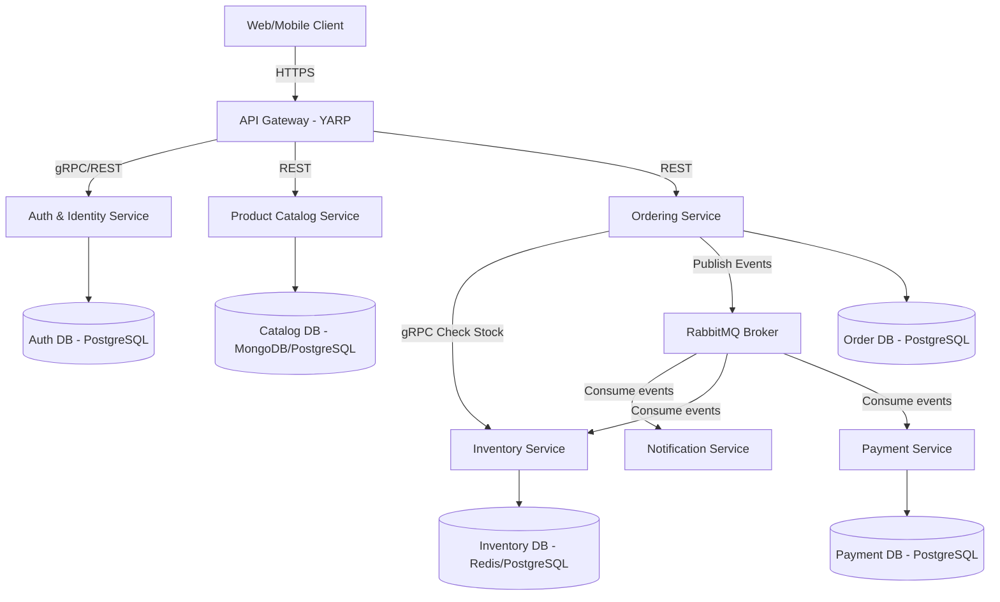

# E-Commerce Microservices Architecture Design

This document details the microservices architecture proposal for the other modules of the E-commerce platform. It outlines service boundaries, database design principles, and service communication patterns (gRPC vs. RabbitMQ).

---

## 1. System Topology (Mermaid)



---

## 2. Microservice Module Breakdown

Each microservice is fully self-contained, owning its business logic, database, and scaling profile.

### 2.1 Identity & Auth Service (Present)
* **Responsibility**: User management, authentication, role assignment, token validation (Access + Refresh tokens).
* **Database**: `ecommerce-identity-db` (Postgres).
* **Key Entities**: `User`, `Role`, `RefreshToken`.

### 2.2 Product Catalog Service
* **Responsibility**: Managing brands, categories, dynamic product specifications, pricing, search indexes, and media.
* **Database**: `ecommerce-catalog-db` (Document database like **MongoDB** is recommended due to the schema-less, polymorphic nature of dynamic product attributes; otherwise Postgres with JSONB columns).
* **Key Entities**: `Product`, `Category`, `Brand`, `ProductAttribute`.
* **Caching**: Highly read-heavy. Uses Redis cache to serve catalog endpoints under 10ms.

### 2.3 Ordering Service
* **Responsibility**: Shopping cart persistence, checkout validation, price calculations, order creation, and order state machine tracking (Pending, Paid, Shipped, Cancelled).
* **Database**: `ecommerce-order-db` (Postgres, due to strong transactional ACID requirements).
* **Key Entities**: `Order`, `OrderItem`, `Cart`, `CartItem`.

### 2.4 Inventory Service
* **Responsibility**: Real-time stock counting, reserving items during checkout, updating stock levels on new shipments, and resolving low stock alerts.
* **Database**: `ecommerce-inventory-db` (Postgres or Redis for ultra-fast distributed locking of inventory to prevent double-selling).
* **Key Entities**: `Inventory`, `StockReservation`, `StockMovement`.

### 2.5 Payment Service
* **Responsibility**: Initiating transactions, interfacing with Stripe, PayPal, VNPay API, and processing payment gateway webhooks securely.
* **Database**: `ecommerce-payment-db` (Postgres, audit trail of transactions).
* **Key Entities**: `PaymentTransaction`, `Refund`.

### 2.6 Notification Service
* **Responsibility**: Decoupled worker service that listens to events and dispatches customer emails (registration confirmation, invoice PDF, order shipment tracking).
* **Database**: None or tiny audit database.
* **Communication**: 100% Event-driven (never calls other services synchronously).

---

## 3. Communication Patterns

### 3.1 Asynchronous Event-Driven (Broker: RabbitMQ)
Used when a service needs to trigger actions in other services without waiting for a response, ensuring high resilience and loose coupling.

```text
Ordering Service (Create Order)
      │
      ▼
[Publish: OrderPlacedEvent] ──► RabbitMQ Broker
                                     │
         ┌───────────────────────────┼───────────────────────────┐
         ▼                           ▼                           ▼
[Inventory Service]         [Payment Service]          [Notification Service]
(Reserve Stock &            (Process Stripe            (Send invoice email
 Deduct Inventory)           charge asynchronously)     to Customer)
```

### 3.2 Synchronous RPC (Protocol: gRPC)
Used for fast, low-latency, strongly-typed internal service-to-service queries where a real-time response is required before proceeding.

* **Example**: During Checkout, the `Ordering Service` must query the `Inventory Service` to confirm if products are still in stock before creating the order record.
* **Protocol**: **gRPC (HTTP/2 Protocol Buffers)** instead of standard REST. gRPC is up to **8x faster** and consumes significantly less network bandwidth due to binary serialization.

---

## 4. API Gateway Configuration (YARP)

We use Microsoft's official **YARP (Yet Another Reverse Proxy)** library running in [`Ecommerce.ApiGateway`](file:///d:/Code/CSharp/e-commerce/server/src/ApiGateway/Ecommerce.ApiGateway/) on **Port `5000`**.

### Route Mappings in `appsettings.json`

```json
  "ReverseProxy": {
    "Routes": {
      "identity-route": {
        "ClusterId": "identity-cluster",
        "Match": { "Path": "/api/auth/{**catch-all}" }
      },
      "catalog-categories-route": {
        "ClusterId": "catalog-cluster",
        "Match": { "Path": "/api/categories/{**catch-all}" }
      },
      "catalog-products-route": {
        "ClusterId": "catalog-cluster",
        "Match": { "Path": "/api/products/{**catch-all}" }
      }
    },
    "Clusters": {
      "identity-cluster": {
        "Destinations": { "destination1": { "Address": "http://localhost:5056/" } }
      },
      "catalog-cluster": {
        "Destinations": { "destination1": { "Address": "http://localhost:5057/" } }
      }
    }
  }
```

---

## 5. Key Challenges & Patterns to Implement

When transitioning to Microservices, you will need to implement:
1. **Saga Pattern (Orchestration/Choreography)**: To manage distributed transactions across multiple databases (e.g. if payment fails, roll back inventory reservation).
2. **API Gateway (YARP - Yet Another Reverse Proxy)**: A single .NET gateway proxying requests from the browser to the individual microservices on port `5000`.
3. **Outbox Pattern**: To guarantee that database updates and RabbitMQ event publishing happen atomically in a single transaction.
