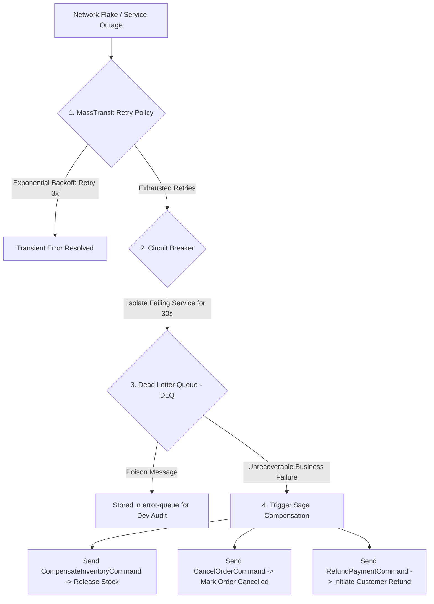

# Architecture Guide: Reliable Distributed Messaging, Transactional Outbox & Fault Tolerance

This document details the architectural design for **Reliable Distributed Messaging**, **Transactional Outbox Pattern**, **Publisher/Consumer Acknowledgments**, and **Fault Tolerance** across our Monorepo Microservices.

---

## 1. The Dual-Write Problem

In a Database-per-Service Microservices architecture, executing a database write followed by an asynchronous event publish in an application handler poses a critical reliability risk:

```csharp
// DANGEROUS UNPROTECTED PATTERN:
await _dbContext.SaveChangesAsync(); // Step 1: Saves to PostgreSQL
await _publishEndpoint.Publish(new OrderSubmittedEvent(...)); // Step 2: Publishes to RabbitMQ
```

### Failure Scenario:
If the application process crashes or experiences a network partition immediately after Step 1, the database transaction is committed, but the event is **lost forever**. As a result, downstream microservices (e.g., `Ecommerce.Orchestrator`) will never be notified, causing permanent system state inconsistency.

---

## 2. Solution: Transactional Outbox Pattern

The **Transactional Outbox Pattern** eliminates the Dual-Write Problem by executing database writes and event publishing within a single atomic database transaction.

```mermaid
graph TD
    subgraph Microservice DB [PostgreSQL Database]
        EntityTable[(Business Entity Table)]
        OutboxTable[(outbox_messages Table)]
    end

    Handler[Application Handler] -->|1. Single Local Transaction| EntityTable
    Handler -->|1. Single Local Transaction| OutboxTable

    OutboxWorker[MassTransit Outbox Worker] -->|2. Poll Unprocessed Messages| OutboxTable
    OutboxWorker -->|3. Guaranteed At-Least-Once Publish| RabbitMQ[RabbitMQ Broker]
    RabbitMQ -->> OutboxWorker: 4. Publisher ACK
    OutboxWorker -->|5. Mark Processed| OutboxTable
```

### Implementation with MassTransit EF Core Outbox
MassTransit provides native support for the EF Core Transactional Outbox. Messages are stored in the local service database inside the `outbox_messages` table during `SaveChangesAsync()`. A background worker periodically polls the outbox table and delivers messages to RabbitMQ.

---

## 3. Three-Tier Delivery & Fault-Tolerance Guarantee

We guarantee 100% data reliability across network outages and container crashes using a three-tier delivery protocol:

```text
┌───────────────────────────────────────────────────────────────────────────────────────────────────┐
│ 1. Publisher Tier: Transactional Outbox + Publisher Confirms (ACK)                                │
│    - Messages saved in local DB outbox_messages table.                                           │
│    - Marked processed ONLY after receiving Publisher ACK from RabbitMQ.                           │
└───────────────────────────────────────────────────────────────────────────────────────────────────┘
                                                │
                                                ▼
┌───────────────────────────────────────────────────────────────────────────────────────────────────┐
│ 2. Broker Tier: RabbitMQ Queue Durability & Disk Persistence                                     │
│    - Messages written to disk (Durable Queues).                                                   │
│    - Survives complete RabbitMQ container restarts or power outages.                              │
└───────────────────────────────────────────────────────────────────────────────────────────────────┘
                                                │
                                                ▼
┌───────────────────────────────────────────────────────────────────────────────────────────────────┐
│ 3. Consumer Tier: Consumer Acknowledgments (ACK / NACK) & Re-queueing                            │
│    - Messages held in Unacknowledged state while Orchestrator processes.                          │
│    - Removed from Queue ONLY after Orchestrator commits state to Saga DB and sends Consumer ACK.  │
│    - Automatically re-queued if Orchestrator crashes before ACK.                                  │
└───────────────────────────────────────────────────────────────────────────────────────────────────┘
```

---

## 4. Idempotent Consumer & Duplicate Message Handling

Because we enforce **At-Least-Once Delivery**, transient network retries can occasionally result in duplicate message delivery.

To prevent duplicate execution:
1. Every message includes a unique **`CorrelationId`** (e.g., `OrderId`).
2. The `Ecommerce.Orchestrator` Saga State database (`ecommerce_saga_db`) uses `CorrelationId` as its **Primary Key**.
3. If a duplicate `OrderSubmittedEvent` arrives, MassTransit Saga inspects `ecommerce_saga_db`, detects the existing `CorrelationId`, and **safely ignores the duplicate message** without mutating state.

---

## 5. Fault Hierarchy & Compensating Transactions

When processing distributed transactions across multiple microservices, errors are handled at 4 distinct levels:



### 5.1 Retry Policy (Transient Errors)
MassTransit automatically retries failed message handling using **Exponential Backoff** (e.g., retrying after 2s, 5s, 10s).

### 5.2 Circuit Breaker (Infrastructure Isolation)
If a microservice is unresponsive for extended periods, the Circuit Breaker trips, pausing message delivery to prevent Queue congestion.

### 5.3 Dead Letter Queue (DLQ / Poison Messages)
Messages that fail all retry attempts due to unhandled exceptions are routed to an `error-queue` for manual inspection.

### 5.4 Saga Compensating Transactions (Business Rollback)
If a business rule fails (e.g., insufficient stock or payment decline), the `Ecommerce.Orchestrator` executes **Compensating Commands** in reverse order ($C_k \dots C_1$) to undo previous local transactions.
