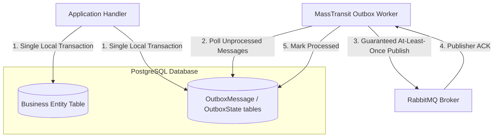
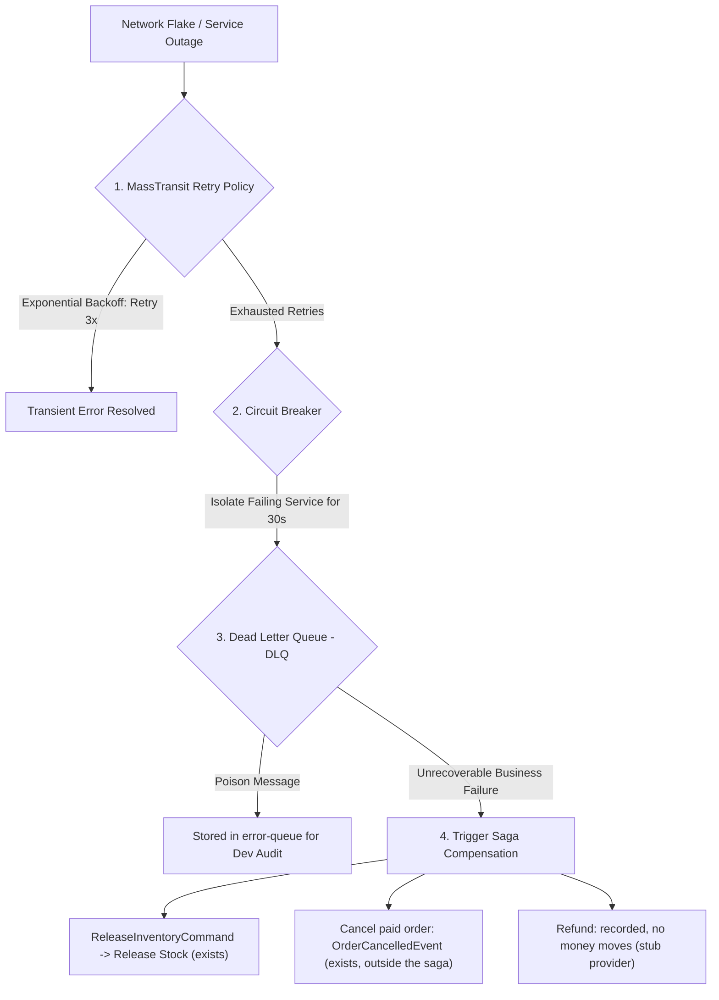

# Architecture Guide: Reliable Distributed Messaging, Transactional Outbox & Fault Tolerance

This document details the architectural design for **Reliable Distributed Messaging**, **Transactional Outbox Pattern**, **Publisher/Consumer Acknowledgments**, and **Fault Tolerance** across our Monorepo Microservices.

**The message catalogue** - all 20 messages, who publishes each and which consumer class receives it -
is generated from the code in [reference/messages.md](../reference/messages.md). This document
explains the rules they follow rather than listing them.

---

## 1. The Dual-Write Problem

In a Database-per-Service Microservices architecture, executing a database write followed by an asynchronous event publish in an application handler poses a critical reliability risk:

```csharp
// DANGEROUS UNPROTECTED PATTERN:
await _dbContext.SaveChangesAsync(); // Step 1: Saves to PostgreSQL
await _publishEndpoint.Publish(new OrderSubmittedEvent(...)); // Step 2: Publishes to RabbitMQ
```

### Failure Scenario:
If the application process crashes or experiences a network partition immediately after Step 1, the database transaction is committed, but the event is **lost forever**. As a result, downstream microservices (e.g., `Ecommerce.Orchestrator`) will never be notified, causing permanent system state inconsistency.

---

## 2. Solution: Transactional Outbox Pattern

The **Transactional Outbox Pattern** eliminates the Dual-Write Problem by executing database writes and event publishing within a single atomic database transaction.



### Implementation with MassTransit EF Core Outbox
MassTransit provides native support for the EF Core Transactional Outbox. Messages are stored in the local service database, in MassTransit's `OutboxMessage` table, during `SaveChangesAsync()`; a background delivery service then publishes them to RabbitMQ. Consumers in the same services use the matching inbox (`InboxState`), which records consumed message ids.

**Who uses it:** Identity, Catalog, Order, Orchestrator, Inventory, Payment and Activity. Identity gained MassTransit in specs/027, when it began announcing sellers; Activity publishes nothing but uses the same EF outbox configuration for its consumer inbox. Cart consumes events but publishes none, so it has no outbox; its idempotency is its own (see §4).

**The order inside a handler matters:** stage the entity, then `Publish(...)`, *then* `SaveChangesAsync()`. Publishing after the save puts the message outside the transaction, which is the dual-write problem above in a form that reviews clean. The Orchestrator did exactly that until `20260921104437_AddTransactionalOutbox`, and the first order after every cold start was stranded.

### 2.1 Audit entries and notifications are messages too

Since specs/041 and 042 most writes publish more than their domain event. `IAuditTrail.RecordAsync(...)`
and `INotifier.NotifyAsync(...)` in `Ecommerce.Shared` publish `AuditEntryRecorded` and
`UserNotificationRequested` through the calling service's outbox, so the same rule applies: **call
them before the one `SaveChangesAsync`**. The entry and the notice then commit with the change they
describe, or not at all. An audit entry written after the save can be lost to a crash in between; a
notice about an order that then failed to save would be a lie in somebody's inbox.

Identity, Catalog, Order, Inventory and Payment record audit entries; Identity, Catalog and Order also
send notifications. Both messages carry an id minted by the publisher (`EntryId`,
`NotificationId`), which is what lets Activity store each exactly once (§4). The one deliberate
exception is a product image switch (specs/019): the switch is its own guarded `UPDATE`, and its
audit entry is saved just after it rather than with it.

### 2.2 A guarded statement in its own transaction: the stage callback

Some changes are not "load an entity, change it, save". They are a single guarded statement, because
the guard in the `WHERE` clause is what decides a race: settling an order
(`WHERE "Status" = 'Submitted'`), a parcel move, a cancellation, a delivery confirmation, a payout's
claim, a shop application decision (`WHERE "Status" = 'Pending'`), a product review decision
(`WHERE "ReviewStatus" IN (...)`). `ExecuteUpdateAsync` runs immediately and is not part of
`SaveChangesAsync`, so publishing "before the save" is no longer enough on its own: the statement and
the outbox rows have to share an explicit transaction, and the messages must be staged **only if the
statement won**.

The repositories solve this with a `stage` callback:

```csharp
Task<bool> TryDecideAsync(
    Guid id, ShopApplicationStatus decision, string? reason, Guid decidedBy, DateTime decidedAt,
    Func<CancellationToken, Task> stage,              // publishes the event, the audit entry, the notices
    CancellationToken cancellationToken = default);
```

Inside, the repository opens a transaction (under the EF execution strategy), runs the guarded
statement, and **only when it affected a row** calls `stage` and then `SaveChangesAsync`, which writes
the outbox rows the callback staged; then it commits. A repeat, or the loser of a race, affects zero
rows, never runs `stage`, and so publishes nothing. The handler decides *what* to announce; the
repository decides *whether* it happened. Examples: `IOrderRepository.TrySettleAsync`,
`TryCancelAsync`, `TryConfirmDeliveryAsync` and the parcel moves in Order, the payout claim in
`IPayoutRepository`, `IProductRepository.TryReviewAsync` in Catalog and
`IShopApplicationRepository.TryDecideAsync` in Identity.

### 2.3 The trap: a consumer already holds a transaction

A consumer configured with `UseEntityFrameworkOutbox<TDbContext>` (every consumer in a service with an
outbox) runs inside a transaction MassTransit has already opened on the same `DbContext`; MassTransit
commits it, with the inbox row and any staged messages, after the consumer returns. A repository
method that calls `BeginTransactionAsync` from inside a consumer throws "already in a transaction" -
and clearing the change tracker there would also drop the inbox row.

This happened. When notifications were added (specs/042,
[#94](https://github.com/jessiicamaru/e-commerce-asp-dotnet-practice/pull/94)), settling an order on
`OrderCompletedEvent` began staging a notice through `TrySettleAsync`, which opened its own
transaction. Inside the consumer that threw `InvalidOperationException: The connection is already in
a transaction`, and in the running stack **every order stayed `Submitted`** - while every unit test
passed, because the tests sent the command outside a consumer. It was found before the pull request
merged, and the fix, part of #94, is a branch in `OrderRepository.TrySettleAsync`:

```csharp
// Called from a consumer, this runs inside MassTransit's consumer outbox, which already holds a
// transaction on this context and commits it - with the staged messages - after the consumer.
// Join it: a second BeginTransaction throws, and clearing the tracker would drop the inbox row.
if (_context.Database.CurrentTransaction is not null)
{
    // run the guarded UPDATE; if it won, stage and SaveChangesAsync - no transaction of its own
}
```

`NotificationTests.Settling_inside_a_consumer_transaction_joins_it` opens the transaction the way
MassTransit does, so the regression is caught. **Any new `stage` method that a consumer can reach
needs the same branch.**

---

## 3. Three-Tier Delivery & Fault-Tolerance Guarantee

The design aims at **at-least-once delivery with no lost message** across broker restarts and process crashes, in three tiers. It does not promise exactly-once — that is what §4 is for:

```text
┌───────────────────────────────────────────────────────────────────────────────────────────────────┐
│ 1. Publisher Tier: Transactional Outbox + Publisher Confirms (ACK)                                │
│    - Messages saved in the local DB OutboxMessage table.                                         │
│    - Marked processed ONLY after receiving Publisher ACK from RabbitMQ.                           │
└───────────────────────────────────────────────────────────────────────────────────────────────────┘
                                                │
                                                ▼
┌───────────────────────────────────────────────────────────────────────────────────────────────────┐
│ 2. Broker Tier: RabbitMQ Queue Durability & Disk Persistence                                     │
│    - Messages written to disk (Durable Queues).                                                   │
│    - Survives complete RabbitMQ container restarts or power outages.                              │
└───────────────────────────────────────────────────────────────────────────────────────────────────┘
                                                │
                                                ▼
┌───────────────────────────────────────────────────────────────────────────────────────────────────┐
│ 3. Consumer Tier: Consumer Acknowledgments (ACK / NACK) & Re-queueing                            │
│    - Messages held in Unacknowledged state while Orchestrator processes.                          │
│    - Removed from Queue ONLY after Orchestrator commits state to Saga DB and sends Consumer ACK.  │
│    - Automatically re-queued if Orchestrator crashes before ACK.                                  │
└───────────────────────────────────────────────────────────────────────────────────────────────────┘
```

---

## 4. Idempotent Consumers, Duplicates and Ordering

At-least-once delivery means a message can arrive **twice**. And — the lesson of issue #15 —
messages of *different types* can arrive **in any order**: nothing orders delivery across message
types. Every consumer is written to survive both:

| Where | Mechanism |
| :--- | :--- |
| Orchestrator | the saga instance is keyed by `CorrelationId` (= `OrderId`); a duplicate finds the instance already past that state |
| Catalog, Order, Orchestrator, Inventory, Payment, Activity | MassTransit's EF inbox (`InboxState`) skips a message id it has already consumed |
| Inventory | unique `(OrderId, ProductId)` on reservations; a cancelled order's restock is guarded by the status each reservation moves *from*, so a redelivery moves nothing, whichever of `OrderCompleted` / `OrderCancelled` arrived first |
| Payment | one payment per order and one refund per order, by unique constraint; the losing side of a race reports the outcome that won |
| Order | guarded `UPDATE … WHERE Status = 'Submitted'` — a redelivery affects zero rows |
| Cart | an `Applied` flag under `SELECT … FOR UPDATE`; whichever of `OrderSubmitted` / `OrderCompleted` arrives second applies the removal |
| Catalog | the `sellers` read model is written with the same values on a redelivery, so it changes nothing |
| Activity | `INSERT … ON CONFLICT ("Id") DO NOTHING` on the id the publisher minted, for both `audit_entries` and `notifications` - one statement, so a redelivery, or two deliveries at once, store one row |

The Cart row exists because of ordering, not duplication: Cart needs the items (from
`OrderSubmittedEvent`) and the verdict (`OrderCompletedEvent`), and cannot assume which comes first.
Inventory's restock is the same problem a second time (specs/039): a cancellation can overtake the
completion it follows.

### 4.1 A consumer's class name is its queue name

MassTransit names a receive endpoint after the consumer class, and publish/subscribe fans out **per
endpoint**, not per service. Two services with a consumer class of the same name therefore bind to
**one** queue and compete for it, so each message reaches one of them instead of both. It happened:
Inventory and Order both had `OrderCompletedConsumer`; the order settled and the stock stayed held.

Two defences are in use:

- **An endpoint name prefix.** Identity (`IdentitySvc`), Catalog (`CatalogSvc`), Cart (`CartSvc`),
  Order (`OrderSvc`) and Activity (`ActivitySvc`) call
  `SetEndpointNameFormatter(new DefaultEndpointNameFormatter(prefix: ..., includeNamespace: false))`.
  Inventory, Payment and the Orchestrator do not.
- **Naming a consumer for what it does.** `OrderCancelledEvent` is consumed by Inventory and Payment,
  neither of which has a prefix, so their consumers are `RestockCancelledOrderConsumer` and
  `RefundCancelledOrderConsumer` rather than two classes called `OrderCancelledConsumer`.

The symptom is visible in the broker:
`docker exec e-commerce-rabbitmq rabbitmqctl list_queues name messages consumers` - a queue with two
consumers where each service should have its own is the collision.

---

## 5. Fault Hierarchy & Compensating Transactions

When processing distributed transactions across multiple microservices, errors are handled at 4 distinct levels:

### What is configured today

| Layer | Status |
| :--- | :--- |
| Retry policy | **None configured** — there is no `UseMessageRetry` anywhere. A consumer that throws faults on its first attempt. |
| Circuit breaker | **None configured.** |
| Error queue | MassTransit's default: a faulted message moves to `<queue>_error`, where it stays until someone looks. Nothing replays it. |
| Business compensation | The saga's only compensation is `ReleaseInventoryCommand`, sent when payment fails. A failed reservation holds nothing, so it needs none. After the saga, cancelling a paid order (specs/039) publishes `OrderCancelledEvent`: Inventory puts the units back and Payment records a refund (which moves no money - the provider is a stub). That is not a saga step; each service undoes its own part from its own rows. |

**The retry gap is the one that matters.** A transient database blip today sends a message straight
to an error queue. The diagram and §5.1–5.4 below are the **target**, not the current state.



### 5.1 Retry Policy (Transient Errors) — *not configured*
MassTransit can retry failed message handling using **Exponential Backoff** (e.g., retrying after 2s, 5s, 10s).

### 5.2 Circuit Breaker (Infrastructure Isolation) — *not configured*
If a microservice is unresponsive for extended periods, the Circuit Breaker trips, pausing message delivery to prevent Queue congestion.

### 5.3 Dead Letter Queue (DLQ / Poison Messages)
Messages that fail all retry attempts due to unhandled exceptions are routed to an `error-queue` for manual inspection.

### 5.4 Saga Compensating Transactions (Business Rollback)
If a business rule fails, the orchestrator publishes `OrderFailedEvent` — and, when it was the payment
that failed, first releases the held stock with `ReleaseInventoryCommand`; Order marks its row
`Failed` and Cart leaves the customer's cart alone. That is the whole of the saga's compensation.
Undoing a *paid* order is cancellation (specs/039), described in §4 and in the
[saga roadmap](./saga-orchestration-roadmap.md).
