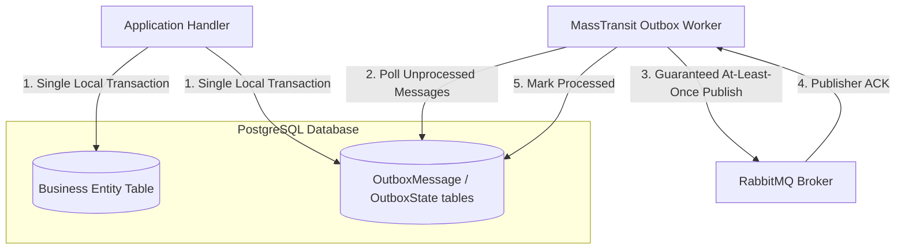
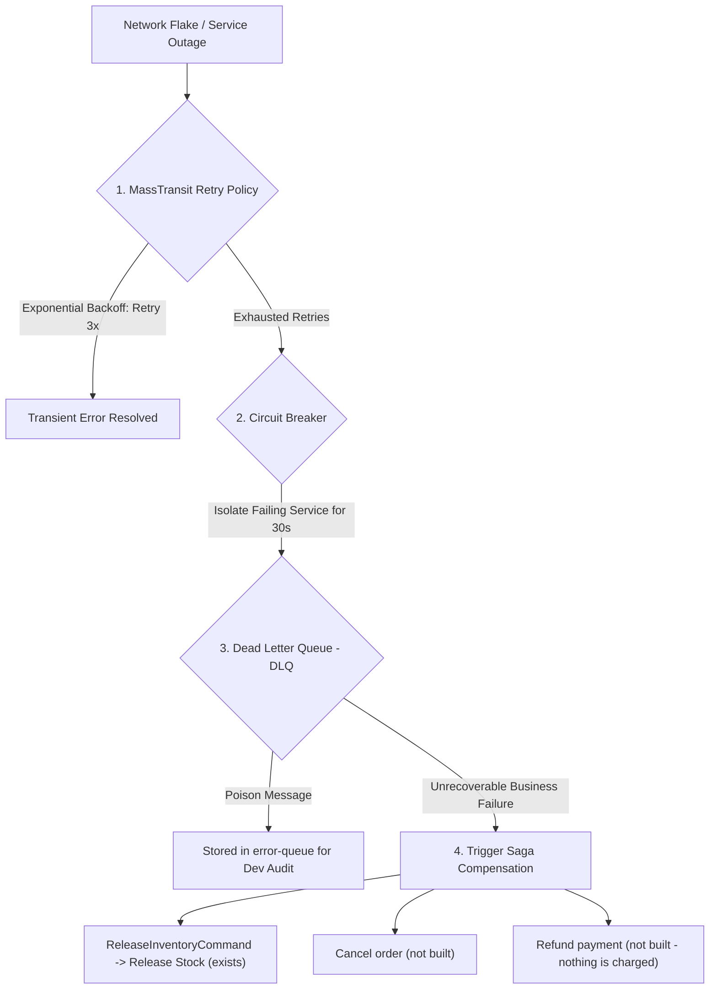

# Architecture Guide: Reliable Distributed Messaging, Transactional Outbox & Fault Tolerance

This document details the architectural design for **Reliable Distributed Messaging**, **Transactional Outbox Pattern**, **Publisher/Consumer Acknowledgments**, and **Fault Tolerance** across our Monorepo Microservices.

---

## 1. The Dual-Write Problem

In a Database-per-Service Microservices architecture, executing a database write followed by an asynchronous event publish in an application handler poses a critical reliability risk:

```csharp
// DANGEROUS UNPROTECTED PATTERN:
await _dbContext.SaveChangesAsync(); // Step 1: Saves to PostgreSQL
await _publishEndpoint.Publish(new OrderSubmittedEvent(...)); // Step 2: Publishes to RabbitMQ
```

### Failure Scenario:
If the application process crashes or experiences a network partition immediately after Step 1, the database transaction is committed, but the event is **lost forever**. As a result, downstream microservices (e.g., `Ecommerce.Orchestrator`) will never be notified, causing permanent system state inconsistency.

---

## 2. Solution: Transactional Outbox Pattern

The **Transactional Outbox Pattern** eliminates the Dual-Write Problem by executing database writes and event publishing within a single atomic database transaction.



### Implementation with MassTransit EF Core Outbox
MassTransit provides native support for the EF Core Transactional Outbox. Messages are stored in the local service database, in MassTransit's `OutboxMessage` table, during `SaveChangesAsync()`; a background delivery service then publishes them to RabbitMQ. Consumers in the same services use the matching inbox (`InboxState`), which records consumed message ids.

**Who uses it:** Catalog, Order, Orchestrator, Inventory and Payment — every service that publishes. Identity has no MassTransit. Cart consumes events but publishes none, so it has no outbox; its idempotency is its own (see §4).

**The order inside a handler matters:** stage the entity, then `Publish(...)`, *then* `SaveChangesAsync()`. Publishing after the save puts the message outside the transaction, which is the dual-write problem above in a form that reviews clean. The Orchestrator did exactly that until `20260921104437_AddTransactionalOutbox`, and the first order after every cold start was stranded.

---

## 3. Three-Tier Delivery & Fault-Tolerance Guarantee

The design aims at **at-least-once delivery with no lost message** across broker restarts and process crashes, in three tiers. It does not promise exactly-once — that is what §4 is for:

```text
┌───────────────────────────────────────────────────────────────────────────────────────────────────┐
│ 1. Publisher Tier: Transactional Outbox + Publisher Confirms (ACK)                                │
│    - Messages saved in the local DB OutboxMessage table.                                         │
│    - Marked processed ONLY after receiving Publisher ACK from RabbitMQ.                           │
└───────────────────────────────────────────────────────────────────────────────────────────────────┘
                                                │
                                                ▼
┌───────────────────────────────────────────────────────────────────────────────────────────────────┐
│ 2. Broker Tier: RabbitMQ Queue Durability & Disk Persistence                                     │
│    - Messages written to disk (Durable Queues).                                                   │
│    - Survives complete RabbitMQ container restarts or power outages.                              │
└───────────────────────────────────────────────────────────────────────────────────────────────────┘
                                                │
                                                ▼
┌───────────────────────────────────────────────────────────────────────────────────────────────────┐
│ 3. Consumer Tier: Consumer Acknowledgments (ACK / NACK) & Re-queueing                            │
│    - Messages held in Unacknowledged state while Orchestrator processes.                          │
│    - Removed from Queue ONLY after Orchestrator commits state to Saga DB and sends Consumer ACK.  │
│    - Automatically re-queued if Orchestrator crashes before ACK.                                  │
└───────────────────────────────────────────────────────────────────────────────────────────────────┘
```

---

## 4. Idempotent Consumers, Duplicates and Ordering

At-least-once delivery means a message can arrive **twice**. And — the lesson of issue #15 —
messages of *different types* can arrive **in any order**: nothing orders delivery across message
types. Every consumer is written to survive both:

| Where | Mechanism |
| :--- | :--- |
| Orchestrator | the saga instance is keyed by `CorrelationId` (= `OrderId`); a duplicate finds the instance already past that state |
| Catalog, Order, Orchestrator, Inventory, Payment | MassTransit's EF inbox (`InboxState`) skips a message id it has already consumed |
| Inventory | unique `(OrderId, ProductId)` on reservations |
| Payment | one payment per order, by unique constraint; the losing side of a race reports the outcome that won |
| Order | guarded `UPDATE … WHERE Status = 'Submitted'` — a redelivery affects zero rows |
| Cart | an `Applied` flag under `SELECT … FOR UPDATE`; whichever of `OrderSubmitted` / `OrderCompleted` arrives second applies the removal |

The last row exists because of ordering, not duplication: Cart needs the items (from
`OrderSubmittedEvent`) and the verdict (`OrderCompletedEvent`), and cannot assume which comes first.

---

## 5. Fault Hierarchy & Compensating Transactions

When processing distributed transactions across multiple microservices, errors are handled at 4 distinct levels:

### What is configured today

| Layer | Status |
| :--- | :--- |
| Retry policy | **None configured** — there is no `UseMessageRetry` anywhere. A consumer that throws faults on its first attempt. |
| Circuit breaker | **None configured.** |
| Error queue | MassTransit's default: a faulted message moves to `<queue>_error`, where it stays until someone looks. Nothing replays it. |
| Business compensation | The saga's only compensation is `ReleaseInventoryCommand`, sent when payment fails. A failed reservation holds nothing, so it needs none. There is no cancel command (nothing cancels an order) and no refund command (nothing charges money). |

**The retry gap is the one that matters.** A transient database blip today sends a message straight
to an error queue. The diagram and §5.1–5.4 below are the **target**, not the current state.



### 5.1 Retry Policy (Transient Errors) — *not configured*
MassTransit can retry failed message handling using **Exponential Backoff** (e.g., retrying after 2s, 5s, 10s).

### 5.2 Circuit Breaker (Infrastructure Isolation) — *not configured*
If a microservice is unresponsive for extended periods, the Circuit Breaker trips, pausing message delivery to prevent Queue congestion.

### 5.3 Dead Letter Queue (DLQ / Poison Messages)
Messages that fail all retry attempts due to unhandled exceptions are routed to an `error-queue` for manual inspection.

### 5.4 Saga Compensating Transactions (Business Rollback)
If a business rule fails, the orchestrator publishes `OrderFailedEvent` — and, when it was the payment
that failed, first releases the held stock with `ReleaseInventoryCommand`; Order marks its row
`Failed` and Cart leaves the customer's cart alone. That is the whole of it today.
