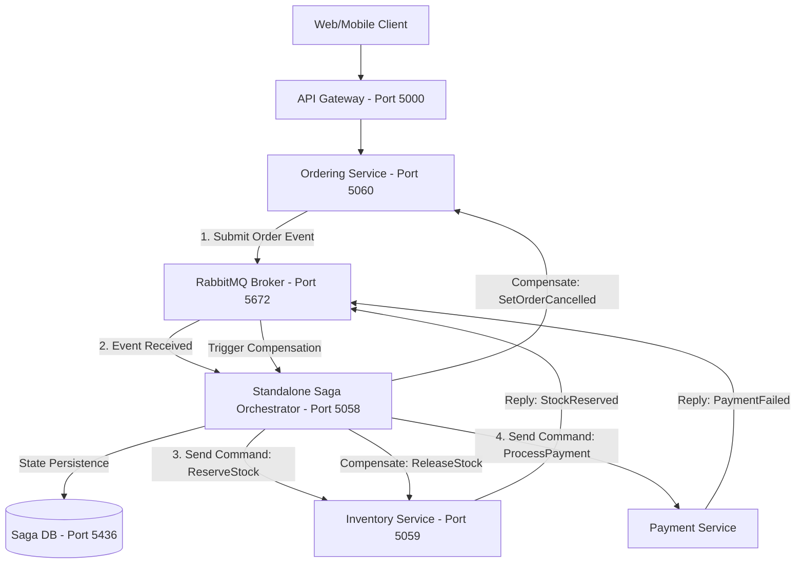
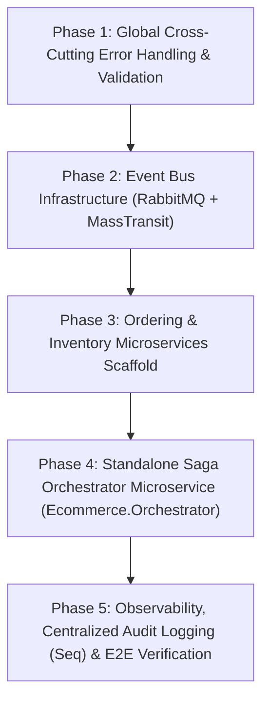

# Saga Orchestration Pattern & System Architecture Roadmap

This document outlines the architectural concept of the **Saga Pattern**, compares **Orchestration vs. Choreography**, and details the 5-phase master roadmap for building our distributed E-commerce Monorepo Microservices system.

---

## 1. Deep Dive: What is the Saga Pattern?

### 1.1 The Challenge of Distributed Transactions
In a traditional monolithic application with a single relational database, maintaining data consistency across multiple tables relies on **ACID Transactions** (`BEGIN TRANSACTION ... COMMIT / ROLLBACK`).

In a **Database-per-Service Microservices Architecture**, each service owns an isolated PostgreSQL database (`ecommerce_identity_db`, `ecommerce_catalog_db`, `ecommerce_order_db`, etc.). Standard ACID transactions cannot span across separate database networks. 

Using traditional Distributed 2-Phase Commit (2PC) protocols is strongly discouraged in microservices because 2PC creates tight runtime coupling, blocking locks, and high latency.

```text
Monolith (ACID Transaction):
[Order Table + Inventory Table + Payment Table] ──► Single DB Commit / Rollback (Instant)

Microservices (Distributed System):
[Order DB] ──(Network)──► [Inventory DB] ──(Network)──► [Payment DB]
   ▲                             ▲                            ▲
   │                             │                            │
Local Tx 1                   Local Tx 2                   Local Tx 3
```

---

### 1.2 The Saga Pattern Definition
The **Saga Pattern** solves distributed data consistency by breaking a global transaction into a sequence of **Local Transactions** ($T_1, T_2, \dots, T_n$):

1. Each local transaction updates the database of a single microservice and emits a message/event.
2. The next service receives the message and executes its own local transaction.
3. **Compensating Transactions ($C_1, C_2, \dots, C_{n-1}$)**: If any local transaction $T_k$ fails (e.g., credit card payment declined), the Saga executes compensating transactions in reverse order ($C_{k-1}, \dots, C_1$) to undo the changes made by previous steps.

```text
Successful Saga Execution:
[T1: Create Order] ──► [T2: Reserve Stock] ──► [T3: Charge Card] ──► [Saga Completed]

Failed Saga with Compensation (Rollback):
[T1: Create Order] ──► [T2: Reserve Stock] ──► [T3: Charge Card FAILS!]
                                                      │
                       ┌──────────────────────────────┘
                       ▼
            [C2: Release Stock] ──► [C1: Cancel Order] ──► [Saga Aborted]
```

---

### 1.3 Saga Approaches: Orchestration vs. Choreography

| Feature | Choreography (Event-Driven) | **Orchestration (Centralized State Machine - Chosen)** |
| :--- | :--- | :--- |
| **Control Mechanism** | Decentralized; services react to events directly. | Centralized; a dedicated **Saga Orchestrator Service** controls the flow. |
| **Coupling** | Services must know about events from other services. | Services only execute commands sent by the Orchestrator. |
| **Visibility & Debugging** | Hard to trace global transaction state. | **Easy to monitor** via Orchestrator State Machine database. |
| **Cyclic Dependencies** | Risk of circular event dependencies. | No circular dependencies. |
| **Best For** | Simple workflows (2-3 steps). | **Complex distributed workflows** (Checkout, Refunds, Shipping). |

---

## 2. Standalone Saga Orchestrator Microservice Architecture

We adopt **Saga Orchestration** by building a dedicated, standalone microservice: **`Ecommerce.Orchestrator`**.



### Microservice Specifications:
* **Project Name**: `Ecommerce.Orchestrator`
* **Directory**: `server/src/Services/Orchestrator/Ecommerce.Orchestrator/`
* **HTTP Port**: `5058`
* **Dedicated Database**: `ecommerce_saga_db` (PostgreSQL on Port `5436`)
* **Technology**: MassTransit State Machine Saga (`Automatonymous`).

---

## 3. Master 5-Phase Implementation Roadmap



---

### 🟢 Phase 1: Global Cross-Cutting Error Handling & Validation (Current)
* **Goal**: Standardize exception handling and DTO validation across all microservices.
* **Deliverables**:
  1. **FluentValidation + MediatR Pipeline Behavior (`ValidationBehavior`)**: Intercepts requests and validates rules prior to handler execution.
  2. **Clean Exception Hierarchy**: `NotFoundException`, `ValidationException`, `ConflictException`.
  3. **ASP.NET Core 10 `IExceptionHandler`**: Maps custom exceptions to standardized **RFC 7807 `ProblemDetails` JSON** (HTTP 400, 404, 409, 500).
  4. **Environment Masking**: Shows full stack traces in `Development`, masks internal details in `Production`.

---

### 🟡 Phase 2: Event Bus Infrastructure (RabbitMQ + MassTransit)
* **Goal**: Integrate asynchronous message bus into existing microservices.
* **Deliverables**:
  1. Install `MassTransit.RabbitMQ` in `Identity` and `Catalog` projects.
  2. Configure MassTransit bus registration in `DependencyInjection.cs`.
  3. Implement domain event publishing (e.g., `ProductCreatedEvent`).

---

### 🔵 Phase 3: Ordering & Inventory Microservices Scaffold
* **Goal**: Build operational services involved in distributed checkout transactions.
* **Deliverables**:
  1. **Inventory Microservice (`Ecommerce.Inventory`)**: Port `5059`, DB `ecommerce_inventory_db` (Port `5435`).
  2. **Ordering Microservice (`Ecommerce.Order`)**: Port `5060`, DB `ecommerce_order_db` (Port `5434`).
  3. Add YARP API Gateway routes for `/api/orders/*` and `/api/inventory/*`.

---

### 🟣 Phase 4: Standalone Saga Orchestrator Microservice (`Ecommerce.Orchestrator`)
* **Goal**: Implement the central Saga Orchestrator Service.
* **Deliverables**:
  1. Create `server/src/Services/Orchestrator/Ecommerce.Orchestrator` (Port `5058`, DB `ecommerce_saga_db` on Port `5436`).
  2. Implement **MassTransit State Machine Saga (`OrderStateMachine`)**:
     * State transition: `Submitted` $\rightarrow$ `StockReserved` $\rightarrow$ `PaymentProcessed` $\rightarrow$ `Completed`.
     * Compensation flows for payment or stock failures.

---

### 🔴 Phase 5: Observability, Centralized Audit Logging (Seq) & E2E Verification
* **Goal**: Operational visibility, centralized logging, and end-to-end system testing.
* **Deliverables**:
  1. Add **Seq** container (`datalust/seq` on Port `5341`) to `docker-compose.yml`.
  2. Stream structured Serilog JSON logs & Correlation IDs from all services to Seq.
  3. Validate full checkout flow from YARP Gateway to Saga Orchestrator.
