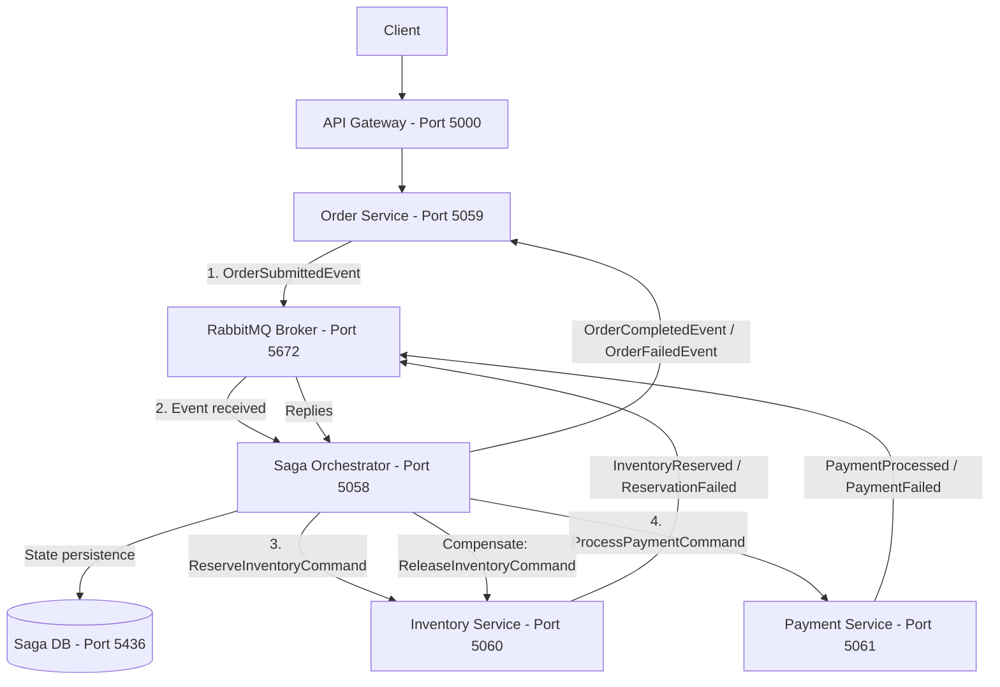

# Saga Orchestration Pattern & System Architecture Roadmap

This document outlines the architectural concept of the **Saga Pattern**, compares **Orchestration vs. Choreography**, and records the phased roadmap that built our distributed E-commerce Monorepo Microservices system.

---

## 1. Deep Dive: What is the Saga Pattern?

### 1.1 The Challenge of Distributed Transactions
In a traditional monolithic application with a single relational database, maintaining data consistency across multiple tables relies on **ACID Transactions** (`BEGIN TRANSACTION ... COMMIT / ROLLBACK`).

In a **Database-per-Service Microservices Architecture**, each service owns an isolated PostgreSQL database (`ecommerce_identity_db`, `ecommerce_catalog_db`, `ecommerce_order_db`, etc.). Standard ACID transactions cannot span across separate database networks. 

Using traditional Distributed 2-Phase Commit (2PC) protocols is strongly discouraged in microservices because 2PC creates tight runtime coupling, blocking locks, and high latency.

```text
Monolith (ACID Transaction):
[Order Table + Inventory Table + Payment Table] ──► Single DB Commit / Rollback (Instant)

Microservices (Distributed System):
[Order DB] ──(Network)──► [Inventory DB] ──(Network)──► [Payment DB]
   ▲                             ▲                            ▲
   │                             │                            │
Local Tx 1                   Local Tx 2                   Local Tx 3
```

---

### 1.2 The Saga Pattern Definition
The **Saga Pattern** solves distributed data consistency by breaking a global transaction into a sequence of **Local Transactions** ($T_1, T_2, \dots, T_n$):

1. Each local transaction updates the database of a single microservice and emits a message/event.
2. The next service receives the message and executes its own local transaction.
3. **Compensating Transactions ($C_1, C_2, \dots, C_{n-1}$)**: If any local transaction $T_k$ fails (e.g., credit card payment declined), the Saga executes compensating transactions in reverse order ($C_{k-1}, \dots, C_1$) to undo the changes made by previous steps.

```text
Successful Saga Execution:
[T1: Create Order] ──► [T2: Reserve Stock] ──► [T3: Charge Card] ──► [Saga Completed]

Failed Saga with Compensation (Rollback):
[T1: Create Order] ──► [T2: Reserve Stock] ──► [T3: Charge Card FAILS!]
                                                      │
                       ┌──────────────────────────────┘
                       ▼
            [C2: Release Stock] ──► [C1: Cancel Order] ──► [Saga Aborted]
```

---

### 1.3 Saga Approaches: Orchestration vs. Choreography

| Feature | Choreography (Event-Driven) | **Orchestration (Centralized State Machine - Chosen)** |
| :--- | :--- | :--- |
| **Control Mechanism** | Decentralized; services react to events directly. | Centralized; a dedicated **Saga Orchestrator Service** controls the flow. |
| **Coupling** | Services must know about events from other services. | Services only execute commands sent by the Orchestrator. |
| **Visibility & Debugging** | Hard to trace global transaction state. | **Easy to monitor** via Orchestrator State Machine database. |
| **Cyclic Dependencies** | Risk of circular event dependencies. | No circular dependencies. |
| **Best For** | Simple workflows (2-3 steps). | **Complex distributed workflows** (Checkout, Refunds, Shipping). |

---

## 2. Standalone Saga Orchestrator Microservice Architecture

We adopt **Saga Orchestration** by building a dedicated, standalone microservice: **`Ecommerce.Orchestrator`**.



### Microservice Specifications:
* **Project Name**: `Ecommerce.Orchestrator`
* **Directory**: `server/src/Services/Orchestrator/Ecommerce.Orchestrator.WebApi/` — one project; its
  `DbContext` lives in the WebApi project too.
* **HTTP Port**: `5058`
* **Dedicated Database**: `ecommerce_saga_db` (PostgreSQL on Port `5436`)
* **Technology**: MassTransit 8 state machine saga (what was once the separate `Automatonymous`
  library), persisted with EF Core and optimistic concurrency.

**There is no `SetOrderCancelled` step.** The saga never tells Order to cancel anything: it publishes
`OrderCompletedEvent` or `OrderFailedEvent`, and Order settles its own row from those. `Cancelled`
is one of four order statuses that no code path reaches.

---

## 3. Implementation Roadmap

The phases below are in the order they were built. The roadmap began with five and grew as each
phase exposed what the next one needed; Phase 6.5 exists because Phase 6 was declared complete while
the order record still disagreed with the saga.

---

### 🟢 Phase 1: Global Cross-Cutting Error Handling & Validation (Completed)
* **Goal**: Standardize exception handling and DTO validation across all microservices.
* **Deliverables**:
  1. **FluentValidation + MediatR Pipeline Behavior (`ValidationBehavior`)**: Intercepts requests and validates rules prior to handler execution.
  2. **Clean Exception Hierarchy**: `NotFoundException`, `ValidationException`, `ConflictException`.
  3. **ASP.NET Core 10 `IExceptionHandler`**: Maps custom exceptions to standardized **RFC 7807 `ProblemDetails` JSON** (HTTP 400, 404, 409, 500).
  4. **Environment Masking**: Shows full stack traces in `Development`, masks internal details in `Production`.

---

### 🟢 Phase 2: Event Bus Infrastructure & Transactional Outbox (Completed)
* **Goal**: Integrate asynchronous message bus and Outbox pattern into microservices.
* **Deliverables**:
  1. Standardized `MassTransit.RabbitMQ` and `MassTransit.EntityFrameworkCore` across projects.
  2. Configured MassTransit transactional outbox (`AddTransactionalOutboxEntities()`, `o.UsePostgres()`, `o.UseBusOutbox()`), first in `CatalogDbContext`; today in every service that publishes — Catalog, Order, Orchestrator, Inventory and Payment. **Identity has no MassTransit at all**, and Cart only consumes.
  3. Implemented domain event contracts in `Ecommerce.Contracts` (e.g., `ProductCreatedEvent`).

---

### 🟢 Phase 3: Standalone Saga Orchestrator Microservice (`Ecommerce.Orchestrator`) (Completed)
* **Goal**: Implement the central Saga Orchestrator Service.
* **Deliverables**:
  1. Created `server/src/Services/Orchestrator/Ecommerce.Orchestrator.WebApi` (Port `5058`, DB `ecommerce_saga_db` on Port `5436`).
  2. Implemented **MassTransit State Machine Saga (`OrderStateMachine`)**:
     * Happy Path: `Submitted` $\rightarrow$ `ReserveInventoryCommand` $\rightarrow$ `InventoryReserved` $\rightarrow$ `ProcessPaymentCommand` $\rightarrow$ `PaymentProcessed` $\rightarrow$ `OrderCompleted`.
     * Compensation flows: Executing `ReleaseInventoryCommand` on payment failure.

---

### 🟢 Phase 4: Ordering Microservice (`Ecommerce.Order`) & Submit Order Flow (Completed)
* **Goal**: Build operational Order service and API endpoint to initiate checkout.
* **Deliverables**:
  1. **Ordering Microservice (`Ecommerce.Order`)**: Port `5059`, DB `ecommerce_order_db` (Port `5434`).
  2. Implemented `SubmitOrderCommand` API via Transactional Outbox pattern.
  3. Added YARP API Gateway route `/api/orders/{**catch-all}` mapping to Port `5059`.

---

### 🟢 Phase 5: Inventory Microservice (`Ecommerce.Inventory`) & Reservation Flow (Completed)
* **Goal**: Answer the saga's stock request so an order can leave `Submitted`.
* **Deliverables**:
  1. **Inventory Microservice**: Port `5060`, DB `ecommerce_inventory_db` (Port `5437`).
  2. `ReserveInventoryCommand` and `ReleaseInventoryCommand` consumers, replying with
     `InventoryReservedEvent` / `InventoryReservationFailedEvent`.
  3. `OrderCompletedEvent` consumed as the confirmation signal — the contracts carry no
     `ConfirmInventoryCommand`, and the saga finalizes without telling inventory anything.
  4. Idempotent consumers: MassTransit EF inbox plus a unique `(OrderId, ProductId)` constraint.
  5. Expiry sweeper returning stock held by orders that never settled.
  6. First test project in the repository, running against a real PostgreSQL.

> The saga now reaches `InventoryReservedState` and stops there: no payment service exists yet, so
> every reservation is eventually reclaimed by the sweeper. That is correct behaviour, not a defect.

---

### 🟢 Phase 6: Payment Microservice (`Ecommerce.Payment`) & Full Saga Completion (Completed)
* **Goal**: Close checkout — the saga runs all the way to `OrderCompleted`.
* **Deliverables**:
  1. **Payment Microservice**: Port `5061`, DB `ecommerce_payment_db` (Port `5438`).
  2. `ProcessPaymentCommand` consumed, replying `PaymentProcessedEvent` / `PaymentFailedEvent`.
  3. One payment per order, enforced by a unique constraint; the losing side of a race reports the
     outcome that won rather than dropping the message or contradicting it.
  4. `PAYMENT_OUTCOME` makes the **compensation branch reachable** — releasing held stock on a
     failed payment had never actually run before this.

> ⚠️ **The gateway is a stand-in and moves no money.** Marked on every payment row, in the startup
> log, and in `/health`. `Infrastructure/Gateway/` is the seam a real provider replaces.

---

### 🟢 Phase 6.5: Order Lifecycle Visibility (`Ecommerce.Order` learns the outcome) (Completed)
* **Goal**: Make the order record agree with what the saga actually did, and let a shopper read it.
* **Why it needed its own phase**: Phase 6 declared checkout complete, and it was — the payment was
  recorded and the stock was deducted. But the `orders` row was never told. Eleven completed orders
  read `Submitted`, and `OrdersController` had only `POST`, so nothing could show otherwise. Filed
  as issue #2 and specified in [specs/003-order-lifecycle](../../specs/003-order-lifecycle/).
* **Deliverables**:
  1. `OrderCompletedConsumer` and `OrderFailedConsumer` — the first consumers this service has had.
  2. A **guarded transition**: `UPDATE ... WHERE Id = @id AND Status = 'Submitted'`, so a redelivery
     affects zero rows. Mutation-checked — removing the guard fails three tests.
  3. `GET /api/orders` (paged) and `GET /api/orders/{id}`, scoped by `ICurrentUser`. Another
     shopper's order answers **404, not 403**, so the response does not confirm the id is real.
  4. `Ecommerce.Order.Tests` (15 tests) against a real PostgreSQL, and order-ownership assertions in
     the auth smoke script using real signed tokens.

> ⚠️ **Consumer class names become queue names.** Inventory and Order both have a class called
> `OrderCompletedConsumer`, so both bound to a queue named `OrderCompleted` and *competed* for it —
> each completion reached one service or the other. The order settled and the stock stayed held.
> Order now sets an endpoint name prefix. Publish/subscribe fans out per **endpoint**, not per
> service.

Four `OrderStatus` values are deliberately unreachable: `Pending`, `StockReserved`, `Paid` and
`Cancelled`. The saga passes through the middle two but announces neither, and adding an announcement
means changing a shared contract every service deserializes; nothing cancels an order at all.
Documented in [specs/003 data-model](../../specs/003-order-lifecycle/data-model.md) rather than left
to be rediscovered.

---

### 🟡 Phase 7: Observability, Centralized Audit Logging (Seq) & E2E Verification (In progress)
* **Goal**: Operational visibility, centralized logging, and end-to-end system testing.
* **Deliverables**:
  1. ⬜ Add **Seq** container (`datalust/seq` on Port `5341`) to `docker-compose.yml`.
  2. ⬜ Stream structured Serilog JSON logs & Correlation IDs from every service to Seq —
     [#22](https://github.com/jessiicamaru/e-commerce-asp-dotnet-practice/issues/22).
  3. ~~Replace the stub payment gateway with a real provider integration.~~ Moved out of this phase:
     deliberately deferred, together with deployment.
  4. ✅ **End-to-end verification in CI** — [`verify-saga.sh`](../../.github/scripts/verify-saga.sh)
     places a real order over HTTP and follows it through every service it touches, asserting that the stock
     moved by exactly the amount ordered and that nothing is left held. Both branches on every
     change: payment approving, and payment refusing so compensation is exercised. Design and
     evidence in [specs/007-saga-e2e-verification](../../specs/007-saga-e2e-verification/).

> **Why this one came first.** Every other test here is confined to a single service, and the saga's
> characteristic failures are not. The queue-name collision recorded under Phase 6.5 settled an order
> while its stock stayed held, and all fifteen Order tests were green throughout. Seq makes such a
> failure easier to *diagnose*; this makes it *detected*, which has to come first.

> ✅ **Found and fixed on its first run.** The check stalled on the first order after a cold start —
> deterministic, 2 of 2 in CI and 2 of 2 locally. With MassTransit at `Debug` the cause was visible:
> `InventoryReservedEvent` finished in 0.29s while `OrderSubmittedEvent` was still 5.4s from
> committing, so the reply found no saga instance and was discarded silently. The orchestrator was
> the one service publishing **outside** the transactional outbox, which Principle III makes
> non-negotiable. Fixed in `20260921104437_AddTransactionalOutbox`; cold starts now settle in 2–3s,
> 4 of 4. Four sagas stranded between **2026-09-03 and 09-17** show how long it had been happening
> without anyone noticing — the second order of any session always worked.

---

### 🟢 After the saga: checkout correctness (Completed)

Two features that did not change the saga's shape but changed what it is trusted with:

* **[specs/009](../../specs/009-catalog-owns-price/) — Catalog owns the price.** The client used to
  send the unit price and the system charged it; a product listed at 40,000,000 was bought for 1.
  Order now asks Catalog over gRPC at submission and freezes price and name onto the line — the
  system's first synchronous cross-service call.
* **[specs/010](../../specs/010-customer-cart/) — the cart.** Checkout takes no body and reads the
  caller's cart over gRPC. Cart consumes `OrderSubmitted`, `OrderCompleted` and `OrderFailed`, and
  removes ordered lines only on completion — whichever of the first two arrives second applies it,
  because nothing orders delivery across message types.
