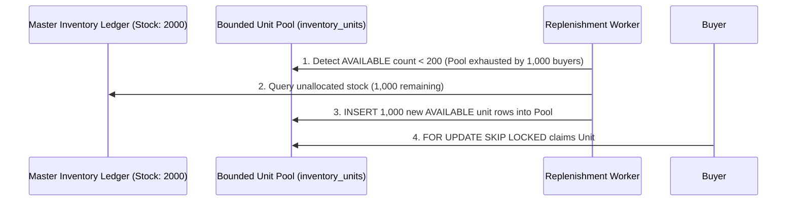

# Architecture Guide: High-Scalability Inventory Reservations via PostgreSQL `FOR UPDATE SKIP LOCKED`

This document details the architectural design for high-throughput, conflict-free inventory reservations using PostgreSQL `FOR UPDATE SKIP LOCKED`, inspired by Shopify Engineering's production architecture.

---

## 1. Context & The "Two-System Fallacy"

In high-traffic e-commerce systems (e.g., flash sales, Black Friday), handling inventory reservations using a dual-system approach—where **Redis** handles temporary reservations and a **Relational Database (PostgreSQL/MySQL)** holds the ledger—introduces severe reliability risks:

```text
DUAL-SYSTEM FALLACY (UNPROTECTED PATTERN):
[Client Request] ──► [Redis: Reserve Stock] ──(Network Gap / Crash)──X──► [PostgreSQL: Commit Ledger]
```

### Critical Flaws:
1. **Distributed System Seam**: No atomic ACID transaction can span across Redis and PostgreSQL.
2. **Overselling & Underselling**: If the application crashes between updating Redis and PostgreSQL, state disagreement occurs, causing overselling (two users buying the same last item) or underselling (false out-of-stock errors).

---

## 2. Solution: Single-DB Unit Row Pool + `FOR UPDATE SKIP LOCKED`

Instead of keeping an aggregated integer counter (e.g., `StockQuantity = 100`) which forces thousands of concurrent checkout requests to block waiting for a single row lock, we unify reservations and ledger updates into a single PostgreSQL database using **Bounded Unit Row Pools** and **`FOR UPDATE SKIP LOCKED`**.

```text
Unit Row Pool Structure (inventory_units table):
┌──────────────────────────────────────┬──────────────────────┬─────────────┐
│ Unit ID (UUID v7)                    │ Product ID           │ Status      │
├──────────────────────────────────────┼──────────────────────┼─────────────┤
│ 019183ab-4f21-7d12-8000-000000000001 │ iPhone 15 Pro        │ AVAILABLE   │
│ 019183ab-4f21-7d12-8000-000000000002 │ iPhone 15 Pro        │ AVAILABLE   │
│ 019183ab-4f21-7d12-8000-000000000003 │ iPhone 15 Pro        │ AVAILABLE   │
└──────────────────────────────────────┴──────────────────────┴─────────────┘
```

### 2.1 The Magic of `FOR UPDATE SKIP LOCKED`
When 500 concurrent checkout requests attempt to reserve an iPhone 15 Pro simultaneously, each request executes:

```sql
SELECT id FROM inventory_units 
WHERE product_id = '019183ab-4f21-7d12-8000-000000000000' AND status = 'AVAILABLE' 
LIMIT 1 
FOR UPDATE SKIP LOCKED;
```

#### How It Works Under Heavy Load:
* **Request 1** acquires a lock on `Unit #1`.
* **Request 2** encounters `Unit #1` locked by Request 1. Instead of **blocking/waiting** (traditional pessimistic locking), `SKIP LOCKED` instructs PostgreSQL to instantly skip `Unit #1` and claim `Unit #2`.
* **Result**: All 500 concurrent requests acquire 500 distinct unit row locks in parallel with **zero lock contention delay**!

---

## 3. C# EF Core Implementation Blueprint (`Ecommerce.Inventory`)

### 3.1 Entity Definition
```csharp
namespace Ecommerce.Inventory.Domain.Entities;

public class InventoryUnit
{
    public Guid Id { get; set; } // UUID v7
    public Guid ProductId { get; set; }
    public string Status { get; set; } = "AVAILABLE"; // AVAILABLE, RESERVED, SOLD
    public DateTime? ReservedAt { get; set; }
    public Guid? ReservedByOrderId { get; set; }
}
```

### 3.2 Reservation Handler Code
```csharp
public async Task<Guid> ReserveInventoryUnitAsync(Guid productId, Guid orderId, CancellationToken cancellationToken)
{
    // Execute FOR UPDATE SKIP LOCKED query to claim an available unit without blocking other threads
    var unit = await _dbContext.InventoryUnits
        .FromSqlInterpolated($@"
            SELECT * FROM inventory_units 
            WHERE product_id = {productId} AND status = 'AVAILABLE' 
            LIMIT 1 
            FOR UPDATE SKIP LOCKED")
        .FirstOrDefaultAsync(cancellationToken);

    if (unit == null)
    {
        throw new DomainException("Product is out of stock!");
    }

    unit.Status = "RESERVED";
    unit.ReservedAt = DateTime.UtcNow;
    unit.ReservedByOrderId = orderId;

    await _dbContext.SaveChangesAsync(cancellationToken); // Atomic Single DB Transaction
    return unit.Id;
}
```

---

## 4. Dynamic Replenishment & TTL Hold Expiration Mechanics

### 4.1 Dynamic Pool Replenishment (`ReplenishmentWorker`)
To prevent buyers from being falsely blocked when unallocated physical stock exists in the master ledger (e.g., Physical Stock = 2,000, but Pool Capacity = 1,000):

1. **Threshold Monitoring**: A background worker (`ReplenishmentWorker`) monitors the count of `AVAILABLE` rows per product in `inventory_units`.
2. **Auto-Replenishment**: When `AVAILABLE` units drop below a low threshold (e.g., `< 200`), the worker inspects the master ledger (`product_inventory_ledger`). If unallocated stock remains, it inserts new `AVAILABLE` unit rows into `inventory_units`.
3. **Zero Wait Time for Request #1,001**: Buyer #1,001 claims the newly replenished unit row instantly via `FOR UPDATE SKIP LOCKED` without waiting for earlier reservations to expire!



---

### 4.2 TTL Hold Expiration & Active Compensation

Every reservation on hold requires a **Time-To-Live (TTL)** (e.g., 10 minutes). Unclaimed units are returned to `AVAILABLE` status via two complementary mechanisms:

#### Mechanism A: Active Compensation (Saga Command)
When a buyer clicks "Cancel Order" or credit card payment fails, `Ecommerce.Orchestrator` issues a `ReleaseInventoryCommand(UnitId)`. The handler immediately executes:

```sql
UPDATE inventory_units 
SET status = 'AVAILABLE', reserved_at = NULL, reserved_by_order_id = NULL 
WHERE id = @UnitId;
```

#### Mechanism B: Passive Expiration (Sweeper Worker)
If a buyer abandons their checkout (closes browser tab without clicking Cancel), an `ExpiredReservationSweeperWorker` runs periodically (e.g., every 1 minute) executing a single optimized query:

```sql
UPDATE inventory_units 
SET status = 'AVAILABLE', reserved_at = NULL, reserved_by_order_id = NULL 
WHERE status = 'RESERVED' AND reserved_at < NOW() - INTERVAL '10 minutes';
```

---

## 5. Architectural Strategy Comparison

| Metric / Strategy | Aggregated Counter Lock (`SELECT FOR UPDATE`) | Distributed Redis Lock | **PostgreSQL `SKIP LOCKED` Unit Pool (Chosen)** |
| :--- | :--- | :--- | :--- |
| **Data Consistency** | ✅ Strong ACID | ❌ Eventual / Risk of State Disagreement | ✅ **Strong Single DB ACID** |
| **Lock Contention** | ❌ High (Requests queued sequentially) | ⚠️ Medium (Network latency / Key contention) | ✅ **Zero (Non-blocking row skip)** |
| **Operational Overhead**| ✅ Low (Single DB) | ❌ High (Managing Redis Cluster sync) | ✅ **Low (Single PostgreSQL DB)** |
| **Flash Sale Scale** | ❌ Poor under heavy concurrency | ⚠️ Moderate | ✅ **Extreme High Throughput** |
