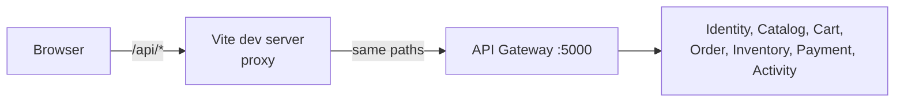

# Storefront

The React client under [`client/`](../../client/): every page a shopper, a seller, a moderator and an
administrator uses. It exists to exercise the API the way a person would - and to reveal what the
backend lacks - rather than as a polished product. How to run it and the folder conventions are in the
[client README](../../client/README.md); this page describes how it fits the system.

## Place in the system

- **It talks only to the gateway.** In development Vite proxies `/api` to `:5000`, so the page and the
  API share one origin and there is no CORS to configure.
- **Tokens:** the access token lives in memory only; the refresh token is Identity's HttpOnly cookie,
  which no script can read. On a reload, and whenever a request gets a 401, the client asks for a new
  access token once (concurrent 401s share one refresh) and retries.
- **Roles are for drawing, never deciding.** The client learns a person's roles from the sign-in
  response (not by decoding the token) and uses them to show or hide pages and buttons. Every rule is
  enforced again by the server, which answers in words the client shows as they are.
- **Language and currency** are chosen separately and sent on every request (`Accept-Language`,
  `X-Currency`). The interface text is `react-i18next` JSON per language under `src/locales/`; product
  text comes translated from Catalog.

## Stack

React 19, TypeScript, Vite, Tailwind CSS v4, shadcn/ui components (on Base UI), axios, TanStack Query for
server state, react-i18next. Lint with oxlint, tests with Vitest + Testing Library (see
[testing strategy](../testing/testing-strategy.md)).

## Layers

| Folder | Holds |
| :-- | :-- |
| `services/` | One class per entity over axios (`Product.list()`, `Accounts.lock()`); the model types in `services/<entity>/types.ts` |
| `hooks/` | The TanStack Query layer a page calls: queries with their keys, mutations that invalidate what they change |
| `pages/` | One folder per route, composing components; supporting files beside the page's `index.tsx` |
| `components/` | Reusable pieces by area; `components/ui/` is generated by shadcn (four files edited on purpose - see the client README) |
| `layouts/` | The frames: main, seller console, admin console |
| `routes/` | Every address and the guards in front of them |
| `context/` | Authentication state |
| `config/`, `constants/`, `utils/` | axios and i18n setup; query keys and page size (`PAGE_SIZE` = 12); formatting helpers |

## Pages

| Address | Who | Page |
| :-- | :-- | :-- |
| `/` | anyone | Catalogue: search, category, sort |
| `/products/:id` | anyone | A product: variants, stock, add to cart, ratings and reviews |
| `/sign-in`, `/sign-up` | anyone | Authentication |
| `/status` | anyone | Service health through the gateway |
| `/account` | signed in | The account |
| `/cart` | signed in | The cart |
| `/addresses` | signed in | The address book |
| `/checkout` | signed in | Address, delivery option, the quote, placing the order and waiting for the saga |
| `/orders`, `/orders/:id` | signed in | Order history; one order parcel by parcel, cancel, confirm arrival |
| `/notifications` | signed in | The inbox (the bell in the top bar shows the unread count) |
| `/open-shop` | signed in | Apply to sell; where the application stands |
| `/shop` | Seller | Seller console home |
| `/shop/products`, `/shop/products/new`, `/shop/products/:id` | Seller | Listings: create, variants, prices per currency, photographs, stock, review status |
| `/shop/sales`, `/shop/sales/:id` | Seller | Sales and preparing/shipping their own parcel |
| `/shop/payouts` | Seller | Balance and payouts |
| `/admin` | Admin (moderators are sent to Moderation) | Fulfilment queue for the shop's own parcels |
| `/admin/overview` | Admin | Insights: revenue per currency, top selling, top viewed, top buyers |
| `/admin/orders/:id` | Admin | One order as staff see it |
| `/admin/payouts` | Admin | What is due to each seller; record a payout |
| `/admin/moderation` | Staff | What is waiting, and the moderator's own recent decisions |
| `/admin/products` | Staff | Product review queue: approve, reject, take down |
| `/admin/shops` | Staff | Shop applications: approve, reject |
| `/admin/reviews` | Staff | Ratings and reviews: hide, restore |
| `/admin/users` | Staff | Find people; lock/unlock (staff), grant/revoke Moderator and ban (admin) |
| `/admin/audit` | Admin | The audit log with diffs |

## Known limits

- No test drives these pages in a real browser against the running stack
  ([#117](https://github.com/jessiicamaru/e-commerce-asp-dotnet-practice/issues/117)).
- Notifications are polled every 30 seconds, not pushed.
