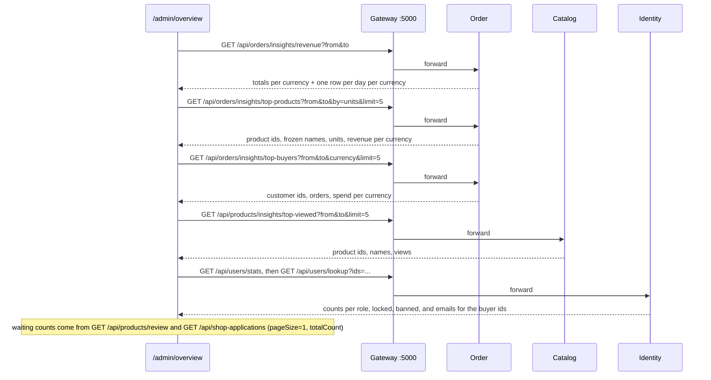

# Admin insights

The Overview at `/admin/overview` shows an administrator how the shop is doing. It covers revenue per currency over the last 7, 30 or 90 days with a bar per day, what sold most, what shoppers looked at most, who spent most, and headline counts of people and of what waits for moderation. No new service or cross-service call builds it. The storefront **composes the page from three services**, and each answers from its own data: Order for money, sales and buyers, Catalog for product views, and Identity for who people are. Two rules matter most. There is **one definition of a sale** (`OrderInsights.Sold`: `Paid`, `Completed`, `Preparing`, `Shipped`). And **money is never added across currencies**: every amount comes with its currency, and dong and dollars are never summed.

## What people can do

| Role | Capabilities |
| :-- | :-- |
| Administrator | Open `/admin/overview` (first item in the console's sidebar). Choose a period of 7, 30 or 90 days. Read revenue, order count and average order value per currency, and a daily chart for one chosen currency. Read the top 5 products by units sold, the top 5 most viewed, and the top 5 buyers by spend in the chosen currency, named by email. Read counts of customers, sellers, moderators and stopped accounts, and how many products and shop applications are waiting. Call each insight endpoint directly with any `from` and `to`. |
| Moderator | Nothing here. The link is hidden, and every insight endpoint answers 403. |
| Shopper | Opening a product page sends one view. A view is counted only for a product that is on sale, viewed by somebody who is neither staff nor that product's seller. |
| System | Catalog increments the view count per product per shop day (specs/082) in the database. |

## How it works

**The page.** `AdminOverviewPage` fixes `to` = now and `from` = now minus the chosen number of days **less one** when the period is chosen, not on every render - today and the N - 1 days before it, exactly the N days the chart draws (specs/055). It then issues six reads through `useInsights`. Each is keyed by the period's start, so switching back to a period already seen shows it at once.

**Order.** `OrderInsights` (Infrastructure) does the grouping in PostgreSQL over `SoldIn(from, to)`. That is the orders whose `Status` is one of `Sold`, with `CreatedAt >= from AND CreatedAt < to`.
- `RevenueByDayAsync` groups by the shop's date of `PaidAt ?? CreatedAt` - `TimeZoneInfo.ConvertTimeBySystemTimeZoneId`, which Npgsql writes as `AT TIME ZONE` (specs/082) - and `Currency`, summing `TotalAmount` and counting orders.
- `ProductSalesAsync` flattens order lines and groups by `ProductId` and `Currency`, summing `Quantity` and `Quantity * UnitPrice`. It keeps the most recently frozen `ProductName`.
- `BuyersAsync` groups by `UserId` and `Currency`.

`InsightsHandlers` (Application) shapes the rows into totals and series per currency. An order from before specs/022 has `Currency = null` and counts as `Money:DefaultCurrency`. The average order value is revenue divided by orders, rounded to 2 places half away from zero. **One period rule for all four insights** (`Ecommerce.Shared.Insights.InsightsPeriod`, specs/055): whole days **of the shop** (`InsightsCalendar`, specs/082), from the day `from` falls on to the day `to` falls on, both included - a time is snapped to its day in the shop's time zone, and a bare date is taken as that day. The default is the last 30 days, today included; at most 366 days; `from` not after `to` (a single day is a period). Every insight query - revenue, top products, top buyers and Catalog's top viewed - validates it with the same `ValidPeriod` rule and the same words, and the revenue response's `from`/`to` report the whole-day bounds as UTC instants (`to` exclusive), with `firstDay`/`lastDay` naming the days themselves. Before #125 Order cut at instants, Catalog at days, and only revenue had a limit.

**Catalog.** `POST /api/products/{id}/view` sends `RecordProductViewCommand`. The handler returns quietly unless the product exists and `IsListed`, and the caller is not an administrator, not a moderator, and not the product's seller. Otherwise `ProductViewRepository.RecordAsync` runs one upsert that increments `product_views."Views"` for (`ProductId`, today in the shop's time zone). `GET /api/products/insights/top-viewed` sums views per product between the dates of `from` and `to` (both days included), and joins `products` for the name.

**Identity.** `GET /api/users/stats` returns `UserStats(Total, Customers, Sellers, Moderators, Admins, Locked, Banned)`: a count per role, accounts locked until a future time, and banned accounts. `GET /api/users/lookup?ids=` returns `UserBrief(Id, Email, FirstName, LastName)` for 1 to 100 ids and leaves out unknown ones. The Overview uses it to put emails on the top buyers, because Order knows buyers only by id.

**The chart.** `DailyRevenueChart` draws one column for every day of the period, not only the days with revenue. `periodDays(first, last)` in `client/src/utils/insights` lists every `YYYY-MM-DD` day from the response's `firstDay` to its `lastDay` - the server's days, because the browser's clock knows neither the shop's time zone nor what the server counted (specs/082). Days with no sales stay empty. Bars scale to the busiest day, which is named above the chart. The first and last days are labelled below it, and hovering or focusing a column shows the date, the amount and the number of orders. The chart shows one currency at a time: the one whose revenue card is selected.

## Rules and guarantees

1. **One definition of a sale, in one place.** `OrderInsights.Sold` = `Paid`, `Completed`, `Preparing`, `Shipped`, and revenue, top products and top buyers all use it. `Failed`, `Cancelled` and still-settling orders (`Submitted`) never count. `Completed` is included because orders settled before specs/011 still carry it, and every read reports it as `Paid`. Why: three reports with three definitions would disagree with each other on the same page ([specs/047 spec FR-001](../../specs/047-admin-insights/spec.md)). A cancellation after payment moves the order to `Cancelled`, so it drops out of the report retroactively.
2. **Money is never added across currencies.** Every total, every top-product revenue and every buyer's spend is a list of `{ currency, amount }`. The Overview shows one card per currency and charts one currency at a time. Why: the shop converts nothing (specs/022), so a sum of dong and dollars would be neither. The same reason is why a variant with no dollar price has no dollar price rather than a converted one.
3. **Rankings in money are by one named currency.** Top buyers (and top products `by=revenue`) sort by the amount in `currency`, defaulting to `Money:DefaultCurrency`. Buyers with nothing in that currency sort as 0, ties broken by order count. Top products `by=units` counts units across currencies, which is meaningful because a unit is a unit.
4. **The client composes the page; no service calls another for it.** Why: the alternative was a new service-to-service edge used only for a report. Each service answers from its own data and nothing new is shared ([specs/047 plan D1](../../specs/047-admin-insights/plan.md)). The cost: a page of six requests, and emails fetched in a second round trip.
5. **Order knows buyers only by id.** The email comes from Identity's `GET /api/users/lookup`, which is Admin only. Why: Identity owns people's details and Order records only the buyer's id ([spec FR-003](../../specs/047-admin-insights/spec.md)). Top buyers are therefore ids until the page asks Identity.
6. **A view is its own request, not a side effect of reading a product.** Why: `GET /api/products/{id}` is called once per currency by the seller's product page and again whenever the storefront refetches on window focus. Counting reads would count both (specs/047 D2). The product page sends the view once per product opened, guarded by a `useRef`, and ignores failures.
7. **Views are incremented by the database.** `INSERT ... ON CONFLICT ("ProductId", "Day") DO UPDATE SET "Views" = product_views."Views" + 1`. Why: read-then-write loses views that arrive together (specs/047 D3). `ProductViewTests` fires twenty at once and expects twenty.
8. **Only shoppers' views of products on sale count.** Staff, and the product's own seller, do not count. Neither does a pending, rejected or deleted product. Why: a seller checking their listing and a moderator reviewing it are not interest from buyers.
9. **The view endpoint says nothing about the product.** It is anonymous and always answers 204, counted or not. Why: a different answer for an unlisted product would let anyone probe whether an id exists and is waiting for review.
10. **Every insight is Administrator only.** The controller attribute (`[Authorize(Roles = "Admin")]` on `InsightsController`, and on `top-viewed`, `users/stats` and `users/lookup`) is the whole permission, and a moderator gets 403. The storefront hides the Overview link from moderators, but that only draws; the server decides.
11. **The daily chart shows every day of the period.** Why: when it drew only days with revenue, a single day of seeded orders produced one bar filling the whole chart with no dates and no baseline. It was reported as nonsense and fixed in [#101](https://github.com/jessiicamaru/e-commerce-asp-dotnet-practice/pull/101).
12. **Revenue is dated by the day the order was PAID** (specs/072, #116), in the shop's time zone (rule 15). The settlement to `Paid` writes `orders.PaidAt` in its own guarded statement; the period filter and the daily grouping both use `PaidAt ?? CreatedAt`, so an order from before this - which recorded no payment time - keeps the day it was placed. *Why:* an order placed at 23:59 and paid at 00:01 was revenue of the day before it was paid.
13. **Revenue is the order's `TotalAmount`; product revenue is goods only.** Revenue includes delivery and tax, as charged. A top product's revenue is `Quantity * UnitPrice` of its lines, before tax and without delivery. The two are different measures and are not expected to reconcile.
14. **A product's name in "top selling" is the one frozen on its most recent order line**, in the language that order was placed in. Order does not ask Catalog. A deleted product still appears. "Most viewed" names the product by Catalog's current default-language `Name`, and a deleted product drops out of it (its `product_views` rows are deleted with it).
15. **A day is the shop's day** (specs/082, #168). `Insights:TimeZone` - an IANA id, `Asia/Ho_Chi_Minh` by default - is read once at startup by `AddInsightsCalendar`, and an id the machine does not know stops the service rather than counting in UTC. Every insight, Order's and Catalog's, counts that zone's days: the period's ends, the grouping and a view's day. *Why:* the shop's customers are in Vietnam (UTC+7), so with UTC days an order paid at 06:30 in Hanoi was revenue of the day before. One zone for the whole shop, not the reader's, so two people see the same numbers.

## Data

| Table | Service | Role here |
| :-- | :-- | :-- |
| [`orders`](../reference/data-model.md#orders) | Order | `Status`, `Currency`, `TotalAmount`, `CreatedAt`, `UserId`: revenue and buyers. |
| [`order_items`](../reference/data-model.md#order_items) | Order | `ProductId`, `ProductName`, `Quantity`, `UnitPrice`: top products. |
| [`product_views`](../reference/data-model.md#product_views) | Catalog | One row per product per shop day (UTC before specs/082), primary key (`ProductId`, `Day`), with an index on `Day`. |
| [`products`](../reference/data-model.md#products) | Catalog | The name shown for most-viewed products. |
| [`users`](../reference/data-model.md#users), [`user_roles`](../reference/data-model.md#user_roles), [`roles`](../reference/data-model.md#roles) | Identity | Emails for buyer ids; counts per role; `LockedUntil` and `BannedAt`. |

## API

All Admin only except the view. See the [API reference](../reference/api.md).

| Method | Path | Who | Parameters |
| :-- | :-- | :-- | :-- |
| `GET` | `/api/orders/insights/revenue` | Admin | `from`, `to` - whole shop days, both included, at most 366 (the same on every insight) |
| `GET` | `/api/orders/insights/top-products` | Admin | `from`, `to`, `by` = `units` or `revenue`, `currency`, `limit` 1-50 (default 10) |
| `GET` | `/api/orders/insights/top-buyers` | Admin | `from`, `to`, `currency`, `limit` 1-50 (default 10) |
| `GET` | `/api/products/insights/top-viewed` | Admin | `from`, `to`, `limit` 1-50 (default 10) |
| `POST` | `/api/products/{id}/view` | anyone | - (always 204) |
| `GET` | `/api/users/stats` | Admin | - |
| `GET` | `/api/users/lookup` | Admin | `ids` (repeated, 1-100) |
| `GET` | `/api/products/review` | Admin, Moderator | used with `status=Pending&pageSize=1` for the waiting count |
| `GET` | `/api/shop-applications` | Admin, Moderator | used with `status=Pending&pageSize=1` for the waiting count |

## Messages

None. The insights are reads, and the view counter is a single SQL statement. Nothing is published or consumed.

## Storefront

| Path | What it does |
| :-- | :-- |
| `client/src/pages/admin-overview/index.tsx` | `AdminOverviewPage`: period buttons, six headline cards (the two waiting counts link to their queues), revenue cards per currency, the chart, and three top-5 lists. |
| `client/src/components/insights/` | Shared with the seller's Insights page since specs/068: `DailyRevenueChart` (one keyboard-focusable column per day, bars scaled to the peak, a tooltip that stays inside the card), `RevenuePanel`, `RankedList`, `InsightPanel`, `PeriodPicker`. |
| `client/src/utils/insights/index.ts` | `periodDays`: every day from `firstDay` to `lastDay`, as the server counted them. `periodRange`: the request's `from` and `to` for a period. |
| `client/src/services/insights/`, `client/src/hooks/insights/` | The `Insights` class (Order, Catalog and Identity calls) and `useInsights`, with `TOP = 5`. |
| `client/src/pages/product/index.tsx` | Sends `Product.recordView(id)` once per product opened. |
| `client/src/layouts/admin-layout/` | The Overview link, first in the sidebar, shown to administrators only. |

## Tests

| Where | What it proves |
| :-- | :-- |
| `Ecommerce.Order.Tests/InsightsTests` | `Revenue_counts_paid_orders_per_currency_and_nothing_else`: Paid, Shipped and Preparing count; Cancelled, Failed and Submitted do not; VND and USD are separate totals; one day row per currency per day. `Top_products_count_units_and_keep_revenue_per_currency`: a cancelled order's 50 units do not count. `Top_buyers_rank_by_spend_in_the_asked_currency`. |
| `Ecommerce.Catalog.Tests/ProductViewTests` | `A_shopper_opening_a_product_page_counts_and_twenty_at_once_count_twenty`; `Staff_and_the_seller_do_not_count_and_neither_does_what_is_not_on_the_shelf`; `The_most_viewed_come_first`. |
| `Ecommerce.Identity.Tests/UserReportTests` | `Ids_are_turned_into_emails_and_unknown_ones_are_left_out`; `The_counts_follow_the_roles`. |
| `client/src/pages/admin-overview/index.test.tsx` | Revenue per currency, never added together; top buyers named by email; waiting counts shown; a different period asks again; the request covers exactly the days the chart draws. |
| `client/src/components/insights/daily-revenue-chart/index.test.tsx` | One column per day with empty days included; bars scaled to the busiest day, which is named; one currency at a time; the hover text gives day, amount and orders. |
| `client/src/utils/insights/index.test.ts` | `periodDays` lists every day oldest first, crosses a month end, and gives as many days as asked. |
| `client/src/pages/product/index.test.tsx` (`ProductPage views`) | The page reports a view once, however often it renders. |
| `bruno/admin-insights/` | A shopper opens the product page; revenue per currency, top selling, most viewed, top buyers, who the buyers are, and people in numbers answer 200 to an administrator; a customer and a moderator get 403. |
| `bruno/security-checks/insights without a token is 401.yml`, `people without a token is 401.yml` | 401 without a token. |

The plan records two mutation checks: counting cancelled orders as revenue, and counting staff views. Each makes the tests above fail.

## Known limits

- **One time zone for the whole shop.** A seller or an administrator elsewhere still reads the shop's days (specs/082).
- **Views recorded before specs/082 kept their UTC day.** The rows hold a day, not an instant, so they could not be moved; revenue is dated by instants and needed no migration.
- **Views are not deduplicated.** The endpoint is anonymous and has no rate limit, so repeated requests inflate a count. The storefront sends one per product opened, per page load.
- **Headline counts are now, not for the period.** "Customers" includes sellers, who also hold `Customer`. "Stopped" adds locked and banned, so an account that is both counts twice.
- **Revenue and product revenue measure different things** (with and without tax and delivery). The Overview shows units for top products and does not display product revenue.
- **A seller's own view is a separate page**, [Seller insights](seller-insights.md) (specs/068). It leaves a returned and refunded parcel out of revenue; this Overview does not yet.
- **Out of scope in the spec:** charts beyond a daily bar per currency, exports, and custom date ranges in the storefront.

## History

| Spec | PR | What it added |
| :-- | :-- | :-- |
| [022-multi-currency-prices](../../specs/022-multi-currency-prices/) | [#59](https://github.com/jessiicamaru/e-commerce-asp-dotnet-practice/pull/59) | `orders.Currency`, which makes per-currency revenue possible. |
| [038-admin-console](../../specs/038-admin-console/) | [#82](https://github.com/jessiicamaru/e-commerce-asp-dotnet-practice/pull/82) | The `/admin` console the Overview joins. |
| [047-admin-insights](../../specs/047-admin-insights/) | [#99](https://github.com/jessiicamaru/e-commerce-asp-dotnet-practice/pull/99) | Order insights endpoints, `product_views` and the view endpoint, Identity's lookup and stats, and the Overview page. |
| - | [#101](https://github.com/jessiicamaru/e-commerce-asp-dotnet-practice/pull/101) | The daily chart shows every day of the period, with labels, the peak and a tooltip. |
| [082-insights-local-days](../../specs/082-insights-local-days/) | #170 | Days are the shop's (`InsightsCalendar`, `Insights:TimeZone`), and the chart draws the server's `firstDay`..`lastDay` (#168). |
