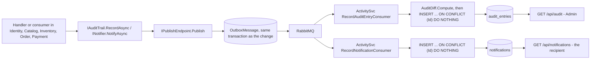

# Audit log and in-app notifications

The **Activity** service (REST on 5063, database `ecommerce_activity_db` on 5440) keeps two things that
every other service produces and none owns: an **audit log** of who did what, for administrators, and
an **inbox of notifications** for each person. A service never calls Activity. It publishes
`AuditEntryRecorded` or `UserNotificationRequested` through its own transactional outbox, in the same
transaction as the change being described, and Activity stores each message once, keyed by the id the
publisher minted. An audit entry carries before and after snapshots, redacted before they leave the
service, and Activity computes the field-level diff once when it stores the entry. A notification stores
a kind and data, never a sentence, and the storefront words it in whatever language the reader has
chosen.

Related documents: [moderation and staff](moderation-and-staff.md), [marketplace](marketplace.md),
[fulfilment and delivery](fulfilment-and-delivery.md), [reliable messaging](../architecture/reliable-messaging-and-outbox-pattern.md).

## What people can do

| Role | Can |
| :-- | :-- |
| **Customer** | Read their own notifications (the bell and `/notifications`), mark one or all read. Is told when an order is paid, fails, ships a parcel or is cancelled. |
| **Seller** | The same inbox. Is told of a new sale, a cancelled sale, a parcel the customer received, a payout, a shop decision, a product decision and a new review. |
| **Moderator** | The same inbox (told when made or no longer a moderator). Reads their own Moderation decisions through `GET /api/audit/mine`, shown on their dashboard. |
| **Administrator** | Reads the whole audit log: filtered and paged, counts per category, one entry with its diff. |
| **System** | Every service that changes something records it; sweepers record under **System** with no actor. Activity stores each entry and notice once. |

## How it works

### One path for both



Both interfaces live in `Ecommerce.Shared` and are registered per service: `AddAuditTrail("identity")`
(also `catalog`, `inventory`, `order`, `payment`) and `AddNotifier()` (Identity, Catalog, Order). Cart
and the Orchestrator record nothing.

### Recording an audit entry

```csharp
await _audit.RecordAsync(AuditCategory.Moderation, "AccountLocked", "User", user.Id.ToString(),
    $"{user.Email} locked for {request.Days} day(s)", before, Snapshot(user), cancellationToken: ct);
await _users.SaveChangesAsync(ct);   // the entry commits with the change, or not at all
```

`AuditTrail.RecordAsync` fills in:

- **the actor** - from `ICurrentUser`: id, email and the most powerful role held, in the order
  `Admin`, `Moderator`, `Seller`, `Customer`. With no signed-in caller (a message consumer, a sweeper)
  the actor is empty, which the log shows as the system. A caller can pass an explicit `AuditActor` -
  sign-in and registration do, because nobody is signed in yet;
- **the service name** given to `AddAuditTrail`;
- **a fresh entry id** (`Guid.CreateVersion7()`) and the time;
- **the snapshots** - `before` and `after` are any serialisable objects, turned into JSON by
  `AuditSnapshot.Serialize`, which replaces with `***` the value of every property, at any depth, whose
  name contains `password`, `token`, `secret` or `hash` (case-insensitive).

Where the change is a guarded statement in its own transaction - a parcel move, a delivery, a payout, a
cancellation, a shop decision, a product review decision, settling an order - the repository method
takes a `stage` callback, and the handler records the entry (and the notice) inside it, so they are saved
in that transaction and only by the request that won the guard.

Activity's `RecordAuditEntryCommandHandler` computes the diff with `AuditDiff.Compute`: both snapshots
are flattened to paths (`name`, `prices.VND`, `options[0].value`), a path is a change when it is on one
side only or its values differ, and the list is sorted by path and cut at 200 changes
(`AuditDiff.MaxChanges`). A creation lists every field as added; a deletion as removed. The list and
its count are stored in `Changes` (`jsonb`) and `ChangeCount`; the reader never recomputes them.

### Sending a notification

```csharp
await _notifier.NotifyAsync(user.Id, NotificationKind.ShopApproved,
    new Dictionary<string, string> { ["shop"] = application.ShopName }, "/shop", ct);
```

A notice is a recipient, a `Kind` (one of the `NotificationKind` constants), a `Data` dictionary of
strings, and an optional `Link` into the storefront. Order builds its notices in one place,
`OrderNotices`, from `OrderNoticeFacts` (buyer, total, currency, parcels with their sellers) read inside
the same transaction.

The storefront words each notice with `describeNotification`
(`client/src/utils/notifications`), looking up `notifications:kind.<Kind>` in the reader's current
language and interpolating the data. A kind it has no words for is shown as "You have a new update."
rather than hidden, and so is a notice missing a value its sentence needs (specs/048): the sentence's
raw form is read first, and any placeholder that would come out empty means the generic sentence
instead - never a sentence with a hole in it. The English review notice is plural by its rating
("1 star", "5 stars"). The bell (`components/layout/notification-bell`) polls
`GET /api/notifications/unread-count` every 30 seconds (`NOTIFICATION_POLL_MS`), only while the tab is
visible, and loads the latest 8 only when opened; choosing one marks it read and follows its link.

## Rules and guarantees

1. **An entry or a notice commits with the change it describes.** Call `RecordAsync` / `NotifyAsync`
   **before the one `SaveChangesAsync`**, or inside a repository's `stage`. *Why:* both publish through
   the outbox; called after the save, a crash in between leaves a change nobody can account for, or a
   notice about an order that never saved (constitution Principle III, specs/041 D2).
2. **A refused change leaves no entry.** Validation, ownership and guard failures throw before the save,
   so the staged message is never committed. The Catalog, Order and Payment `AuditTests` assert it.
3. **At most one row per message id.** Both consumers insert with `ON CONFLICT ("Id") DO NOTHING` on
   the id the publisher minted. *Why:* the broker delivers at least once; a redelivery must be a no-op
   (specs/041 D4).
4. **Secrets never leave the service.** Redaction runs in the publishing service, before the message is
   written to the outbox, and decides by property name at any depth. *Why:* a secret that reached the
   broker or Activity's database could not be recalled.
5. **Personal data is kept out of diffs where it is not needed.** Address changes are recorded as
   "Added / Edited / Deleted a delivery address" with no snapshot; user moderation snapshots hold roles
   and the two stops, nothing personal.
6. **The diff is computed once, when stored.** *Why:* a diff recomputed at read time could change with
   the code that computes it; the stored list is what was seen (specs/041 D5).
7. **The actor comes from the token, never from a body.** With no token it is the system. A sign-in
   with an unknown email is recorded with an empty actor - never "whoever is calling", which on an
   anonymous endpoint means nothing.
8. **A refused sign-in is recorded on its own.** The login handler saves the outbox row by itself before
   throwing, because a refusal leaves nothing else to save.
9. **Product images are the one place the entry is saved just after its change.** The image switch is
   its own guarded `UPDATE` (specs/019), so the entry is saved immediately afterwards rather than with it.
10. **The audit log is an administrator's.** `AuditController` is `[Authorize(Roles = "Admin")]`: it
    names who did what to whom, and a moderator reading who locked them would be reading their own
    file. `GET /api/audit/mine` gives staff only their own **Moderation** entries.
11. **A notice stores a kind and data, never a sentence.** *Why:* a sentence stored in the language of
    the moment would stay in it; worded by the storefront, one notice reads Vietnamese on one visit and
    English on the next (specs/042 D1). An unknown kind still shows, generically.
12. **Only the recipient reads or marks a notice.** Every query and update has the caller's id in its
    `WHERE`; somebody else's notice id is 404 `Notification not found.`, the same as a missing one.
    Marking an already-read notice is not an error.
13. **Polling, not a socket.** 30 seconds on the unread count only, not in a background tab; the list
    loads when the bell opens (decided with the user, specs/042).
14. **Joining the consumer's transaction.** The saga's outcome reaches Order in a consumer, and
    MassTransit's consumer outbox already holds a transaction on the context. `TrySettleAsync` joins it
    (`Database.CurrentTransaction`) instead of opening a second, which throws "already in a
    transaction" - and did, leaving every order `Submitted` while every unit test passed.
    `NotificationTests.Settling_inside_a_consumer_transaction_joins_it` opens the transaction the way
    MassTransit does. A new `stage` method called from a consumer needs the same branch.
15. **Activity's queues are prefixed** (`ActivitySvc`), so its consumers never share a queue with a
    same-named consumer elsewhere.

## Every audit action

Found by searching every `RecordAsync(` call in `server/src`. **Actor** is who the entry names:
*caller* means the signed-in user from the token; *system* means none.

| Action | Category | Subject type | Service | Recorded when | Actor |
| :-- | :-- | :-- | :-- | :-- | :-- |
| `SignedIn` | Security | User | Identity | A sign-in succeeds. | the user |
| `SignInRefused` | Security | User | Identity | Wrong password or unknown email; or the right password on a locked or banned account. | the account, or nobody |
| `Registered` | User | User | Identity | `POST /api/auth/register`. | the new user |
| `ShopApplied` | User | ShopApplication | Identity | `register-seller`, or `POST /api/shop-applications`. | the applicant |
| `ShopRenamed` | User | Seller | Identity | A seller renames their shop. | caller |
| `AddressAdded` / `AddressUpdated` / `AddressDeleted` | User | Address | Identity | The address book changes (no snapshot). | caller |
| `RoleGranted` / `RoleRevoked` | Security | User | Identity | An administrator grants or revokes `Moderator`. | caller |
| `AccountLocked` / `AccountUnlocked` | Moderation | User | Identity | Staff lock or unlock an account. | caller |
| `AccountBanned` / `BanLifted` | Moderation | User | Identity | An administrator bans or lifts a ban. | caller |
| `ShopApproved` / `ShopRejected` | Moderation | ShopApplication | Identity | Staff decide an application (inside the guarded decision). | caller |
| `CategoryCreated` / `CategoryDeleted` | Catalog | Category | Catalog | An administrator creates or deletes a category. | caller |
| `ProductCreated` / `ProductDeleted` | Catalog | Product | Catalog | A product is listed or removed for good. | caller |
| `ProductTextEdited` | Catalog | Product | Catalog | A product's name and description are set in one language. | caller |
| `PriceSet` / `PriceRemoved` | Catalog | Variant | Catalog | A variant's price in one currency is set or removed. | caller |
| `VariantAdded` / `VariantUpdated` | Catalog | Variant | Catalog | A variant is added, re-priced or taken off sale. | caller |
| `ProductImageSet` / `ProductImageRemoved` | Catalog | Product | Catalog | The product photograph changes (saved just after the switch). | caller |
| `VariantImageSet` / `VariantImageRemoved` | Catalog | Variant | Catalog | A variant's own photograph changes. | caller |
| `OrphanImagesReclaimed` | System | ImageStore | Catalog | An administrator reclaims unreferenced image files. | caller |
| `ProductSentForReview` | Moderation | Product | Catalog | A seller changes an approved product's text or photographs; it goes back to `Pending`. | caller |
| `ProductResubmitted` | Moderation | Product | Catalog | A seller sends a rejected product back to the queue. | caller |
| `ProductApproved` / `ProductRejected` / `ProductTakenDown` | Moderation | Product | Catalog | Staff decide a product (inside the guarded move). | caller |
| `ReviewPosted` / `ReviewEdited` | Catalog | Review | Catalog | A customer writes or rewrites their review. | caller |
| `ReviewHidden` / `ReviewRestored` | Moderation | Review | Catalog | Staff hide or restore a review. | caller |
| `StockSet` | Catalog | Variant | Inventory | `PUT /api/stock/{variantId}`. | caller |
| `ReservationsExpired` | System | Reservation | Inventory | The expiry sweeper returns holds to the shelf. | system |
| `StockReturned` | Order | Order | Inventory | A cancelled order's units are put back. | system |
| `OrderPlaced` | Order | Order | Order | Checkout. | caller |
| `OrderPaid` | Order | Order | Order | The saga's `OrderCompletedEvent` settles the order. | system |
| `OrderFailed` | Order | Order | Order | The saga's `OrderFailedEvent` settles the order. | system |
| `OrderCancelled` | Order | Order | Order | The customer or staff cancel a paid order. | caller |
| `ParcelPrepared` / `ParcelShipped` | Order | Order | Order | Staff move the shop's parcel, or a seller moves theirs. | caller |
| `ParcelReceived` | Order | Order | Order | The customer confirms a parcel arrived. | caller |
| `DeliveriesAutoConfirmed` | System | Parcel | Order | The delivery sweeper takes unconfirmed parcels as delivered (no subject id). | system |
| `PayoutRecorded` | Payment | Seller | Order | An administrator records a payout (inside the claim's transaction). | caller |
| `PaymentCharged` / `PaymentRefused` | Payment | Order | Payment | The saga's `ProcessPaymentCommand` is handled. | system |
| `RefundRecorded` | Payment | Order | Payment | A cancelled order's payment is refunded. | system |

54 actions in 7 categories: System, Security, User, Catalog, Order, Payment, Moderation
(`AuditCategory.All`). The storefront has a label for each, plus `ShopOpened`, which the code no longer
records (before specs/044, `register-seller` opened a shop at once) but older entries may carry.

## Every notification kind

From `NotificationKind` in `Ecommerce.Shared/Notifications` and every `NotifyAsync` call.

⚠️ **The data keys of each kind are declared once, in
`Ecommerce.Shared/Notifications/notification-kinds.json`** (specs/048), and both sides are tested
against that file. The server tests check every notice they publish carries exactly its declared keys
(`NotificationContract.Problems`), and that the declared kinds are the `NotificationKind` constants. The
storefront tests check every declared kind has a sentence in both languages that shows what it was sent.
Before this, five kinds reached people as "“{{product}}” was not approved: {{reason}}" (#119): the
server sent the words and the storefront never passed them on, and no test could see the two sides at
once. **A new kind or key is a line in that file, in the same change as the `NotifyAsync` call and the
sentence.** It is checked by the tests, never at run time - a mismatch that threw inside `Notifier`
would roll back the payout or the decision it announces.

| Kind | Recipient | Data | Link | Sent when (service) |
| :-- | :-- | :-- | :-- | :-- |
| `OrderPaid` | buyer | `orderId`, `total`, `currency` | `/orders/{id}` | The order settles as paid (Order). |
| `NewSale` | each seller on the order | `orderId` | `/shop/sales/{id}` | The same moment (Order). |
| `OrderFailed` | buyer | `orderId` | `/orders/{id}` | The order settles as failed (Order). |
| `ParcelShipped` | buyer | `orderId`, `tracking`, `shop` (a seller's parcel only) | `/orders/{id}` | Staff or a seller ship a parcel (Order). |
| `OrderCancelled` | buyer | `orderId`, `by` (`Customer` or `Staff`) | `/orders/{id}` | The order is cancelled (Order). |
| `SaleCancelled` | each seller on the order | `orderId` | `/shop/sales/{id}` | The same moment (Order). |
| `ParcelReceived` | the parcel's seller (not for the shop's own) | `orderId` | `/shop/sales/{id}` | The customer confirms receipt (Order). |
| `PayoutRecorded` | seller | `amount`, `currency` | `/shop/payouts` | An administrator records a payout (Order). |
| `ModeratorGranted` | the person | none | `/admin` | An administrator grants `Moderator` (Identity). |
| `ModeratorRevoked` | the person | none | none | An administrator revokes it (Identity). |
| `ShopApproved` | applicant | `shop` | `/shop` | Staff approve the application (Identity). |
| `ShopRejected` | applicant | `shop`, `reason` | `/open-shop` | Staff reject it (Identity). |
| `ProductApproved` | seller | `product` | `/shop/products/{id}` | Staff approve a product (Catalog). |
| `ProductRejected` | seller | `product`, `reason` | `/shop/products/{id}` | Staff reject a product (Catalog). |
| `ProductTakenDown` | seller | `product`, `reason` | `/shop/products/{id}` | Staff take an approved product down (Catalog). |
| `NewReview` | seller | `product`, `rating` | `/products/{id}` | A customer's first review of the product - not its edits (Catalog). |

The shop's own goods have nobody to tell: no `NewSale`, `SaleCancelled`, `ParcelReceived` or product
notice goes out for them.

## Data

Activity database - see [data-model.md](../reference/data-model.md#activity---ecommerce_activity_db-2-tables).

| Table | Columns | Indexes |
| :-- | :-- | :-- |
| [`audit_entries`](../reference/data-model.md#audit_entries) | `Id` (the publisher's entry id), `Category`, `Action`, `ActorId`, `ActorEmail`, `ActorRole`, `SubjectType`, `SubjectId`, `Summary`, `Before` / `After` (`jsonb`), `Changes` (`jsonb`), `ChangeCount`, `Service`, `OccurredAt`, `RecordedAt` | `OccurredAt`; `(Category, OccurredAt)`; `(ActorId, OccurredAt)`; `(SubjectType, SubjectId)` |
| [`notifications`](../reference/data-model.md#notifications) | `Id` (the publisher's id), `RecipientId`, `Kind`, `Data` (`jsonb`), `Link`, `CreatedAt`, `ReadAt` | `(RecipientId, CreatedAt)`; `IX_notifications_unread` on `RecipientId WHERE "ReadAt" IS NULL` |

Activity also holds MassTransit's inbox and outbox tables for its consumers.

## API

Full list in [api.md](../reference/api.md); gateway routes `/api/audit/**`, `/api/notifications/**` and
`/api/activity/health` in [gateway.md](../reference/gateway.md).

| Method | Path | Who |
| :-- | :-- | :-- |
| `GET` | `/api/audit?category=&action=&actor=&actorId=&subjectType=&subjectId=&from=&to=&page=&pageSize=` | Admin |
| `GET` | `/api/audit/summary?from=&to=` | Admin |
| `GET` | `/api/audit/{id}` | Admin |
| `GET` | `/api/audit/mine?page=&pageSize=` | Admin, Moderator - their own Moderation entries |
| `GET` | `/api/notifications?unreadOnly=&page=&pageSize=` | signed in - their own |
| `GET` | `/api/notifications/unread-count` | signed in |
| `POST` | `/api/notifications/{id}/read` | signed in - 204, or 404 for none or not theirs |
| `POST` | `/api/notifications/read-all` | signed in - answers `{ marked }` |

`actor` matches part of the actor's email (`ILIKE`); `category` must be one of the seven; `pageSize` is
at most 100 for the log and 50 for the inbox.

## Messages

From [messages.md](../reference/messages.md).

| Message | Fields | Published by | Consumed by |
| :-- | :-- | :-- | :-- |
| `AuditEntryRecorded` | `EntryId`, `Category`, `Action`, `ActorId`, `ActorEmail`, `ActorRole`, `SubjectType`, `SubjectId`, `Summary`, `Before`, `After`, `Service`, `OccurredAt` | Identity, Catalog, Inventory, Order, Payment, through `Ecommerce.Shared` | Activity `RecordAuditEntryConsumer` |
| `UserNotificationRequested` | `NotificationId`, `RecipientId`, `Kind`, `Data`, `Link`, `OccurredAt` | Identity, Catalog, Order, through `Ecommerce.Shared` | Activity `RecordNotificationConsumer` |

## Storefront

| Where | What |
| :-- | :-- |
| `components/layout/notification-bell` | The unread count, polled every 30 seconds; the latest 8 when opened; mark one or all read. |
| `pages/notifications` (`/notifications`) | Every notice, all or unread only, a page at a time. |
| `utils/notifications` | `describeNotification`: kind and data to words in the reader's language. |
| `constants/notifications` | `NOTIFICATION_POLL_MS = 30_000`. |
| `hooks/notifications`, `services/notifications` | The TanStack Query hooks and the axios calls. |
| `pages/admin-audit` (`/admin/audit`) | Administrators: a tab per category with its count for the period, filters by period and actor, and each entry opening in `entry-dialog.tsx` to its field-level diff. The filters live in the address, so a view can be shared as a link. |
| `pages/admin-moderation` | A moderator's recent decisions from `/api/audit/mine`. |
| `locales/*/notifications.json`, `locales/*/admin.json` | The words for each notification kind and each audit action, in Vietnamese and English. |

## Tests

| Where | Proves |
| :-- | :-- |
| `Ecommerce.Activity.Tests/AuditDiffTests` | Only changed fields; nested paths; creation and deletion; appearing and disappearing fields; type changes; the 200-change cap. |
| `Ecommerce.Activity.Tests/RedactionTests` | Secret-looking fields are redacted at any depth, by name. |
| `Ecommerce.Activity.Tests/AuditTrailTests` | The actor is the caller's most powerful role; nobody signed in is the system unless an actor is given. |
| `Ecommerce.Activity.Tests/AuditLogTests` | Kept with its diff; a redelivery kept once; filters; the summary; unknown entry 404; unknown category 400. |
| `Ecommerce.Activity.Tests/NotificationTests` | Lands in its recipient's inbox once; nobody reads or marks another's; marking lowers the count; newest first, paged. |
| `Ecommerce.Identity.Tests/AuditTests`, `ModerationTests` | Registering, signing in, refused sign-ins, renaming, and every moderation action are recorded with their diff. |
| `Ecommerce.Catalog.Tests/AuditTests` | Listing, pricing and withdrawing are each recorded once; a refused change is not. |
| `Ecommerce.Inventory.Tests/AuditTests` | Setting stock records old and new counts; the sweeper records what it returned. |
| `Ecommerce.Order.Tests/AuditTests` | An order's life one step at a time; who cancelled; a refused step leaves nothing; the delivery sweep is a System entry. |
| `Ecommerce.Order.Tests/NotificationTests` | Paid, failed, shipped, received, cancelled and payout notices go to exactly the right people once; settling inside a consumer transaction joins it; every notice carries exactly its declared keys; the declared kinds are the `NotificationKind` constants. |
| `Ecommerce.Catalog.Tests/ProductReviewTests`, `ReviewTests`; `Ecommerce.Identity.Tests/ShopApplicationTests`, `ModerationTests` | Every product, review, shop and moderator notice - approved, rejected, taken down, new review, granted, revoked - goes to the right person with exactly its declared keys. |
| `Ecommerce.Payment.Tests/AuditTests` | A charge and its refund are each recorded once. |
| client `components/layout/notification-bell`, `pages/notifications`, `utils/notifications`, `services/notifications`, `pages/admin-audit` (and `format.test.ts`), `services/audit` | Polling, wording per kind and language (every declared kind, both languages, showing each value it was sent), the generic fallback for an unknown kind or a missing value, marking read, the audit filters and diff display. |
| Bruno `notifications/`, `admin-audit/`, `admin-users/` | The customer is told the order was paid and shipped; marking read; another person's notice is 404; the audit log records the order it followed and the lock; the summary. |

## Known limits

- **Some writes are not audited:** ([#128](https://github.com/jessiicamaru/e-commerce-asp-dotnet-practice/issues/128)) setting or removing a category translation, removing a product
  translation (only `ProductSentForReview` is recorded when it applies),
  changing the default address, signing out and refreshing a session. Cart records nothing.
- **Some events notify nobody:** ([#128](https://github.com/jessiicamaru/e-commerce-asp-dotnet-practice/issues/128)) a lock or a ban, a parcel the sweeper takes as delivered (the seller
  gets `ParcelReceived` only when the customer confirms), a hidden review, and a product sent back to
  review by the seller's own edit.
- **No retention or archiving.** Both tables grow without bound; exporting is out of scope (specs/041).
- **No email, push or SMS** - in-app only -
  [#102](https://github.com/jessiicamaru/e-commerce-asp-dotnet-practice/issues/102). No notification
  preferences.
- **Up to 30 seconds of delay** on the bell, by design.
- **Activity down means nothing is lost but nothing is visible**: messages wait in the publishers'
  outboxes and the broker until it returns.

## History

| Spec | PR | Added |
| :-- | :-- | :-- |
| [041-audit-log](../../specs/041-audit-log/) | [#93](https://github.com/jessiicamaru/e-commerce-asp-dotnet-practice/pull/93) | The Activity service; `AuditEntryRecorded`; `IAuditTrail`, categories, redaction; `AuditDiff`; `/api/audit`; instrumentation of Identity, Catalog, Inventory, Order and Payment; the audit log page. |
| [042-in-app-notifications](../../specs/042-in-app-notifications/) | [#94](https://github.com/jessiicamaru/e-commerce-asp-dotnet-practice/pull/94) | `UserNotificationRequested`, `INotifier`, `NotificationKind`; `/api/notifications`; `OrderNotices`; `TrySettleAsync` with a `stage`; the bell and `/notifications`. |
| [043-moderators-and-locks](../../specs/043-moderators-and-locks/) | [#95](https://github.com/jessiicamaru/e-commerce-asp-dotnet-practice/pull/95) | Moderation and Security entries for roles, locks and bans; `ModeratorGranted`, `ModeratorRevoked`. |
| [044-shop-applications](../../specs/044-shop-applications/) | [#96](https://github.com/jessiicamaru/e-commerce-asp-dotnet-practice/pull/96) | `ShopApplied`, `ShopApproved`, `ShopRejected`; the matching notices. |
| [045-product-review](../../specs/045-product-review/) | [#97](https://github.com/jessiicamaru/e-commerce-asp-dotnet-practice/pull/97) | Product review actions and notices; `GET /api/audit/mine`. |
| [046-product-reviews](../../specs/046-product-reviews/) | [#98](https://github.com/jessiicamaru/e-commerce-asp-dotnet-practice/pull/98) | Review actions; `NewReview`. |
| [048-notification-wording](../../specs/048-notification-wording/) | [#129](https://github.com/jessiicamaru/e-commerce-asp-dotnet-practice/pull/129) | `notification-kinds.json` and `NotificationContract`: each kind's data keys declared once and tested on both sides; the five kinds that showed placeholders read as sentences (#119). |
