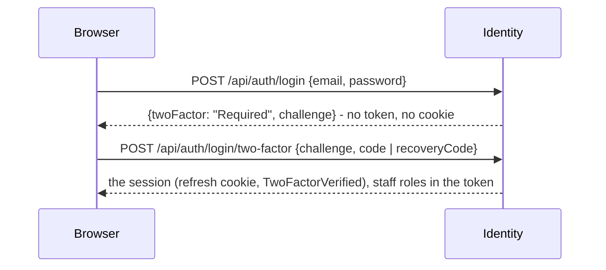

# Two-factor sign-in with an authenticator app (TOTP)

How a six-digit code from Google Authenticator, Microsoft Authenticator, Authy or 1Password proves who is signing
in. The algorithm is the one in [RFC 6238](https://www.rfc-editor.org/rfc/rfc6238) (TOTP), built on
[RFC 4226](https://www.rfc-editor.org/rfc/rfc4226) (HOTP). This page covers:

- how it works, with a worked example you can reproduce;
- the traps an implementation has to avoid;
- how this project uses it: compulsory for staff since specs/110 (#218) - section 7.

---

## 1. The one idea: a shared secret, and the clock

There is **no conversation** between the app and the server.

1. When 2FA is turned on, the server generates a random **secret** and hands it to the phone once, through a QR code.
2. From then on, the app and the server each compute the same code from two things they both have:
   - the secret;
   - the current time.

The server never asks the app anything. It computes what the code *should* be and compares it with what was typed.

```text
                enrolment (once)                                 every sign-in
┌──────────┐   secret, as a QR code   ┌───────┐        ┌──────────┐              ┌───────┐
│  server  │ ───────────────────────▶ │  app  │        │  server  │  ◀── code ── │ person│ ◀── reads the app
└──────────┘                          └───────┘        └──────────┘              └───────┘
 stores the secret                     stores it        computes the code itself from the stored secret
                                                        and its own clock, and compares
```

This is why an authenticator works in aeroplane mode, and why it breaks when the phone's clock is wrong.

## 2. What the QR code holds

A QR code is only a picture of text. For TOTP the text is a URI in the
[Key URI format](https://github.com/google/google-authenticator/wiki/Key-Uri-Format):

```text
otpauth://totp/EcommerceShop:admin@shop.vn?secret=GEZDGNBVGY3TQOJQGEZDGNBVGY3TQOJQ&issuer=EcommerceShop&algorithm=SHA1&digits=6&period=30
```

| Part | Meaning |
| :-- | :-- |
| `totp` | Time-based. `hotp` would be counter-based: a code per button press, rarely used now. |
| `EcommerceShop:admin@shop.vn` | The label the app shows, so a person with ten accounts knows which code is which. |
| `secret` | The shared secret, in **base32** (A-Z, 2-7), so a person can also type it in when a camera is not available. |
| `issuer` | Who issued it, which the app uses for the icon and the heading. |
| `algorithm`, `digits`, `period` | SHA1, 6 and 30 are the defaults every app assumes. Anything else is poorly supported, so they are not changed. |

The secret here is base32 of the ASCII bytes `12345678901234567890`, the RFC's own test secret. A real one is 20
random bytes from a cryptographic generator.

## 3. How a code is computed

```text
T      = floor(unix_seconds / 30)                  the number of 30-second windows since 1970
hmac   = HMAC-SHA1(secret, T as 8 big-endian bytes) 20 bytes
offset = last byte of hmac & 0x0F                  a position from 0 to 15
number = the 4 bytes of hmac at offset, top bit cleared  (a 31-bit integer)
code   = number mod 10^6, padded to 6 digits
```

The code changes every 30 seconds **only because `T` goes up by one**. HMAC turns a one-bit change in its input into an
unrelated output, so consecutive codes look random. Anyone who does not hold the secret cannot compute the next one.

Taking the four bytes from a position chosen by the hash itself ("dynamic truncation") keeps every digit equally
likely. The top bit is cleared so the number is the same whether a language reads it as signed or unsigned.

### Worked example (RFC 6238, Appendix B)

The secret is `12345678901234567890` (ASCII) and the time is 59 seconds after 1970:

| Step | Value |
| :-- | :-- |
| `T = floor(59 / 30)` | `1` |
| `HMAC-SHA1(secret, 0x0000000000000001)` | `75a48a19d4cbe100644e8ac1397eea747a2d33ab` |
| last byte `0xab & 0x0F` | offset `11` |
| 4 bytes at offset 11 | `c1397eea` |
| cleared top bit | `0x41397eea` = `1094287082` |
| `mod 10^8` (the RFC's 8-digit vector) | `94287082` |
| `mod 10^6` (what an app shows) | `287082` |

At time `1111111109` the same steps give `T = 37037036`, offset `4` and `07081804` (8 digits). Both match the RFC's
table, and the implementation's tests use that table.

To reproduce the example:

```python
import hmac, hashlib, struct
secret, t = b"12345678901234567890", 59
h = hmac.new(secret, struct.pack(">Q", t // 30), hashlib.sha1).digest()
o = h[-1] & 0x0F
print(str((struct.unpack(">I", h[o:o + 4])[0] & 0x7FFFFFFF) % 10**6).zfill(6))   # 287082
```

## 4. How the server checks a code

The server does not know which code is on the phone. It knows the secret, so it computes the code for the current
window and compares:

```text
for step in (T - 1, T, T + 1):              one window either side
    if step <= last_used_step: continue     never accept a window already used
    if constant_time_equals(code_for(step), typed):
        last_used_step = step               remember it, in the same guarded write
        return OK
return REFUSED
```

What each line is for:

- **One window either side.** A person types slowly, and a phone's clock drifts by a few seconds. Accepting `T-1`
  and `T+1` gives about 90 seconds of validity, which is what the RFC recommends. More would make a stolen code
  useful for longer.
- **`last_used_step`.** A code seen over a shoulder, or captured by a phishing page, stays valid for the rest of its
  window. Refusing any step at or before the last one used makes each code **single-use**. Without this, TOTP is
  only "a password that changes".
- **Constant-time comparison** (`CryptographicOperations.FixedTimeEquals`). A comparison that stops at the first
  wrong digit answers faster the more digits are wrong, which leaks information.
- **Limit guessing.** Six digits are a million possibilities, but three windows make three valid codes at a time, so
  one blind guess has a 3-in-a-million chance. That is nothing on one try and a real chance over thousands. Wrong
  codes must count toward a lock-out, and in this project they count toward the same sign-in pause as wrong
  passwords (specs/062).

## 5. What must be protected

- **The secret cannot be hashed.** A password is stored as a hash because the server only needs to check it. A TOTP
  secret has to be read back to compute codes, so it is **encrypted at rest** instead. Anyone who reads it can
  produce every code for ever. In .NET that is the Data Protection API.
- **The secret is shown once**, during enrolment. Afterwards the server never returns it. Re-enrolling generates a
  new one.
- **Enrolment is confirmed with a code** before 2FA counts as on. This proves the app saved the right secret; without
  it, a mis-scan locks the person out at their next sign-in.
- **Recovery codes** are for a lost phone. They are a handful of random one-time codes, shown once and stored **only
  as hashes**, like a password-reset token. Each works once, in place of a TOTP code.
- **The second step is its own stage of sign-in.** After the right password the server issues nothing that grants
  access. It returns a short-lived, single-purpose challenge that can only be exchanged, with a valid code, for a
  real session. Issuing the session first and "asking for the code later" is 2FA in appearance only.

## 6. What TOTP does not protect against

- **Real-time phishing.** A fake sign-in page can ask for the password and the code and replay both within the
  window. Only origin-bound methods (WebAuthn/passkeys) stop that.
- **A compromised phone**, or a secret read from the server's database together with its encryption key.
- **Social engineering of the recovery path.** Whoever can turn off somebody else's 2FA must be few, audited and
  loud: the owner is emailed.

It still turns a leaked or guessed password, which is the common way into an account, from enough on its own into
not enough.

## 7. How this project uses it

Built in [specs/110](../../../specs/110-staff-two-factor/) (#218).

**Who.** Staff (Admin and Moderator) must use it; anybody else may. The rule is enforced where tokens are signed: an
access token carries `Admin` or `Moderator` **only for a session verified with a code**
(`SessionRoles.Of`, `refresh_tokens.TwoFactorVerified`). Every service already authorizes from the token's roles, so
an unverified staff session is refused by every staff endpoint in every service, with no change outside Identity. A
staff member without it signs in with `twoFactor: "SetupRequired"`, holding their other roles, and the storefront sends
them to `/account/two-factor`.

**Signing in.**



The challenge is a random token stored only as its SHA-256 (`two_factor_challenges`). It lives 5 minutes, dies after 5
wrong codes and is claimed once. Wrong codes count toward the email's sign-in pause (specs/062), and ⚠️ for an account
with 2FA the right password does **not** clear that count, only the code does; otherwise knowing the password would
restart the count before every batch of guesses.

**Where each piece is.**

| Piece | Where |
| :-- | :-- |
| The algorithm | `Application/Auth/TwoFactor/Totp.cs`, pinned to RFC 6238's vectors in `TotpTests` |
| The secret at rest | `users.TwoFactorSecret`, AES-GCM under `TWO_FACTOR_KEY` (`TwoFactorSecretProtector`); Identity refuses to start without a 32-byte key |
| Replay | `users.TwoFactorLastStep`, written by one guarded `UPDATE ... WHERE "TwoFactorLastStep" < @step` |
| Recovery codes | `two_factor_recovery_codes`, ten, SHA-256 only, spent by a guarded `UPDATE` |
| The page | `/account/two-factor`: the QR code is drawn in the browser (`qrcode`), so the secret never goes to an image service |
| Losing the phone | a recovery code; else an administrator's reset (`DELETE /api/users/{id}/two-factor`, never one's own), which ends every session and emails the owner (`TwoFactorReset`) |

**Development and CI.** `ADMIN_TOTP_SECRET` (base32) enrols the seeded administrator with a known secret, so
`verify-auth.sh`, `verify-saga.sh`, the seed scripts, Bruno and Playwright compute its codes. It is for development and
CI only. Because a code works once, two sign-ins within one 30-second window collide, and each of those tools waits
for the next window when that happens.
