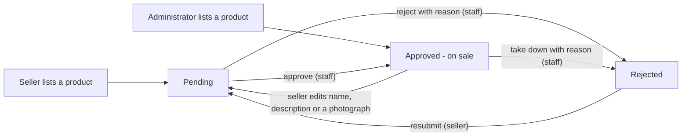
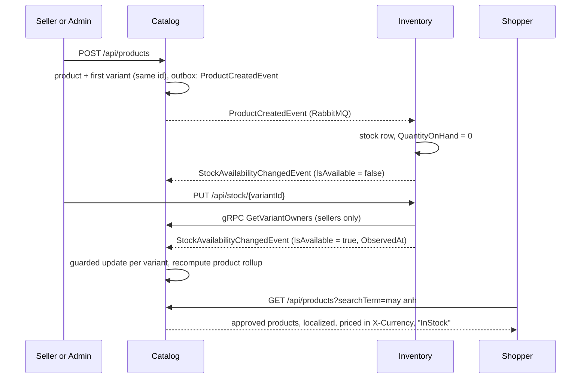

# Catalog

The catalogue is what a shopper browses and what checkout prices: products filed under categories, each sold in one or more **variants** (a kit, a colour), with photographs, text in Vietnamese and English, and a price list per currency. It is owned by the Catalog service (REST on 5057, gRPC on 6057, database `ecommerce_catalog_db` on 5433). Sellers and administrators write it, moderators decide what goes on sale, and everyone reads it. Two ideas carry most of the weight. The **variant is what is bought**: it holds the SKU, the price and its own stock, and the first variant of a product reuses the product's id. And **Catalog reports, but never decides with, facts it does not own**: stock availability is a read model fed by Inventory, and nothing sells against it.

## What people can do

| Role | Capabilities |
| :-- | :-- |
| Shopper (anyone) | Browse the listing with paging, category filter, search and sort; open a product page with its variants, photographs, "from" price and in-stock flag; read it in `vi` or `en` and priced in `VND` or `USD`; fetch product and variant images. Opening a product page reports one view. |
| Seller | List a product (it waits for review); add variants; reprice or deactivate a variant; set or remove a price per currency; translate the product and its options; upload or remove the product's and each variant's photograph; delete their own product; see their own listings in any review state; resubmit a rejected product. Every write is limited to their own products. |
| Moderator | Read the review queue (pending oldest first) or the history of approved and rejected products; approve, reject with a reason, or take down an approved product with a reason. |
| Administrator | Everything a moderator can do. Also: create and delete categories and translate them; list products that belong to the shop itself (they go on sale at once); write to any seller's product; find and reclaim orphaned image files; read the most-viewed products. |
| System | Record stock availability from Inventory's announcements; keep a read model of shop names from Identity; recompute each product's "from" price and availability from its variants. |

## How it works

**Products and variants.** `POST /api/products` creates a product and its first variant in one transaction. The first variant's id is the product's id. The command carries the default currency's price, the SKU and optional options (`Kit: Body only`). More variants come through `POST /api/products/{id}/variants` and get fresh ids. Each variant has its own SKU, which is unique across the catalogue. Two variants of one product may not carry identical options. The product's `Price` column is not entered; `RecomputeProductRollupAsync` derives it as the cheapest active variant. Creating a product or a variant publishes `ProductCreatedEvent` or `ProductVariantCreatedEvent` through the outbox, and Inventory creates a stock row at zero for it. A new listing therefore has no stock until its seller sets some (`PUT /api/stock/{variantId}` on Inventory).

**Who owns a product.** `products.SellerId` is taken from the token: a seller's product is theirs, and an administrator's product has no seller and belongs to the shop itself. Every write handler calls `SellerOwnership.RequireCanWrite`. It lets an administrator through, lets a seller through for their own product, and otherwise throws the same `NotFoundException` a missing product throws. Shop names come from Catalog's own `sellers` table, which `SellerRegisteredConsumer` and `SellerRenamedConsumer` fill. A page of products therefore needs no call to Identity.

**Review before sale.** A seller's new product starts `Pending` (`ProductReview.StartsPending`). A product listed by an administrator starts `Approved`. Only `Approved` products are on the shelf (`Product.IsListed`). The public listing filters on it. The public lookup returns 404 to anyone but the seller and staff (`ProductReview.MaySee`). `ProductVariant.Sellable` requires it too, so both gRPC pricing paths report the variant unsellable and checkout refuses it. Staff move a product through `ProductReviewHandlers`. Each move is a guarded `UPDATE ... WHERE "ReviewStatus" IN (...)` inside `IProductRepository.TryReviewAsync`. The audit entry and the seller's notification are staged in the same transaction.

**Language and currency.** Every request resolves a language (`?lang=`, then `Accept-Language`, then `Localization:DefaultLanguage` = `vi`) and a currency (`?currency=`, then `X-Currency`, then `Money:DefaultCurrency` = `VND`). Handlers read them through `IRequestLanguage` and `IRequestCurrency`. Responses carry `Content-Language`, `X-Currency` and `Vary: Accept-Language, X-Currency`. The product's own `Name` and `Description` columns hold the default-language text. `product_translations` and `variant_option_translations` hold the other languages. `Localized` picks per field, falling back to the default. Prices come from `Priced.Of`. It returns the variant's `variant_prices` row for the asked currency. For the default currency with no row, it returns `product_variants.Price`. Otherwise it returns `null`. There is no conversion and no fallback between currencies.

**Stock availability.** Inventory owns stock. Every stock change in Inventory publishes `StockAvailabilityChangedEvent` with `IsAvailable` and the time it was observed. Catalog records the flag per variant, guarded by `AvailabilityObservedAt` alone - an announcement wins only if it was observed later than the last one recorded, whatever its value, so a repeat still moves the clock and an older contrary one overtaken in flight loses (specs/054, #124). It then recomputes the product's flag as "any active variant available". Responses say `"InStock"` or `"OutOfStock"`, never a count. A real number comes from Inventory's public `GET /api/stock/{variantId}`.

**Photographs.** Bytes live behind `IProductImageStore`. There are two implementations:
- `S3ProductImageStore` (specs/079) writes to an S3-compatible bucket that every Catalog instance shares. It is
  what the containers use, with SeaweedFS in development.
- `FileSystemProductImageStore` writes to a directory (`ProductImages:Root`). It is `dotnet run`'s default and
  assumes one instance.

`ProductImages:Store` chooses between them. There is no file-name column: the key is derived from the row as `{productId:N}-{ImageUpdatedAt ticks}.{ext}`, or `variant-{variantId:N}-{ticks}.{ext}` for a variant. An upload writes the new file first. It then switches the row with a guarded `UPDATE ... WHERE "ImageUpdatedAt" = @seen`, and only after that deletes the old file. The image address is `/api/products/{id}/image?v={ticks}`, which is cacheable for good when `v` matches. A variant with no photograph of its own reports the product's address in `VariantResponse.ImageUrl`. Deleting a product deletes its images after the row. Administrators can list and reclaim files that no row names (`/api/products/images/orphans`).

**Search and sort.** `GetPaginatedAsync` finds the ids whose `f_unaccent(lower(Name))` or `lower(Sku)` is `LIKE` the escaped term, UNIONed with the ids whose translation into the requested language matches the same way, and reads the page of those (specs/074). Sorting is by name (the default-language `Name`), or by price in the **requested** currency. Products with no price in that currency sort last.

**Views.** The storefront's product page sends `POST /api/products/{id}/view` once per product opened. Catalog counts it in `product_views` only for a listed product viewed by someone who is neither staff nor the product's seller. The endpoint answers 204 either way. See [admin insights](admin-insights.md).

## Rules and guarantees

1. **The variant is the sellable unit, and the first variant reuses the product's id.** Why: Inventory's stock rows, Cart's lines and Order's lines in three other databases held a product id before variants. Reusing the id made all of them correct without a cross-service backfill. Later variants get fresh ids, so nothing may assume either way. Inventory's `ProductId` columns hold a variant id. ([specs/020 research D2](../../specs/020-product-variants/research.md))
2. **A variant's SKU and options never change, and a variant is deactivated, never deleted.** `PUT .../variants/{variantId}` only reprices or toggles `IsActive`. Why: an order froze the SKU and option summary, and it has to keep describing what was bought. Two variants with the same set of options are refused with 409 in the handler, because the database cannot express "the same set" (specs/020 D5).
3. **`products.Price` and `products.Sku` are derived, not entered.** `Price` is the cheapest active variant in the default currency, and `Sku` is the first variant's. Why: an earlier Catalog image reads both columns on every query, so dropping them would strand a rollback (specs/020 D3).
4. **Catalog never stores or reports a stock count.** `Availability` defaults to `false` and nothing may sell, reserve or charge against it. Checkout reserves against Inventory's row under `FOR UPDATE`. Why: issue #4 was a `StockQuantity` set at creation, never written again and shown to shoppers. Showing "out of stock" by mistake costs a sale and corrects itself. Showing "in stock" by mistake takes an order that cannot be filled (specs/004 D4).
5. **An older availability announcement never overwrites a newer one.** The record is guarded by the observation time Inventory carried on the event, not by the arrival time. Why: redelivery and reordering are normal broker behaviour. A plain "write when the value differs" survives a duplicate but lets an overtaken "out of stock" win (specs/004 D3). An announcement for a variant Catalog does not hold is logged and discarded rather than retried.
6. **Somebody else's product is 404, never 403.** It is the same message a missing product gives. Why: a 403 confirms the id exists and belongs to somebody, which turns write endpoints into an enumeration tool. An administrator passes every ownership check, because moderation is the job. A product of the shop itself (`SellerId` null) cannot be adopted by a seller. The seller comes from the token, never from the body (specs/027).
7. **Opening a write to sellers means the controller attribute too.** Why: when these endpoints were `[Authorize(Roles = "Admin")]`, a seller was refused at the door, so the ownership code never ran. Every unit test still passed because tests send commands straight to handlers (comment in `ProductsController`).
8. **Nothing a seller lists is on sale until a moderator approves it, and the filter sits at the source.** Listing, search, lookup and both pricing paths all ask `IsListed`. Why: a client-side filter would miss checkout (specs/045 D2). The status is text with a database default of `'Approved'`, so every product from before the feature stays on sale. An older image that inserts a product without the column still writes a readable row. The cost is recorded: during a rollback, pending products would show (specs/045 D1).
9. **A review decision happens once.** Approve and reject require `Pending`, take-down requires `Approved`, and resubmit requires `Rejected`. The guarded `UPDATE` decides, and the loser gets 409 and writes nothing. The audit entry (category `Moderation`) and the seller's notice (`ProductApproved`, `ProductRejected`, `ProductTakenDown`) commit in the same transaction. Rejecting and taking down need a reason of at most 500 characters, which the seller reads.
10. **After a rejection, the seller resubmits explicitly. After a seller edits an approved product, it goes back to review automatically.** `ProductReview.AfterSellerEditAsync` runs before the one save in eight handlers: set or remove a product translation, upload or remove the product image, upload or remove a variant image, and - since specs/056 (#126) - translate a variant option and add a variant, whose option words a shopper reads on the product page and an order line keeps. Why: an edit to an approved product is a change no moderator has seen. A rejected product is still being worked on, so its seller says when it is ready (specs/045 D3). What was decided with the user is "what a shopper sees goes back to review; prices and stock do not"; nothing staff edit sends a product back.
11. **A missing translation falls back per field. A missing price does not fall back at all.** A product with a Vietnamese name and no Vietnamese description shows both what exists. A variant with no price in the requested currency comes back with `price: null`, and checkout refuses it with 409 naming the currency. Why: the worst case of a text fallback is a shopper reading English. The worst case of a price fallback is a 40,000,000 VND camera sold for 1,600 VND, or charged at 40,000,000 USD ([specs/022 research D3](../../specs/022-multi-currency-prices/research.md)).
12. **Language and currency are chosen separately.** Why: most of this shop's customers read English and pay in dong. Deriving currency from language, from the delivery address or from IP geolocation was rejected (specs/022 D1). Responses vary on both headers because a shared cache would otherwise serve one shopper's Vietnamese or dong to the next.
13. **A price must fit its currency.** `Currency.Fits` refuses 9.99 in `VND` (0 decimals) in `CreateProduct`, `AddProductVariant`, `UpdateProductVariant` and `SetVariantPrice`. Zero is refused too. Why: an order once came back with a subtotal of 29.97 VND because a price had been entered as 9.99. Rounding what is computed does not fix a stored price (specs/022 D8). Rows written before the rule keep their amounts. The default currency's price lives on the variant and cannot be removed through the price endpoint.
14. **A translation in a language the shop does not speak is refused on write (400), but falls back to the default on read.** Why: a row nobody reads is a false claim about what the shop offers. A request in an unknown language is still a request worth answering.
15. **Search ignores diacritics on both sides, and is indexed** (specs/074, #113). `unaccent()` is only STABLE, so PostgreSQL would not index it; `f_unaccent` names its dictionary, which makes declaring it IMMUTABLE true, and `pg_trgm` GIN indexes over `f_unaccent(lower("Name"))` (products, translations) and `lower("Sku")` serve a `LIKE '%term%'`. The term's own `%`, `_` and `\` are escaped - Npgsql writes `ESCAPE ''` unless an escape is named. The translations are a UNION of ids rather than an `OR EXISTS`, which kept every product scanned even with the indexes. Measured on 100,000 products: a narrow search 452 ms to 1.2 ms, a broad one (10,000 matches) 426 ms to 81 ms.
16. **An image's type is decided by its bytes.** JPEG, PNG or WebP by signature only. The client's `Content-Type` and the file name are ignored, and SVG is refused. Why: a header is a claim, and an HTML or SVG file served as an image from the shop's own origin is stored XSS. Uploads are limited to 2 MB, once by `[RequestSizeLimit]` before buffering and again while reading. Serving sets `X-Content-Type-Options: nosniff` ([specs/019 research D4-D6](../../specs/019-product-images/research.md)).
17. **The row always names a file that exists: write, then switch, then delete.** A concurrent replacement that loses the guarded switch deletes its own new file and answers 409. Why: delete-then-write leaves a product pointing at nothing if it fails half-way. The worst case of this order is an orphan file, which is waste rather than breakage (specs/019 D3). CHECK constraints on `products` and `product_variants` refuse half an image (a type without a time, or the reverse) and any type other than the three.
18. **A variant's photograph belongs to the variant, not to an option value. The fallback to the product's photograph is resolved on the server.** Why: `FUJI-XT5` and `FUJI-XT5-1855` are both black and look different. A client-side fallback is a second place to get it wrong, and getting it wrong shows the previous variant's picture, which looks like the feature working. The listing card deliberately keeps the product's picture ([specs/032 research](../../specs/032-variant-images/research.md)).
19. **Variant image keys carry a `variant-` prefix.** Why: the first variant shares the product's id, so without the prefix the two keys differ only by two timestamps. Setting both in the same tick would make one image overwrite the other. `FileSystemProductImageStore` accepts only keys matching `^(variant-)?[a-z0-9]+-[0-9]+\.(jpg|png|webp)$` before it builds a path.
20. **Deleting a product deletes its images after the row, outside the transaction, and never fails because of them.** Why: before specs/029 the row went and the bytes stayed forever, and two orphans were found only by listing the directory. Deleting bytes first would leave a live row naming a missing file. A leftover PNG must not stop a product from being removed ([specs/029 research D2-D3](../../specs/029-delete-product-image/research.md)). The deletion publishes `ProductDeletedEvent` with every variant id, so Inventory drops the stock rows.
21. **Orphan reclamation reads the live keys first, and a failure there is fatal.** If that read failed and the scan went on with an empty set, every file would become a candidate and the reclaim would delete the whole catalogue's images. The response publishes `liveKeys` so a nonsensical answer is visible. Files younger than `ProductImages:OrphanGraceHours` (default 24) are never orphans. The reclaim takes no key list: it reconciles again and removes what it finds. Nothing runs it on a timer, because it destroys bytes nobody can recreate ([specs/033 research](../../specs/033-image-reconciliation/research.md)).
22. **A product view is its own request, counted by the database.** One `INSERT ... ON CONFLICT ("ProductId", "Day") DO UPDATE SET "Views" = "Views" + 1`. Why: `GET /products/{id}` is called repeatedly by the seller page (once per currency) and by focus refetches, so counting reads would count both. A read-then-write increment loses views that arrive together ([specs/047 plan D2-D3](../../specs/047-admin-insights/plan.md)).

## Data

All in `ecommerce_catalog_db`. See the [data model](../reference/data-model.md#catalog---ecommerce_catalog_db-14-tables).

| Table | What it holds |
| :-- | :-- |
| [`products`](../reference/data-model.md#products) | Name and description (default language), category, `SellerId`, derived `Price` and `Availability`, image columns, `ReviewStatus` / `ReviewReason` / `SubmittedAt` / `ReviewedAt` / `ReviewedBy`, `RatingAverage` / `RatingCount`. |
| [`product_variants`](../reference/data-model.md#product_variants) | One sellable shape: unique `Sku`, default-currency `Price`, `OptionSummary`, `IsActive`, per-variant `Availability`, its own image columns. |
| [`variant_options`](../reference/data-model.md#variant_options) | Name and value pairs of a variant, unique on (`VariantId`, `Name`). |
| [`variant_prices`](../reference/data-model.md#variant_prices) | A variant's price in a non-default currency, unique on (`VariantId`, `Currency`). |
| [`product_translations`](../reference/data-model.md#product_translations) | Name and description per language. |
| [`variant_option_translations`](../reference/data-model.md#variant_option_translations) | Option name and value per language. |
| [`categories`](../reference/data-model.md#categories) | Name, slug, description, optional parent. |
| [`category_translations`](../reference/data-model.md#category_translations) | Category name and description per language. |
| [`sellers`](../reference/data-model.md#sellers) | Read model of shop names, fed by Identity's events. |
| [`product_views`](../reference/data-model.md#product_views) | Views per product per shop day (UTC before specs/082). |
| [`product_reviews`](../reference/data-model.md#product_reviews), [`review_eligibility`](../reference/data-model.md#review_eligibility) | See [ratings and reviews](ratings-and-reviews.md). |

**Off the shelf, nothing hangs on it for the public either** (specs/081, #166).
- A product that is not listed is the public lookup's 404, and so are its reviews and questions, except to its
  seller and staff (`ProductReview.MaySee`).
- Its images are served only to an address carrying the image's own **`ImageAccessKey`** (`&k=`). This is an
  unguessable Guid, new with every image and written by the guarded statement that switches it. It is handed out
  only in the responses its reader may see. The address needs a key because a browser's image request carries no
  token.
- On sale, an image is served with or without the key, so cached addresses keep working. Off the shelf, the
  response is `private, no-cache`.

Image bytes are not in the database. They are objects in the `product-images` bucket (specs/079), or files in the
store's directory under `dotnet run`, named by the key derived from the row.

**Object storage** (specs/079, #114):
- A key is stored **only when new**, with `If-None-Match: *`, as the directory's move is.
- A read copies the object into memory; images are at most 2 MB.
- The listing pages through `ListObjectsV2` and never holds the bucket.
- Startup creates the bucket and writes a probe, or **refuses to start** and says why.
- The orphan report reads the same bucket from any instance, and its `note` says the store is shared.
- The images from the old `catalog_images` volume are copied in at startup (`ProductImages:ImportFrom`, the volume
  mounted read-only). The copy is idempotent by key and safe on several instances at once, and it never deletes the
  directory.

| Setting | Meaning |
| :-- | :-- |
| `ProductImages:Store` | `FileSystem` (the default) or `S3`. |
| `ProductImages:S3:ServiceUrl`, `Bucket`, `AccessKey`, `SecretKey` | Where the bucket is and who Catalog is to it. A missing one refuses to start, naming it. |
| `ProductImages:S3:Region`, `PageSize` | The signing region (default `us-east-1`) and how many keys one listing page asks for (1 to 1000; outside that, Catalog refuses to start). |
| `ProductImages:ImportFrom` | A directory whose images the bucket lacks are copied in at startup. |

## API

Through the gateway (`/api/products/**`, `/api/categories/**`). Full list: [API reference](../reference/api.md#catalog-38).

| Method | Path | Who |
| :-- | :-- | :-- |
| `GET` | `/api/products` | anyone (approved only; `pageNumber`, `pageSize`, `categoryId`, `searchTerm`, `sortBy` = `name_desc` / `price_asc` / `price_desc`) |
| `GET` | `/api/products/{id}` | anyone (404 unless approved, or the caller is its seller or staff) |
| `GET` | `/api/products/mine` | Seller |
| `POST` | `/api/products` | Seller, Admin |
| `DELETE` | `/api/products/{id}` | Seller, Admin |
| `POST` | `/api/products/{id}/variants` | Seller, Admin |
| `PUT` | `/api/products/{id}/variants/{variantId}` | Seller, Admin |
| `PUT` / `DELETE` | `/api/products/{id}/variants/{variantId}/prices/{currency}` | Seller, Admin |
| `PUT` / `DELETE` | `/api/products/{id}/translations/{language}` | Seller, Admin |
| `PUT` | `/api/products/{id}/options/{optionId}/translations/{language}` | Seller, Admin |
| `GET` | `/api/products/{id}/image` | anyone |
| `PUT` / `DELETE` | `/api/products/{id}/image` | Seller, Admin |
| `GET` | `/api/products/{id}/variants/{variantId}/image` | anyone |
| `PUT` / `DELETE` | `/api/products/{id}/variants/{variantId}/image` | Seller, Admin |
| `GET` / `DELETE` | `/api/products/images/orphans` | Admin |
| `GET` | `/api/products/review` | Admin, Moderator (`status` = `Pending` / `Approved` / `Rejected`) |
| `POST` | `/api/products/{id}/approve` | Admin, Moderator |
| `POST` | `/api/products/{id}/reject` | Admin, Moderator (body `{ reason }`) |
| `POST` | `/api/products/{id}/take-down` | Admin, Moderator (body `{ reason }`) |
| `POST` | `/api/products/{id}/resubmit` | Seller, Admin |
| `POST` | `/api/products/{id}/view` | anyone (always 204) |
| `GET` | `/api/categories` | anyone |
| `POST` | `/api/categories` | Admin |
| `DELETE` | `/api/categories/{id}` | Admin (409 while products are filed under it) |
| `PUT` / `DELETE` | `/api/categories/{id}/translations/{language}` | Admin |
| `GET` | `/api/stock/{productId}` (Inventory) | anyone - the real count, keyed by variant id |

Catalog also serves `CatalogPricing` (Cart and Order price variants at checkout) and `CatalogOwnership` (Inventory asks who owns a variant) over gRPC. See [gRPC reference](../reference/grpc.md).

## Messages

See [messages reference](../reference/messages.md).

| Message | Direction | Why |
| :-- | :-- | :-- |
| `ProductCreatedEvent` | published | Inventory creates the first variant's stock row at zero. |
| `ProductVariantCreatedEvent` | published | Inventory creates the new variant's stock row. |
| `ProductDeletedEvent` | published | Carries every variant id, so Inventory drops their stock rows. |
| `StockAvailabilityChangedEvent` | consumed (`StockAvailabilityChangedConsumer`) | Records per-variant availability. From an Inventory that sends no `VariantId`, the product id is used. |
| `SellerRegisteredEvent`, `SellerRenamedEvent` | consumed (`SellerRegisteredConsumer`, `SellerRenamedConsumer`) | Keeps `sellers.ShopName`. A rename writes no product. |
| `AuditEntryRecorded`, `UserNotificationRequested` | published | Through `IAuditTrail` and `INotifier`: listing, editing, deleting and every review decision. |

## Storefront

| Path | What it does |
| :-- | :-- |
| `client/src/pages/catalog/` | The listing. Search, category and sort live in the URL so a result can be shared. Pages of `PAGE_SIZE` = 12. |
| `client/src/components/catalog/catalog-filters/`, `catalog-hero/` | Search box, category combobox and sort select; the landing banner. |
| `client/src/components/product/product-card/` | A listing card: the product's photograph, "from" price, availability and star average. |
| `client/src/pages/product/` | The product page. Variant chooser, price, add to cart, reviews, and one `recordView` per product opened (guarded by a ref). |
| `client/src/components/product/variant-chooser/`, `product-image/`, `availability/`, `stock-badge/` | Choosing a shape; the photograph or a tinted placeholder; the in-stock flag; Inventory's real count. |
| `client/src/components/shared/price/`, `components/layout/currency-switcher/`, `language-switcher/` | Price formatting with `Intl.NumberFormat(language, { currency })`; choosing currency and language independently (both stored in `localStorage`, sent as headers). |
| `client/src/pages/shop-products/`, `shop-product-new/`, `shop-product/` | A seller's listings, the create form (price labelled in the default currency), and the product editor (prices read once per currency, stock, photographs, withdraw). |
| `client/src/components/seller/variant-editor/`, `components/shared/image-dropzone/` | One variant's prices, stock and photograph; drag-and-drop upload that refuses SVG and files over 2 MB before sending. |
| `client/src/components/product/review-badge/`, `components/seller/review-banner/` | Where a listing stands with the moderators; the reason for a rejection and "send back for review". |
| `client/src/pages/admin-products/`, `admin-moderation/` | The review queue with a tab per status and a reason dialog; a moderator's dashboard (waiting counts and their own decisions from `GET /api/audit/mine`). |
| `client/src/services/product/`, `hooks/product/`, `services/moderation/`, `hooks/moderation/`, `services/category/` | The axios classes and TanStack Query hooks behind the pages. |

## Tests

Server tests run against a real PostgreSQL (`Ecommerce.Catalog.Tests`, port 5433).

| Class | What it proves |
| :-- | :-- |
| `VariantTests` | Creating a product creates its first variant with the product's id; the "from" price follows the cheapest active variant; duplicate SKUs and identical option sets are refused; availability is per variant; the specs/020 migration gave every existing product one variant with its own id; options are summarised in a stable order. |
| `AvailabilityTests` | An announcement makes a product available; an unannounced product reads as unavailable; ten deliveries record once; an older observation arriving later does not win; an unknown product's announcement is discarded; creating a product accepts no stock quantity. |
| `SellerOwnershipTests` | Every write to another seller's product is 404 (delete, add variant, reprice, translate, option translate, price, photograph); the shop's own product cannot be adopted; an administrator may touch any listing; "my listings" holds only mine; a shop rename changes listings without writing a product; an overtaken rename does not win. |
| `ProductReviewTests` | A seller's new product is hidden and unsellable until approved; the shop's own is on sale at once; approval happens once and notifies the seller; rejection carries its reason and can be resubmitted; take-down removes it from the shelf; editing the name sends an approved product back and a price change does not; the queue is oldest submission first. |
| `TranslationTests`, `CategoryTranslationTests`, `LanguageNegotiationTests` | Translated reads say which language they are in; the fallback is per field; writes are upserts; unsupported languages are refused on write; option text is translated; search ignores diacritics and looks at both the translation and the original; `?lang=` beats `Accept-Language`; `Content-Language` and `Vary` are set. |
| `VariantPriceTests`, `RequestCurrencyTests` | A variant with no price in a currency is not sold in it; the "from" price and "price varies" use only variants priced in the asked currency; zero and amounts the currency cannot hold are refused; the default currency's price cannot be removed; currency is not taken from language; dong has no decimals. |
| `ProductImageTests` | Upload, replace, remove; the bytes decide the type; oversize, empty or lying files are refused and the old image stays; a failed write or delete leaves the row correct; a lost race is 409 with no file left behind; CHECK constraints; product deletion deletes every image; variant photographs fall back to the product's; a product and its first variant never share a file. |
| `S3ProductImageStoreTests` (12, against SeaweedFS) | What is saved reads back and is gone once deleted. A key is stored once, and a second write is refused. Keys that are not image keys are refused before any request. The listing pages (2 at a time) and leaves out the probe. Two instances see each other's images. The orphan report from either instance finds only what no row names. The import copies what the bucket lacks and nothing twice, even run four times at once. A wrong secret or a missing setting refuses to start. Every one of seven mutations turns one of these red. |
| `OrphanImageTests` | Live product and variant images are never orphans; young files are skipped; a catalogue read that fails reports nothing rather than everything; one refusing key does not stop the rest; the store's own probe file is not waste. |
| `DeleteProductTests`, `DeleteCategoryTests` | A deleted product takes its variants, options, prices and translations, announces every variant, and frees its SKU; a category with products is refused with the count. |
| `ProductViewTests` | A shopper's view counts and twenty concurrent views count twenty; staff, the seller and unlisted products do not count; the most viewed come first. |
| `VariantOwnershipTests`, `VariantSellerPricingTests` | The gRPC ownership and pricing answers name the seller and shop, and say nothing rather than invent a name. |
| `AuditTests` | Listing, pricing and withdrawing are recorded once; a refused change is not recorded. |

Client tests (Vitest): `pages/product/index.test.tsx` (the chosen variant's photograph, the fallback, one view per product however often it renders), `pages/admin-products/index.test.tsx`, `pages/admin-moderation/index.test.tsx`, `components/seller/review-banner/index.test.tsx`, `pages/shop-product/index.test.tsx` (prices read per currency, stock by variant id, variant photographs), `pages/shop-product-new/index.test.tsx`, `pages/shop-products/index.test.tsx`, `components/shared/image-dropzone/index.test.tsx`, `services/product/index.test.ts`, `hooks/product/index.test.tsx`.

Bruno: `bruno/product/` (variants, translations, search without diacritics, dollar prices, an unpriced variant, images, orphan report, deletion), `bruno/category/`, `bruno/seller/` (a product goes pending, approved, renamed back to pending, taken down, resubmitted, with the 403s), and `bruno/security-checks/` (customers cannot write products, oversize and non-image uploads are 400, a seller cannot read the orphan report). `server/seed/seed-catalogue.py` seeds the camera catalogue through the gateway as an administrator, and `server/seed/clean-test-debris.py` removes products that `seed/cameras.json` does not name.

## Known limits

- **Catalog still streams every image itself.** There is no CDN and no presigned URL straight to the bucket
  (specs/079, out of scope).
- **The directory store still assumes one instance.** It is `dotnet run`'s default. The containers use the bucket.
- **Sorting by name uses the default-language `Name`**, not the translated one. Search matches the SKU with a plain `LIKE` and does not search descriptions.
- **An image address somebody already holds keeps opening that image** after its product leaves the shelf,
  until the image is replaced (specs/081: the key is a capability, not a signed and expiring URL). Anybody who holds
  it saw the photograph already.
- **Pending products would show during a rollback** to an image from before specs/045, which ignores `ReviewStatus` (specs/045 D1).
- **Prices entered before specs/022's rule keep fractional dong amounts** until somebody reprices them.
- **Order lines freeze no image.** An order for a deleted product loses its picture (specs/029 D1, specs/032 D8).
- **Products left by older test runs stay** until somebody cleans them. Since specs/073 (#118) Bruno's `teardown` folder and the scripts' `trap ... EXIT` remove what each run makes. What earlier runs left is still there, and `seed/clean-test-debris.py` removes it.
- Saving a product for later is [saved products](saved-products.md) (specs/075), and asking its seller is [product questions](product-questions.md) (specs/076).

## History

| Spec | PR | What it added |
| :-- | :-- | :-- |
| [004-stock-single-source](../../specs/004-stock-single-source/) | [#5](https://github.com/jessiicamaru/e-commerce-asp-dotnet-practice/pull/5) | Removed `StockQuantity`; availability as a read model of Inventory's announcements, guarded by observation time. |
| [016-storefront-catalog](../../specs/016-storefront-catalog/) | [#46](https://github.com/jessiicamaru/e-commerce-asp-dotnet-practice/pull/46) | Storefront listing, search and product page. |
| [019-product-images](../../specs/019-product-images/) | [#54](https://github.com/jessiicamaru/e-commerce-asp-dotnet-practice/pull/54) | Product image store, write-switch-delete, type by bytes, versioned cacheable address. |
| [020-product-variants](../../specs/020-product-variants/) | [#57](https://github.com/jessiicamaru/e-commerce-asp-dotnet-practice/pull/57) | Variants as the sellable unit; the first variant reuses the product's id; per-variant availability; `PriceVariants`. |
| [021-internationalisation](../../specs/021-internationalisation/) | [#58](https://github.com/jessiicamaru/e-commerce-asp-dotnet-practice/pull/58) | Product and option translations, language negotiation, diacritic-insensitive search. |
| [022-multi-currency-prices](../../specs/022-multi-currency-prices/) | [#59](https://github.com/jessiicamaru/e-commerce-asp-dotnet-practice/pull/59) | `variant_prices`, `X-Currency`, null price instead of conversion, minor-unit validation. |
| - | [#60](https://github.com/jessiicamaru/e-commerce-asp-dotnet-practice/pull/60) | A catalogue of real cameras, seeded through the API. |
| [024-delete-product](../../specs/024-delete-product/) | [#61](https://github.com/jessiicamaru/e-commerce-asp-dotnet-practice/pull/61) | Deleting a product for good. |
| [025-storefront-redesign](../../specs/025-storefront-redesign/) | [#62](https://github.com/jessiicamaru/e-commerce-asp-dotnet-practice/pull/62) | Deleting an empty category, with the storefront's redesign. |
| specs/026 (no folder) | [#63](https://github.com/jessiicamaru/e-commerce-asp-dotnet-practice/pull/63) | Category translations. |
| [027-seller-accounts](../../specs/027-seller-accounts/) | [#64](https://github.com/jessiicamaru/e-commerce-asp-dotnet-practice/pull/64) | `products.SellerId`, `SellerOwnership`, the `sellers` read model. |
| [028-seller-console](../../specs/028-seller-console/) | [#65](https://github.com/jessiicamaru/e-commerce-asp-dotnet-practice/pull/65) | Seller pages to list, price, photograph and withdraw products. |
| [029-delete-product-image](../../specs/029-delete-product-image/) | [#68](https://github.com/jessiicamaru/e-commerce-asp-dotnet-practice/pull/68) | Deleting a product deletes its image. |
| - | [#69](https://github.com/jessiicamaru/e-commerce-asp-dotnet-practice/pull/69) | Seeded photographs, kept out of the repository. |
| [032-variant-images](../../specs/032-variant-images/) | [#73](https://github.com/jessiicamaru/e-commerce-asp-dotnet-practice/pull/73) | Variant photographs with a server-resolved fallback and the `variant-` key prefix. |
| [033-image-reconciliation](../../specs/033-image-reconciliation/) | [#74](https://github.com/jessiicamaru/e-commerce-asp-dotnet-practice/pull/74) | Orphan image report and reclaim. |
| [045-product-review](../../specs/045-product-review/) | [#97](https://github.com/jessiicamaru/e-commerce-asp-dotnet-practice/pull/97) | Review before sale, the moderators' queue, edits that send a product back. |
| [046-product-reviews](../../specs/046-product-reviews/) | [#98](https://github.com/jessiicamaru/e-commerce-asp-dotnet-practice/pull/98) | `RatingAverage` and `RatingCount` on products. See [ratings and reviews](ratings-and-reviews.md). |
| [047-admin-insights](../../specs/047-admin-insights/) | [#99](https://github.com/jessiicamaru/e-commerce-asp-dotnet-practice/pull/99) | `product_views` and top viewed. See [admin insights](admin-insights.md). |
| [079-object-storage](../../specs/079-object-storage/) | [#163](https://github.com/jessiicamaru/e-commerce-asp-dotnet-practice/pull/163) | Images in an S3-compatible bucket shared by every instance (SeaweedFS in development), the old volume imported at startup (#114). |
