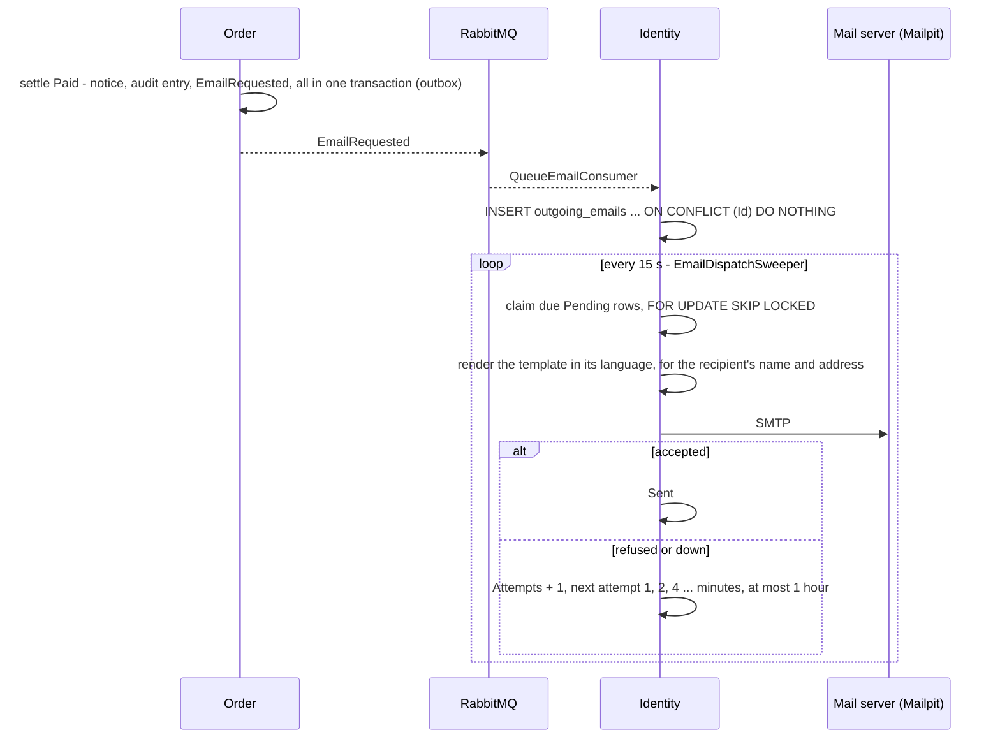

# Email

Since specs/060 the system sends email: the **order confirmation**, since specs/061 the **password
reset link**, and since specs/063 the **link that confirms an address**. Any service asks for an
email the way it asks for a notification, and Identity, the one service that knows email addresses, sends
it. In development every email lands in **Mailpit**, and nothing leaves the machine.

## What people get

| Email | To | When | Language |
| :-- | :-- | :-- | :-- |
| Order confirmation (`OrderPaid`) | the buyer | the order settles `Paid` | the language the order was placed in (`orders.Language`) |
| Password reset (`PasswordReset`) | the account's owner | they ask at `/forgot-password` (specs/061) | the request's `Accept-Language` |
| Address confirmation (`EmailConfirmation`) | a new account | they register, or ask again from the banner (specs/063) | the request's `Accept-Language` |

The confirmation greets the buyer by first name. It gives the short order number and the total in the
order's currency, in the reader's number format (`20.416.000 VND`, `22,462,000 VND`), and links to the
order on the storefront.

## How it works

1. **Asking.** `IEmailSender.SendAsync(recipientId, template, data, language)`, from
   `Ecommerce.Shared/Email`, publishes `EmailRequested` through the caller's outbox. An email about a
   change therefore commits with the change, or not at all. Like a notification, it carries a template and
   data, never a sentence.
2. **Keeping.** Identity's `QueueEmailConsumer` stores the request in `outgoing_emails`, keyed on the
   requester's id. A redelivered message inserts nothing and sends nothing twice. The consumer only
   stores: sending there would tie the broker's delivery to the mail server, and a mail server that is
   down would fill the error queue.
3. **Sending.** `EmailDispatchSweeper` sends the due emails every `Email:SweepSeconds` (15). It uses the
   same shape as the other sweepers: one scope per tick, and a bad tick never ends it. It claims rows with
   `FOR UPDATE SKIP LOCKED`, so several instances never send one row twice. It renders each email when it
   sends it, reading the recipient's address and first name from the account.

## Rules and why

1. **Identity sends.** Why: it is the one service that knows email addresses. Sending from Activity, as
   the issue first suggested, would need a copy of every address, plus a backfill for every account created
   before it.
2. **A down mail server delays email, never loses it.** A refused or failed send sets the next attempt
   1 minute later, doubling to at most 1 hour. After `Email:MaxAttempts` (12) the email is `Failed`,
   with its last error kept. Why: an in-memory retry on the consumer gives up within minutes and forgets
   everything on restart. A row with its own next-attempt time survives both.
3. **At least once.** The row stays locked while the message goes to SMTP. If the commit fails after a
   successful send, that one email goes out twice. Marking an email sent *before* sending would lose it
   whenever the send failed, which is worse.
4. **Nobody to write to, no words to write.** An unknown recipient, an unknown template, or data missing
   a value the words need make the email `Failed` at once, with the reason. Why: retrying will not create
   the person, and an email with a hole in it is worse than none.
5. **Its language is the thing's language.** An order is confirmed in the language it was placed in, the
   language the order itself keeps (specs/021). An unknown language falls back to Vietnamese, the shop's
   default. A person's preferred language is not stored on the account yet.
6. **Nothing leaves a development machine.** Identity sends to `SMTP_HOST`:`SMTP_PORT`, which defaults
   to Mailpit on `localhost:1025`, and the containers point at the `mailpit` service. `SmtpEmailTransport`
   is plain SMTP with no authentication. It is the seam a real provider replaces, the way
   `StubPaymentGateway` is for payments.
7. **A secret never crosses the broker, and is not kept once delivered** (specs/061). A reset link's token
   is a credential, and so is an address-confirmation token (specs/063). Identity asks for that email itself, so it writes
   the row straight into `outgoing_emails` in the transaction that stores the token's hash - no
   `EmailRequested`, no outbox row, no queue holding it. Once the email is `Sent`, the dispatcher replaces
   the data with `{}` (`EmailTemplates.ScrubbedOnceSent`): delivery needed the token, nothing afterwards
   does. A pending or failed row still holds it, for as long as the link could work anyway.
8. **Nobody fills an inbox** (specs/062). A reset link is sent at most once a minute per address, and one
   client may ask at most 5 times a minute at the gateway. Both still answer 202 or 429 the same way for
   any address.

## Editing the words

An **administrator** edits every email at `/admin/emails` (specs/077, part of #150). A moderator cannot: these
reach every customer's inbox, and two of them carry the link that resets a password.

1. **The code is the default.** The words in `EmailTemplates` are what an unedited email says. Their HTML form is
   derived from the plain text: a paragraph per block, and `{link}` as a link. **Reset to default** goes back to
   them.
2. **Every save is a version.** `email_template_versions` is append-only, and the current words are the highest
   version.
   - A reset, and a restore of an earlier version, each add a version too. History is never rewritten, so
     anything can be undone.
   - The editor sends the version it opened. A stale one is a **409**.
   - The unique `(Template, Language, Version)` turns two saves at once into one version, stored with
     `INSERT ... ON CONFLICT DO NOTHING`, and a 409 for the other.
3. **HTML is sanitised, on save and again on every send.** The allow-list is `AllowListHtmlSanitizer`
   (Ganss.Xss), and `href` is the only attribute allowed:
   - allowed tags: paragraphs, line breaks, bold, italic, underline, strike, `h1`-`h3`, lists, quotes, rules
     and links;
   - allowed link schemes: `http`, `https` and `mailto`.
   - No scripts, event handlers, styles, images or frames.
4. **Values are escaped as they are filled in.** A customer named `<b>Mai</b>` reads as that text. A link's
   value is the storefront's own URL.
5. **Placeholders are checked.**
   - A placeholder the email cannot fill is a **400 that names it**, on the field it is in.
   - The password reset and address confirmation **must keep `{link}`**.
   - What each email may use:

     | Email | Placeholders |
     | :-- | :-- |
     | `OrderPaid` | `{name}`, `{order}`, `{total}`, `{link}` |
     | `PasswordReset` | `{name}`, `{link}` |
     | `EmailConfirmation` | `{name}`, `{link}` |

6. **Per language.** A language without an edit uses **its own** built-in words, never the other language's
   edit.
7. **Preview and test.**
   - A preview fills the draft with made-up data, never a real order or token. It is shown in a sandboxed
     `iframe`.
   - **Send me a test** sends it at once to the administrator's own address. A mail server that is down is a
     503 they see now.
8. **Audited.** Every save, reset and restore is a `System` audit entry (`EmailTemplateSaved`,
   `EmailTemplateReset` or `EmailTemplateRestored`) with the before and the after.

Emails go out as **`multipart/alternative`**: the HTML, inside a minimal inline-styled document, plus a
plain-text alternative derived from it. In the text, a link reads as "words (address)".

The storefront's editor is TipTap, limited to what the server keeps. It is **lazy-loaded**, so no shopper
downloads it.

## Data

| Table | Service | What |
| :-- | :-- | :-- |
| [`email_template_versions`](../reference/data-model.md#email_template_versions) | Identity | Every saved version of an email's words: `Template`, `Language`, `Version` (unique together), `IsDefault`, `Subject`, `BodyHtml`, `CreatedAt`, `CreatedBy`. A CHECK makes a version either the default or both a subject and a body. |
| [`outgoing_emails`](../reference/data-model.md#outgoing_emails) | Identity | One row per requested email: recipient, template, data (jsonb), language, `Status` (Pending / Sent / Failed), `Attempts`, `NextAttemptAt`, `SentAt`, `LastError`. A partial index on `NextAttemptAt` covers pending rows. |

## Configuration

| Setting | Default | What |
| :-- | :-- | :-- |
| `SMTP_HOST`, `SMTP_PORT` | `localhost`, `1025` | The mail server: Mailpit in development |
| `STOREFRONT_URL` | `http://localhost:8088` | Where links in emails point |
| `Email:SweepSeconds` | 15 | How often due emails are sent |
| `Email:MaxAttempts` | 12 | Attempts before an email is `Failed` |
| `Email:From` | `e-commerce <no-reply@ecommerce.local>` | The sender |

Mailpit's inbox is at **http://localhost:8025**. It keeps its mail on the `mailpit_data` volume.

## Messages

| Message | Publisher | Consumer |
| :-- | :-- | :-- |
| [`EmailRequested`](../reference/messages.md) (email id, recipient, template, data, language) | any service, through `IEmailSender`; today Order | Identity (`QueueEmailConsumer`) |

## Tests

| Where | Proves |
| :-- | :-- |
| `Ecommerce.Identity.Tests/EmailTests` | A request delivered twice is kept and sent once; Vietnamese and English words, Vietnamese as the fallback; a mail server that is down delays the email, and it goes out once it is back; after 12 failed attempts the email is `Failed` with its reason; an unknown recipient, an unknown template and incomplete data fail rather than retry; the backoff doubles to an hour. |
| `Ecommerce.Identity.Tests/PasswordResetTests` | The reset email carries the link to the storefront, in the language asked for, and once sent its row holds no token. |
| `Ecommerce.Order.Tests/NotificationTests` | A paid order asks for one confirmation in its language, a redelivered settlement asks for no second one, and a failed order asks for none. |
| `Ecommerce.Identity.Tests/EmailTemplateTests` (13) | An unedited email is the built-in words as HTML plus text. A saved edit is what the next email says, in that language only. An unknown placeholder is refused by name. A security email keeps `{link}`. Scripts, handlers, `javascript:`, images and frames are stripped, and a name is escaped. A stale editor is a 409, and two saves at once make one version. The store gives a number once. A future version is a 409. Reset and restore are versions, audited with before and after. The list, the preview and a test to the caller. An unknown template is a 404. |
| `client/src/pages/admin-emails/index.test.tsx`, `components/shared/rich-text-editor/index.test.tsx` | The page opens on the first email and says what a security email must keep. A save goes on top of the version it opened, with a placeholder inserted at the cursor. Every refusal is listed. The preview is sandboxed. A restore goes on top of the current version. The editor inserts placeholders and toggles bold. |
| `bruno/admin-users/` 17-23 | 403 for a moderator; the list; a placeholder refused by name (400); a preview with the script gone; a save as a new version; 409 on a stale version; a reset. |

Mutation checks (specs/077): each of these turns `EmailTemplateTests` red.
- Allowing unknown placeholders.
- Not checking `{link}`.
- Not escaping values.
- Not sanitising on save.
- Removing `ON CONFLICT`.
- The composer ignoring edits.
- Removing the stale-version check.

The last two before this were each covered by the other guard until the store and future-version tests.

It was verified end to end against Mailpit (specs/060):
- An English order produced one "Your order … is paid".
- With Mailpit stopped, an order still settled `Paid`. Its email waited `Pending` with "Failure sending
  mail.", and arrived in Vietnamese once Mailpit returned.

## Known limits

- **Three emails so far.** Other notices are not emails yet.
- **No preferred language on the account.** An email about an order uses the order's language, and one
  about nothing in particular would use the default.
- **No unsubscribe and no bounce handling.** A real provider would add both.
- **Images cannot be used** (no logo): the allow-list leaves them out, because a remote image in an email is also
  a read receipt.
- **No screen shows failed emails**, though the rows keep the reason.

## History

| Spec | PR | Added |
| :-- | :-- | :-- |
| [060-email](../../specs/060-email/) | #143 | `IEmailSender`, `EmailRequested`, Identity's `outgoing_emails` and dispatcher, Mailpit, the order confirmation (#102). |
| [061-password-reset](../../specs/061-password-reset/) | #144 | The password reset email, queued by Identity itself and scrubbed once sent (#103). |
| [063-email-confirmation](../../specs/063-email-confirmation/) | #146 | The address-confirmation email, staged in the account's own save and scrubbed once sent (#106). |
| [077-email-templates](../../specs/077-email-templates/) | #161 | Administrators edit every email: versions, sanitised HTML, placeholders checked, preview and test, multipart sending (#150, the email half). |
