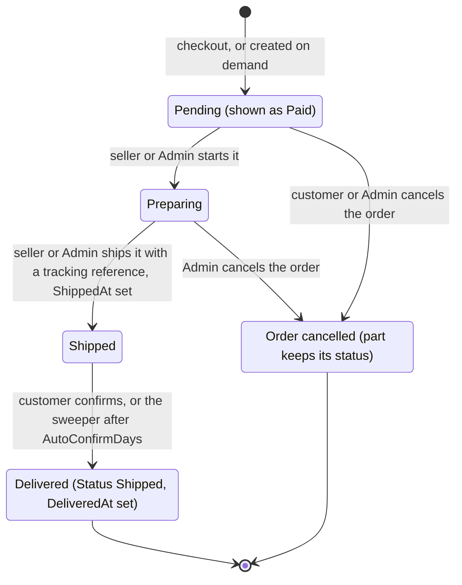
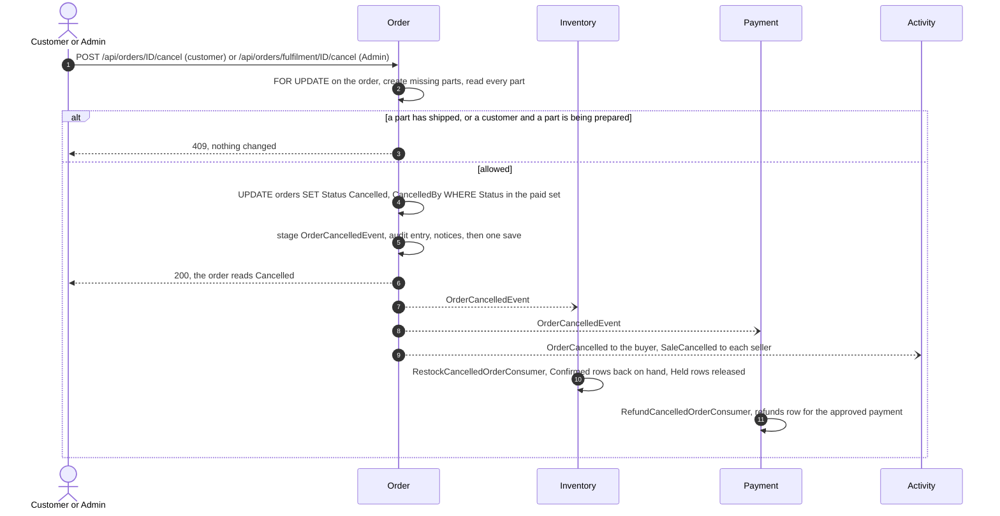

# Fulfilment and delivery

Once an order is `Paid`, it is delivered in parcels: one part per seller whose goods are on it, plus one for the shop's own goods when it holds any. Each seller prepares and ships their own part from their sales pages; an administrator does the same for the shop's part from the console. The customer follows every parcel, can cancel the whole order while nothing has been started, and says when each parcel arrived - or the system takes it as delivered a set number of days after it shipped. Two ideas matter most. Every move of a parcel, and every cancellation, first takes a row lock on the order, so concurrent moves on one order run one after another and the order's own status stays a correct summary of its parts. And nothing here adds a status value that an older image could not parse: "delivered" is a pair of columns, "cancelled" was always in the enum, and returned stock ends `Released`.

How an order reaches `Paid` is in [shopping-and-checkout.md](shopping-and-checkout.md).

## What people can do

| Role | Capabilities |
| :-- | :-- |
| Customer | See each parcel of their order: its shop, contents, status, tracking reference and when it arrived. Cancel their own paid order while every parcel is still waiting. Say that a shipped parcel arrived. Receive notices when the order is paid, a parcel ships, or the order is cancelled. |
| Seller | List their sales and open one (their lines only). Start preparing their part, then ship it with a tracking reference. See the delivery address only while their part is waiting or being prepared. Receive notices of a new sale, a cancelled sale, a parcel the customer received, and a payout. |
| Moderator | Nothing in fulfilment. The fulfilment endpoints are `Admin` only, and the console sends a moderator to `/admin/moderation`. |
| Administrator | Work the fulfilment queue by the shop's part's state (`Paid`, `Preparing`, `Shipped`). Read any order (`GET /api/orders/fulfilment/{id}`). Prepare and ship the shop's part. Cancel any paid order until its first parcel ships. |
| System | Create any missing parts before a move. Rewrite `orders.Status` as a summary. Take unconfirmed parcels as delivered after `Delivery:AutoConfirmDays` (`DeliveryConfirmationSweeper`). On cancellation, Inventory puts the stock back and Payment records a refund. On delivery, Catalog records who may review which product. Activity stores notices and audit entries. |

## How it works

### Parts

Checkout writes the parts in the same save as the order (`SubmitOrderCommandHandler`): one `order_shipments` row per distinct `order_items.SellerId`, the shop's own goods being `SellerId` null, each starting `Pending` with its frozen earnings (`GoodsTotal`, `Commission`, `ShippingShare`, specs/037). Every later step first runs `OrderRepository.EnsureShipmentsAsync`, an idempotent `INSERT ... SELECT ... ON CONFLICT ("OrderId", "SellerId") DO NOTHING` that creates any part an older image did not write, in the state the order itself is in.

A part moves forwards one step at a time. Delivery and cancellation are not part statuses:



### Moving a part

Staff move the shop's part through `POST /api/orders/{id}/preparing` and `POST /api/orders/{id}/shipment` (`FulfilmentStep`); a seller moves their own through `POST /api/orders/sales/{id}/preparing` and `/shipment` (`SellerStep`). Both call `OrderRepository.TryMoveShipmentAsync`, which runs one transaction:

1. `SELECT 1 FROM orders WHERE "Id" = @id FOR UPDATE` - the order's row lock, before anything is read;
2. read the order's status: a cancelled order or one that is not paid stops here;
3. `EnsureShipmentsAsync`;
4. one guarded `UPDATE order_shipments ... WHERE "OrderId" = @id AND "SellerId" = @seller AND "Status" = @from`, which also sets `TrackingReference` and `ShippedAt` when shipping;
5. recompute `orders.Status` and `orders.TrackingReference` from every part, under the lock;
6. stage the audit entry and, when shipping, the buyer's `ParcelShipped` notice; save; commit.

The order's status is a summary in words an older image already knows:

| Parts | `orders.Status` | `orders.TrackingReference` |
| :-- | :-- | :-- |
| none started | unchanged (`Paid`) | the part's, when there is exactly one part; otherwise null |
| some started, not all shipped | `Preparing` | as above |
| all shipped | `Shipped` | as above |

A repeated step is a no-op answered 200 (`AlreadyThere`). Shipping again with a different tracking reference is 409. The staff queue (`GET /api/orders/fulfilment?status=Paid|Preparing|Shipped`, oldest first, page size 12 by default) lists paid orders whose **shop** part is in that state, plus orders with no parts whose own status matches.

### Cancellation



`OrderCancelledEvent` carries only `OrderId`, `CancelledAt` and `CancelledBy` (`Customer` or `Staff`). Inventory puts back what its own reservations say, and Payment refunds what its own payment row says. The Orchestrator is not involved: the saga ended at payment, and cancellation is a decision Order owns.

### Delivery

A customer confirms one parcel with `POST /api/orders/{id}/shipments/{shipmentId}/received`. `TryConfirmDeliveryAsync` runs one guarded statement, with the owner in the same query:

```sql
UPDATE order_shipments SET "DeliveredAt" = @at, "DeliveryConfirmedBy" = 'Customer'
 WHERE "Id" = @part AND "OrderId" = @order AND <order owned by caller>
   AND "Status" = 'Shipped' AND "DeliveredAt" IS NULL
```

`DeliveryConfirmationSweeper`, a `BackgroundService` in Order's Infrastructure, wakes every `Delivery:SweepIntervalMinutes` (60) and sends `AutoConfirmDeliveriesCommand` with a cutoff of now minus `Delivery:AutoConfirmDays` (7). The repository locks the due rows (`FOR UPDATE SKIP LOCKED` on `Status = 'Shipped' AND DeliveredAt IS NULL AND ShippedAt <= cutoff`), sets them delivered with `DeliveryConfirmedBy = 'Auto'` under the same guard, and stages one audit entry for the batch.

In both paths, the same transaction publishes one `ParcelDeliveredEvent` per parcel (order, parcel, buyer, the parcel's product ids, delivered time). Catalog's `ReviewEligibilityConsumer` records the buyer in `review_eligibility`, which is what allows a review (specs/046). A delivered parcel's earnings become due to its seller; payouts claim only delivered parts (specs/037, 040).

## Rules and guarantees

1. **One part per seller per order, and at most one for the shop.** `IX_order_shipments_OrderId_SellerId` is unique with `NULLS NOT DISTINCT`. *Why:* PostgreSQL treats nulls as distinct by default, so two shop parts would be allowed and the create-if-missing statement, which relies on `ON CONFLICT` against this index, would add another every time it ran (specs/035 research D1).
2. **The shop's goods are a part like any seller's.** *Why:* one model means no read has to ask which model an order uses, and the administrator's endpoints keep their addresses and act on the shop's part; an order of the shop's goods alone behaves exactly as before (research D2). An order with no shop part answers staff with 409 "This order has no part the shop ships; each seller ships their own."
3. **Parts are written at checkout and also created on demand.** *Why:* a rolled-back image writes orders without parts, and a one-off backfill cannot see orders written after it ran; creating them before every move, in the order's own state, means an order shipped under the old image is a shipped part under the new one (research D3).
4. **Every move and every cancellation takes the order's row lock first.** *Why:* two sellers shipping the last two parts at once would each compute the summary from a snapshot without the other's shipment, and the order would stay `Preparing` for good (`ShipmentTests.Two_parts_shipped_at_the_same_moment_leave_the_order_shipped` fails without it). The same lock serialises a cancel against a ship, so exactly one wins (`CancellationTests.Cancel_and_ship_at_once_leave_exactly_one_winner`). Different orders never wait for each other.
5. **Each move is one guarded `UPDATE` on the part.** *Why:* a read-then-write would let two clicks both "succeed" (specs/011 research D9). `FulfilmentTests.Ten_concurrent_prepare_requests_move_the_order_exactly_once`.
6. **`orders.Status` gained no new value.** It stays `Paid`, `Preparing` or `Shipped` as a summary, and the customer learns "1 of 2 shipped" from the parts. *Why:* "partly shipped" would stop a rolled-back image from parsing the row - the expand/contract trap the constitution names (research D4).
7. **A seller's part is addressed by the order id and the token, never by a part id or a seller id.** *Why:* there is nothing to change into somebody else's (research D7). Not theirs, not there, not paid and failed are one 404, `Sale not found.`; a cancelled sale is 409 `This order was cancelled.` only to a seller who has a part on it.
8. **A seller sees the delivery address only while their part is waiting or being prepared**, and never the customer's id or email. *Why:* once their parcel is out, a seller holding customers' home addresses has no use for them (research D6). A cancelled sale shows no address.
9. **Each parcel names its shop from a name frozen at checkout.** `order_items.SellerName` comes from Catalog's pricing answer and is never rewritten; the shop's own parcel is labelled by the storefront in the reader's language (`IsShop` on `ShipmentResponse`). *Why:* the customer bought from the shop as it was named then, and an order page makes no call to Catalog (specs/036 research D1, D3). There is no backfill.
10. **Cancellation is of whole orders only, and only of paid orders.** A customer may cancel while every part is `Pending`; an administrator until the first part ships. *Why:* once a parcel is on its way, cancelling would refund goods already sent. A repeat is a 200 no-op that publishes nothing again.
11. **Order decides, then tells, in one transaction.** The guarded `UPDATE` to `Cancelled` and the staged `OrderCancelledEvent` commit together. *Why:* principle III - the row and the outbox message commit together or not at all.
12. **The event carries no items and no amount.** *Why:* Inventory knows what it reserved and Payment knows what it charged; sending either again would be a second opinion they could disagree with (specs/039 research D1).
13. **Inventory handles a cancellation that overtakes the completion.** `Confirmed` reservations go back on hand; `Held` reservations are released; both end `Released` with `SettlementReason` "Returned: order cancelled", under `FOR UPDATE` on the stock rows. A late `OrderCompletedEvent` then finds no `Held` row and deducts nothing. *Why:* the two events are different message types and nothing orders their delivery (research D4). The handler announces availability, as every stock-moving handler must.
14. **Payment refunds once, from its own row.** Only an `Approved` payment is refunded, for its full amount and currency, through the same provider. `refunds.OrderId` is unique; a concurrent delivery that loses gets SQLSTATE 23505, discards its pending changes and answers "already refunded". *Why:* a failed save leaves its rows tracked, so saving again would raise the same violation (CLAUDE.md gotcha). `payments` is untouched.
15. **No new status anywhere for cancellation.** `Cancelled` was already in `OrderStatus`; returned stock is `Released`; the refund is a new table. *Why:* a rolled-back image must still parse every row (research D3).
16. **The two cancellation consumers have distinct names**: `RestockCancelledOrderConsumer` and `RefundCancelledOrderConsumer`. *Why:* neither service sets an endpoint prefix, so two classes called `OrderCancelledConsumer` would share one queue and each event would reach only one of them (research D6).
17. **A cancelled sale is visible but earns nothing.** `Sales.Statuses` (what a seller sees) includes `Cancelled`; `Sales.Earning` (what balances and payouts count) does not. *Why:* a seller mid-preparation must learn to stop, and confusing the two would pay sellers for cancelled orders.
18. **Delivered is columns, not a status.** `ShippedAt`, `DeliveredAt` and `DeliveryConfirmedBy` on `order_shipments`, with the part still `Shipped`. *Why:* a `Delivered` enum value would stop an image rolled back to before specs/040 from reading any delivered row (research D1).
19. **The week counts from `ShippedAt`, which the ship move writes.** *Why:* `UpdatedAt` is "last changed", and the next write to the part would silently restart the period. The migration `AddShipmentDelivery` backfilled `ShippedAt = UpdatedAt` for parts already shipped, which is true for them because nothing moves a part after it ships (research D2).
20. **Each confirmation is set once, by whoever is first.** Both the customer's statement and the sweep require `DeliveredAt IS NULL`. *Why:* two sweeper instances, or a customer confirming during a sweep, must not both record it (research D3). A repeat by the customer is a 200 no-op; a parcel not shipped is 409; somebody else's parcel is 404.
21. **The sweep locks its rows first, and announces exactly the rows it set.** *Why:* a parcel confirmed by the customer in the meantime fails the guard and must be announced once, by the customer's confirmation, not twice (specs/046).
22. **`ParcelDeliveredEvent` is published inside the delivery transaction.** *Why:* the right to review is granted exactly when the parcel was delivered and never twice. Product ids, not variant ids, because a review is of the product; one event per parcel, so a customer who received half an order can review that half.
23. **A nonsensical delivery period stops Order at startup.** `DeliveryOptions` validates `AutoConfirmDays >= 1` and `SweepIntervalMinutes >= 1` with `ValidateOnStart`. *Why:* zero days would pay a seller the moment they click "shipped" (`DeliveryTests.Order_does_not_start_without_a_sensible_delivery_period`).
24. **Money is due only for a delivered parcel.** Balances show a paid part as on the way until `DeliveredAt` is set, then due; the payout claim requires `DeliveredAt IS NOT NULL`. *Why:* a seller is paid for what arrived, not for what they said they sent (specs/040, PR #85).
25. **Notices and audit entries commit with the change.** They are staged through the repository's `stage` callback inside the same transaction. *Why:* an entry or a notice for a change that rolled back would be false (specs/041, 042). A notice stores a kind and data, never a sentence, so the storefront words it in the reader's current language.
26. **`GET /api/orders/fulfilment/{id}` is the one order read not scoped to its owner.** *Why:* staff need to see what to pack and where; the `Admin` role on the route is the whole permission, so its handler `GetOrderForStaffQuery` must never sit behind any other route (specs/038).

## Data

| Table | Service | Role in this feature |
| :-- | :-- | :-- |
| [`order_shipments`](../reference/data-model.md#order_shipments) | Order | One part per seller on the order, plus the shop's if it has goods on it: status, tracking, `ShippedAt`, `DeliveredAt`, `DeliveryConfirmedBy`, frozen earnings, `PayoutId`. |
| [`orders`](../reference/data-model.md#orders) | Order | `Status` and `TrackingReference` as a summary of the parts; `CancelledBy`. |
| [`order_items`](../reference/data-model.md#order_items) | Order | `SellerId` and `SellerName` frozen per line - which parcel a line belongs to and which shop sends it. |
| [`payouts`](../reference/data-model.md#payouts) | Order | Claims only delivered parts. |
| [`stock_items`](../reference/data-model.md#stock_items), [`stock_reservations`](../reference/data-model.md#stock_reservations) | Inventory | Stock returned on cancellation; reservations end `Released`. |
| [`payments`](../reference/data-model.md#payments), [`refunds`](../reference/data-model.md#refunds) | Payment | The charge, untouched; the refund, one per order. |
| [`review_eligibility`](../reference/data-model.md#review_eligibility) | Catalog | Who received which product, from `ParcelDeliveredEvent`. |
| [`notifications`](../reference/data-model.md#notifications), [`audit_entries`](../reference/data-model.md#audit_entries) | Activity | Notices to buyer and sellers; the audit trail of every move. |

## API

Full list: [../reference/api.md](../reference/api.md).

| Method | Path | Who |
| :-- | :-- | :-- |
| `GET` | `/api/orders/{id}` | signed in (owner; includes parcels) |
| `POST` | `/api/orders/{id}/cancel` | signed in (owner) |
| `POST` | `/api/orders/{id}/shipments/{shipmentId}/received` | signed in (owner) |
| `GET` | `/api/orders/sales` | Seller |
| `GET` | `/api/orders/sales/{id}` | Seller |
| `POST` | `/api/orders/sales/{id}/preparing` | Seller |
| `POST` | `/api/orders/sales/{id}/shipment` | Seller (body `trackingReference`, 1-100 characters) |
| `GET` | `/api/orders/fulfilment` | Admin (`?status=` `Paid`, `Preparing` or `Shipped`) |
| `GET` | `/api/orders/fulfilment/{id}` | Admin |
| `POST` | `/api/orders/{id}/preparing` | Admin (the shop's part) |
| `POST` | `/api/orders/{id}/shipment` | Admin (the shop's part, body `trackingReference`) |
| `POST` | `/api/orders/fulfilment/{id}/cancel` | Admin |
| `GET` | `/api/payments/{orderId}` | Admin (includes `refundedAmount`, `refundedAt`) |
| `GET` | `/api/reservations/{orderId}` | Admin |
| `GET` | `/api/notifications`, `/api/notifications/unread-count` | signed in (own notices only) |

## Messages

See [../reference/messages.md](../reference/messages.md).

| Message | Published by | Consumed by |
| :-- | :-- | :-- |
| `OrderCancelledEvent` (`OrderId`, `CancelledAt`, `CancelledBy`) | Order | Inventory (`RestockCancelledOrderConsumer`), Payment (`RefundCancelledOrderConsumer`) |
| `ParcelDeliveredEvent` (`OrderId`, `ShipmentId`, `BuyerId`, `ProductIds`, `DeliveredAt`) | Order | Catalog (`ReviewEligibilityConsumer`) |
| `StockAvailabilityChangedEvent` | Inventory, after a restock | Catalog |
| `UserNotificationRequested` | Order | Activity (`RecordNotificationConsumer`) |
| `AuditEntryRecorded` | Order, Inventory, Payment | Activity (`RecordAuditEntryConsumer`) |

Notices sent by Order (`OrderNotices`), with the link each carries:

| Kind | To | When | Link |
| :-- | :-- | :-- | :-- |
| `OrderPaid` | buyer | the order settles to `Paid` | `/orders/{id}` |
| `NewSale` | each seller with a part | the order settles to `Paid` | `/shop/sales/{id}` |
| `OrderFailed` | buyer | the order settles to `Failed` | `/orders/{id}` |
| `ParcelShipped` | buyer | any part ships (data: tracking, shop name if any) | `/orders/{id}` |
| `OrderCancelled` | buyer | the order is cancelled (data: `by`) | `/orders/{id}` |
| `SaleCancelled` | each seller with a part | the order is cancelled | `/shop/sales/{id}` |
| `ParcelReceived` | the part's seller | the customer confirms a seller's parcel | `/shop/sales/{id}` |
| `PayoutRecorded` | seller | a payout is recorded | `/shop/payouts` |

Audit actions: `ParcelPrepared`, `ParcelShipped`, `OrderCancelled`, `ParcelReceived` (Order category), `DeliveriesAutoConfirmed` (System), `StockReturned` (Inventory), `RefundRecorded` (Payment).

## Storefront

| Path | What it does |
| :-- | :-- |
| [client/src/pages/order/index.tsx](../../client/src/pages/order/index.tsx) | The customer's order (`/orders/:id`): parcels, cancel, "received". |
| [client/src/components/order/order-shipments/index.tsx](../../client/src/components/order/order-shipments/index.tsx) | Parcel by parcel, with shop name and "n of m sent"; drawn only for two or more parcels. |
| [client/src/components/order/order-lines/index.tsx](../../client/src/components/order/order-lines/index.tsx) | The lines, each with the shop that sold it. |
| [client/src/components/order/receive-parcel/index.tsx](../../client/src/components/order/receive-parcel/index.tsx) | "I've received it" after a confirmation dialog, and the note that silence is taken as received after a week. |
| [client/src/components/order/cancel-order/index.tsx](../../client/src/components/order/cancel-order/index.tsx) | Cancel after saying what it does; shared by the customer's and the staff page. |
| [client/src/utils/order/cancel.ts](../../client/src/utils/order/cancel.ts), [client/src/utils/order/delivery.ts](../../client/src/utils/order/delivery.ts) | When to offer cancelling and "received", drawn the way the server decides; an order reads delivered once every parcel is. |
| [client/src/components/order/parcel-actions/index.tsx](../../client/src/components/order/parcel-actions/index.tsx) | The next step for one parcel (prepare, then ship with a tracking reference); one component for sellers and staff. |
| [client/src/pages/shop-sales/index.tsx](../../client/src/pages/shop-sales/index.tsx) | A seller's sales (`/shop/sales`), amounts over their own lines only. |
| [client/src/pages/shop-sale/index.tsx](../../client/src/pages/shop-sale/index.tsx) | One sale (`/shop/sales/:id`): their lines, their parcel's step, the address while it is their job. |
| [client/src/components/seller/sale-earnings/index.tsx](../../client/src/components/seller/sale-earnings/index.tsx) | What the sale earns, and whether it is on the way, due or paid out. |
| [client/src/pages/admin-orders/index.tsx](../../client/src/pages/admin-orders/index.tsx) | The fulfilment queue (`/admin`, `?status=`), rendered by `pages/admin-home` for administrators. |
| [client/src/pages/admin-order/index.tsx](../../client/src/pages/admin-order/index.tsx) | One order for staff (`/admin/orders/:id`): the shop's parcel and its next step, and staff cancellation. |
| [client/src/pages/admin-order/shop-parcel.ts](../../client/src/pages/admin-order/shop-parcel.ts) | Which parcel is the shop's, or the whole order when it has no parts. |
| [client/src/components/layout/notification-bell/index.tsx](../../client/src/components/layout/notification-bell/index.tsx) | Polls the unread count every `NOTIFICATION_POLL_MS` (30 s); loads the list only when opened. |
| [client/src/pages/notifications/index.tsx](../../client/src/pages/notifications/index.tsx), [client/src/utils/notifications/index.ts](../../client/src/utils/notifications/index.ts) | The inbox, and each kind worded from its data in the reader's language. |

## Tests

| Test | What it proves |
| :-- | :-- |
| [`ShipmentTests`](../../server/tests/Ecommerce.Order.Tests/ShipmentTests.cs) | One part per seller and one for the shop; a seller moves only their own part; not theirs is 404 in the same words; unpaid orders cannot be started; the order is `Shipped` only when every part is, even when two ship at once; staff move only the shop's part; a single-parcel order carries its tracking; missing parts are made in the order's state; the address disappears once the seller's part ships. |
| [`FulfilmentTests`](../../server/tests/Ecommerce.Order.Tests/FulfilmentTests.cs) | Staff read any order; prepare then ship; a legacy `Completed` order reads as `Paid`; repeats are no-ops but a different tracking reference is refused; ten concurrent prepares move once. |
| [`CancellationTests`](../../server/tests/Ecommerce.Order.Tests/CancellationTests.cs) | Customer cancels while every parcel waits, not once one is prepared; staff can while preparing; nobody once shipped; twice changes nothing; cancel and ship at once leave exactly one winner; a cancelled order leaves every balance and no payout claims it; its seller sees it cancelled and cannot move it. |
| [`DeliveryTests`](../../server/tests/Ecommerce.Order.Tests/DeliveryTests.cs) | Shipping records `ShippedAt`; the customer confirms a shipped parcel, not an unshipped one, not somebody else's; twice changes nothing; the sweep delivers once; each delivery announces its products once; Order refuses to start without a sensible period. |
| [`ShopNameTests`](../../server/tests/Ecommerce.Order.Tests/ShopNameTests.cs) | The shop name is frozen per line; a later rename does not rename an order; each parcel says who sends it. |
| [`NotificationTests`](../../server/tests/Ecommerce.Order.Tests/NotificationTests.cs) | Shipping tells the buyer with the tracking; receiving tells the seller; a cancellation tells the buyer and every seller; a payout tells its seller. |
| [`SellerSalesTests`](../../server/tests/Ecommerce.Order.Tests/SellerSalesTests.cs), [`PayoutTests`](../../server/tests/Ecommerce.Order.Tests/PayoutTests.cs) | A sale shows only the seller's lines and no customer data; a balance moves from on the way to due to paid out. |
| [`RestockTests`](../../server/tests/Ecommerce.Inventory.Tests/RestockTests.cs) | A completed-then-cancelled order puts units back on hand; a cancellation before the completion releases the hold; twice restocks once; only this order's units come back. |
| [`RefundTests`](../../server/tests/Ecommerce.Payment.Tests/RefundTests.cs) | The refund equals the charge; many deliveries refund once; the loser of a race is told it was already refunded; a rejected payment is not refunded. |
| [`ReviewTests`](../../server/tests/Ecommerce.Catalog.Tests/ReviewTests.cs) | Somebody who has not received a product cannot review it; receiving it twice is one right to review. |
| [`NotificationTests`](../../server/tests/Ecommerce.Activity.Tests/NotificationTests.cs) (Activity) | A notice lands once; nobody reads or marks another's. |
| client [`pages/order/index.test.tsx`](../../client/src/pages/order/index.test.tsx) | Cancel only after confirming, not once preparing, refusals in the server's words; "received" per parcel. |
| client [`pages/admin-order/index.test.tsx`](../../client/src/pages/admin-order/index.test.tsx), [`shop-parcel.test.ts`](../../client/src/pages/admin-order/shop-parcel.test.ts), [`pages/admin-orders/index.test.tsx`](../../client/src/pages/admin-orders/index.test.tsx) | Staff read through the staff route, prepare, ship with a typed tracking reference, cancel while preparing; the queue follows `?status=`. |
| client [`pages/shop-sale/index.test.tsx`](../../client/src/pages/shop-sale/index.test.tsx), [`pages/shop-sales/index.test.tsx`](../../client/src/pages/shop-sales/index.test.tsx) | The seller's part moves; the address is gone once shipped; a cancelled sale has nothing to do. |
| client [`order-shipments`](../../client/src/components/order/order-shipments/index.test.tsx), [`utils/order/cancel.test.ts`](../../client/src/utils/order/cancel.test.ts), [`utils/order/delivery.test.ts`](../../client/src/utils/order/delivery.test.ts), [`services/order/index.test.ts`](../../client/src/services/order/index.test.ts) | Parcels and shop names are drawn; cancel and "received" are offered exactly when the server would allow them; requests name no user. |

**End to end:** [`.github/scripts/verify-saga.sh`](../../.github/scripts/verify-saga.sh), approve branch: an administrator prepares and ships the order and the customer sees `Shipped` with the tracking reference; the customer confirms the parcel and it reads "received by Customer"; a second order is paid and cancelled by its customer, and the script asserts the stock is back exactly where it was, a refund of the full charge is recorded, and cancelling again is a 200 no-op. Reject branch: preparing a failed order is 409.

**Bruno:** [`bruno/admin-audit/`](../../bruno/admin-audit/) (fulfilment queue, staff read, prepare, ship, the customer says the parcel arrived, saying it again changes nothing, cancelling or preparing a shipped order is 409), [`bruno/seller/`](../../bruno/seller/) (a seller cannot ship a part that is not theirs, saying someone else's parcel arrived is 404, cancelling someone else's order is 404, someone who did not receive it cannot review it), [`bruno/notifications/`](../../bruno/notifications/) (the customer was told the order was paid and shipped), [`bruno/security-checks/`](../../bruno/security-checks/) (a customer cannot ship a sale or move an order, 403; cancelling or preparing without a token, 401).

## Known limits

- **A delivered parcel cannot be returned** ([#107](https://github.com/jessiicamaru/e-commerce-asp-dotnet-practice/issues/107)). Once any part has shipped, the order cannot be cancelled either.
- **Cancellation is whole-order only.** There is no cancelling one seller's part.
- **Payment is a stub.** A refund is a ledger row recorded through `Provider = "Stub"`; no money moves. A real provider is deliberately deferred.
- **Shipping is manual.** No carrier integration: a person types the tracking reference, and it cannot be changed after shipping (a different reference is 409). Despatch is not a saga step (specs/011 research D2).
- **An automatically delivered parcel does not notify its seller.** ([#128](https://github.com/jessiicamaru/e-commerce-asp-dotnet-practice/issues/128)) `ParcelReceived` is sent only when the customer confirms; the sweep records an audit entry and publishes `ParcelDeliveredEvent` but no notice.
- **Moderators have no part in fulfilment.** Every fulfilment and staff-cancel endpoint is `Admin` only.
- **Notices are in-app only**; nobody is emailed ([#102](https://github.com/jessiicamaru/e-commerce-asp-dotnet-practice/issues/102)). The bell polls every 30 s rather than being pushed.
- **Parcels delivered before specs/046 give no right to review**, and parts from before specs/037 carry no earnings; neither is backfilled.

## History

| Spec | PR | What it added |
| :-- | :-- | :-- |
| [011-order-shipping](../../specs/011-order-shipping/) | #31 | Staff fulfilment: `Paid` to `Preparing` to `Shipped` with a tracking reference, as guarded updates. |
| [035-seller-shipments](../../specs/035-seller-shipments/) | #79 | `order_shipments`, one part per seller plus the shop's; the order row lock; `orders.Status` as a summary; the seller's endpoints. |
| [036-parcel-shop-names](../../specs/036-parcel-shop-names/) | #80 | Each parcel and line says which shop it comes from. |
| [037-seller-payouts](../../specs/037-seller-payouts/) | #81 | Frozen earnings per part, balances and payouts. |
| [038-admin-console](../../specs/038-admin-console/) | #82 | The administrator's console: fulfilment queue, staff order read, shop parcel steps. |
| - | #83 | A confirmed dialog closes (the edited `alert-dialog`). |
| [039-order-cancellation](../../specs/039-order-cancellation/) | #84 | Cancellation by customer and staff, `OrderCancelledEvent`, restock and refund. |
| [040-delivery-confirmation](../../specs/040-delivery-confirmation/) | #85 | Delivery confirmation by the customer and by `DeliveryConfirmationSweeper`; money due only once delivered. |
| [041-audit-log](../../specs/041-audit-log/) | #93 | Audit entries for every parcel move, cancellation, delivery, restock and refund. |
| [042-in-app-notifications](../../specs/042-in-app-notifications/) | #94 | Notices to buyers and sellers, staged with each change. |
| [046-product-reviews](../../specs/046-product-reviews/) | #98 | `ParcelDeliveredEvent` published in the delivery transaction; the sweep locks its rows first. |
