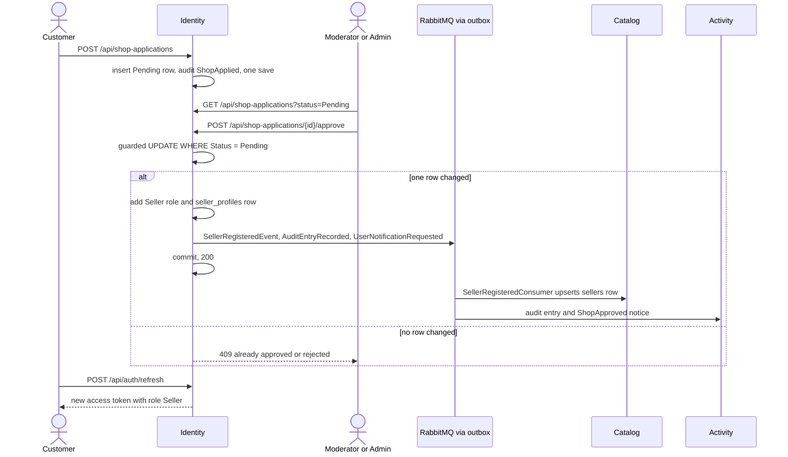
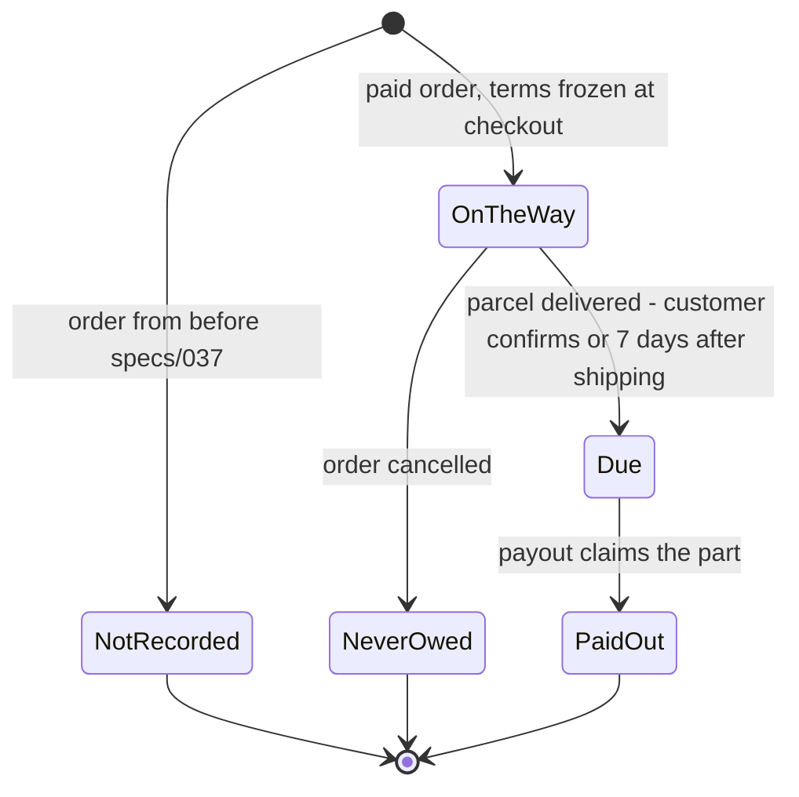

# Marketplace: sellers, their shops and their money

The shop is a marketplace: besides the products the shop itself sells, independent **sellers** list,
stock, ship and are paid for products of their own. A person becomes a seller by applying; a moderator
or an administrator approves the application, which grants the `Seller` role and opens the shop. From
then on every write to a product, a stock row, a sale or a parcel is checked against who owns it, and
somebody else's is answered with a 404 exactly like a missing one. At checkout Order freezes who sold
each line and what the shop owes them, and an administrator settles delivered parcels as payouts, one
guarded SQL statement per seller and currency.

Related documents: [fulfilment and delivery](fulfilment-and-delivery.md) (each seller ships their own
parcel), [catalog](catalog.md) (product review before sale), [moderation and staff](moderation-and-staff.md),
[audit and notifications](audit-and-notifications.md).

## What people can do

| Role | Can |
| :-- | :-- |
| **Customer** | Apply to open a shop from `/open-shop` (`POST /api/shop-applications`), or register and apply in one step (`POST /api/auth/register-seller`); see where their applications stand; buy from any seller. |
| **Seller** | Everything a customer can (a seller always holds `Customer` too). List products, which wait for review before sale; manage their own listings - translations, variants, prices per currency, photographs, deletion; set the stock of their own variants; rename their shop; read their sales (their lines only); prepare and ship their own parcel of an order; read their balance and payouts. |
| **Moderator** | Work the shop-application queue: approve, or reject with a reason. Review sellers' products (see [catalog](catalog.md)). |
| **Administrator** | Everything a moderator can. List products that belong to the shop itself. Pass every ownership check - write to any listing and stock any variant - because moderating a marketplace is the job. See what is due to every seller and record payouts. |
| **System** | Catalog keeps a read model of shop names fed by Identity's events. Order freezes the seller, the shop name and the commission terms onto an order at checkout. The delivery sweeper takes parcels nobody confirmed as delivered after 7 days; their money is due once the 7-day return window has passed too (specs/066). |

## How it works

### Becoming a seller

A shop starts as an **application** (`shop_applications`), not as a role. `register-seller` creates
an account holding `Customer` only plus a `Pending` application, in one save; a signed-in customer
applies the same way from `/open-shop`. Nobody sells until staff decide.

**The address must be confirmed first** (specs/063). A signed-in customer whose address is unconfirmed is
refused the application (403 `EmailNotConfirmed`, and `/open-shop` says to confirm first). Registering as a
seller still creates the application in one step, but approving it is 409 until the applicant has used the
link emailed to them; staff see "Email not confirmed" on such an application. A shop is a public claim in
the address's name, so the address must be shown to be theirs.

A decision is made by `ShopApplicationRepository.TryDecideAsync`: in its own transaction it runs a
guarded `UPDATE shop_applications ... WHERE "Id" = @id AND "Status" = 'Pending'`, and only when that
statement changed a row does it run the handler's `stage` callback and commit. For an approval the
stage adds the `Seller` role, inserts the `SellerProfile` (keyed by the user id), publishes
`SellerRegisteredEvent`, records the audit entry and notifies the applicant (`ShopApproved`). For a
rejection it records the audit entry and the notice (`ShopRejected`, carrying the reason). A second
decision on the same application changes no row and answers 409.



The new role reaches the person's session only when it is renewed: an access token carries the roles
it was issued with. `/open-shop` therefore calls `refreshSession` before sending an approved applicant
to `/shop`, which would otherwise bounce them.

### Whose product it is

`products.SellerId` names the seller; **null means the shop itself** - every product from before
sellers existed, and anything an administrator lists. The owner comes from the token, never from the
request body. Every write handler in Catalog calls one method, `SellerOwnership.RequireCanWrite`,
which lets an administrator through and otherwise requires `product.SellerId == currentUser.Id`. A
seller cannot adopt a product of the shop's own. A refusal throws the same `NotFoundException` text a
missing product produces.

Shop names are a **read model** in Catalog (`sellers`: `SellerId`, `ShopName`, `ObservedAt`), fed by
`SellerRegisteredEvent` and `SellerRenamedEvent`. `SellerRepository.TryRecordAsync` updates only when
the incoming timestamp is newer (`WHERE "ObservedAt" < @observedAt`), so a redelivered or overtaken
rename changes nothing. A page of products resolves every seller's name with one batched query.
Renaming a shop (`PUT /api/sellers/me/shop-name`) writes one row in Identity, publishes
`SellerRenamedEvent` through the outbox, and changes what every listing shows without writing a
product.

A seller's new product waits for a moderator before it goes on sale; that flow is in
[catalog](catalog.md).

### Stock

`PUT /api/stock/{variantId}` is open to `Seller,Admin`. Inventory decides ownership itself
(`StockOwnership.RequireCanStockAsync`) by asking Catalog **live** over gRPC -
`CatalogOwnership.GetVariantOwners` - and never caches the answer. The call is made **before** the
transaction that locks the stock row `FOR UPDATE`, so a slow Catalog never holds a row lock open. An
administrator skips the call entirely. The endpoint can answer three different 404s:

| Case | Message | Meaning |
| :-- | :-- | :-- |
| Variant does not exist | `Product with ID '…' was not found.` | No. |
| Variant is somebody else's, or the shop's own | `Product with ID '…' was not found.` (identical) | No. |
| Variant is yours, but its stock row has not arrived from the broker | `Product '…' is not registered in inventory.` | Retry shortly. |

A newly listed product has no stock (`QuantityOnHand = 0`) until the seller sets it; stocking is a
second step on the listing's page, not a field on the create form.

### Sales and parcels

At checkout Order prices each line with `CatalogPricing.PriceVariants`, whose `PricedVariant` carries
`optional string seller_id = 9` (empty for the shop's own goods) and `optional string seller_name = 10`.
Order freezes both onto the line (`order_items.SellerId`, `SellerName`) and never writes them again.
`GET /api/orders/sales` and `/sales/{id}` read only the caller's lines, with a subtotal over them.

Each seller ships their own part of an order (`order_shipments`, one row per seller per order plus one
for the shop's own goods). Preparing, shipping, the customer confirming receipt and the 7-day
auto-confirmation are documented in [fulfilment and delivery](fulfilment-and-delivery.md).

### Money: commission, delivery shares and payouts

At checkout Order reads `Marketplace:CommissionRate` (0.1 in `appsettings.json`), stores it on the
order as `orders.CommissionRate`, and freezes three amounts on each part, computed by the pure
`Earnings` class:

- `GoodsTotal` - unit price times quantity over the part's lines, **before tax**;
- `Commission` - `GoodsTotal × rate`, rounded half away from zero to the currency's minor unit; **0 on
  the shop's own part**;
- `ShippingShare` - the order's delivery charge split **equally** between the parts in the currency's
  smallest unit, the remainder to the first part (shop first, then by seller id). 30,000 ₫ over three
  parts is 10,000 each; $2.00 over three is 0.68 / 0.66 / 0.66.

What the shop owes a seller for a part is `GoodsTotal − Commission + ShippingShare`. Tax stays with the
shop, which charged it.



Only parts of orders in `Sales.Earning` (`Paid`, legacy `Completed`, `Preparing`, `Shipped`) are
money. `POST /api/orders/payouts` takes a seller id and a currency - **no amount** - and
`PayoutRepository.TryRecordAsync` settles everything due in one statement:

```sql
WITH claimed AS (
    UPDATE order_shipments AS s SET "PayoutId" = @payout
      FROM orders AS o
     WHERE o."Id" = s."OrderId" AND s."SellerId" = @seller AND s."Status" = 'Shipped'
       AND s."DeliveredAt" IS NOT NULL AND s."PayoutId" IS NULL AND s."GoodsTotal" IS NOT NULL
       AND o."Currency" = @currency AND o."Status" = ANY (@earning)
 RETURNING s."GoodsTotal" - s."Commission" + s."ShippingShare" AS owed
)
INSERT INTO payouts ("Id", "SellerId", "Currency", "Amount", "PartCount", "RecordedBy", "CreatedAt")
SELECT @payout, @seller, @currency, sum(owed), count(*), @admin, @now FROM claimed
HAVING count(*) > 0
```

When the statement inserts nothing the handler answers 409 (nothing due). When it inserts a payout,
the audit entry `PayoutRecorded` and the seller's `PayoutRecorded` notice are staged and saved in the
same transaction.

## Rules and guarantees

1. **A shop is an application first.** `register-seller` and `POST /api/shop-applications` grant no
   role and open no shop. *Why:* anybody could list products in the request that created their
   account; a marketplace checks who it lets sell (specs/044).
2. **One pending application per person, enforced by the database** - the partial unique index
   `IX_shop_applications_one_pending` on `UserId WHERE "Status" = 'Pending'`. A second application
   while one waits, or from somebody who already sells, is 409; two tabs racing past the check hit the
   index and get the same 409. *Why:* a check in code alone lets two simultaneous requests through.
3. **The guarded update decides; everything the decision does commits with it.** Role, profile, event,
   audit entry and notice are staged only by the request whose `UPDATE ... WHERE "Status" = 'Pending'`
   changed a row. *Why:* the profile's key would already stop a second shop, but with a 500 and only
   after publishing; the guard stops the second approval before anything is written (specs/044 D2).
4. **A rejection needs a reason, and the person may apply again.** The rejected row stays as history.
5. **A seller always holds `Customer` as well.** *Why:* a seller who cannot buy is a strange account,
   and every customer-only endpoint would refuse them (`RoleNames.Seller`).
6. **Who owns a product comes from the token.** `CreateProductCommandHandler` sets `SellerId` to
   `ICurrentUser.Id` when the caller holds `Seller` and leaves it null otherwise (an administrator); no
   request body names a seller. *Why:* the same
   defect as `UserId` in a body (specs/009) and a price in a body (#18).
7. **Not yours is 404, never 403** - in Catalog (`SellerOwnership`), Inventory (`StockOwnership`) and
   Order (`Sale not found.`), with the same words as a missing thing. *Why:* a 403 confirms the id is
   real and belongs to somebody, which turns any endpoint into an enumeration tool.
8. **An administrator passes every ownership check.** *Why:* moderation is the job. An
   administrator's own products belong to the shop, not to them.
9. **Opening a write to sellers means the controller attribute too.** Leaving
   `[Authorize(Roles = "Admin")]` in place made the ownership checks unreachable while every unit test
   passed (specs/027).
10. **Shop names are display data, eventually consistent.** For a few seconds after an approval or a
    rename, Catalog shows the old name or none; a product whose seller is unknown reads as the shop's
    own, which is what an older product reads as. *Why:* an anonymous catalogue read must not need
    Identity (specs/027 D1).
11. **Stock ownership is asked live and never cached.** *Why:* authorization must not be eventually
    consistent - a read model seconds behind would refuse a seller her own new product with the exact
    404 that means "not yours", and nothing could tell the two apart (specs/031 D2). The cost is
    accepted: Catalog unreachable means a seller cannot stock (503), and also means nobody can see the
    product.
12. **Frozen at checkout, asked live for permissions - both on purpose.** A sale records who owned a
    variant *then* (`order_items.SellerId`), like the price and the name; stock asks who owns it *now*.
    Do not make them consistent in either direction (specs/034 D1).
13. **`seller_id` is proto3 `optional`.** Empty means the shop's own; absent means a Catalog too old to
    say, and Order then records no seller and logs a warning rather than refuse the checkout
    (specs/034 D2).
14. **A seller sees their lines only.** The sale responses have no field for the order's total,
    delivery, tax totals, the customer or the address (the address appears only while the seller's own
    parcel is waiting or being prepared). `SellerSalesTests` asserts the shape.
15. **Failed and still-settling orders are never sales; cancelled ones are sales but never money.**
    `Sales.Statuses` (what a seller sees) includes `Cancelled` so the seller stops preparing;
    `Sales.Earning` (balances and payouts) does not. *Why:* checkout writes a failed order's parts too,
    so the status filter is the only thing keeping a declined payment out of a balance.
16. **Terms are frozen, not recomputed.** Rate and amounts are stored at checkout, and a CHECK
    (`CK_order_shipments_terms_all_or_none`) requires the three amounts to be all set or all null.
    *Why:* every balance is a sum of stored columns, never a second rounding; a rate changed later
    leaves existing sales unchanged (specs/037 D1).
17. **The shares add up exactly.** `Earnings.SplitDelivery` counts in minor units, so the parts' shares
    always sum to the delivery charge.
18. **A seller's own voucher comes out of their goods** (specs/069). A part's `GoodsTotal` is its lines less the
    seller's voucher, so their commission and payout follow. A platform voucher is the shop's cost and changes
    nothing a seller earns ([vouchers](vouchers.md)).
19. **Money is due only once a delivered parcel can no longer come back.** Balances, the due list and the
    payout claim all require the parcel delivered **more than the return window (7 days) ago** with no
    return of it open (specs/040, 066). Until then it is "on the way"; a returned part is no money at all
    ([returns](returns.md)).
20. **A payout is one statement, and carries no amount.** The CTE claims the parts and the `INSERT`
    records the sum of exactly those rows; `HAVING count(*) > 0` inserts nothing when nothing was
    claimed. Of two administrators at once, the second's `UPDATE` waits on the row locks, re-evaluates
    `"PayoutId" IS NULL`, claims nothing and gets 409. `CK_payouts_covers_something` (`PartCount > 0`)
    backs it up. *Why:* summing first and claiming second would pay for rows another payout took in
    between (specs/037 D5).
21. **Orders from before a feature are owed nothing by it.** Lines from before specs/034 have no
    seller; parts from before specs/037 (and parts created on demand for an older image's order) have
    no terms and are excluded from balances and payouts. *Why:* backfilling would invent yesterday's
    agreement or answer with today's owner.
22. **Money is never added across currencies.** Balances, the due list and payouts are per currency.

## Data

| Service | Table | Columns that matter here |
| :-- | :-- | :-- |
| Identity | [`shop_applications`](../reference/data-model.md#shop_applications) | `UserId`, `ShopName`, `Description`, `Phone`, `Status` (`Pending` / `Approved` / `Rejected` as text), `DecisionReason`, `DecidedBy`, `DecidedAt`. Partial unique index `IX_shop_applications_one_pending`; index on `(Status, CreatedAt)` for the queue. |
| Identity | [`seller_profiles`](../reference/data-model.md#seller_profiles) | `UserId` is the primary key **and** the foreign key to `users`, so one shop per account is a constraint. `ShopName`. |
| Identity | [`user_roles`](../reference/data-model.md#user_roles) | `Seller` next to `Customer`. |
| Catalog | [`products`](../reference/data-model.md#products) | `SellerId` (null = the shop itself), `ReviewStatus`. |
| Catalog | [`sellers`](../reference/data-model.md#sellers) | Read model: `SellerId`, `ShopName`, `ObservedAt`. |
| Inventory | [`stock_items`](../reference/data-model.md#stock_items) | `ProductId` holds a **variant** id. |
| Order | [`order_items`](../reference/data-model.md#order_items) | `SellerId`, `SellerName`, frozen at checkout. Indexed on `SellerId`. |
| Order | [`orders`](../reference/data-model.md#orders) | `CommissionRate` (`numeric(5,4)`, null before specs/037). |
| Order | [`order_shipments`](../reference/data-model.md#order_shipments) | `SellerId`, `GoodsTotal`, `Commission`, `ShippingShare`, `DeliveredAt`, `PayoutId` (FK to `payouts`, `Restrict`). Unique `(OrderId, SellerId)` NULLS NOT DISTINCT. |
| Order | [`payouts`](../reference/data-model.md#payouts) | `SellerId`, `Currency`, `Amount`, `PartCount`, `RecordedBy`, `CreatedAt`. |

## API

All through the gateway; the full list is in [api.md](../reference/api.md).

| Method | Path | Who |
| :-- | :-- | :-- |
| `POST` | `/api/auth/register-seller` | anyone |
| `POST` | `/api/shop-applications` | Customer |
| `GET` | `/api/shop-applications/mine` | signed in |
| `GET` | `/api/shop-applications?status=` | Admin, Moderator |
| `POST` | `/api/shop-applications/{id}/approve` | Admin, Moderator |
| `POST` | `/api/shop-applications/{id}/reject` | Admin, Moderator |
| `GET` | `/api/sellers/me` | Seller |
| `PUT` | `/api/sellers/me/shop-name` | Seller |
| `GET` | `/api/products/mine` | Seller |
| `POST`, `PUT`, `DELETE` | `/api/products/...` (create, variants, prices, translations, images, delete) | Seller, Admin - ownership checked in the handler |
| `PUT` | `/api/stock/{variantId}` | Seller, Admin - ownership asked of Catalog |
| `GET` | `/api/orders/sales`, `/api/orders/sales/{id}` | Seller |
| `POST` | `/api/orders/sales/{id}/preparing`, `/api/orders/sales/{id}/shipment` | Seller |
| `GET` | `/api/orders/sales/balance` | Seller |
| `GET` | `/api/orders/sales/payouts` | Seller |
| `GET` | `/api/orders/payouts/due` | Admin |
| `POST` | `/api/orders/payouts` | Admin |

## Messages

From [messages.md](../reference/messages.md) and [grpc.md](../reference/grpc.md).

| Message or call | From | To | Carries |
| :-- | :-- | :-- | :-- |
| `SellerRegisteredEvent` | Identity, on approval | Catalog `SellerRegisteredConsumer` | `SellerId`, `ShopName`, `RegisteredAt` |
| `SellerRenamedEvent` | Identity, on rename | Catalog `SellerRenamedConsumer` | `SellerId`, `ShopName`, `RenamedAt` |
| `AuditEntryRecorded`, `UserNotificationRequested` | Identity, Catalog, Order | Activity | decisions, payouts, sales (see [audit and notifications](audit-and-notifications.md)) |
| gRPC `CatalogOwnership.GetVariantOwners` | Inventory | Catalog | who owns each variant, asked per stock write |
| gRPC `CatalogPricing.PriceVariants` | Order | Catalog | `PricedVariant.seller_id` (field 9) and `seller_name` (field 10), both `optional` |

Identity publishes through its transactional outbox (`AddEntityFrameworkOutbox<ApplicationDbContext>`
with `UseBusOutbox()`), so an approval succeeds with RabbitMQ down and the event is delivered when the
broker returns.

## Storefront

| Where | What |
| :-- | :-- |
| `components/layout/user-menu` | Offers "Open a shop" to anybody who does not sell yet. |
| `pages/open-shop` (`/open-shop`) | The application form, shown only when nothing is waiting, and the history of the person's applications; "Go to my shop" calls `refreshSession` first. |
| `components/auth/require-role` | Draws `/shop` for `Seller` and `/admin` for staff. Drawing only - the server refuses on its own. |
| `layouts/seller-layout` | The seller console's frame. |
| `pages/shop` (`/shop`) | The shop at a glance: listings, what has run out, recent sales, revenue per currency. |
| `pages/shop-products` (`/shop/products`) | The seller's listings with Inventory's real stock count. |
| `pages/shop-product-new` (`/shop/products/new`) | Lists a product; the price is the default currency's amount. |
| `pages/shop-product` (`/shop/products/:id`) | Photograph, variants, prices per currency, stock, variant photographs; `components/seller/variant-editor`, `review-banner`. |
| `pages/shop-sales`, `pages/shop-sale` | The seller's sales and one sale, with `components/seller/sale-earnings` and the parcel steps. |
| `pages/shop-payouts` (`/shop/payouts`) | One card per currency: on the way, due, paid out; and the payouts list. |
| `components/seller/rename-shop-dialog` | Renames the shop. |
| `pages/admin-shops` (`/admin/shops`) | Staff: the application queue, a tab per status. |
| `pages/admin-payouts` (`/admin/payouts`) | Administrators: what is due per seller and currency, and a confirmed "record payout". |

The storefront learns roles from `roles` on the authentication response, not by decoding the access
token. The sign-up page creates customers only; `register-seller` is reached through the API (Bruno).

## Tests

| Where | Proves |
| :-- | :-- |
| `Ecommerce.Identity.Tests/ShopApplicationTests` | Registering to sell opens no shop and publishes nothing; approval grants the role, opens the shop, publishes and notifies once; two simultaneous approvals open one shop; a rejection says why and the person may reapply; a seller cannot apply again; the queue is oldest first. |
| `Ecommerce.Identity.Tests/SellerRolesTests` | A customer holds `Customer` only; an applicant is a customer; an approved seller holds `Seller` and `Customer`; refresh keeps the roles. |
| `Ecommerce.Catalog.Tests/SellerOwnershipTests` | Per write operation, another seller's product is 404; the shop's own cannot be adopted; an administrator passes; "my listings" holds only mine; a rename changes the listings without writing one; an overtaken rename loses. |
| `Ecommerce.Catalog.Tests/VariantOwnershipTests`, `VariantSellerPricingTests` | The gRPC answers: owner per variant, `seller_id` empty-but-present for the shop, the shop name or no name. |
| `Ecommerce.Inventory.Tests/SellerStockTests` | A seller stocks their own; another's is 404 and never 403; the shop's own is refused; an administrator costs no call to Catalog; a missing stock row says something different; Catalog unreachable is not a refusal. |
| `Ecommerce.Order.Tests/SellerSalesTests`, `ShopNameTests` | The seller and shop name are frozen per line; a sale holds only the seller's lines and nothing about the customer; unpaid orders are never sales; not-yours and not-there read alike. |
| `Ecommerce.Order.Tests/EarningsTests` | Equal split that sums exactly, commission rounding, no commission on the shop's part, the rate's range. |
| `Ecommerce.Order.Tests/PayoutTests` | Terms recorded at checkout; balance moves on the way → due → paid out; failed orders count nowhere; nothing due is 409 and leaves nothing; simultaneous payouts pay each part once; one currency at a time; older parts are never paid. |
| client `pages/open-shop`, `shop*`, `admin-shops`, `admin-payouts`, `components/seller/*`, `components/auth/require-role`, `components/layout/user-menu` | What each page sends and shows, and how a server refusal is shown. |
| Bruno `seller/`, `security-checks/` | The round trip: register a seller, wait for review, approve, approving again is 409, sign in again as a seller, the shop name reaches the catalogue, stock, sales, balance, payouts; 401/403/404 cases. |

## Known limits

- **One commission rate for everybody** (`Marketplace:CommissionRate`). There is no per-seller or
  per-category rate.
- **A missing commission rate is not caught at startup.** `ConfiguredCommissionRate` throws when the
  setting is missing or outside [0, 1), but `Program.cs` resolves only `IShippingOptions` and
  `ITaxRates` eagerly, so a missing rate surfaces at the first checkout as a 500, not as a refusal to
  start. `appsettings.json` ships `0.1`, so this only bites a deployment that removes it.
- **A payout moves no money.** Payment is a stub; a payout is a ledger entry. It always settles
  everything due in one currency - there is no partial payout.
- **Nothing takes a shop away.** The only role that can be granted or revoked through the API is
  `Moderator`; there is no endpoint to close a shop or remove `Seller`. Locking the account
  ([moderation](moderation-and-staff.md)) stops the person, not their listings.
- **A new role reaches a session at its next refresh**, and an access token lives out its 15 minutes.
- Built since, and described on their own pages:
  - how a seller's shop is doing, in [seller insights](seller-insights.md) (specs/068);
  - questions to a seller, in [product questions](product-questions.md) (specs/076);
  - [returns](returns.md) (specs/066). A return is a hold before money is due, never a debt after a payout.
- **Shop names are not unique** - two shops may trade under the same name.
- **Orders before specs/034 belong to no seller and orders before specs/037 are owed nothing**, by
  design (rule 20).

## History

| Spec | PR | Added |
| :-- | :-- | :-- |
| [027-seller-accounts](../../specs/027-seller-accounts/) | [#64](https://github.com/jessiicamaru/e-commerce-asp-dotnet-practice/pull/64) | The `Seller` role, `register-seller`, `seller_profiles`, `products.SellerId`, `SellerOwnership`, Catalog's `sellers` read model, the rename, Identity's first outbox. |
| [028-seller-console](../../specs/028-seller-console/) | [#65](https://github.com/jessiicamaru/e-commerce-asp-dotnet-practice/pull/65), [#78](https://github.com/jessiicamaru/e-commerce-asp-dotnet-practice/pull/78) | `/shop` and its pages; `roles` on the authentication response; the client's first tests. |
| [031-seller-stock](../../specs/031-seller-stock/) | [#71](https://github.com/jessiicamaru/e-commerce-asp-dotnet-practice/pull/71) | Sellers stock their own variants; `CatalogOwnership` gRPC; the three 404s. |
| [034-seller-sales](../../specs/034-seller-sales/) | [#77](https://github.com/jessiicamaru/e-commerce-asp-dotnet-practice/pull/77) | `order_items.SellerId` frozen at checkout; `/api/orders/sales`. |
| [035-seller-shipments](../../specs/035-seller-shipments/) | [#79](https://github.com/jessiicamaru/e-commerce-asp-dotnet-practice/pull/79) | One parcel per seller per order (see [fulfilment](fulfilment-and-delivery.md)). |
| [036-parcel-shop-names](../../specs/036-parcel-shop-names/) | [#80](https://github.com/jessiicamaru/e-commerce-asp-dotnet-practice/pull/80) | `order_items.SellerName` frozen at checkout. |
| [037-seller-payouts](../../specs/037-seller-payouts/) | [#81](https://github.com/jessiicamaru/e-commerce-asp-dotnet-practice/pull/81) | Commission rate, `GoodsTotal` / `Commission` / `ShippingShare`, `payouts`, the one-statement claim. |
| [038-admin-console](../../specs/038-admin-console/) | [#82](https://github.com/jessiicamaru/e-commerce-asp-dotnet-practice/pull/82) | `/admin/payouts`. |
| [039-order-cancellation](../../specs/039-order-cancellation/) | [#84](https://github.com/jessiicamaru/e-commerce-asp-dotnet-practice/pull/84) | `Sales.Earning` split from `Sales.Statuses`, so a cancelled sale is never money. |
| [040-delivery-confirmation](../../specs/040-delivery-confirmation/) | [#85](https://github.com/jessiicamaru/e-commerce-asp-dotnet-practice/pull/85) | Due means delivered, not shipped. |
| [044-shop-applications](../../specs/044-shop-applications/) | [#96](https://github.com/jessiicamaru/e-commerce-asp-dotnet-practice/pull/96) | Shop applications; `register-seller` grants `Customer` only; `/open-shop`, `/admin/shops`, `refreshSession`. |
| [063-email-confirmation](../../specs/063-email-confirmation/) | [#146](https://github.com/jessiicamaru/e-commerce-asp-dotnet-practice/pull/146) | A shop is applied for and approved only with a confirmed address. |
