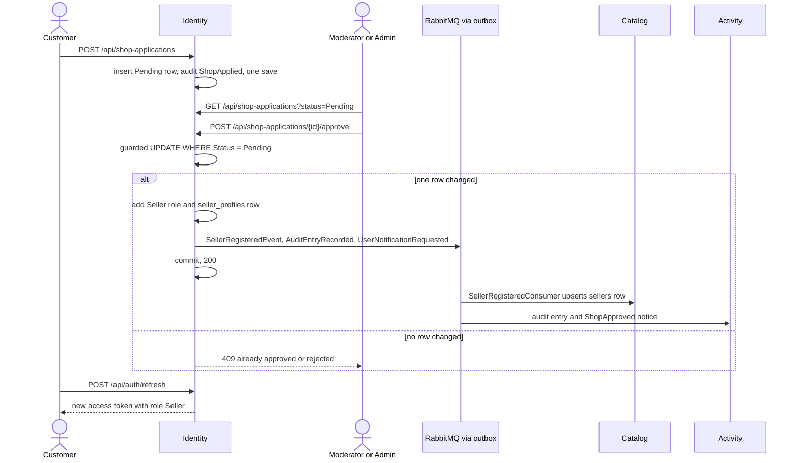
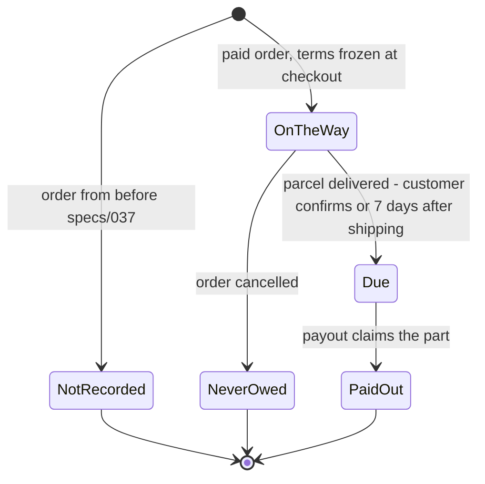

# Marketplace: sellers, their shops and their money

The shop is a marketplace: besides the products the shop itself sells, independent **sellers** list,
stock, ship and are paid for products of their own. A person becomes a seller by applying; a moderator
or an administrator approves the application, which grants the `Seller` role and opens the shop. From
then on every write to a product, a stock row, a sale or a parcel is checked against who owns it, and
somebody else's is answered with a 404 exactly like a missing one. At checkout Order freezes who sold
each line and what the shop owes them, and an administrator settles delivered parcels as payouts, one
guarded SQL statement per seller and currency.

Related documents: [fulfilment and delivery](fulfilment-and-delivery.md) (each seller ships their own
parcel), [catalog](catalog.md) (product review before sale), [moderation and staff](moderation-and-staff.md),
[audit and notifications](audit-and-notifications.md).

## What people can do

| Role | Can |
| :-- | :-- |
| **Customer** | Apply to open a shop from `/open-shop` (`POST /api/shop-applications`), or register and apply in one step (`POST /api/auth/register-seller`); see where their applications stand; buy from any seller. |
| **Seller** | Everything a customer can (a seller always holds `Customer` too). List products, which wait for review before sale; manage their own listings - translations, variants, prices per currency, photographs, deletion; set the stock of their own variants; rename their shop; read their sales (their lines only); prepare and ship their own parcel of an order; read their balance and payouts. |
| **Moderator** | Work the shop-application queue: approve, or reject with a reason. Review sellers' products (see [catalog](catalog.md)). |
| **Administrator** | Everything a moderator can. List products that belong to the shop itself. Pass every ownership check - write to any listing and stock any variant - because moderating a marketplace is the job. See what is due to every seller and record payouts. |
| **System** | Catalog keeps a read model of shop names fed by Identity's events. Order freezes the seller, the shop name and the commission terms onto an order at checkout. The delivery sweeper takes parcels nobody confirmed as delivered after 7 days; their money is due once the 7-day return window has passed too (specs/066). |

## How it works

### Becoming a seller

A shop starts as an **application** (`shop_applications`), not as a role. `register-seller` creates
an account holding `Customer` only plus a `Pending` application, in one save; a signed-in customer
applies the same way from `/open-shop`. Nobody sells until staff decide.

**The address must be confirmed first** (specs/063). A signed-in customer whose address is unconfirmed is
refused the application (403 `EmailNotConfirmed`, and `/open-shop` says to confirm first). Registering as a
seller still creates the application in one step, but approving it is 409 until the applicant has used the
link emailed to them; staff see "Email not confirmed" on such an application. A shop is a public claim in
the address's name, so the address must be shown to be theirs.

A decision is made by `ShopApplicationRepository.TryDecideAsync`: in its own transaction it runs a
guarded `UPDATE shop_applications ... WHERE "Id" = @id AND "Status" = 'Pending'`, and only when that
statement changed a row does it run the handler's `stage` callback and commit. For an approval the
stage adds the `Seller` role, inserts the `SellerProfile` (keyed by the user id), publishes
`SellerRegisteredEvent`, records the audit entry and notifies the applicant (`ShopApproved`). For a
rejection it records the audit entry and the notice (`ShopRejected`, carrying the reason). A second
decision on the same application changes no row and answers 409.


```mermaid
sequenceDiagram
    actor C as Customer
    participant I as Identity
    actor S as Moderator or Admin
    participant Q as RabbitMQ via outbox
    participant K as Catalog
    participant A as Activity
    C->>I: POST /api/shop-applications
    I->>I: insert Pending row, audit ShopApplied, one save
    S->>I: GET /api/shop-applications?status=Pending
    S->>I: POST /api/shop-applications/{id}/approve
    I->>I: guarded UPDATE WHERE Status = Pending
    alt one row changed
        I->>I: add Seller role and seller_profiles row
        I->>Q: SellerRegisteredEvent, AuditEntryRecorded, UserNotificationRequested
        I->>I: commit, 200
        Q->>K: SellerRegisteredConsumer upserts sellers row
        Q->>A: audit entry and ShopApproved notice
    else no row changed
        I-->>S: 409 already approved or rejected
    end
    C->>I: POST /api/auth/refresh
    I-->>C: new access token with role Seller
```

The new role reaches the person's session only when it is renewed: an access token carries the roles
it was issued with. `/open-shop` therefore calls `refreshSession` before sending an approved applicant
to `/shop`, which would otherwise bounce them.

### Whose product it is

`products.SellerId` names the seller; **null means the shop itself** - every product from before
sellers existed, and anything an administrator lists. The owner comes from the token, never from the
request body. Every write handler in Catalog calls one method, `SellerOwnership.RequireCanWrite`,
which lets an administrator through and otherwise requires `product.SellerId == currentUser.Id`. A
seller cannot adopt a product of the shop's own. A refusal throws the same `NotFoundException` text a
missing product produces.

Shop names are a **read model** in Catalog (`sellers`: `SellerId`, `ShopName`, `ObservedAt`), fed by
`SellerRegisteredEvent` and `SellerRenamedEvent`. `SellerRepository.TryRecordAsync` updates only when
the incoming timestamp is newer (`WHERE "ObservedAt" < @observedAt`), so a redelivered or overtaken
rename changes nothing. A page of products resolves every seller's name with one batched query.
Renaming a shop (`PUT /api/sellers/me/shop-name`) writes one row in Identity, publishes
`SellerRenamedEvent` through the outbox, and changes what every listing shows without writing a
product.

A seller's new product waits for a moderator before it goes on sale; that flow is in
[catalog](catalog.md).

**A shop has a page** (specs/099, #197). `/shops/{sellerId}` shows the shop's name, the seller's own
description and its products on the shelf; the shop name on a product page links there. The seller
writes the description beside the rename (`PUT /api/sellers/me/description`, at most 500 characters,
not moderated - like the name). Identity announces `SellerDescribedEvent` in the same save, and Catalog
keeps it on `sellers` (`Description`, guarded by its own `DescriptionObservedAt`). Catalog serves the
page (`GET /api/shops/{sellerId}`, anyone): 404 for an unknown id, a seller whose name has not arrived
yet, or a suspended one. The products are the public listing with `?sellerId=` - the same shelf rule as
the catalogue. The shop's own goods have no page: the catalogue is theirs.

### Stock

`PUT /api/stock/{variantId}` is open to `Seller,Admin`. Inventory decides ownership itself
(`StockOwnership.RequireCanStockAsync`) by asking Catalog **live** over gRPC -
`CatalogOwnership.GetVariantOwners` - and never caches the answer. The call is made **before** the
transaction that locks the stock row `FOR UPDATE`, so a slow Catalog never holds a row lock open. An
administrator skips the call entirely. The endpoint can answer three different 404s:

| Case | Message | Meaning |
| :-- | :-- | :-- |
| Variant does not exist | `Product with ID '…' was not found.` | No. |
| Variant is somebody else's, or the shop's own | `Product with ID '…' was not found.` (identical) | No. |
| Variant is yours, but its stock row has not arrived from the broker | `Product '…' is not registered in inventory.` | Retry shortly. |

A newly listed product has no stock (`QuantityOnHand = 0`) until the seller sets it; stocking is a
second step on the listing's page, not a field on the create form.

**A seller is told when a variant runs low** (specs/102, #200). When a checkout's reservation takes a
variant's available stock from at or above its line to below it, Inventory stages `StockRanLowEvent` in
that same transaction, and Catalog - which knows the seller and the words - sends them `StockRunningLow`
("“X-T5 · Colour: Silver” is running low: 4 left"). The crossing is judged from before and after under
the reservation's row lock, with **no stored flag**: staying below never crosses again, and stock coming
back (a failed payment, a restock) makes the next fall a new crossing. The line is
`stock_items.LowStockThreshold` (null = `Inventory:LowStock:DefaultThreshold`, 5; 0 = never), set by the
seller beside the stock count through `PUT /api/stock/{variantId}/low-stock-threshold` with the same
ownership check. A seller's own adjustment tells nobody, and nobody is told about the shop's own goods.

### Sales and parcels

At checkout Order prices each line with `CatalogPricing.PriceVariants`, whose `PricedVariant` carries
`optional string seller_id = 9` (empty for the shop's own goods) and `optional string seller_name = 10`.
Order freezes both onto the line (`order_items.SellerId`, `SellerName`) and never writes them again.
`GET /api/orders/sales` and `/sales/{id}` read only the caller's lines, with a subtotal over them. Since specs/131 (#247) the list takes an optional `status` of the caller's own part - `Paid` (waiting to be prepared, neither it nor the order cancelled), `Preparing`, `Shipped`, `Cancelled` - filtered in SQL so the total covers every page. The seller's home opens with **Needs you**: sales to prepare, questions to answer, returns to decide and a missing payout account, each linking to where it is done, and the seller menu badges Sales, Questions and Returns with the same counts (`useSellerWaiting`, a page of one from each owner under keys of their own).

Each seller ships their own part of an order (`order_shipments`, one row per seller per order plus one
for the shop's own goods). Preparing, shipping, the customer confirming receipt and the 7-day
auto-confirmation are documented in [fulfilment and delivery](fulfilment-and-delivery.md).

### Money: commission, delivery shares and payouts

At checkout Order reads `Marketplace:CommissionRate` (0.1 in `appsettings.json`), stores it on the
order as `orders.CommissionRate`, and freezes three amounts on each part, computed by the pure
`Earnings` class:

- `GoodsTotal` - unit price times quantity over the part's lines, **before tax**;
- `Commission` - `GoodsTotal × rate`, rounded half away from zero to the currency's minor unit; **0 on
  the shop's own part**;
- `ShippingShare` - the order's delivery charge split **equally** between the parts in the currency's
  smallest unit, the remainder to the first part (shop first, then by seller id). 30,000 ₫ over three
  parts is 10,000 each; $2.00 over three is 0.68 / 0.66 / 0.66.

What the shop owes a seller for a part is `GoodsTotal − Commission + ShippingShare`. Tax stays with the
shop, which charged it.


```mermaid
stateDiagram-v2
    [*] --> NotRecorded: order from before specs/037
    [*] --> OnTheWay: paid order, terms frozen at checkout
    OnTheWay --> Due: parcel delivered - customer confirms or 7 days after shipping
    OnTheWay --> NeverOwed: order cancelled
    Due --> PaidOut: payout claims the part
    NotRecorded --> [*]
    NeverOwed --> [*]
    PaidOut --> [*]
```

Only parts of orders in `Sales.Earning` (`Paid`, legacy `Completed`, `Preparing`, `Shipped`) are
money. `POST /api/orders/payouts` takes a seller id and a currency - **no amount** - and
`PayoutRepository.TryRecordAsync` settles everything due in one statement:

```sql
WITH claimed AS (
    UPDATE order_shipments AS s SET "PayoutId" = @payout
      FROM orders AS o
     WHERE o."Id" = s."OrderId" AND s."SellerId" = @seller AND s."Status" = 'Shipped'
       AND s."DeliveredAt" IS NOT NULL AND s."PayoutId" IS NULL AND s."GoodsTotal" IS NOT NULL
       AND o."Currency" = @currency AND o."Status" = ANY (@earning)
 RETURNING s."GoodsTotal" - s."Commission" + s."ShippingShare" AS owed
)
INSERT INTO payouts ("Id", "SellerId", "Currency", "Amount", "PartCount", "RecordedBy", "CreatedAt",
                     "PaidToBank", "PaidToHolder", "PaidToAccountLast4")
SELECT @payout, @seller, @currency, sum(owed), count(*), @admin, @now, @bank, @holder, @last4 FROM claimed
HAVING count(*) > 0
```

When the statement inserts nothing the handler answers 409 (nothing due). When it inserts a payout,
the audit entry `PayoutRecorded` and the seller's `PayoutRecorded` notice are staged and saved in the
same transaction.

### Where a payout goes (specs/106)

A seller gives **one payout account** - bank, holder, account number - on `/shop/payouts`
(`PUT /api/sellers/me/payout-account`). It lives in **Identity** (`seller_payout_accounts`, one row per seller),
beside the rest of what is known about the person, and every change:

- emails the seller (`PayoutAccountChanged`, in the language they last used) with the bank and the **last four
  digits** only - so a change they did not make is noticed;
- is audited (`PayoutAccountSet`), with the number **masked by hand** - `AuditSnapshot` redacts by property name,
  and "AccountNumber" is not one it knows.

The seller reads it back masked (`•••• 4321`); the whole number is read only by an administrator, at
`GET /api/sellers/payout-accounts?sellerIds=` - the `/admin/payouts` page shows it beside what is due, marks an
account changed within the last 7 days, and disables **Pay** for a seller with none.

When an administrator records a payout, Order asks Identity over gRPC (`PayoutAccounts.GetPayoutAccount`, the
administrator's token forwarded, Admin only) **before** the claim's transaction, and:

- no account is a **409** that claims nothing - nothing is paid to nowhere;
- Identity not answering is a **503** that claims nothing;
- otherwise the bank, the holder and the **last four digits** are frozen on the payout (`PaidToBank`,
  `PaidToHolder`, `PaidToAccountLast4`), so the record says where the money went even after the seller changes
  their account. Payouts from before have none.

## Rules and guarantees

1. **A shop is an application first.** `register-seller` and `POST /api/shop-applications` grant no
   role and open no shop. *Why:* anybody could list products in the request that created their
   account; a marketplace checks who it lets sell (specs/044).
2. **One pending application per person, enforced by the database** - the partial unique index
   `IX_shop_applications_one_pending` on `UserId WHERE "Status" = 'Pending'`. A second application
   while one waits, or from somebody who already sells, is 409; two tabs racing past the check hit the
   index and get the same 409. *Why:* a check in code alone lets two simultaneous requests through.
3. **The guarded update decides; everything the decision does commits with it.** Role, profile, event,
   audit entry and notice are staged only by the request whose `UPDATE ... WHERE "Status" = 'Pending'`
   changed a row. *Why:* the profile's key would already stop a second shop, but with a 500 and only
   after publishing; the guard stops the second approval before anything is written (specs/044 D2).
4. **A rejection needs a reason, and the person may apply again.** The rejected row stays as history.
5. **A seller always holds `Customer` as well.** *Why:* a seller who cannot buy is a strange account,
   and every customer-only endpoint would refuse them (`RoleNames.Seller`).
6. **Who owns a product comes from the token.** `CreateProductCommandHandler` sets `SellerId` to
   `ICurrentUser.Id` when the caller holds `Seller` and leaves it null otherwise (an administrator); no
   request body names a seller. *Why:* the same
   defect as `UserId` in a body (specs/009) and a price in a body (#18).
7. **Not yours is 404, never 403** - in Catalog (`SellerOwnership`), Inventory (`StockOwnership`) and
   Order (`Sale not found.`), with the same words as a missing thing. *Why:* a 403 confirms the id is
   real and belongs to somebody, which turns any endpoint into an enumeration tool.
8. **An administrator passes every ownership check.** *Why:* moderation is the job. An
   administrator's own products belong to the shop, not to them.
9. **Opening a write to sellers means the controller attribute too.** Leaving
   `[Authorize(Roles = "Admin")]` in place made the ownership checks unreachable while every unit test
   passed (specs/027).
10. **Shop names are display data, eventually consistent.** For a few seconds after an approval or a
    rename, Catalog shows the old name or none; a product whose seller is unknown reads as the shop's
    own, which is what an older product reads as. *Why:* an anonymous catalogue read must not need
    Identity (specs/027 D1).
11. **Stock ownership is asked live and never cached.** *Why:* authorization must not be eventually
    consistent - a read model seconds behind would refuse a seller her own new product with the exact
    404 that means "not yours", and nothing could tell the two apart (specs/031 D2). The cost is
    accepted: Catalog unreachable means a seller cannot stock (503), and also means nobody can see the
    product.
12. **Frozen at checkout, asked live for permissions - both on purpose.** A sale records who owned a
    variant *then* (`order_items.SellerId`), like the price and the name; stock asks who owns it *now*.
    Do not make them consistent in either direction (specs/034 D1).
13. **`seller_id` is proto3 `optional`.** Empty means the shop's own; absent means a Catalog too old to
    say, and Order then records no seller and logs a warning rather than refuse the checkout
    (specs/034 D2).
14. **A seller sees their lines only.** The sale responses have no field for the order's total,
    delivery, tax totals, the customer or the address (the address appears only while the seller's own
    parcel is waiting or being prepared). `SellerSalesTests` asserts the shape.
15. **Failed and still-settling orders are never sales; cancelled ones are sales but never money.**
    `Sales.Statuses` (what a seller sees) includes `Cancelled` so the seller stops preparing;
    `Sales.Earning` (balances and payouts) does not. *Why:* checkout writes a failed order's parts too,
    so the status filter is the only thing keeping a declined payment out of a balance.
16. **Terms are frozen, not recomputed.** Rate and amounts are stored at checkout, and a CHECK
    (`CK_order_shipments_terms_all_or_none`) requires the three amounts to be all set or all null.
    *Why:* every balance is a sum of stored columns, never a second rounding; a rate changed later
    leaves existing sales unchanged (specs/037 D1).
17. **The shares add up exactly.** `Earnings.SplitDelivery` counts in minor units, so the parts' shares
    always sum to the delivery charge.
18. **A seller's own voucher comes out of their goods** (specs/069). A part's `GoodsTotal` is its lines less the
    seller's voucher, so their commission and payout follow. A platform voucher is the shop's cost and changes
    nothing a seller earns ([vouchers](vouchers.md)).
19. **Money is due only once a delivered parcel can no longer come back.** Balances, the due list and the
    payout claim all require the parcel delivered **more than the return window (7 days) ago** with no
    return of it open (specs/040, 066). Until then it is "on the way"; a returned part is no money at all
    ([returns](returns.md)).
20. **A payout is one statement, and carries no amount.** The CTE claims the parts and the `INSERT`
    records the sum of exactly those rows; `HAVING count(*) > 0` inserts nothing when nothing was
    claimed. Of two administrators at once, the second's `UPDATE` waits on the row locks, re-evaluates
    `"PayoutId" IS NULL`, claims nothing and gets 409. `CK_payouts_covers_something` (`PartCount > 0`)
    backs it up. *Why:* summing first and claiming second would pay for rows another payout took in
    between (specs/037 D5).
21. **Orders from before a feature are owed nothing by it.** Lines from before specs/034 have no
    seller; parts from before specs/037 (and parts created on demand for an older image's order) have
    no terms and are excluded from balances and payouts. *Why:* backfilling would invent yesterday's
    agreement or answer with today's owner.
22. **Money is never added across currencies.** Balances, the due list and payouts are per currency.
23. **A shop's page is the catalogue's shelf, filtered.** Its products come from `GET /api/products?sellerId=`,
    never a second query, so a product taken down or a shop suspended leaves the shop page and the
    catalogue together; its count is `Product.OnShelf` counted (specs/099 D5).
24. **A shop's rating is its products' reviews, and its seller reads the same number** (specs/165, #379). `GET
    /api/shops/{id}` carries `ratingAverage` (null with no visible review, never zero) and `ratingCount`: each product's
    stored average weighted by its count - one review at 4 and three at 2 is 2.5 - over **every** product the seller
    has, on the shelf or not, so withdrawing a badly reviewed product does not lift the shop. One method
    (`SellerRatings`) answers both this and the seller's insights (specs/068), so the two can never disagree. A hidden
    review is out of both, because each product's average is recomputed from the visible rows (specs/046); and a
    review write updates `products`, which empties the read cache (specs/157). The shop page shows the stars and the
    count under the name, or "no reviews yet"; a seller's product page shows them beside "Sold by", from the same cached
    read. Why not stored on `sellers`: one more write on every review path and a copy that can drift
    ([research](../../specs/165-shop-rating/research.md)).

## Data

| Service | Table | Columns that matter here |
| :-- | :-- | :-- |
| Identity | [`shop_applications`](../reference/data-model.md#shop_applications) | `UserId`, `ShopName`, `Description`, `Phone`, `Status` (`Pending` / `Approved` / `Rejected` as text), `DecisionReason`, `DecidedBy`, `DecidedAt`. Partial unique index `IX_shop_applications_one_pending`; index on `(Status, CreatedAt)` for the queue. |
| Identity | [`seller_profiles`](../reference/data-model.md#seller_profiles) | `UserId` is the primary key **and** the foreign key to `users`, so one shop per account is a constraint. `ShopName`. |
| Identity | [`user_roles`](../reference/data-model.md#user_roles) | `Seller` next to `Customer`. |
| Catalog | [`products`](../reference/data-model.md#products) | `SellerId` (null = the shop itself), `ReviewStatus`. |
| Catalog | [`sellers`](../reference/data-model.md#sellers) | Read model: `SellerId`, `ShopName`, `ObservedAt`. |
| Inventory | [`stock_items`](../reference/data-model.md#stock_items) | `ProductId` holds a **variant** id. |
| Order | [`order_items`](../reference/data-model.md#order_items) | `SellerId`, `SellerName`, frozen at checkout. Indexed on `SellerId`. |
| Order | [`orders`](../reference/data-model.md#orders) | `CommissionRate` (`numeric(5,4)`, null before specs/037). |
| Order | [`order_shipments`](../reference/data-model.md#order_shipments) | `SellerId`, `GoodsTotal`, `Commission`, `ShippingShare`, `DeliveredAt`, `PayoutId` (FK to `payouts`, `Restrict`). Unique `(OrderId, SellerId)` NULLS NOT DISTINCT. |
| Order | [`payouts`](../reference/data-model.md#payouts) | `SellerId`, `Currency`, `Amount`, `PartCount`, `RecordedBy`, `CreatedAt`; where it went - `PaidToBank`, `PaidToHolder`, `PaidToAccountLast4` (specs/106). |
| Identity | [`seller_payout_accounts`](../reference/data-model.md#seller_payout_accounts) | One per seller: `BankName`, `AccountHolder`, `AccountNumber` (normalised, 6-34 letters and digits), `UpdatedAt` (specs/106). |

## API

All through the gateway; the full list is in [api.md](../reference/api.md).

| Method | Path | Who |
| :-- | :-- | :-- |
| `POST` | `/api/auth/register-seller` | anyone |
| `POST` | `/api/shop-applications` | Customer |
| `GET` | `/api/shop-applications/mine` | signed in |
| `GET` | `/api/shop-applications?status=` | Admin, Moderator |
| `POST` | `/api/shop-applications/{id}/approve` | Admin, Moderator |
| `POST` | `/api/shop-applications/{id}/reject` | Admin, Moderator |
| `GET` | `/api/sellers/me` | Seller |
| `PUT` | `/api/sellers/me/shop-name` | Seller |
| `PUT` | `/api/sellers/me/description` | Seller |
| `GET` | `/api/shops/{sellerId}` | anyone - name, description, products on sale, paused, and the shop's rating (`ratingAverage`, `ratingCount`, specs/165) |
| `GET` | `/api/products?sellerId=` | anyone |
| `GET` | `/api/products/mine` | Seller |
| `POST`, `PUT`, `DELETE` | `/api/products/...` (create, variants, prices, translations, images, delete) | Seller, Admin - ownership checked in the handler |
| `PUT` | `/api/stock/{variantId}` | Seller, Admin - ownership asked of Catalog |
| `PUT` | `/api/stock/{variantId}/low-stock-threshold` | Seller, Admin - the same ownership check (specs/102) |
| `POST` | `/api/orders/sales/{id}/cancel` | Seller - their own part, before it ships (specs/104) |
| `GET` | `/api/orders/sales?status=`, `/api/orders/sales/{id}` | Seller - `status` of their own part (specs/131); each row names up to three of their own `lines` (specs/132) |
| `POST` | `/api/orders/sales/{id}/preparing`, `/api/orders/sales/{id}/shipment` | Seller |
| `GET` | `/api/orders/sales/balance` | Seller |
| `GET` | `/api/orders/sales/payouts` | Seller |
| `GET` | `/api/orders/payouts/due` | Admin |
| `POST` | `/api/orders/payouts` | Admin |
| `GET` / `PUT` | `/api/sellers/me/payout-account` | Seller |
| `GET` | `/api/sellers/payout-accounts?sellerIds=` | Admin |

## Messages

From [messages.md](../reference/messages.md) and [grpc.md](../reference/grpc.md).

| Message or call | From | To | Carries |
| :-- | :-- | :-- | :-- |
| `SellerRegisteredEvent` | Identity, on approval | Catalog `SellerRegisteredConsumer` | `SellerId`, `ShopName`, `RegisteredAt` |
| `SellerRenamedEvent` | Identity, on rename | Catalog `SellerRenamedConsumer` | `SellerId`, `ShopName`, `RenamedAt` |
| `SellerDescribedEvent` | Identity, on a description | Catalog `SellerDescribedConsumer` | `SellerId`, `Description` (null = cleared), `DescribedAt` |
| `StockRanLowEvent` | Inventory, in a reservation that crossed a line | Catalog `StockRanLowConsumer` | `VariantId`, `QuantityAvailable`, `Threshold`, `OccurredAt` (specs/102) |
| `AuditEntryRecorded`, `UserNotificationRequested` | Identity, Catalog, Order | Activity | decisions, payouts, sales (see [audit and notifications](audit-and-notifications.md)) |
| gRPC `CatalogOwnership.GetVariantOwners` | Inventory | Catalog | who owns each variant, asked per stock write |
| gRPC `CatalogPricing.PriceVariants` | Order | Catalog | `PricedVariant.seller_id` (field 9) and `seller_name` (field 10), both `optional` |

Identity publishes through its transactional outbox (`AddEntityFrameworkOutbox<ApplicationDbContext>`
with `UseBusOutbox()`), so an approval succeeds with RabbitMQ down and the event is delivered when the
broker returns.

## Storefront

| Where | What |
| :-- | :-- |
| `components/layout/user-menu` | Offers "Open a shop" to anybody who does not sell yet. |
| `pages/open-shop` (`/open-shop`) | The application form, shown only when nothing is waiting, and the history of the person's applications; "Go to my shop" calls `refreshSession` first. |
| `components/auth/require-role` | Draws `/shop` for `Seller` and `/admin` for staff. Drawing only - the server refuses on its own. |
| `layouts/seller-layout` | The seller console's frame. |
| `pages/shop` (`/shop`) | The shop at a glance: listings, what has run out, recent sales, revenue per currency. |
| `pages/shop-products` (`/shop/products`) | The seller's listings with Inventory's real stock count. |
| `pages/shop-product-new` (`/shop/products/new`) | Lists a product; the price is the default currency's amount. |
| `pages/shop-product` (`/shop/products/:id`) | Photograph, variants, prices per currency, stock and its low-stock line (specs/102), variant photographs; `components/seller/variant-editor`, `review-banner`. |
| `pages/shop-sales`, `pages/shop-sale` | The seller's sales and one sale, with `components/seller/sale-earnings` and the parcel steps. |
| `pages/shop-payouts` (`/shop/payouts`) | One card per currency: on the way, due, paid out; and the payouts list. |
| `components/seller/rename-shop-dialog` | Renames the shop. |
| `components/seller/describe-shop-dialog` | The shop's description, beside the rename; the seller layout also links to the shop's own page. |
| `pages/shop-front` (`/shops/:sellerId`) | Anyone: a shop's name, its rating (or "no reviews yet"), description and products on the shelf, paged; the product page's shop name links here and shows the same rating beside it (specs/165). |
| `pages/admin-shops` (`/admin/shops`) | Staff: the application queue, a tab per status. |
| `pages/admin-payouts` (`/admin/payouts`) | Administrators: what is due per seller and currency, and a confirmed "record payout". |

The storefront learns roles from `roles` on the authentication response, not by decoding the access
token. The sign-up page creates customers only; `register-seller` is reached through the API (Bruno).

## Tests

| Where | Proves |
| :-- | :-- |
| `Ecommerce.Identity.Tests/ShopApplicationTests` | Registering to sell opens no shop and publishes nothing; approval grants the role, opens the shop, publishes and notifies once; two simultaneous approvals open one shop; a rejection says why and the person may reapply; a seller cannot apply again; the queue is oldest first. |
| `Ecommerce.Identity.Tests/SellerRolesTests` | A customer holds `Customer` only; an applicant is a customer; an approved seller holds `Seller` and `Customer`; refresh keeps the roles. |
| `Ecommerce.Catalog.Tests/SellerOwnershipTests` | Per write operation, another seller's product is 404; the shop's own cannot be adopted; an administrator passes; "my listings" holds only mine; a rename changes the listings without writing one; an overtaken rename loses. |
| `Ecommerce.Catalog.Tests/VariantOwnershipTests`, `VariantSellerPricingTests` | The gRPC answers: owner per variant, `seller_id` empty-but-present for the shop, the shop name or no name. |
| `Ecommerce.Inventory.Tests/LowStockTests` | A sale crossing the line publishes once; below it, none; back above then down, again; exactly at the line is not low; a variant's own line and 0; a seller's adjustment and a redelivery publish nothing; several variants judged each; the line's owner, range and default; an unusable configured default stops startup (specs/102). |
| `Ecommerce.Catalog.Tests/LowStockNoticeTests` | The seller is told the product, the variant and how many are left; the shop's own goods and a variant that is gone tell nobody (specs/102). |
| `Ecommerce.Inventory.Tests/SellerStockTests` | A seller stocks their own; another's is 404 and never 403; the shop's own is refused; an administrator costs no call to Catalog; a missing stock row says something different; Catalog unreachable is not a refusal. |
| `Ecommerce.Order.Tests/SellerSalesTests`, `ShopNameTests` | The seller and shop name are frozen per line; a sale holds only the seller's lines and nothing about the customer; unpaid orders are never sales; not-yours and not-there read alike. |
| `Ecommerce.Catalog.Tests/ShopPageTests` | The seller filter lists only that seller's products on the shelf; the shop read carries name, description and count; unknown, unnamed and suspended are 404; an older description loses. |
| `Ecommerce.Catalog.Tests/ShopRatingTests` | With real reviews: the shop page weights each product by its reviews (4 once and 2 three times is 2.5 over 4) and gives exactly the seller's insights' numbers; no review is null, never zero, and another shop's reviews are not its own; a hidden review leaves and a restored one returns; a product off the shelf still counts. Counting only active products fails the last. |
| client `pages/shop-front`, `pages/product`, `hooks/review`; `e2e/flows.spec.ts` | The shop page shows the stars, the number and the count, or "no reviews yet" without stars; a seller's product shows the shop's rating beside "Sold by", from the shop's own read, and the shop's own product asks for no shop; writing a review re-reads the shops' pages (dropping that fails the hook test). In a browser, after the flows' review, the shop page and the product page read 5.0 from one review (specs/165). |
| `Ecommerce.Identity.Tests/ShopDescriptionTests` | A description is stored trimmed and announced with its audit entry; empty clears it; too long is 400; a non-seller is 404. |
| `Ecommerce.Order.Tests/EarningsTests` | Equal split that sums exactly, commission rounding, no commission on the shop's part, the rate's range. |
| `Ecommerce.Order.Tests/PayoutTests` | Terms recorded at checkout; balance moves on the way → due → paid out; failed orders count nowhere; nothing due is 409 and leaves nothing; simultaneous payouts pay each part once; one currency at a time; older parts are never paid; no payout account is 409 and claims nothing; a payout freezes where it went. |
| `Ecommerce.Identity.Tests/PayoutAccountTests` | A seller sets and reads their account masked, the email and audit carry the last four only; a customer has none to set; a bad number is 400; the administrator's read is whole. |
| client `pages/open-shop`, `shop*`, `admin-shops`, `admin-payouts`, `components/seller/*`, `components/auth/require-role`, `components/layout/user-menu` | What each page sends and shows, and how a server refusal is shown. |
| Bruno `seller/`, `security-checks/` | The round trip: register a seller, wait for review, approve, approving again is 409, sign in again as a seller, the shop name reaches the catalogue, stock, sales, balance, payouts, pausing and closing the shop; 401/403/404/409 cases. |
| `Ecommerce.Catalog.Tests/ShopClosureTests` | Pausing takes the shop off the shelf and reopening tells savers once; 409s; staff close with a reason the seller cannot undo; staff reopening keeps a pause; a lifted ban does not reopen a paused or closed shop; approval while paused stays off; the page says paused, hides closed; audit categories. |

**A banned seller's shop is closed** (specs/095, #193). Identity announces `SellerSuspensionChangedEvent(SellerId,
Suspended, ChangedAt)` in the ban's transaction, and again when it is lifted. Catalog records it on `sellers`
(`Suspended`, `SuspensionChangedAt` - the ordering guard) and copies it onto every product of the seller
(`products.SellerSuspended`), so `Product.OnShelf` answers no everywhere: listing, lookup, images, reviews, questions,
checkout. Reopening tells the savers of products back on sale. ⚠️ This read model **decides** - a few seconds' lag
sells a banned seller's product a little longer, which staff can cancel (specs/039); asking Identity live would make
every page depend on it. A lock does not close a shop. Paid orders of a suspended seller wait for staff to cancel them.

**A seller pauses their shop, and staff close one** (specs/107, #214) - both without touching the account. Catalog's
`sellers` row holds them (`PausedAt`; `ClosedAt`, `ClosedReason`, `ClosedBy`): the shelf is Catalog's, so it is
decided there, in the same transaction as the products.

- `products.SellerSuspended` now means **the shop is not open** - banned, paused or closed - and one statement writes
  it from the whole row (`SellerRepository.ApplyShopStateAsync`). ⚠️ Three independent reasons: lifting one (a ban
  lifted while the seller is away) never reopens a shop another keeps shut, which is why the ban path no longer
  writes its own bool. `OnShelf` did not change.
- ⚠️ **Approval takes the shop's state** (`TryReviewAsync`): a product listed while its shop is paused would
  otherwise go on sale when a moderator approves it.
- The seller pauses and reopens at `/shop` (`POST /api/shops/mine/pause`, `/reopen`). Staff close with a reason the
  seller reads (`POST /api/shops/{id}/close`) from the shop's page, and reopen from the "Closed shops" tab of
  `/admin/shops` (`GET /api/shops/closed`, `POST /api/shops/{id}/reopen`). ⚠️ The seller's moves are guarded by
  `"ClosedAt" IS NULL`: **a seller never reopens what staff closed**; staff reopening leaves the seller's own pause.
- A paused shop's page answers `paused: true` ("taking a break"); a closed one is a 404, like a banned one.
- Paid orders are untouched: the seller still ships them. Reopening from either side tells savers of what is back
  on sale; staff closing and reopening tell the seller (`ShopClosed`, `ShopReopened`).

## Known limits

- **One commission rate for everybody** (`Marketplace:CommissionRate`). There is no per-seller or
  per-category rate.
- **A payout moves no money.** Payment is a stub; a payout is a ledger entry. It always settles
  everything due in one currency - there is no partial payout. It records where it would have gone (specs/106);
  one account per seller, for every currency, with no waiting period after a change - the email and the
  "changed recently" mark are the guard.
- **A shop is closed by a ban, a seller's pause or staff's closure** (specs/095, 107); a lock stops the person, not
  their listings. A pause has no end date, and a closure keeps one reason (its history is the audit log). There is
  no removing `Seller` - the only role granted or revoked through the API is `Moderator`.
- **A new role reaches a session at its next refresh**, and an access token lives out its 15 minutes.
- Built since, and described on their own pages:
  - how a seller's shop is doing, in [seller insights](seller-insights.md) (specs/068);
  - questions to a seller, in [product questions](product-questions.md) (specs/076);
  - [returns](returns.md) (specs/066). A return is a hold before money is due, never a debt after a payout.
- **Shop names are not unique** - two shops may trade under the same name.
- **Orders before specs/034 belong to no seller and orders before specs/037 are owed nothing**, by
  design (rule 20).

## History

| Spec | PR | Added |
| :-- | :-- | :-- |
| [027-seller-accounts](../../specs/027-seller-accounts/) | [#64](https://github.com/jessiicamaru/e-commerce-asp-dotnet-practice/pull/64) | The `Seller` role, `register-seller`, `seller_profiles`, `products.SellerId`, `SellerOwnership`, Catalog's `sellers` read model, the rename, Identity's first outbox. |
| [095-suspended-seller](../../specs/095-suspended-seller/) | [#202](https://github.com/jessiicamaru/e-commerce-asp-dotnet-practice/pull/202) | A ban closes a seller's shop: `SellerSuspensionChangedEvent`, `sellers.Suspended`, `products.SellerSuspended` (#193). |
| [099-shop-page](../../specs/099-shop-page/) | [#206](https://github.com/jessiicamaru/e-commerce-asp-dotnet-practice/pull/206) | A shop has a page: `/shops/:sellerId`, `GET /api/shops/{id}`, `?sellerId=` on the listing, the seller's description and `SellerDescribedEvent` (#197). |
| [102-low-stock-notice](../../specs/102-low-stock-notice/) | [#209](https://github.com/jessiicamaru/e-commerce-asp-dotnet-practice/pull/209) | `stock_items.LowStockThreshold`, `StockRanLowEvent`, `StockRunningLow`; the line beside the stock count (#200). |
| [103-commission-at-startup](../../specs/103-commission-at-startup/) | [#223](https://github.com/jessiicamaru/e-commerce-asp-dotnet-practice/pull/223) | A missing or impossible `Marketplace:CommissionRate` stops Order at startup (`RequiredSettings.Check`) instead of failing the first checkout (#210). |
| [104-seller-cancels-part](../../specs/104-seller-cancels-part/) | [#224](https://github.com/jessiicamaru/e-commerce-asp-dotnet-practice/pull/224) | A seller cancels their part of an order they cannot fulfil; a cancelled part earns nothing and gives back their voucher (#211). |
| [106-payout-accounts](../../specs/106-payout-accounts/) | [#226](https://github.com/jessiicamaru/e-commerce-asp-dotnet-practice/pull/226) | A seller gives a payout account (Identity `seller_payout_accounts`); a payout asks for it over gRPC and freezes bank, holder and last four (#213). |
| [107-shop-closure](../../specs/107-shop-closure/) | #227 | A seller pauses their shop, staff close one with a reason; `sellers.PausedAt`/`ClosedAt`, one shelf statement for all three reasons (#214). |
| [131-seller-needs-you](../../specs/131-seller-needs-you/) | #271 | `status` on the seller's sales; Needs you on `/shop` and badges on the seller menu (#247). |
| [028-seller-console](../../specs/028-seller-console/) | [#65](https://github.com/jessiicamaru/e-commerce-asp-dotnet-practice/pull/65), [#78](https://github.com/jessiicamaru/e-commerce-asp-dotnet-practice/pull/78) | `/shop` and its pages; `roles` on the authentication response; the client's first tests. |
| [031-seller-stock](../../specs/031-seller-stock/) | [#71](https://github.com/jessiicamaru/e-commerce-asp-dotnet-practice/pull/71) | Sellers stock their own variants; `CatalogOwnership` gRPC; the three 404s. |
| [034-seller-sales](../../specs/034-seller-sales/) | [#77](https://github.com/jessiicamaru/e-commerce-asp-dotnet-practice/pull/77) | `order_items.SellerId` frozen at checkout; `/api/orders/sales`. |
| [035-seller-shipments](../../specs/035-seller-shipments/) | [#79](https://github.com/jessiicamaru/e-commerce-asp-dotnet-practice/pull/79) | One parcel per seller per order (see [fulfilment](fulfilment-and-delivery.md)). |
| [036-parcel-shop-names](../../specs/036-parcel-shop-names/) | [#80](https://github.com/jessiicamaru/e-commerce-asp-dotnet-practice/pull/80) | `order_items.SellerName` frozen at checkout. |
| [037-seller-payouts](../../specs/037-seller-payouts/) | [#81](https://github.com/jessiicamaru/e-commerce-asp-dotnet-practice/pull/81) | Commission rate, `GoodsTotal` / `Commission` / `ShippingShare`, `payouts`, the one-statement claim. |
| [038-admin-console](../../specs/038-admin-console/) | [#82](https://github.com/jessiicamaru/e-commerce-asp-dotnet-practice/pull/82) | `/admin/payouts`. |
| [039-order-cancellation](../../specs/039-order-cancellation/) | [#84](https://github.com/jessiicamaru/e-commerce-asp-dotnet-practice/pull/84) | `Sales.Earning` split from `Sales.Statuses`, so a cancelled sale is never money. |
| [040-delivery-confirmation](../../specs/040-delivery-confirmation/) | [#85](https://github.com/jessiicamaru/e-commerce-asp-dotnet-practice/pull/85) | Due means delivered, not shipped. |
| [044-shop-applications](../../specs/044-shop-applications/) | [#96](https://github.com/jessiicamaru/e-commerce-asp-dotnet-practice/pull/96) | Shop applications; `register-seller` grants `Customer` only; `/open-shop`, `/admin/shops`, `refreshSession`. |
| [063-email-confirmation](../../specs/063-email-confirmation/) | [#146](https://github.com/jessiicamaru/e-commerce-asp-dotnet-practice/pull/146) | A shop is applied for and approved only with a confirmed address. |
| [165-shop-rating](../../specs/165-shop-rating/) | [#PR_NUMBER](https://github.com/jessiicamaru/e-commerce-asp-dotnet-practice/pull/PR_NUMBER) | A shop's rating on its page and beside "Sold by" - every visible review of every product it has, the seller's insights' own computation. |
