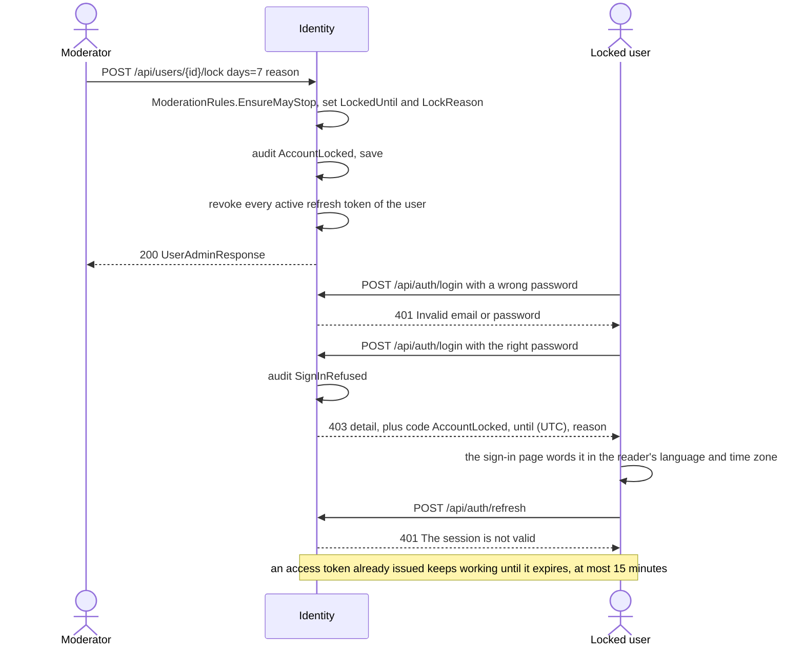

# Moderation and staff

The shop is run by **staff**: administrators and moderators. An administrator is seeded at Identity's
startup and can make other people moderators; moderators share the day-to-day work - deciding who may
open a shop, which sellers' products go on sale, which reviews stay visible - and may lock an abusive
account for up to 30 days. Only an administrator bans, handles fulfilment and payouts, reads the full
audit log and sees the shop's figures. Every staff decision commits together with its audit entry and,
where there is one, the notice that tells the person affected; shop and product decisions, which two
staff could race on, are guarded writes that succeed exactly once. Both kinds of staff work from one
console at `/admin`, which draws for each person only the pages their role can use.

Related documents: [marketplace](marketplace.md) (shop applications), [catalog](catalog.md) (product
review before sale), [ratings and reviews](ratings-and-reviews.md) (hiding reviews),
[fulfilment and delivery](fulfilment-and-delivery.md), [audit and notifications](audit-and-notifications.md),
[JWT setup](auth/jwt-setup.md).

## What people can do

| Role | Can |
| :-- | :-- |
| **Customer** | Nothing staff-related. When locked or banned, is refused at sign-in with the reason and the end date in the API's answer - only after typing the right password. Is told by notification when made or no longer a moderator. |
| **Seller** | Reads why a shop application or a product was rejected or taken down, in a notification and on the page; sends a rejected product back for review. |
| **Moderator** | Opens the console on `/admin/moderation`: how many shops and products wait, and their own recent decisions. Finds people by email or name; locks an account for 1 to 30 days with a reason, and unlocks. Approves or rejects shop applications. Approves, rejects or takes down sellers' products. Hides and restores reviews. |
| **Administrator** | Everything a moderator can. Grants and revokes `Moderator`. Locks for up to 365 days; bans and lifts bans. Works the fulfilment queue, reads any order, cancels orders, records payouts ([fulfilment](fulfilment-and-delivery.md), [marketplace](marketplace.md)). Reads the whole audit log. Reads the shop's figures at `/admin/overview` ([admin insights](admin-insights.md)). |
| **System** | `DataInitializer` seeds the four roles (`Admin`, `Customer`, `Seller`, `Moderator`) and the first administrator from `ADMIN_EMAIL` / `ADMIN_PASSWORD`; the bootstrap closes once any administrator exists. |

## How it works

### Two staff roles, one name for both

`RoleNames.Moderator` sits beside `Admin`, `Customer` and `Seller` in Identity. Every service names
staff through `Ecommerce.Shared.Authentication.StaffRoles`:

```csharp
public const string Staff = Admin + "," + Moderator;   // [Authorize(Roles = StaffRoles.Staff)]
```

The comma is ASP.NET Core's "any of". An attribute decides who reaches an endpoint; what a moderator
may do **to whom** depends on the target's row and is decided in the handler, by
`ModerationRules.EnsureMayStop`:

| Caller \ target | Themselves | An administrator | A moderator | A customer or seller |
| :-- | :-- | :-- | :-- | :-- |
| Administrator | 409 | 409 | allowed | allowed |
| Moderator | 409 | 409 | **403** `ForbiddenException` | allowed |

A moderator asking for more than 30 days gets 403 (`ModerationRules.ModeratorMaxLockDays = 30`); the
validator allows 1 to 365 days for anyone (`AdminMaxLockDays = 365`).

**Unlocking obeys the same limits** (specs/050, `ModerationRules.EnsureMayRelease`), because it had none
until #121 - a moderator could lift an administrator's year-long lock, free another moderator, or, with an
access token that outlived the lock (possible until specs/065 closed #112), free themselves:

| Caller \ target | Themselves | A moderator | A customer or seller, lock with at most 30 days to run | ... with more than 30 days to run |
| :-- | :-- | :-- | :-- | :-- |
| Administrator | 409 | allowed | allowed | allowed |
| Moderator | 409 | **403** | allowed | **403** |

"More than a moderator could have set" is read from the time **still to run**, not from who set the lock:
that needs no column, and a long lock stays until an administrator decides. A lock an administrator set
for 40 days is therefore a moderator's to lift once it has 30 days or fewer left - the same lock the
moderator could have set that day. The users page shows "Unlock" disabled in exactly these cases. Granting, revoking, banning and
lifting a ban are `[Authorize(Roles = RoleNames.Admin)]` on `UsersController`, whose class admits
`Staff`.

### Stopping an account

A lock and a ban are two nullable pairs of columns on `users`, not a status: `LockedUntil` /
`LockReason` and `BannedAt` / `BanReason`. `User.IsLocked(now)` is `LockedUntil > now`, so a lock that
has run out needs no clean-up; `IsBanned` is `BannedAt is not null`.



`LoginCommandHandler` checks the password **first**: an unknown email and a wrong password both answer
401 with one message, and a locked or banned account is refused with `ForbiddenException` (403, message
shown) only after the password matched. Since specs/049 the refusal also carries its facts as
ProblemDetails extensions - `code` (`AccountLocked` or `AccountBanned`), `until` (ISO 8601 UTC, locks
only) and `reason` - and `pages/sign-in` words them itself: "This account is locked until 1/10/2026,
14:30:00: Spam in reviews", in the reader's language and local time, rather than the English sentence in
UTC. A 403 it has no words for shows the server's `detail`. `RefreshTokenCommandHandler` refuses a locked or banned
account with the ordinary 401 whatever the token, because the account row decides, not the token.
Unlocking and lifting a ban clear the columns; the person signs in again.

### Granting a role

`PUT /api/users/{id}/roles/{role}` and `DELETE` on the same path accept only `Moderator` (the
validators say so in words). A banned account cannot be given a role (409). A grant or a revoke writes
the role, an audit entry under **Security** (`RoleGranted`, `RoleRevoked`) and a notification
(`ModeratorGranted` with a link to `/admin`, or `ModeratorRevoked`) in one save. The person holds the
new role after their session next refreshes.

### The queues moderators work

| Queue | Page | Endpoints | Decision is guarded by | Documented in |
| :-- | :-- | :-- | :-- | :-- |
| Shop applications, oldest first | `/admin/shops` | `GET /api/shop-applications`, `/approve`, `/reject` | `UPDATE ... WHERE "Status" = 'Pending'` | [marketplace](marketplace.md#becoming-a-seller) |
| Sellers' products, oldest first | `/admin/products` | `GET /api/products/review`, `/approve`, `/reject`, `/take-down` | `UPDATE ... WHERE "ReviewStatus" IN (...)` | [catalog](catalog.md) |
| Reviews | `/admin/reviews` | `GET /api/reviews`, `/hide`, `/restore` | a check on `HiddenAt`, then one save that recomputes the product's rating | [ratings and reviews](ratings-and-reviews.md) |

**Product review before sale** (specs/045) in one paragraph: a product listed by a seller starts
`Pending` and is invisible to everybody but its seller and staff, and unsellable, until a moderator
approves it; a rejection or a take-down carries a reason the seller reads; a seller changing an
approved product's name, description or any photograph sends it back to `Pending` and off the shelf,
while prices and stock do not. Details in [catalog](catalog.md).

**Hiding a review** (specs/046): a hidden review leaves the product page and the average, which is
recomputed from the visible rows in the same save; it is hidden, never deleted, and can be restored.
Details in [ratings and reviews](ratings-and-reviews.md).

Every approve, reject, take-down, resubmit, hide and restore is recorded under the **Moderation**
audit category. Every shop and product decision notifies the applicant or seller it concerns; hiding
or restoring a review notifies nobody.

### The consoles

`/admin` is drawn for `Admin` or `Moderator` (`RequireRole role={['Admin', 'Moderator']}`).
`AdminLayout` filters its sidebar by role: administrators see Overview, Fulfilment, Payouts, Moderation,
Review, Shops, Reviews, Users and Audit; moderators see Moderation, Review, Shops, Reviews and Users.
`AdminHome` shows an administrator the fulfilment queue and sends a moderator to `/admin/moderation`.

The moderator's dashboard asks each queue for one row of one page and shows its `totalCount`, so the
number never disagrees with the queue it links to. Its "recently" list is
`GET /api/audit/mine` (`MyDecisionsController`, Staff): audit entries in category `Moderation` whose
actor is the caller, newest first. The rest of the audit log stays an administrator's.

The users page (`/admin/users`) searches by part of an email or a name (`GET /api/users?search=`,
paged, newest first) and shows each person's roles and whether they are locked or banned. A lock that
has run out is shown as no lock. The row menu offers each person only the actions their role allows,
and never an action on one's own account or on an administrator's; the server refuses the same things
on its own.

## Rules and guarantees

1. **Staff is Admin or Moderator, named once.** `StaffRoles.Staff` in `Ecommerce.Shared` is what every
   service's staff endpoint uses. *Why:* the same list typed in five services drifts.
2. **Moderator is the only role that can be granted or revoked.** *Why:* granting `Admin` would be a
   second bootstrap path, `Seller` comes from an approved shop application, and everybody is a
   `Customer` (specs/043 D3).
3. **The first administrator comes from the environment, once.** `DataInitializer` stops as soon as
   any user holds `Admin`, so the bootstrap cannot be used to escalate later. It refuses a password
   shorter than 8 characters, and promotes an existing account rather than overwriting its password.
4. **Nobody stops themselves or an administrator; a moderator does not stop a moderator.** Checked
   against the stored target row in `ModerationRules.EnsureMayStop`, whatever the client sends.
   *Why:* an attribute runs before the target is read and cannot know who it is. **Unlocking obeys the
   same limits** (`EnsureMayRelease`, specs/050), and a moderator lifts only a lock with 30 days or
   fewer to run.
5. **A moderator locks for at most 30 days; only an administrator bans.** A ban has no end date and
   lasts until an administrator lifts it.
6. **A lock and a ban are columns, not a status.** *Why:* they can overlap, and an earlier image must
   still parse the row - the migration only adds nullable columns (specs/043 D1).
7. **Sign-in says why only after the right password.** Before it, a locked account and a wrong
   password look the same (#28); after it, the person has proved who they are and is owed the reason
   and the end date. Both refusals are recorded as `SignInRefused`.
8. **Stopping an account ends every session.** `RevokeAllRefreshTokensAsync` runs right after the
   save, and refresh refuses a locked or banned account in any case, so a session that slipped through
   still cannot be renewed.
9. **A stop reaches a signed-in session within seconds** (specs/065). Accepted in specs/043 as "an access
   token lives out its minutes"; since #112 a lock, a ban or a role revoked publishes
   `AccessTokensRevoked`, and every service refuses the tokens issued before it - from a list each keeps
   in memory, not a lookup on every request. Roles granted still arrive at the next refresh.
10. **403 only when the caller is known and the answer is no.** `ForbiddenException` carries a sentence
    the caller reads - a locked account after the right password, a moderator reaching past what
    moderators may do. "Not yours" stays a 404, because a 403 confirms the thing exists.
11. **A decision is made exactly once.** Shop applications and product reviews are decided by a guarded
    `UPDATE` whose `WHERE` names the states the move starts from; only the request that changed a row
    stages its role change, event, audit entry and notice, in the same transaction. A second decision
    is 409.
12. **A rejection, a take-down, a hide and a stop each need a reason.** Validators refuse an empty one.
    *Why:* the person affected reads it.
13. **Every staff action is on the record.** Role changes under **Security**; locks, bans, unlocks,
    lifts, shop decisions, product decisions and review moderation under **Moderation**, each with a
    before and after snapshot so the diff shows what changed.
14. **The console draws; the server decides.** `RequireRole`, the sidebar filter and the row menu hide
    what a person cannot do, and every endpoint behind them is refused by the server on its own.
15. **The staff order read is Admin-only and is the one read not scoped to an owner.**
    `GET /api/orders/fulfilment/{id}` (`GetOrderForStaffQuery`) must never sit behind any other route
    (specs/038).

## Data

| Service | Table | Columns |
| :-- | :-- | :-- |
| Identity | [`users`](../reference/data-model.md#users) | `LockedUntil`, `LockReason` (500), `BannedAt`, `BanReason` (500). `IsActive` exists but nothing reads it. |
| Identity | [`roles`](../reference/data-model.md#roles), [`user_roles`](../reference/data-model.md#user_roles) | Four seeded roles. |
| Identity | [`refresh_tokens`](../reference/data-model.md#refresh_tokens) | `RevokedAt` set on every active token when an account is stopped. |
| Identity | [`shop_applications`](../reference/data-model.md#shop_applications) | `Status`, `DecisionReason`, `DecidedBy`, `DecidedAt`. |
| Catalog | [`products`](../reference/data-model.md#products) | `ReviewStatus`, `ReviewReason`, `ReviewedBy`, `ReviewedAt`, `SubmittedAt`. |
| Catalog | [`product_reviews`](../reference/data-model.md#product_reviews) | `HiddenAt`, `HiddenBy`, `HiddenReason`. |
| Activity | [`audit_entries`](../reference/data-model.md#audit_entries) | `ActorId` and `Category` serve `/api/audit/mine`. |

## API

Full list in [api.md](../reference/api.md).

| Method | Path | Who |
| :-- | :-- | :-- |
| `GET` | `/api/users?search=&page=&pageSize=` | Admin, Moderator |
| `POST` | `/api/users/{id}/lock` (`days`, `reason`) | Admin, Moderator |
| `POST` | `/api/users/{id}/unlock` | Admin, Moderator |
| `POST` | `/api/users/{id}/ban` (`reason`) | Admin |
| `POST` | `/api/users/{id}/unban` | Admin |
| `PUT` | `/api/users/{id}/roles/{role}` | Admin |
| `DELETE` | `/api/users/{id}/roles/{role}` | Admin |
| `GET` | `/api/users/lookup`, `/api/users/stats` | Admin |
| `GET` | `/api/shop-applications`, `POST .../{id}/approve`, `POST .../{id}/reject` | Admin, Moderator |
| `GET` | `/api/products/review`, `POST /api/products/{id}/approve`, `/reject`, `/take-down` | Admin, Moderator |
| `GET` | `/api/reviews`, `POST /api/reviews/{id}/hide`, `/restore` | Admin, Moderator |
| `GET` | `/api/audit/mine` | Admin, Moderator |
| `GET` | `/api/audit`, `/api/audit/summary`, `/api/audit/{id}` | Admin |
| `GET` | `/api/orders/fulfilment`, `/api/orders/fulfilment/{id}` | Admin |
| `POST` | `/api/orders/payouts` | Admin |

## Messages

No message is specific to moderation. Staff actions publish, through the acting service's outbox:
`AuditEntryRecorded` and `UserNotificationRequested` (consumed by Activity), and - for a shop approval
- `SellerRegisteredEvent` (consumed by Catalog). See [messages.md](../reference/messages.md) and
[audit and notifications](audit-and-notifications.md).

## Storefront

| Where | What |
| :-- | :-- |
| `components/auth/require-role` | Draws `/admin` for `Admin` or `Moderator`. |
| `layouts/admin-layout` | The console's frame; the sidebar lists only the pages the role can use. |
| `pages/admin-home` (`/admin`) | Administrator: the fulfilment queue. Moderator: redirected to `/admin/moderation`. |
| `pages/admin-moderation` | What waits in the product and shop queues, and the caller's last 8 decisions. |
| `pages/admin-users` | Search, role badges, lock and ban status, a row menu per person; `stop-dialog.tsx` offers preset durations (1, 3, 7, 14, 30, 90, 365 days), only those up to 30 for a moderator. |
| `pages/admin-shops` | Shop applications, a tab per status. |
| `pages/admin-products` | Sellers' products waiting, approved or rejected; approve, reject with a reason, take down. |
| `pages/admin-reviews` | Reviews, visible or hidden; hide with a reason, restore. |
| `pages/admin-orders`, `pages/admin-order`, `pages/admin-payouts` | Administrator: fulfilment and payouts ([fulfilment](fulfilment-and-delivery.md), [marketplace](marketplace.md)). |
| `pages/admin-audit` | Administrator: the audit log ([audit and notifications](audit-and-notifications.md)). |
| `pages/admin-overview` | Administrator: people, queues, revenue per currency, top products and buyers - see [admin insights](admin-insights.md). |
| `pages/sign-in` | A 401 is only "That email and password do not match an account." (#28). A 403 for a locked or banned account is worded from its `code`, `until` and `reason` (`pages/sign-in/refusal.ts`, specs/049); any other 403 shows the server's sentence; anything else is "Signing in failed. Try again in a moment." |

## Tests

| Where | Proves |
| :-- | :-- |
| `Ecommerce.Identity.Tests/ModerationTests` | A grant arrives at the next refresh; only `Moderator` can be granted; a locked account cannot sign in or refresh until unlocked; the 30-day cap; nobody stops themselves or an administrator and a moderator does not stop a moderator; a ban holds until lifted and unlocking does not lift it; nobody unlocks themselves, only an administrator unlocks a moderator, and a moderator lifts only a lock of 30 days or fewer still to run (a refused unlock records nothing); the refusal carries `code`, `until` and `reason`; every action is recorded with its diff and a grant notifies; search by part of an email. |
| `Ecommerce.Identity.Tests/ShopApplicationTests` | Approval and rejection, two simultaneous approvals open one shop, the queue order. |
| `Ecommerce.Identity.Tests/AuthErrorTests` | Unknown email and wrong password give the same 401. |
| `Ecommerce.Identity.Tests/ForbiddenProblemTests` | A 403's facts reach the response body in Production, a date as ISO 8601 UTC, and never hide `traceId`. |
| `Ecommerce.Catalog.Tests/ProductReviewTests`, `ReviewTests` | Product review moves and review hiding ([catalog](catalog.md), [ratings and reviews](ratings-and-reviews.md)). |
| `Ecommerce.Activity.Tests/AuditLogTests` | Filtering by actor and category, which `/api/audit/mine` relies on. |
| client `pages/admin-users` (specs/050) | "Unlock" is disabled for yourself, for a moderator seen by a moderator, and for a lock beyond a moderator's reach. |
| client `pages/sign-in` | A locked person is told why and until when in their language and time; a banned one why; a wrong password only "wrong"; another 403 its sentence; no sentence the generic one. |
| client `pages/admin-users`, `admin-shops`, `admin-moderation`, `admin-products`, `admin-reviews`, `layouts/admin-layout`, `components/auth/require-role` | What each role is offered and what each action sends. |
| Bruno `admin-users/` | Grant, sign in holding the role, a moderator cannot grant, ban or lock beyond 30 days, lock, locked sign-in refused with its `code`, `until` and `reason`, a moderator cannot unlock their own account (409), unlock, sign in again, the audit log records it, revoke. |
| Bruno `seller/`, `reviews/`, `security-checks/` | Shop and product decisions, a second approval is 409, review hiding, 401 and 403 cases. |

## Known limits

- **A service restarted within an hour of a stop forgets it**, and a token it held lives out its minutes
  there (specs/065).
- **A lock or ban is told in the app, not by email.** Since specs/059 the person gets an `AccountLocked`
  or `AccountBanned` notice, readable once the stop ends, and the reason at sign-in (specs/049). Email
  (specs/060) does not carry it yet.
- **Nothing closes a shop or removes `Seller`**; locking the account stops the person, not their
  listings. Taking a product down is per product.
- **The audit log is an administrator's.** A moderator sees only their own Moderation decisions.

## History

| Spec | PR | Added |
| :-- | :-- | :-- |
| [038-admin-console](../../specs/038-admin-console/) | [#82](https://github.com/jessiicamaru/e-commerce-asp-dotnet-practice/pull/82) | The `/admin` console: fulfilment queue, the staff order read, payouts. |
| [041-audit-log](../../specs/041-audit-log/) | [#93](https://github.com/jessiicamaru/e-commerce-asp-dotnet-practice/pull/93) | The audit log page for administrators. |
| [043-moderators-and-locks](../../specs/043-moderators-and-locks/) | [#95](https://github.com/jessiicamaru/e-commerce-asp-dotnet-practice/pull/95) | `Moderator`, `StaffRoles.Staff`, `ForbiddenException`, lock and ban columns, `ModerationRules`, `/api/users`, the users page, the role-filtered sidebar. |
| [044-shop-applications](../../specs/044-shop-applications/) | [#96](https://github.com/jessiicamaru/e-commerce-asp-dotnet-practice/pull/96) | The shop-application queue. |
| [045-product-review](../../specs/045-product-review/) | [#97](https://github.com/jessiicamaru/e-commerce-asp-dotnet-practice/pull/97) | Product review before sale, the moderator's dashboard, `GET /api/audit/mine`. |
| [046-product-reviews](../../specs/046-product-reviews/) | [#98](https://github.com/jessiicamaru/e-commerce-asp-dotnet-practice/pull/98) | Hiding and restoring reviews. |
| [047-admin-insights](../../specs/047-admin-insights/) | [#99](https://github.com/jessiicamaru/e-commerce-asp-dotnet-practice/pull/99) | `/admin/overview`, `/api/users/lookup`, `/api/users/stats`. |
| [049-sign-in-refusal](../../specs/049-sign-in-refusal/) | [#130](https://github.com/jessiicamaru/e-commerce-asp-dotnet-practice/pull/130) | `ForbiddenException` facts as ProblemDetails extensions; the sign-in refusal's `code`, `until`, `reason`; the sign-in page words a lock or ban in the reader's language and time (#120). |
| [050-unlock-rules](../../specs/050-unlock-rules/) | [#131](https://github.com/jessiicamaru/e-commerce-asp-dotnet-practice/pull/131) | `ModerationRules.EnsureMayRelease`: nobody unlocks themselves, only an administrator unlocks a moderator, a moderator lifts only a lock within their reach (#121). |
| [065-revoke-access-tokens](../../specs/065-revoke-access-tokens/) | [#148](https://github.com/jessiicamaru/e-commerce-asp-dotnet-practice/pull/148) | A lock, a ban or a role revoked stops the access tokens already issued within seconds, in every service (#112). |
