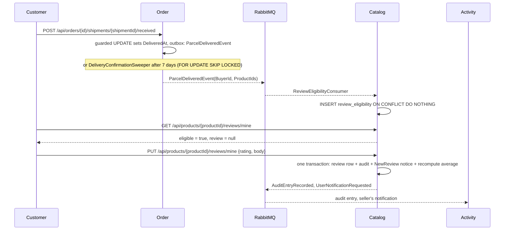

# Ratings and reviews

A customer whose parcel has arrived can give each product in it 1 to 5 stars and, optionally, some words. Shoppers see the average, the count and the reviews on the product page, and the average on every listing card. Moderators hide reviews that do not belong and can restore them. The feature lives in Catalog, which owns reviews and decides who may write them. Catalog cannot know who bought what, so it learns that from an event: Order publishes `ParcelDeliveredEvent` when a parcel is delivered, and Catalog keeps a `review_eligibility` table from it. The other idea that matters is that a product's `RatingAverage` and `RatingCount` are **recomputed from the visible rows** in the same transaction as every change, never incremented.

## What people can do

| Role | Capabilities |
| :-- | :-- |
| Shopper (anyone) | Read a product's visible reviews, newest first, and its average and count. See the average on listing cards. |
| Customer | Ask whether they may review a product and read their own review (`GET .../reviews/mine`). Write one review per product they have received, and edit it afterwards with the same request. |
| Seller | Receives a `NewReview` notification when a customer first reviews one of their products. Edits do not notify. Holding the `Customer` role, a seller can also review what they received as a buyer. |
| Moderator / Administrator | List visible or hidden reviews across the shop, with the product name. Hide a review with a reason, or restore it. Each action is recorded in the audit log under `Moderation`. |
| System | Order announces every delivered parcel, whether the customer confirmed it or the sweep took it as delivered after `Delivery:AutoConfirmDays` (7). Catalog records who received which products. |

## How it works

**Eligibility.** A parcel is delivered when its customer confirms it (`POST /api/orders/{id}/shipments/{shipmentId}/received`). If nobody confirms, `DeliveryConfirmationSweeper` takes it as delivered once it has been shipped for `Delivery:AutoConfirmDays` days (specs/040). Both paths call `ParcelDeliveries.AnnounceAsync` inside the transaction that sets `order_shipments.DeliveredAt`. It publishes one `ParcelDeliveredEvent(OrderId, ShipmentId, BuyerId, ProductIds, DeliveredAt)` per parcel. `GetDeliveredParcelsAsync` finds a parcel's products by matching the order lines whose `SellerId` equals the parcel's `SellerId`, and the shop's own parcel matches the lines with no seller. The event carries **product** ids, not variant ids. In Catalog, `ReviewEligibilityConsumer` sends `RecordReviewEligibilityCommand`. It inserts one `review_eligibility` row per (product, customer) with `ON CONFLICT DO NOTHING`.

**Writing.** `PUT /api/products/{productId}/reviews/mine` (role `Customer`) carries `{ rating, body }` and nothing else. The customer's id comes from the token. The handler returns 404 if the product does not exist. It returns 403 `ForbiddenException` with the words "Only a customer who has received this product can review it." if there is no eligibility row. Otherwise it creates the review or edits the existing one. The author name is the token's `given_name` claim. For a token issued before that claim existed, it is the email's first letter followed by a dot. A new review stages an audit entry (`ReviewPosted`, category `Catalog`) and, for a seller's product, a `NewReview` notice to the seller. An edit stages `ReviewEdited` and no notice. `SaveAndRecomputeAsync` then opens a transaction and saves the review, the outbox messages and the audit entry. In the same transaction it recomputes `products.RatingCount` and `products.RatingAverage` (rounded to 2 places) from the visible rows.

**Moderating.** `POST /api/reviews/{id}/hide` sets `HiddenAt`, `HiddenReason` and `HiddenBy`, and `restore` clears them. Both are 409 if the review is already in that state. Both go through the same `SaveAndRecomputeAsync`, so the average and count change with the decision. A hidden review is never deleted.

## Rules and guarantees

1. **Only somebody who received a product may review it.** Anybody else gets 403 with the reason in words. Why: the issue's acceptance asks for a refusal that says why, not a quiet one. The rule comes from Catalog's own `review_eligibility` table, never from the request.
2. **Eligibility is a read model fed by an event, not a call to Order at write time.** Why: a synchronous call would make reviewing depend on Order being up. The right to review is a fact that only grows, so a copy a few seconds behind does no harm. Contrast specs/031, where a stock write asks Catalog live who owns a variant: that is a permission that can be withdrawn, and a stale answer would refuse a seller her own product ([specs/046 plan D1](../../specs/046-product-reviews/plan.md)).
3. **One event per parcel, staged in the transaction that delivered it.** A customer who received half an order may review that half. The event commits with the delivery or not at all, like every outbox publish (constitution III).
4. **The sweep announces exactly what it delivered.** `SweepDeliveriesAsync` first locks the due rows with `FOR UPDATE SKIP LOCKED`, then sets them with the same guard as the customer's confirmation. Why: the ids the sweep announces must be exactly the ids it set. A parcel whose row a customer's confirmation holds is skipped, and is announced once, by that confirmation. A customer confirming a parcel the sweep has already locked waits, then fails the `DeliveredAt IS NULL` guard and announces nothing. Before specs/046 the sweep did not lock first, so it could not know which rows its update had actually set.
5. **Recording eligibility is idempotent by key.** The primary key is (`ProductId`, `CustomerId`), written with `ON CONFLICT DO NOTHING`. A redelivered event, or the same product arriving in a second parcel, changes nothing. `FirstDeliveredAt` keeps the first delivery.
6. **Reviews are of products, not variants.** Why: a review is of a camera, not of its black body-only shape ([specs/046 plan D2](../../specs/046-product-reviews/plan.md)).
7. **One review per customer per product, enforced by the database.** There is a unique index on `product_reviews` (`ProductId`, `CustomerId`), and a second `PUT` edits the first review. The first is written with `INSERT ... ON CONFLICT DO NOTHING` (specs/057): two first reviews at once - a double-click, two tabs - insert one, and the other edits it; only the insert that happened records `ReviewPosted` and tells the seller. Before #127 the second hit the unique index and answered 500. A CHECK constraint (`CK_product_reviews_rating`) keeps `Rating` between 1 and 5. The validator says the same in words, and limits `Body` to 2000 characters.
8. **The author's name comes from the token, never from the request.** Identity added `given_name` to the access token for this (`JwtTokenGenerator`). `ICurrentUser.GivenName` has a default implementation returning `null`, so every existing test double still compiles and an older token still works. The name is copied onto the review when it is first written.
9. **The average is recomputed from the visible rows, never incremented.** One `UPDATE products SET "RatingCount" = (SELECT count(*) ...), "RatingAverage" = (SELECT round(avg(...), 2) ...)` over rows with `HiddenAt IS NULL`, in the transaction of every write, hide and restore. Why: two reviews landing at once would make an increment drift ([specs/046 plan D3](../../specs/046-product-reviews/plan.md)). Keeping the result on the product row means a listing shows stars without counting anything.
10. **Hidden, never deleted, and decided once.** Why: a moderator can be wrong, and the author's words stay on record (specs/046 D4). Hiding and restoring are one guarded `UPDATE ... WHERE "HiddenAt" IS [NOT] NULL` with the audit entry staged in its transaction (specs/057): two moderators at once, one decides and the other gets 409, and there is one entry. A hidden review leaves the product page and the average. Staff can list the hidden ones, with the reason, and restore any of them.
11. **The seller hears about a new review, not about every edit.** `NewReview` carries the product name and the rating. The notice stores a kind and data, not a sentence, so the storefront words it in the reader's current language. The shop's own products have nobody to notify.
12. **Every change commits with its audit entry.** `ReviewPosted` and `ReviewEdited` go under `Catalog`, `ReviewHidden` and `ReviewRestored` under `Moderation`, with before and after snapshots.
13. **What a shopper reads carries no moderation data.** The public list returns only visible reviews. The staff list adds `productName`, `hiddenAt` and `hiddenReason`. `edited` is true when a review was updated more than a second after it was created.
14. **No backfill.** Parcels delivered before this feature give no right to review. Why: Catalog can learn who received what only from the event. Asking Order after the fact would add the synchronous dependency that rule 2 avoids, for a one-off.
15. **Nobody reviews what they sell.** A seller who received their own product is refused with 403, "You cannot review your own product.", and `GET .../reviews/mine` reports them not eligible (specs/057, #127). Why: it is the one signal a shopper reads as independent.

## Data

| Table | What it holds |
| :-- | :-- |
| [`product_reviews`](../reference/data-model.md#product_reviews) | One row per customer per product: `Rating`, `Body`, `AuthorName`, timestamps, and `HiddenAt` / `HiddenBy` / `HiddenReason`. Deleted with its product (cascade). |
| [`review_eligibility`](../reference/data-model.md#review_eligibility) | Who received which product, and when first. Primary key (`ProductId`, `CustomerId`). No foreign key. |
| [`products`](../reference/data-model.md#products) | `RatingAverage numeric(3,2)` (null when there are no visible reviews) and `RatingCount`. |
| [`order_shipments`](../reference/data-model.md#order_shipments) (Order) | `DeliveredAt` and `DeliveryConfirmedBy` (`Customer` or `Auto`), the moment that triggers the event. |

## API

Reviews are in Catalog. The gateway routes `/api/products/**` and `/api/reviews/**` to it. See the [API reference](../reference/api.md#catalog-38).

| Method | Path | Who |
| :-- | :-- | :-- |
| `GET` | `/api/products/{productId}/reviews` | anyone (visible reviews, newest first, `pageNumber` / `pageSize` up to 50) |
| `GET` | `/api/products/{productId}/reviews/mine` | signed in (`{ eligible, review }`) |
| `PUT` | `/api/products/{productId}/reviews/mine` | Customer (`{ rating, body }`) |
| `GET` | `/api/reviews` | Admin, Moderator (`hidden` = `true` or `false`) |
| `POST` | `/api/reviews/{id}/hide` | Admin, Moderator (`{ reason }`, required, at most 500 characters) |
| `POST` | `/api/reviews/{id}/restore` | Admin, Moderator |
| `POST` | `/api/orders/{id}/shipments/{shipmentId}/received` (Order) | signed in, owner only - the confirmation that makes a customer eligible |

## Messages

See the [messages reference](../reference/messages.md).

| Message | Publisher | Consumer |
| :-- | :-- | :-- |
| `ParcelDeliveredEvent` | Order: `ConfirmDeliveryCommandHandler` and `AutoConfirmDeliveriesCommandHandler`, through `ParcelDeliveries.AnnounceAsync` | Catalog: `ReviewEligibilityConsumer` |
| `AuditEntryRecorded` | Catalog (`IAuditTrail`) | Activity |
| `UserNotificationRequested` | Catalog (`INotifier`, kind `NewReview`) | Activity |

## Storefront

| Path | What it does |
| :-- | :-- |
| `client/src/components/product/product-reviews/` | The reviews section on the product page: average, count, list, and a form offered only when the server says the customer is eligible. A refusal is shown in the server's words, and the form is pre-filled with the customer's own review for editing. |
| `client/src/components/product/star-rating/` | `StarRating` (read-only, whole and half stars, the number in words for screen readers) and `StarInput` (five toggle buttons). |
| `client/src/components/product/product-card/`, `client/src/pages/product/` | The average on each listing card and next to the product's name. |
| `client/src/pages/admin-reviews/` | `/admin/reviews` for staff: visible and hidden tabs, hide with a required reason, restore. |
| `client/src/services/review/`, `client/src/hooks/review/` | `Reviews` over axios. `useMyReview` only asks when signed in. `useWriteReview` refetches the reviews and the product afterwards, so the page shows the server's recomputed average. |
| `client/src/locales/*/notifications.json` | Wording for the `NewReview` notice in both languages. |

## Tests

| Where | What it proves |
| :-- | :-- |
| `Ecommerce.Catalog.Tests/ReviewTests` | `Somebody_who_has_not_received_it_cannot_review_it` (403); `One_review_each_signed_with_the_first_name_and_the_average_follows`; `A_hidden_review_is_neither_shown_nor_counted`; `The_seller_is_told_about_a_new_review_not_about_every_edit`; `Receiving_it_twice_is_one_right_to_review`. |
| `Ecommerce.Order.Tests/DeliveryTests` | `A_confirmed_parcel_announces_the_products_in_it_once` and `The_sweep_announces_each_parcel_it_delivers` (one event per parcel, carrying that parcel's products, never twice), plus the specs/040 delivery rules the event depends on. |
| `client/src/components/product/product-reviews/index.test.tsx` | Shows the average, count and text; offers no form to somebody not eligible; posts stars and words; fills the form for an edit; shows a server refusal in its words. |
| `client/src/pages/admin-reviews/index.test.tsx` | Hiding needs a reason; the hidden tab shows why, and restoring puts a review back. |
| `bruno/reviews/` | The customer whose parcel arrived may review, reviews, edits the same review; the product carries its average; a moderator hides it (off the page), sees it among the hidden, restores it; a customer cannot hide. |
| `bruno/seller/someone who did not receive it cannot review it.yml` | The refusal, in the seller folder, which runs last. |
| `bruno/security-checks/reviewing without a token is 401.yml` | Writing needs a token. |

The plan records two mutation checks: counting hidden reviews, and removing the eligibility check. Each makes `ReviewTests` fail.

## Known limits

- **No backfill.** Customers whose parcels were delivered before specs/046 cannot review those products.
- **A product that is pending or taken down still accepts reviews from eligible customers.** Only its seller and
  staff can read them there: its reviews are a 404 to anybody else, as the product is (specs/081).
- **No photos in reviews, no replies from sellers, no "was this helpful" votes** (out of scope in the spec).
- **Eligibility rows outlive a deleted product**: `review_eligibility` has no foreign key, while the reviews themselves are deleted with the product.
- Related, and built since:
  - asking a seller about a product, in [product questions](product-questions.md) (specs/076);
  - a seller's own view of how their shop is doing, including ratings, in [seller insights](seller-insights.md)
    (specs/068).

## History

| Spec | PR | What it added |
| :-- | :-- | :-- |
| [040-delivery-confirmation](../../specs/040-delivery-confirmation/) | [#85](https://github.com/jessiicamaru/e-commerce-asp-dotnet-practice/pull/85) | Parcels delivered by the customer's confirmation or after 7 days: the moment eligibility is taken from. |
| [042-in-app-notifications](../../specs/042-in-app-notifications/) | [#94](https://github.com/jessiicamaru/e-commerce-asp-dotnet-practice/pull/94) | `INotifier`, used for `NewReview`. |
| [046-product-reviews](../../specs/046-product-reviews/) | [#98](https://github.com/jessiicamaru/e-commerce-asp-dotnet-practice/pull/98) | `ParcelDeliveredEvent`, the sweep's row lock, the `given_name` claim, `review_eligibility`, `product_reviews`, the rating columns, the reviews UI and `/admin/reviews`. |
