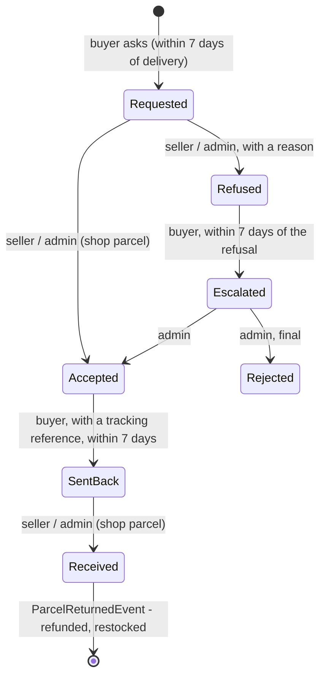

# Returns

Since specs/066 (#107), a buyer can send a delivered parcel back. They ask within 7 days of delivery. The
parcel's seller decides, or an administrator decides for the shop's own parcel. A refused return can be
disputed. Once the parcel is back, the buyer is refunded what they paid for its goods and their tax, and its units return
to the shelf, each exactly once.

The server came in #149 (specs/066) and the storefront screens in #151 (specs/067).

## Where it happens in the storefront

| Who | Page | What they see |
| :-- | :-- | :-- |
| **Buyer** | `/orders/:id`, under each parcel | **Return this parcel** while the window is open, with the last day. Then the return's state in words: waiting, accepted with the send-back form and its deadline, refused with the reason and **Ask the shop to look again**, with staff, rejected for good, on its way back, and the amount refunded. |
| **Seller** | `/shop/sales/:id`, a card above the parcel | The buyer's reason. **Accept** or **Refuse** (a reason is required) while requested, then **Mark as received** once sent back. Nothing to press on an escalated return. |
| **Administrator** | `/admin/orders/:id`, a returns card | Every parcel of the order with a return. For the shop's own parcel, the seller's steps. For an escalated return of anyone's, the final word: **Reject for good**. A seller's parcel that is not escalated is drawn without buttons. |
| **Administrator** | `/admin/returns` (menu: Returns) | The queue by state - escalated first, then requested, sent back, received - oldest first, each row leading to its order. No amounts, because a return carries no currency. |

Accepting and receiving are confirmed in a dialog first, because they cannot be taken back. The pages
decide only what to *offer*: `utils/order/returns.ts` copies each server guard, and the window is the
constant `RETURN_WINDOW_DAYS` (7). If the two ever disagree, the server's 409 is shown in its own words
(specs/067 research D1).

## What people can do

| Who | Can |
| :-- | :-- |
| **Buyer** | Ask to return a whole delivered parcel, with a reason, within `Returns:WindowDays` (7) of its delivery. Escalate a refusal to staff. Record the tracking reference of the parcel they sent back. |
| **Seller** | Accept or refuse, with a reason, a return of their own parcel. Mark it received when it comes back. |
| **Administrator** | Do the same for the shop's own parcels. Have the final word on an escalated return of any parcel. See returns by state (`GET /api/orders/returns?status=Escalated` is the dispute queue). |
| **System** | Refund (Payment) and restock (Inventory) when a return is received. Hold a seller's money while a parcel can still come back. |

## How it works

- **One row per parcel.** A request is one row in `parcel_returns`, which is unique on the parcel. The
  row is inserted with `ON CONFLICT ("ShipmentId") DO NOTHING`, so two requests at once make one row and
  the second gets 409.
- **Each step is one guarded statement.** Every step is an
  `UPDATE parcel_returns ... WHERE "Id" = @id AND "Status" = @from`. The buyer's steps after a decision
  also carry `AND "DecidedAt" > now - window`. The step runs in a transaction with its `stage`: the audit
  entry, the notice and, for "received", the event. A second or late step changes no row and answers 409.
- **Receiving it triggers the refund and the restock.** "Received" computes the refund from the prices the
  order froze: the parcel's lines (the `order_items` of that seller), `UnitPrice × Quantity - discount + TaxAmount` -
  what was paid, after any voucher (specs/069).
  The delivery is not refunded. It publishes `ParcelReturnedEvent(ReturnId, OrderId, ShipmentId, Items,
  Amount, Currency)`.
  - **Payment** (`RefundReturnedParcelConsumer`) records a refund of that amount. The row is tied to the
    return by `refunds.ReturnId`, which is unique. A refund beyond what was paid, or in another currency,
    is refused and logged. Payment is still a stub, so this is a ledger entry.
  - **Inventory** (`RestockReturnedParcelConsumer`) first claims the return in `returned_parcels`
    (`ON CONFLICT DO NOTHING`), then adds the units back to `QuantityOnHand` under the stock lock and
    announces the new availability. It is the eighth path that moves stock.

## Rules and why

1. **Whole parcels only.** This matches whole-order cancellation (specs/039): one refund, one restock, and
   no states per line. Returning part of a parcel is a known limit.
2. **A hold, never a debt.** A seller's part is **due** only once it was delivered more than the window
   ago and no return of it is open. Open means one of these:
   - requested, escalated, or on its way back;
   - accepted or refused, and still inside the window the buyer has to act.

   A **returned** part is no money at all. A return can start only inside the window and money is due only
   after it, so nothing already paid out can come back. *Why:* the issue expected a paid-out part to become
   a debt. Holding the money instead means there are no negative balances and nothing to claw back.
3. **The rule is written twice and tested once.** The balance and the due list read "due" from one LINQ
   projection (`PayoutRepository.Money`). The payout claim writes it in SQL. `The_payout_claims_exactly_what_the_balance_calls_due`
   holds the two together.
4. **The customer pays the return trip.** The refund is goods plus their tax, and the delivery share is not
   refunded. Nothing in the system models return shipping.
5. **A seller answers their own parcel; staff answer the shop's and settle disputes.** An escalated return
   is out of the seller's hands. Returns are `Admin`, like the rest of fulfilment (specs/039).
6. **Lapses close themselves.** An accepted return not sent back within the window, and a refusal not
   escalated within it, stop holding the money. A seller who never answers a request keeps their own money
   held; that is the incentive to answer.
7. **The event carries lines and an amount.** `OrderCancelledEvent` carries neither, but a return is *part*
   of an order: only Order knows which lines were that part and what was paid for them.

## Data

| Table | Service | What |
| :-- | :-- | :-- |
| `parcel_returns` | Order | One per parcel. The columns are: - `Status` (text): `Requested`, `Accepted`, `Refused`, `Escalated`, `Rejected`, `SentBack` or `Received`; - the texts: `Reason`, `DecisionReason`, `TrackingReference`; - the times: `RequestedAt`, `DecidedAt`, `SentBackAt`, `ReceivedAt`; - `RefundAmount`. |
| `refunds.ReturnId` | Payment | Unique where set. The unique index on `OrderId` is now partial (`ReturnId IS NULL`), which keeps one whole-order refund per order. |
| `returned_parcels` | Inventory | One per restocked return, keyed by `ReturnId`. |

## API

| Method | Path | Who |
| :-- | :-- | :-- |
| `POST` | `/api/orders/{id}/shipments/{shipmentId}/return` `{reason}` | the buyer |
| `POST` | `/api/orders/{id}/shipments/{shipmentId}/return/escalate` | the buyer |
| `POST` | `/api/orders/{id}/shipments/{shipmentId}/return/sent` `{trackingReference}` | the buyer |
| `POST` | `/api/orders/sales/{id}/return/accept` · `/refuse` `{reason}` · `/received` | Seller |
| `POST` | `/api/orders/fulfilment/{id}/shipments/{shipmentId}/return/accept` · `/refuse` · `/received` | Admin |
| `GET` | `/api/orders/returns?status=` | Admin |

A parcel's return also appears on the buyer's order (`shipments[].return`) and on the seller's sale
(`return`).

## Messages and notices

- `ParcelReturnedEvent` is published by Order and consumed by Payment and Inventory.
- Notices:
  - `ReturnRequested` and `ReturnSentBack` go to the seller;
  - `ReturnAccepted`, `ReturnRefused` and `ReturnRefunded` go to the buyer.

  The shop's own parcel has no seller to tell.

## Tests

| Where | Proves |
| :-- | :-- |
| `Ecommerce.Order.Tests/ReturnTests` (24) | The request rules: owner, delivered, window, once even at once, reason. Who decides what. Escalation and the final word. Lapses. Sent back. Received with goods plus tax, once. The read models, the queue and the audit trail. The money hold, a final refusal releasing it, and a returned part being no money. The claim agreeing with the balance. |
| `Ecommerce.Payment.Tests/ReturnRefundTests` (5) | Refunded once however delivered. Two parcels refunded separately. Never more than paid, never in another currency. Nothing for an order never charged. Not taken for the order's own refund. |
| `Ecommerce.Inventory.Tests/RestockReturnTests` (4), `AnnouncementTests` | Restocked once however delivered. Two returns of one order. A vanished variant skipped. The availability announced. |
| Bruno `admin-audit/` | The round trip on the shop's parcel through the gateway, with the stock checked coming back over the broker. Also: asking twice is 409, a customer deciding is 403, receiving twice is 409. |
| Vitest `utils/order/returns.test.ts` | What each role is offered in each state, and the window's edges (exactly 7 days is closed, as on the server). |
| Vitest `pages/order`, `shop-sale`, `admin-order`, `admin-returns`, `services/{order,admin}` | What each button sends and to which route, that a reason is required, that an escalated refusal is worded as final, a 409 shown in the server's words, and the queue reading its state from the address. |

## Known limits

- **The sales list has no return badge.** A seller learns of a return from the `ReturnRequested` notice, which links to the sale.
- **Whole parcels only, and no photos.**
- **Insights take a refund off the day the order was paid**, not the day the parcel came back (specs/084), so a past
  period's revenue falls when a return is received.

## History

| Spec | PR | Added |
| :-- | :-- | :-- |
| [066-parcel-returns](../../specs/066-parcel-returns/) | #149 | The return flow, the refund and restock, and the money hold (#107, part 1). |
| [067-return-screens](../../specs/067-return-screens/) | #151 | The storefront screens for the buyer, the seller and staff, and the `/admin/returns` queue (#107, part 2). |
