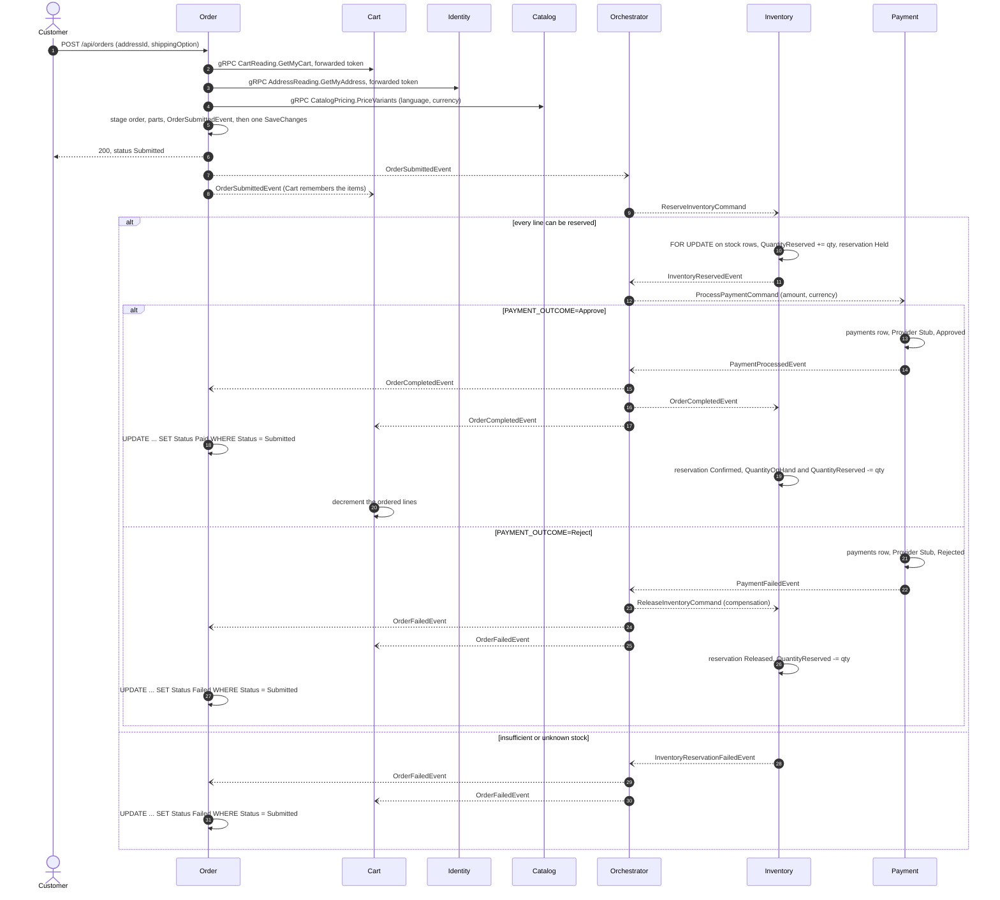
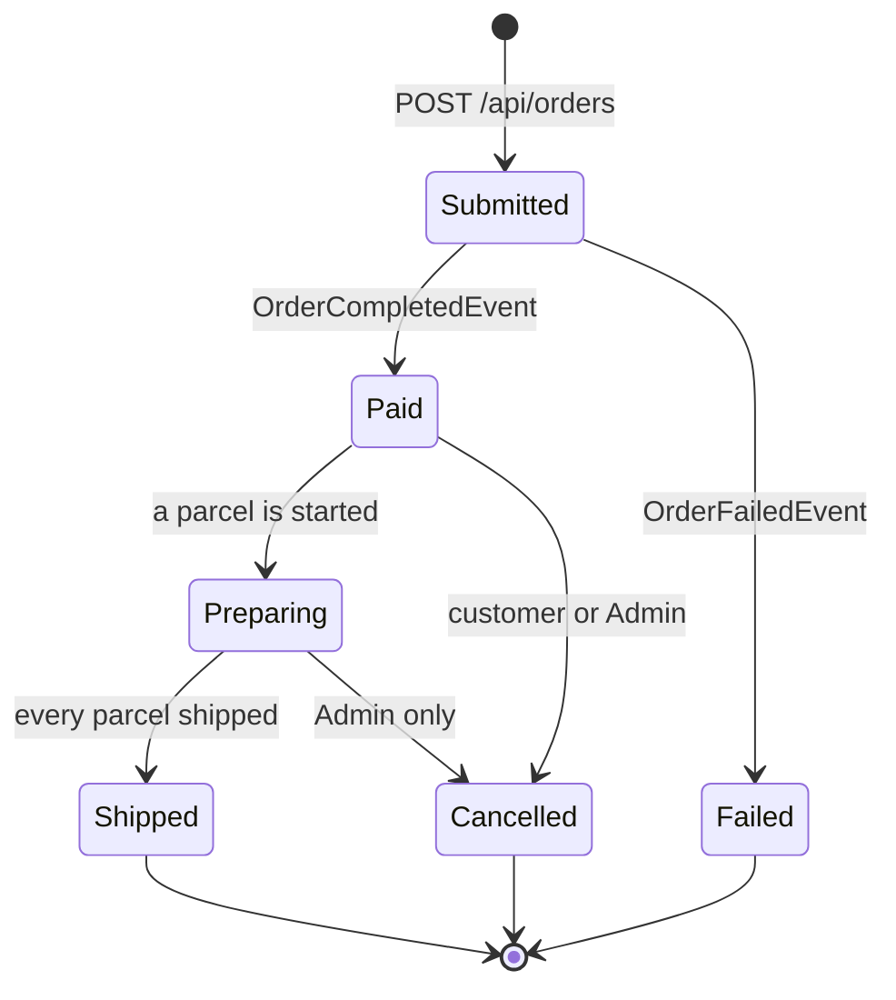

# Shopping and checkout

A signed-in customer keeps a cart in the Cart service, asks Order what checking it out would cost, and places the order by naming only a delivery address and a delivery option. Everything else is decided by the service that owns it: the items come from the cart, the prices and names from Catalog, the address from Identity, and the customer's identity from the access token. Once the order is written, a saga in the Orchestrator reserves the stock in Inventory, takes payment through a stub Payment service, and settles the order to `Paid` or `Failed`, releasing the stock on a declined payment. Two ideas matter most. First, the client asserts nothing the server owns, so a price, a user id or an item list cannot be smuggled in. Second, every step is an atomic write with its outgoing message (transactional outbox) and every consumer is idempotent, so a redelivered or reordered message changes nothing twice.

What happens after `Paid` (parcels, cancellation, delivery) is in [fulfilment-and-delivery.md](fulfilment-and-delivery.md).

## What people can do

| Role | Capabilities |
| :-- | :-- |
| Anyone | Read the delivery options and their prices (`GET /api/orders/shipping-options`). |
| Customer (any signed-in user) | Keep one cart: add a variant, change a quantity, remove a line, empty it. See it priced at today's catalogue prices. Ask for a checkout quote. Place an order to one of their addresses (or their default) with a delivery option. List their own orders and open one, polling until it settles. |
| Seller | Everything a customer can do: a seller also holds the `Customer` role (specs/027). |
| Moderator | Nothing specific to checkout beyond what any signed-in user can do. |
| Administrator | Read any payment (`GET /api/payments`, `/api/payments/{orderId}`) and the reservations Inventory holds for an order (`GET /api/reservations/{orderId}`). |
| System | The Orchestrator drives the saga. Inventory reserves, confirms, releases and expires stock. Payment decides the outcome (stub). Order settles the order. Cart removes what was ordered once the order completes. |

## How it works

### The cart

The Cart service holds one cart per customer (`carts.UserId` is unique), keyed by the user id from the validated token; no route or body names a user. A line is a product id, an optional variant id and a quantity - nothing else. The cart stores no price and no name: when the cart is read, Cart asks Catalog over gRPC (`CatalogPricing.DescribeVariants`) for the current name and price in the shopper's language and currency, and returns them as an `EstimatedTotal` with a per-line `Status` (`Available`, `NotForSale`, `NoLongerAvailable`, `PriceUnavailable`, `NotSoldInCurrency`). Nothing the cart returns is ever used to charge.

A line is addressed by its sellable id (`CartLine.SellableId` = `VariantId ?? ProductId`), so two shapes of one product are two lines. `PUT /api/cart/items/{productId}` and `DELETE /api/cart/items/{productId}` take that sellable id, which since specs/020 is a variant id.

### The quote and the order

`GET /api/orders/quote?addressId=&shippingOption=` and `POST /api/orders` with body `{ "addressId": guid | null, "shippingOption": "standard" }` both call `CheckoutPricing.PriceAsync`, which:

1. reads the caller's cart from Cart over gRPC (`CartReading.GetMyCart`), forwarding the caller's own `Authorization` header - the request message is empty;
2. reads the address from Identity over gRPC (`AddressReading.GetMyAddress`), again with the forwarded token; a null `addressId` means the default address;
3. resolves the delivery option from Order's configuration (`Shipping:Options`) and its price in the request's currency;
4. asks Catalog to price the variants (`CatalogPricing.PriceVariants`) in the request's language and currency;
5. computes the total in named parts with `OrderTotals.Compute`, using the tax rate for the destination country (`Tax:Rates`, falling back to `Tax:DefaultRate`).

The quote returns the result and stages nothing. `SubmitOrderCommandHandler` turns the same result into an order: it copies each line's product id, variant id, SKU, option summary, name, unit price, line tax, seller id and shop name onto `order_items`; freezes a copy of the address, the option's code, name and price, the currency, the language, the tax rate and the commission rate (`Marketplace:CommissionRate`) onto `orders`; writes one `order_shipments` row per seller on the order, plus one for the shop's own goods when it holds any; stages `OrderSubmittedEvent` and an audit entry; and saves once. The response is the order in status `Submitted`.

The request's language comes from `?lang=` then `Accept-Language` (`IRequestLanguage`), and its currency from `?currency=` then `X-Currency` (`IRequestCurrency`). The configured currencies are `VND` (0 decimals, the default) and `USD` (2 decimals).

### The saga

The Orchestrator's `OrderStateMachine` correlates every message on `OrderId` and persists its instance (`OrderStateData`, table `order_state_data`) with optimistic concurrency. It publishes through its own transactional outbox. When the saga finalizes, the instance is removed (`SetCompletedWhenFinalized`), so `order_state_data` holds only checkouts still in flight.



The saga has three states of its own: `Submitted`, `InventoryReservedState` and, since specs/053, `PaymentTimedOut`. **An order waits for Payment at most `ORCHESTRATOR_PAYMENT_TIMEOUT_SECONDS` (600)**, shorter than Inventory's hold: then the saga releases the stock and fails the order, and a payment approved afterwards is refunded (`RefundPaymentCommand`, once, by `refunds.OrderId`) - so the shop is never paid for stock it put back on the shelf (#123). The timer is `PaymentTimeoutSweeper`, reading the saga table; see [the roadmap](../architecture/saga-orchestration-roadmap.md#-a-payment-that-does-not-answer-completed-specs053). `OrderFailedEvent` is published on both failure branches, so Order records a reason for a stock failure as well as for a declined payment. Inventory has no confirm command: it treats `OrderCompletedEvent` as its confirmation signal (specs/001 research D2).

### Settlement

Order's `OrderCompletedConsumer` and `OrderFailedConsumer` send `CompleteOrderCommand` and `FailOrderCommand`. Both call `OrderRepository.TrySettleAsync`, one guarded statement:

```sql
UPDATE orders SET "Status" = @settled, "FailureReason" = @reason, "UpdatedAt" = @at
 WHERE "Id" = @orderId AND "Status" = 'Submitted'
```

One row changed means this delivery settled the order; its notification and audit entry are staged in the same transaction. Zero rows means the order was already settled (a redelivery, logged at Information) or is not held here (logged at Warning and discarded, not retried). A successful checkout settles to `Paid`, not `Completed` (specs/011): `OrderStatus.Completed` stays in the enum so old rows parse, and every read reports it as `Paid`.



`Pending` and `StockReserved` exist in `OrderStatus` and are never written. The transitions after `Paid` are described in [fulfilment-and-delivery.md](fulfilment-and-delivery.md).

### Removing what was ordered from the cart

Cart consumes three events and keeps one `checkout_outcomes` row per order. `OrderSubmittedEvent` records the user and items; `OrderCompletedEvent` marks the outcome `Completed`; `OrderFailedEvent` marks a still-pending outcome `Failed` and never touches the cart. Each event locks the row (`FOR UPDATE`), and whichever of submission and completion arrives second applies the removal, guarded by `Applied`. The removal is a decrement of the ordered quantity, not "empty the cart", and it finds the line by the **variant** bought: `OrderedItem.From` carries `OrderItemDto.VariantId`, matched against `CartLine.SellableId` (specs/052 - by product, two shapes of one lens meant the decrement could land on the one not bought, #122). An item naming no variant (stored before that, or from an Order older than specs/020) is the product's first variant, whose id is the product id.

## Rules and guarantees

1. **The checkout body carries only `addressId` and `shippingOption`.** Items come from the cart, prices and names from Catalog, the user from the token. *Why:* issue #18 - a product listed at 40,000,000 was bought for 1 because the price came from the request body. `ProductName` and `UnitPrice` were removed from `OrderItemRequest` rather than ignored, because a field the server accepts and discards reads as supported (`SubmitOrderCommand.cs`).
2. **No command takes a user id.** `SubmitOrderCommand` reads the caller from `ICurrentUser`. *Why:* Constitution principle IV (identity from the token); a `UserId` in the body let anybody order as anybody.
3. **Cart and Identity are read with the caller's forwarded token, never with a user id in the request.** *Why:* a `GetCart(userId)` would let anything on the network read anybody's cart by naming them - the `UserId`-in-the-body defect one hop further in (specs/010 research D4). Cart validates the forwarded token itself (`CartReadingService`, `[Authorize]`).
4. **Somebody else's address id is a 404, indistinguishable from a missing one.** No address and no default is a 409. *Why:* a distinct answer would confirm that the id exists.
5. **The quote and the order are priced by the same code, `CheckoutPricing`.** *Why:* issue #38 - if the quote were computed anywhere else, a customer could agree to one number and pay another. `CheckoutQuoteTests.The_quote_is_exactly_what_the_same_choices_then_charge` fails if they differ.
6. **Every refusal happens before anything is staged.** Pricing runs before the order is added, so a refused checkout leaves no row, no event and no reservation. *Why:* all-or-nothing by construction, and a slow dependency must not widen the window between staging and commit (`SubmitOrderCommandHandler.cs`).
7. **Catalog, Cart and Identity are synchronous dependencies of checkout, and their absence is a 503.** Each gRPC client tries 3 times with a 5-second deadline and 200 ms / 1 s backoff, then throws `DependencyUnavailableException`. *Why:* bounded waiting - retrying forever turns an outage into requests that never return (specs/009 research D6). This is a deliberate cost: before specs/009, orders were placed at whatever price the client claimed.
8. **Prices exclude tax; tax follows the destination and is rounded half away from zero, per line and on delivery, then summed.** *Why:* ADR-002 keeps every existing catalogue price's meaning and lets the parts sum; `MidpointRounding.AwayFromZero` because .NET's default banker's rounding surprises anyone checking a receipt (specs/012 research D1, D3). Per-line rounding may differ from rounding the sum; the stored per-line tax is what was charged and is not "corrected".
9. **The total is stored in named parts, and the database refuses a total whose parts do not add up.** `CK_orders_parts_sum_to_total`: `"Subtotal" IS NULL OR "Subtotal" + COALESCE("ShippingPrice", 0) + "TaxTotal" - "DiscountTotal" = "TotalAmount"`; `CK_orders_discount_not_negative` keeps `DiscountTotal` at 0 or more (it was `CK_orders_no_discount_yet`, holding it at 0, until [vouchers](vouchers.md) made one); `CK_orders_tax_rate_range` keeps the rate in `[0, 1)`. *Why:* an invariant that matters is a constraint, not only code. The `IS NULL` escape lets an image from before specs/012 still insert orders (expand/contract rule).
10. **Amounts are rounded to the currency's minor unit, and nothing is converted.** Dong has no decimals. A variant nobody priced in the requested currency refuses the checkout with 409 `Not sold in VND: ...`; a delivery option not priced in it is not offered (400 if chosen). *Why:* falling back would sell a 40,000,000 dong camera for 1,600 dong or charge $40,000,000 for it (specs/022).
11. **An order freezes its words, its money and its terms.** Name, SKU, option summary, unit price, line tax, seller id and shop name on each line; address copy, delivery option, currency, language, tax rate and commission rate on the order. *Why:* an order is a record of a purchase, not a view of the catalogue - a price change, a rename or an address edit next week must not rewrite it. `verify-saga.sh` edits the address after ordering and asserts the order still shows the old recipient.
12. **The currency travels with the amount to the charge.** `OrderSubmittedEvent.Currency` is stored on the saga instance and relayed into `ProcessPaymentCommand`, so `payments.Currency` says what `Amount` is. The saga relays; it never re-derives. *Why:* an amount with no currency is what specs/022 ended.
13. **Stage, publish, then save once.** The order row, its parts, the `OrderSubmittedEvent` outbox message and the audit entry commit in one transaction. *Why:* publishing after `SaveChangesAsync` broke atomicity twice in this project's history (CLAUDE.md, transactional outbox).
14. **The saga publishes through its own outbox.** *Why:* issue #15. Without `UseBusOutbox()`, `ReserveInventoryCommand` reached the broker before the saga instance was committed; on a cold start `InventoryReservedEvent` came back in 0.29 s while the instance was still 5.4 s from committing, found no instance and was discarded silently. Four orders stayed `Submitted` with their stock held between 2026-09-03 and 2026-09-17. A reply that finds no instance is now logged at Warning (`MissingInstance` in `OrderStateMachine`).
15. **Settlement is one guarded `UPDATE ... WHERE "Status" = 'Submitted'`.** *Why:* the broker redelivers as normal operation, and a load-then-check would reopen the race the guard closes (`OrderRepository.TrySettleAsync`). It also means a failure notice can never unsettle a paid order, whichever order they arrive in.
16. **Settling from a consumer joins the consumer's transaction.** MassTransit's consumer outbox has already opened a transaction on the `OrderDbContext` when the consumer runs; `TrySettleAsync` checks `Database.CurrentTransaction` and joins it instead of beginning a second one. *Why:* specs/042 added a `stage` callback that opened its own transaction, which threw "already in a transaction" inside a consumer - every order stayed `Submitted` while every unit test passed, because the tests sent the command outside a consumer. `NotificationTests.Settling_inside_a_consumer_transaction_joins_it` opens the transaction the way MassTransit does.
17. **Stock is reserved under a row lock, in ascending id order, all or nothing.** `StockRepository.GetForUpdateAsync` takes `SELECT ... FOR UPDATE` on the stock rows ordered by id; lines for the same variant are summed first. *Why:* no interleaving may let reserved exceed on hand (checked again by `ck_stock_items_reserved_within_on_hand`); a fixed lock order prevents deadlock between two orders holding the same two products in opposite order; summing stops "3 then 4" passing against a stock of 5 (specs/001 research D1).
18. **A reservation is idempotent twice over.** An order that already holds reservations is treated as a duplicate delivery, and `stock_reservations` is unique on `(OrderId, ProductId)`. Every settlement moves a reservation only from `Held`. *Why:* double-deducting stock is invisible until somebody counts the warehouse (specs/001 research D3).
19. **Nothing sells against Catalog's availability.** The storefront's "in stock" is a read model fed by `StockAvailabilityChangedEvent`; the decision is Inventory's row lock. Every handler that moves stock announces availability. *Why:* a read model fed by messages is seconds behind by design (specs/004).
20. **A hold expires, and the saga stops waiting before it does.** A reservation still `Held` after `Inventory:ReservationTtlMinutes` (default 15) is returned to the shelf by `ReservationExpirySweeper` and marked `Expired`. *Why:* a saga that dies mid-flight would otherwise remove sellable stock permanently (specs/001 research D4). The saga's payment timeout (specs/053) is shorter by more than one sweep, and the orchestrator refuses to start otherwise - *why:* a payment taken after the hold expired would be for stock back on the shelf.
21. **Payment is a stub that moves no money, and says so three ways.** `Provider = "Stub"` on every payment row, a warning logged at startup, and `/health` reporting `provider` and `configuredOutcome`. The outcome comes from `PAYMENT_OUTCOME` (`Approve` or `Reject`), resolved once at startup; any other value stops the service. `payments.OrderId` is unique, so one order has at most one payment. *Why:* the stub must not be mistaken for a real integration; `StubPaymentGateway` is the seam a real provider replaces (specs/002).
22. **The cart is changed only when the order completes, and only once.** *Why:* the saga's `Failed` is terminal; removing lines at submission would leave a customer whose card was declined with an empty cart and a dead order (specs/010 research D1). Whichever of `OrderSubmittedEvent` and `OrderCompletedEvent` arrives second applies the removal, because nothing orders delivery across message types - designing only for the likely order is the silent shape of issue #15 (research D3). `Applied` under `FOR UPDATE` makes a redelivery a no-op.
23. **Removal is a decrement, of the variant bought.** *Why:* anything the customer added while the order was in flight must survive, and so must a sibling variant of what was bought.
24. **A consumer's class name is its queue name.** Order uses the endpoint prefix `OrderSvc` and Cart `CartSvc`. *Why:* Inventory and Order once both had `OrderCompletedConsumer`, bound to one queue, and competed for the event: the order settled while the stock stayed held.

## Data

| Table | Service | Role in this feature |
| :-- | :-- | :-- |
| [`carts`](../reference/data-model.md#carts) | Cart | One per customer, unique on `UserId`. |
| [`cart_lines`](../reference/data-model.md#cart_lines) | Cart | Product, optional variant, quantity (> 0); unique on `(CartId, ProductId, VariantId)` with nulls not distinct. No price. |
| [`checkout_outcomes`](../reference/data-model.md#checkout_outcomes) | Cart | One row per order: user, items (JSON), outcome, `Applied`. |
| [`orders`](../reference/data-model.md#orders) | Order | Status, total in parts, frozen address (`ShipTo_*` columns), option, currency, language, tax and commission rates. |
| [`order_items`](../reference/data-model.md#order_items) | Order | Frozen lines: name, SKU, option summary, unit price, tax, variant, seller id and name. |
| [`order_shipments`](../reference/data-model.md#order_shipments) | Order | Written at checkout, one per seller on the order plus one for the shop's own goods if any; see [fulfilment-and-delivery.md](fulfilment-and-delivery.md). |
| [`order_state_data`](../reference/data-model.md#order_state_data) | Orchestrator | The in-flight saga instance: state, amount, currency, failure reason, payment id. |
| [`stock_items`](../reference/data-model.md#stock_items) | Inventory | `QuantityOnHand` and `QuantityReserved` per variant; CHECK constraints keep on hand non-negative and reserved within on hand. |
| [`stock_reservations`](../reference/data-model.md#stock_reservations) | Inventory | One per order and variant: `Held`, `Confirmed`, `Released` or `Expired`, with `ExpiresAt`. |
| [`payments`](../reference/data-model.md#payments) | Payment | One per order: amount, currency, provider (`Stub`), status. |

## API

All through the gateway at `:5000`. Full list: [../reference/api.md](../reference/api.md).

| Method | Path | Who |
| :-- | :-- | :-- |
| `GET` | `/api/cart` | signed in |
| `POST` | `/api/cart/items` | signed in |
| `PUT` | `/api/cart/items/{productId}` | signed in |
| `DELETE` | `/api/cart/items/{productId}` | signed in |
| `DELETE` | `/api/cart` | signed in |
| `GET` | `/api/addresses` (and the rest of the address book) | signed in |
| `GET` | `/api/orders/shipping-options` | anyone |
| `GET` | `/api/orders/quote` | signed in |
| `POST` | `/api/orders` | signed in |
| `GET` | `/api/orders` | signed in |
| `GET` | `/api/orders/{id}` | signed in (own orders only; otherwise 404) |
| `GET` | `/api/stock/{productId}` | anyone |
| `GET` | `/api/reservations/{orderId}` | Admin |
| `GET` | `/api/payments` | Admin |
| `GET` | `/api/payments/{orderId}` | Admin |

Checkout outcomes: 200 with the `Submitted` order; 400 for an unknown or missing delivery option, or one not offered in the currency; 404 for an address that is not the caller's; 409 for an empty cart, no address and no default, a variant not priced in the currency, or a variant not for sale; 503 when Catalog, Cart or Identity cannot be reached.

## Messages

See [../reference/messages.md](../reference/messages.md) and [../reference/grpc.md](../reference/grpc.md).

| Message | Published by | Consumed by |
| :-- | :-- | :-- |
| `OrderSubmittedEvent` (order, user, total, items with variant ids, currency) | Order | Orchestrator (saga), Cart (`OrderSubmittedConsumer`) |
| `ReserveInventoryCommand` | Orchestrator | Inventory (`ReserveInventoryConsumer`) |
| `InventoryReservedEvent` / `InventoryReservationFailedEvent` | Inventory | Orchestrator |
| `ProcessPaymentCommand` (amount, currency) | Orchestrator | Payment (`ProcessPaymentConsumer`) |
| `PaymentProcessedEvent` / `PaymentFailedEvent` | Payment | Orchestrator |
| `ReleaseInventoryCommand` (compensation) | Orchestrator | Inventory (`ReleaseInventoryConsumer`) |
| `OrderCompletedEvent` | Orchestrator | Order, Inventory and Cart (each an `OrderCompletedConsumer`, on separate queues) |
| `OrderFailedEvent` | Orchestrator | Order and Cart (`OrderFailedConsumer`) |
| `StockAvailabilityChangedEvent` | Inventory | Catalog |
| `UserNotificationRequested`, `AuditEntryRecorded` | Order, Inventory, Payment | Activity |

| gRPC call | Served by | Called by | Used for |
| :-- | :-- | :-- | :-- |
| `CartReading.GetMyCart` | Cart | Order | The items, with the caller's token forwarded |
| `AddressReading.GetMyAddress` | Identity | Order | The destination, with the caller's token forwarded |
| `CatalogPricing.PriceVariants` | Catalog | Order | Price, name, SKU, option summary, sellability, seller id and name |
| `CatalogPricing.DescribeVariants` | Catalog | Cart | Showing the cart at today's prices |

Notifications on settlement: the buyer gets `OrderPaid` or `OrderFailed`; each seller with a parcel on a paid order gets `NewSale`.

## Storefront

| Path | What it does |
| :-- | :-- |
| [client/src/components/product/add-to-cart/index.tsx](../../client/src/components/product/add-to-cart/index.tsx) | Adds the chosen variant; needs an account because the cart is kept by the Cart service. |
| [client/src/pages/cart/index.tsx](../../client/src/pages/cart/index.tsx) | The cart page (`/cart`). |
| [client/src/components/cart/cart-lines/index.tsx](../../client/src/components/cart/cart-lines/index.tsx) | Lines with pictures; every change is sent at once and the cart is re-read, so numbers are always the server's. |
| [client/src/utils/cart/index.ts](../../client/src/utils/cart/index.ts) | Why a line cannot be bought, as a translation key. |
| [client/src/pages/checkout/index.tsx](../../client/src/pages/checkout/index.tsx) | Checkout (`/checkout`): shows Order's own quote, then places the order. |
| [client/src/components/checkout/address-choice/index.tsx](../../client/src/components/checkout/address-choice/index.tsx) | Chooses an address, or adds one in a dialog and chooses it on save. |
| [client/src/components/checkout/delivery-choice/index.tsx](../../client/src/components/checkout/delivery-choice/index.tsx) | The delivery options and prices, as Order reports them. |
| [client/src/components/order/order-totals/index.tsx](../../client/src/components/order/order-totals/index.tsx) | The named parts of a total, in the order's own currency. |
| [client/src/pages/orders/index.tsx](../../client/src/pages/orders/index.tsx) | The customer's orders, newest first (`/orders`). |
| [client/src/pages/order/index.tsx](../../client/src/pages/order/index.tsx) | One order (`/orders/:id`); polls every `ORDER_POLL_MS` (1 s) for up to `ORDER_POLL_LIMIT_MS` (30 s) while it is `Submitted`. |
| [client/src/components/order/order-status/index.tsx](../../client/src/components/order/order-status/index.tsx) | The order's state in a sentence, including "still settling". |
| [client/src/hooks/cart/index.ts](../../client/src/hooks/cart/index.ts), [client/src/hooks/order/index.ts](../../client/src/hooks/order/index.ts) | TanStack Query hooks: `useCart`, `useCheckoutQuote`, `usePlaceOrder`, `useOrder`, `useMyOrders`. |
| [client/src/services/cart/index.ts](../../client/src/services/cart/index.ts), [client/src/services/order/index.ts](../../client/src/services/order/index.ts) | Axios service classes over the gateway. |

## Tests

Server tests run against a real PostgreSQL (`DB_PASSWORD=... dotnet test` in `server/`).

| Test | What it proves |
| :-- | :-- |
| [`CheckoutQuoteTests`](../../server/tests/Ecommerce.Order.Tests/CheckoutQuoteTests.cs) | The quote equals what the same choices then charge; a quote places and publishes nothing; empty cart and unknown option are refused the same way as checkout. |
| [`CheckoutShippingTests`](../../server/tests/Ecommerce.Order.Tests/CheckoutShippingTests.cs) | Address and option are frozen and the total is items plus delivery; no address means the default; an address Identity does not find is 404 and places nothing; no address and no default is 409. |
| [`OrderTotalsTests`](../../server/tests/Ecommerce.Order.Tests/OrderTotalsTests.cs) | Half a cent rounds away from zero, not to even; tax per line and on delivery; the parts always sum; an impossible rate is refused. |
| [`TotalsPersistenceTests`](../../server/tests/Ecommerce.Order.Tests/TotalsPersistenceTests.cs) | Two destinations, two taxes; an unlisted country gets the default rate; stored parts sum; the database refuses a total whose parts do not add up. |
| [`OrderCurrencyTests`](../../server/tests/Ecommerce.Order.Tests/OrderCurrencyTests.cs) | The currency is frozen; Catalog is asked in the request's currency; a dong total has no fraction; an unpriced variant or option refuses the checkout; the currency travels to the saga. |
| [`OrderLanguageTests`](../../server/tests/Ecommerce.Order.Tests/OrderLanguageTests.cs) | Catalog is asked in the request's language, and the order keeps those words. |
| [`VariantCheckoutTests`](../../server/tests/Ecommerce.Order.Tests/VariantCheckoutTests.cs) | The line freezes the variant, SKU and options; the variant travels with the event; an unsellable variant refuses the whole order. |
| [`SettlementTests`](../../server/tests/Ecommerce.Order.Tests/SettlementTests.cs) (Order) | Ten completion notices settle once; a failure cannot unsettle a paid order; an unknown order is discarded; an overlong reason is truncated. |
| [`NotificationTests`](../../server/tests/Ecommerce.Order.Tests/NotificationTests.cs) | Paid tells the buyer and each seller once; `Settling_inside_a_consumer_transaction_joins_it`; failed tells only the buyer. |
| [`ReserveStockTests`](../../server/tests/Ecommerce.Inventory.Tests/ReserveStockTests.cs) | Duplicate lines are summed; all or nothing; a replay moves stock once; 100 concurrent orders against 10 units sell exactly 10. |
| [`SettlementTests`](../../server/tests/Ecommerce.Inventory.Tests/SettlementTests.cs) (Inventory) | Release and confirm are idempotent; a release after a confirmation changes nothing; expiry reclaims only past-due holds. |
| [`AnnouncementTests`](../../server/tests/Ecommerce.Inventory.Tests/AnnouncementTests.cs) | Every stock-moving handler announces availability. |
| [`ChargeOrderTests`](../../server/tests/Ecommerce.Payment.Tests/ChargeOrderTests.cs), [`ConcurrentInsertRecoveryTests`](../../server/tests/Ecommerce.Payment.Tests/ConcurrentInsertRecoveryTests.cs) | Every payment records its provider; fifty simultaneous requests record one payment; a replay still replies; an unknown `PAYMENT_OUTCOME` fails at startup. |
| [`CheckoutOutcomeTests`](../../server/tests/Ecommerce.Cart.Tests/CheckoutOutcomeTests.cs) | Completion before or after submission removes the ordered lines once; what was added since survives; a failed order leaves the cart alone; a stray failure cannot undo a completion. |
| [`VariantLineTests`](../../server/tests/Ecommerce.Cart.Tests/VariantLineTests.cs) | Two shapes of one product are two lines; a pre-variant line is still addressed by its product id; a completed order takes out the variant it bought and not its sibling, and an item or line naming no variant falls back to the product (specs/052). |
| [client `pages/cart/index.test.tsx`](../../client/src/pages/cart/index.test.tsx) | Quantity changes and removal are sent for the variant the line belongs to. |
| [client `pages/checkout/index.test.tsx`](../../client/src/pages/checkout/index.test.tsx) | A customer with no address adds one in place and the order is priced to it. |

**End to end:** [`.github/scripts/verify-saga.sh`](../../.github/scripts/verify-saga.sh) is the only check that sees between services. It places a real order through the cart with a real customer token, sends fabricated prices, names and a foreign user id in both the add-to-cart and checkout bodies, recomputes the expected total independently (catalogue price, delivery, tax at the stored rate rounded to the currency's minor unit), follows the order to `Paid` or `Failed`, and asserts on `QuantityOnHand` **and** `QuantityReserved`, the cart after settlement, and the amount Payment was asked for. It runs whichever branch Payment reports; CI runs both (`saga-e2e` job, Payment restarted in between).

**Bruno:** [`bruno/cart/`](../../bruno/cart/) and [`bruno/order/`](../../bruno/order/) (checkout, quote, quotes and options in dollars, a dong order stays in dong); negative cases in [`bruno/security-checks/`](../../bruno/security-checks/) (checkout without a delivery option is 400, unknown address is 404, another customer's order is 404, cart without a token is 401, negative quantity is 400).

## Known limits

- **Payment is a stub.** It approves or rejects according to `PAYMENT_OUTCOME` and moves no money. A real provider is deliberately deferred; `StubPaymentGateway` is the seam.
- **One running Payment exercises one branch.** The outcome is resolved at startup, so both branches need two runs with a restart in between.
- **Discounts come from vouchers only** ([vouchers](vouchers.md), specs/069). No automatic sale prices and no screens yet.
- **The Orchestrator has no `/health` endpoint** ([#115](https://github.com/jessiicamaru/e-commerce-asp-dotnet-practice/issues/115)). It is the one service nothing can probe, so an order stuck in `Submitted` usually points at it.
- **Checkout depends synchronously on Catalog, Cart and Identity.** Any one being down refuses orders with 503.
- **A shopper sees `Submitted` for the seconds before settlement.** The order page polls for up to 30 s.
- **Orders from before specs/012 and specs/022** have no stored parts and no currency; they are left null rather than invented.
- **One email per order, so far**: the confirmation when it is paid (specs/060, [email](email.md)). Shipping and cancellation are told in the app only.
- **Every `verify-saga.sh` and Bruno run creates a product and does not remove it** ([#118](https://github.com/jessiicamaru/e-commerce-asp-dotnet-practice/issues/118)); `server/seed/clean-test-debris.py` cleans up.

## History

| Spec | PR | What it added |
| :-- | :-- | :-- |
| [001-inventory-reservations](../../specs/001-inventory-reservations/) | - (commit `551e856`) | Inventory service: reservations under `FOR UPDATE`, confirm on `OrderCompletedEvent`, release, expiry sweeper. |
| [002-payment-service](../../specs/002-payment-service/) | #1 | The stub Payment service; the saga runs to completion; one payment per order. |
| [003-order-lifecycle](../../specs/003-order-lifecycle/) | #3 | Order settles on the saga's outcome with a guarded update; owner-scoped order reads. |
| [004-stock-single-source](../../specs/004-stock-single-source/) | #5 | Inventory owns stock; Catalog keeps availability as a read model. |
| [007-saga-e2e-verification](../../specs/007-saga-e2e-verification/) | #13 | `verify-saga.sh` and the `saga-e2e` CI job; the Orchestrator's outbox fix for the cold-start stall (#15). |
| [009-catalog-owns-price](../../specs/009-catalog-owns-price/) | #24 | Prices and names from Catalog over gRPC (h2c, second port); fixes #18. |
| [010-customer-cart](../../specs/010-customer-cart/) | #25 | The Cart service; checkout reads the cart with the forwarded token; removal on completion. |
| [011-order-shipping](../../specs/011-order-shipping/) | #31 | Address from Identity over gRPC, delivery options, `Paid` instead of `Completed`, staff fulfilment. |
| [012-order-totals](../../specs/012-order-totals/) | #32 | Totals in named parts, tax by destination, the sum CHECK constraint (ADR-002). |
| [013-observability](../../specs/013-observability/) | #33 | Traces and logs across the checkout in Seq; saga transitions and missing instances logged. |
| [017-storefront-cart](../../specs/017-storefront-cart/) | #47 | Storefront cart and address book. |
| [018-storefront-checkout](../../specs/018-storefront-checkout/) | #48 | Storefront checkout, order page and history; the checkout quote (#38). |
| [020-product-variants](../../specs/020-product-variants/) | #57 | Variants are what is bought, priced, reserved and frozen on the line. |
| [021-internationalisation](../../specs/021-internationalisation/) | #58 | Orders freeze the language they were placed in. |
| [022-multi-currency-prices](../../specs/022-multi-currency-prices/) | #59 | Two price lists, no conversion; currency frozen and carried to the payment. |
| [034-seller-sales](../../specs/034-seller-sales/) | #77 | The seller id frozen on each line at checkout. |
| [035-seller-shipments](../../specs/035-seller-shipments/) | #79 | Checkout writes one shipment part per seller plus the shop's. |
| [036-parcel-shop-names](../../specs/036-parcel-shop-names/) | #80 | The shop name frozen on each line. |
| [037-seller-payouts](../../specs/037-seller-payouts/) | #81 | Commission rate and each part's earnings frozen at checkout. |
| [041-audit-log](../../specs/041-audit-log/) | #93 | Audit entries for placing, paying and failing an order. |
| [042-in-app-notifications](../../specs/042-in-app-notifications/) | #94 | Buyer and seller notices on settlement; the consumer-transaction fix in `TrySettleAsync`. |
