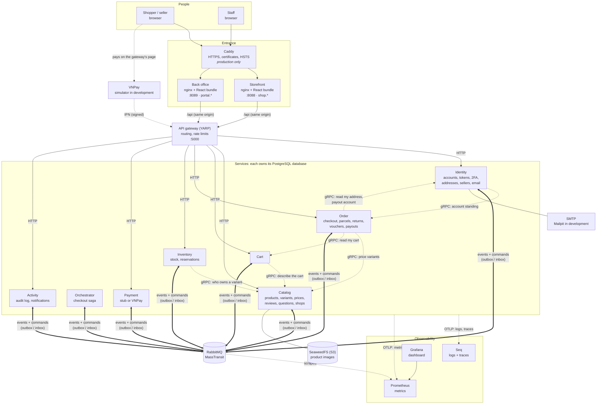
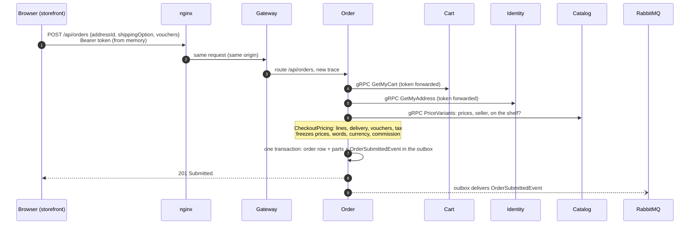
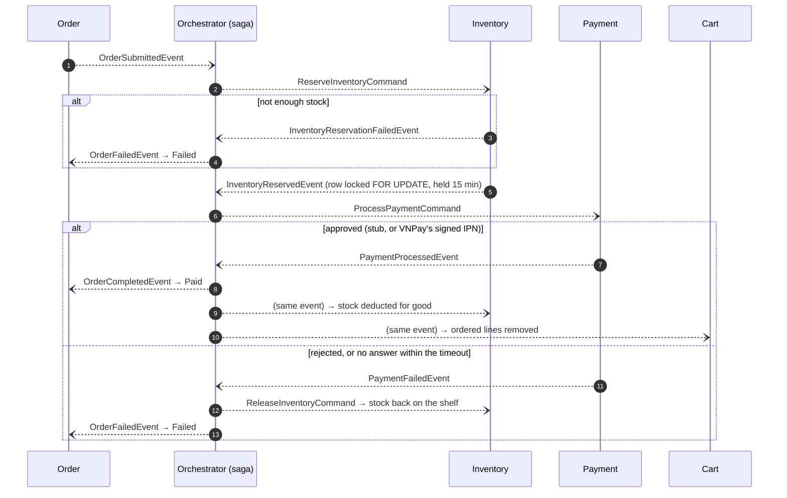

# Architecture overview

The whole system on one page: what runs, how a request travels, and how a message travels. Each part links to
where it is explained in full. For what the shop *does*, start with the [project overview](project-overview.md); for
why it is built this way, the [architecture decisions](../architecture/) (ADR-001 to ADR-004).

## The system

Solid arrows are HTTP, dotted arrows labelled gRPC are synchronous service-to-service calls, and the thick arrows are
messages through RabbitMQ. Caddy exists only in production ([specs/141](../../specs/141-production-https/)). In
development the browser reaches each app's nginx directly.

| Part | What it is | Read |
| :-- | :-- | :-- |
| Storefront, back office | Two React apps from one npm workspace. Each is served by its own nginx, which forwards `/api` to the gateway: one origin per app, no CORS. Staff work only in the back office, on an origin of its own | [ADR-003](../architecture/adr-003-storefront-and-back-office.md), [storefront](../architecture/storefront.md), [back office](../architecture/back-office.md) |
| API gateway | YARP. Routes `/api/<area>` to a service, rate-limits sign-in and email, and starts every trace | [microservices design §4](../architecture/microservices-design.md) |
| Eight services | Clean Architecture each (Domain → Application → Infrastructure → WebApi), each with its own PostgreSQL. CQRS through MediatR | [microservices design §2](../architecture/microservices-design.md) |
| gRPC | Six synchronous edges, all for an answer needed *now*: a price, a cart, an address, an owner, an account's standing. The customer's token is forwarded, so the callee knows who is asking | [service-to-service communication](../architecture/service-to-service-communication.md) |
| RabbitMQ | Everything else between services is a message, written to the sender's **outbox** in the same transaction as its change and recorded in the receiver's **inbox**, so nothing is lost or applied twice | [reliable messaging](../architecture/reliable-messaging-and-outbox-pattern.md) |
| Orchestrator | The checkout saga: reserve stock, charge, settle or compensate | [saga](../architecture/saga-orchestration-roadmap.md) |
| Seq, Prometheus, Grafana | One trace per checkout across HTTP, gRPC and the broker. Metrics and a provisioned dashboard | [observability](../guides/observability.md) |

## How a request travels: placing an order

The price, the address and the cart come from their owners at that moment, never from the request body: a request
that named its own price was how a 40,000,000 VND camera was once bought for 1
([specs/009](../../specs/009-catalog-owns-price/)). The user id comes from the token, never the body.

## How a message travels: the checkout saga

Every arrow is a message written to the sender's outbox inside the transaction that made its change. Every receiver
records it in its inbox, so a redelivery is recognised and dropped ([specs/149](../../specs/149-inbox-redelivery/)).
Consumers retry transient database failures ([specs/145](../../specs/145-transient-retry/)). The saga stops waiting
for Payment after `ORCHESTRATOR_PAYMENT_TIMEOUT_SECONDS`, inside Inventory's reservation window
([specs/053](../../specs/053-saga-payment-timeout/)).

## The rules that hold it together

| Rule | Where it is enforced |
| :-- | :-- |
| A service owns its data. No service reads another's database | one PostgreSQL per service; everything else is gRPC or a message |
| A change and the message about it commit together | the transactional outbox, in every service that publishes |
| A message is applied once | the inbox, and guarded `UPDATE ... WHERE status = ...` statements |
| Who the caller is comes from the token | `ICurrentUser`; no command carries a user id |
| Staff powers need the back office **and** a second factor | `SessionRoles`, the back-office audience, `StaffRoles.KeepOnlyInTheBackOffice` in every service |
| Nothing is sold against a stale number | checkout reserves under `FOR UPDATE` against Inventory's row; Catalog's availability is display only |

These are the five principles of the project's [constitution](../../.specify/memory/constitution.md), and every
feature's design record checks itself against them.

## What runs where

| | Development | Production |
| :-- | :-- | :-- |
| How | `docker compose -f docker-compose.yml -f docker-compose.app.yml up -d --build`, or `start-dev` with services on the host | `docker-compose.prod.yml` on top, images at a `sha-` tag, deployed by the `deploy` workflow |
| Entrance | `localhost:8088` (storefront), `portal.localhost:8089` (back office) | Caddy on 80/443 for `SHOP_DOMAIN` and `PORTAL_DOMAIN`, the only published ports |
| Payment | stub, or the VNPay simulator (`PAYMENT_PROVIDER=VnPay`) | stub until a VNPay merchant account exists (sandbox ready) |
| Email | Mailpit catches everything | a real SMTP account |

Guides: [getting started](../guides/getting-started.md), [deployment](../guides/deployment.md),
[production stack](../infrastructure/production.md).
