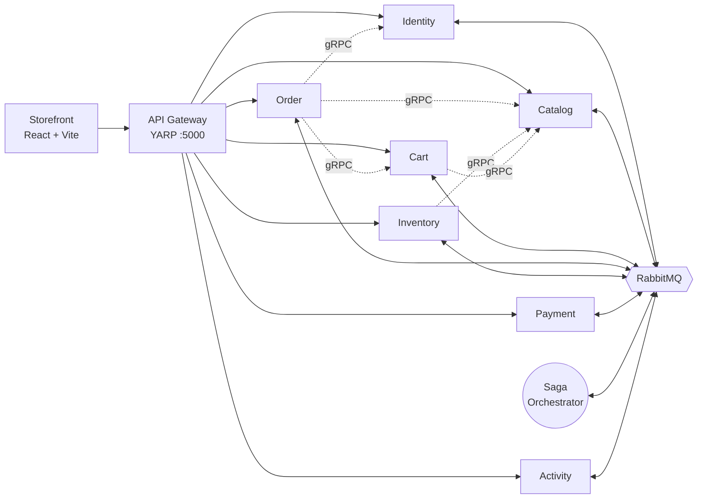

# Project overview

## What this is

A camera marketplace built as a .NET 10 microservices system with a React storefront. Shoppers browse
and buy cameras, lenses and accessories in Vietnamese or English and pay in dong or dollars; independent
sellers open shops, list products, stock them, ship their own parcels and are paid out a share; staff
moderate what sellers publish, look after accounts and follow how the shop is doing.

It is a **practice project**: its purpose is to build, and to understand, the parts of a real
distributed commerce system that are hard to get right - a checkout that spans several services and
cannot lose money or stock, messaging that survives redelivery and reordering, authorization that cannot
be talked around, releases that can be rolled back - rather than to ship a product. Two things a real
shop would need are deliberately left out: a real payment provider (Payment is a stub that approves
without moving money) and a deployment to an environment.

## Principles

Every design is checked against a ratified [constitution](../../.specify/memory/constitution.md). Its
five principles, and what they mean in this code:

| Principle | In practice |
| :-- | :-- |
| **I. Service autonomy** | Each service owns its data in its own PostgreSQL database; no service reads another's tables. They talk through messages, and synchronously over gRPC only where an answer is needed now. |
| **II. Clean Architecture** | Every service is Domain → Application → Infrastructure → WebApi. Use cases are MediatR commands and queries; controllers only send them. |
| **III. Atomic writes, idempotent messaging** (non-negotiable) | A change and the messages announcing it commit in one transaction (the transactional outbox). Every consumer survives a message delivered twice or out of order. |
| **IV. Identity comes from the token** | Who is acting is never read from a request body: not the customer, not the seller, not the price. |
| **V. Evidence over assumption** | A claim that something works is a test that fails when it does not - against a real database, through the real gateway, across real services. |

## Who uses it

| Role | Can |
| :-- | :-- |
| **Visitor** | Browse and search the catalogue in Vietnamese or English, in dong or dollars; read reviews |
| **Customer** | Keep a cart and an address book; check out; follow an order parcel by parcel; cancel while nothing has shipped; confirm a parcel arrived; review what they received; apply to open a shop; get notifications |
| **Seller** | Everything a customer can, plus: list products with variants, photographs, translations and two price lists; stock them; see their own sales; prepare and ship their own parcels; see what they are owed and have been paid |
| **Moderator** | Approve or reject shop applications and products; take a product down; hide a review; lock an account for up to 30 days; see their own recent decisions |
| **Administrator** | Everything a moderator can, plus: grant or revoke Moderator; ban; fulfil the shop's own parcels; record payouts to sellers; read the audit log; the insights Overview |
| **The system** | Settle orders on the payment outcome; release expired stock reservations; take parcels as delivered after a week; record everything that matters in the audit log |

## The system at a glance

Nine processes: the gateway and eight services, each with its own database (the Orchestrator's holds
saga state). The storefront talks only to the gateway. Services talk mostly through RabbitMQ; the dotted
lines are the five synchronous calls (to four gRPC services), each made on behalf of a request that needs
the answer before it can continue. Details: [microservices design](../architecture/microservices-design.md) and
[service-to-service communication](../architecture/service-to-service-communication.md).

| Service | Owns |
| :-- | :-- |
| Identity | Accounts, roles, sessions, delivery addresses, seller profiles, shop applications, moderation state |
| Catalog | Categories, products, variants, prices per currency, translations, images, product review status, ratings and reviews, product views |
| Cart | One cart per customer (no prices) |
| Order | Orders, their frozen prices, words and addresses; shipment parts per seller; commission and payouts; insights |
| Inventory | Stock and reservations |
| Payment | Payments and refunds (stub gateway) |
| Orchestrator | The checkout saga's state |
| Activity | The audit log and every person's notifications |

## Technology

| Concern | Choice |
| :-- | :-- |
| Backend | .NET 10, ASP.NET Core Web API, C# |
| Data | PostgreSQL 16, one database per service, EF Core with Fluent API mappings and migrations |
| Messaging | RabbitMQ with MassTransit 8: transactional outbox and inbox, a saga state machine |
| Synchronous calls | gRPC over h2c on a second port per serving service |
| Gateway | YARP |
| Use cases | MediatR commands and queries, FluentValidation, a shared validation pipeline |
| Errors | RFC 7807 Problem Details from one shared exception handler |
| Auth | JWT access tokens in memory, rotating refresh tokens in an HttpOnly cookie, reuse detection |
| Observability | OpenTelemetry logs and traces to Seq; one trace per checkout across HTTP, gRPC and the broker |
| Storefront | React 19, TypeScript, Vite, Tailwind CSS v4, shadcn/ui, axios, TanStack Query, react-i18next |
| Tests | xUnit against real PostgreSQL; Vitest + Testing Library; Bruno; end-to-end shell scripts |
| Delivery | Docker (one Dockerfile for every service), GitHub Actions, images published to GHCR with immutable tags |

## By the numbers (2026-09-24)

| | |
| :-- | :-- |
| Services | 8, plus the gateway |
| HTTP endpoints | 107 ([reference](../reference/api.md)) |
| Integration messages | 20 ([reference](../reference/messages.md)) |
| gRPC services | 4 ([reference](../reference/grpc.md)) |
| Database tables (excluding outbox) | 33 ([reference](../reference/data-model.md)) |
| Service integration tests | 511 |
| Storefront unit tests | 232 |
| Bruno requests | 190 |
| Design records (`specs/`) | 42 |
| Merged pull requests | 60 |

## Status

**Built and verified:** everything in the table of roles above. The feature-by-feature record is the
[timeline](../project/timeline.md); how each area works is under [features](../README.md#features).

**Deliberately deferred:** a real payment provider, and deployment.

**Open work:** the [backlog](../project/backlog.md) - most urgently password reset and email (the
system sends none), limits on sign-in attempts, returns after delivery and discounts.

## Where to read next

- New to the code: [getting started](../guides/getting-started.md), then
  [microservices design](../architecture/microservices-design.md).
- Understanding a feature: its page under [features](../README.md#features), then its design record in
  `specs/`.
- Why something is the way it is: the [decision log](../project/decisions.md).
- Terms used throughout: the [glossary](glossary.md).
