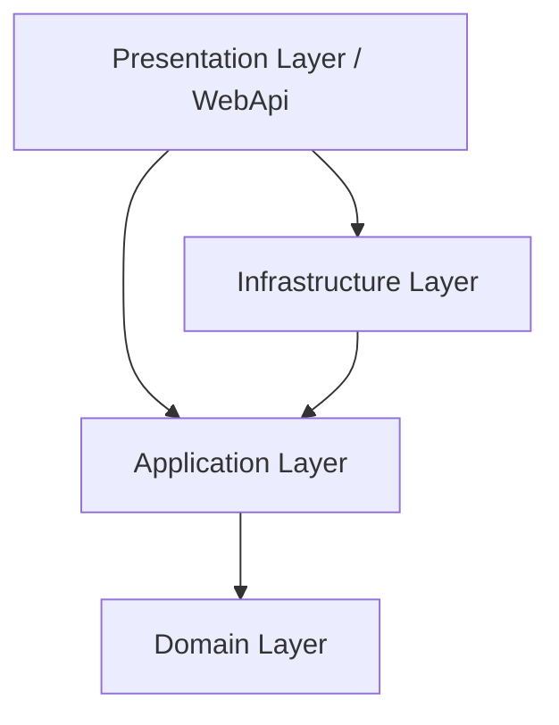

# ASP.NET Core Clean Architecture Setup Guide

This guide provides step-by-step instructions on setting up an ASP.NET Core application using the principles of Clean Architecture.

---

## 1. Architectural Overview

Clean Architecture divides the application into distinct layers, each with a specific responsibility. The core rule is that **dependencies flow inwards**: inner layers cannot depend on outer layers.



### Layer Responsibilities

| Layer | Responsibility | Allowed Dependencies | Common Contents |
| :--- | :--- | :--- | :--- |
| **Domain** | Core business logic & enterprise rules | None | Entities, Value Objects, Enums, Domain Events, Repository Interfaces |
| **Application** | Application use-cases & business flow orchestration | Domain | CQRS Commands/Queries, Handlers, DTOs, Mappers, Validators, Application Interfaces |
| **Infrastructure** | Database access, external APIs, security | Application, Domain | DbContext, Migrations, Repository Implementations, Identity/Auth Services, Email/File Service |
| **Presentation (WebApi)** | HTTP Entry point, controllers, configurations | Infrastructure, Application | Controllers, Minimal APIs, Middleware, Program.cs, AppSettings |

---

## 2. Prerequisites

Before starting, ensure you have the following installed on your machine:
- [.NET 10.0 SDK](https://dotnet.microsoft.com/download) or later
- An IDE/Editor (VS Code, Visual Studio, or JetBrains Rider)

---

## 3. Initial Setup Steps

Run the following commands in your terminal from the workspace root to bootstrap the solution and projects.

### Step 3.1: Create the Solution
Create a new solution file (`.sln`) to group and manage all projects:
```bash
dotnet new sln -n Ecommerce
```

### Step 3.2: Create the Projects
Create each project layer in the `src/` directory:
```bash
dotnet new classlib -o src/Ecommerce.Domain
dotnet new classlib -o src/Ecommerce.Application
dotnet new classlib -o src/Ecommerce.Infrastructure
dotnet new webapi -o src/Ecommerce.WebApi
```

### Step 3.3: Set Up Project Dependencies
Establish references between the projects according to the dependency rule:
```bash
# Application depends only on Domain
dotnet add src/Ecommerce.Application/Ecommerce.Application.csproj reference src/Ecommerce.Domain/Ecommerce.Domain.csproj

# Infrastructure depends on Application (and transitively Domain)
dotnet add src/Ecommerce.Infrastructure/Ecommerce.Infrastructure.csproj reference src/Ecommerce.Application/Ecommerce.Application.csproj

# WebApi depends on both Infrastructure and Application
dotnet add src/Ecommerce.WebApi/Ecommerce.WebApi.csproj reference src/Ecommerce.Infrastructure/Ecommerce.Infrastructure.csproj
dotnet add src/Ecommerce.WebApi/Ecommerce.WebApi.csproj reference src/Ecommerce.Application/Ecommerce.Application.csproj
```

### Step 3.4: Add Projects to Solution
Link all the created projects to the solution file:
```bash
dotnet sln Ecommerce.sln add src/Ecommerce.Domain/Ecommerce.Domain.csproj
dotnet sln Ecommerce.sln add src/Ecommerce.Application/Ecommerce.Application.csproj
dotnet sln Ecommerce.sln add src/Ecommerce.Infrastructure/Ecommerce.Infrastructure.csproj
dotnet sln Ecommerce.sln add src/Ecommerce.WebApi/Ecommerce.WebApi.csproj
```

---

## 4. Verification

To verify that the project setup was successful, perform a build on the entire solution:

```bash
dotnet build Ecommerce.sln
```

To run the Web API presentation layer:

```bash
dotnet run --project src/Ecommerce.WebApi/Ecommerce.WebApi.csproj
```

---

## 5. Next Steps

1. **Review Architecture Roadmap**: Read the [E-commerce Architecture Guide](./ecommerce-architecture.md) to understand the high-level roadmap and core modules.
2. **Database Setup (PostgreSQL & Docker)**: Setup and run your local PostgreSQL instance via Docker Compose. Refer to the [Database Setup Guide](./database-setup.md) for instructions.
3. **Review Auth & Database Schema**: Review the [Authentication Database Design](./auth-db-design.md) for detailed database tables, fields, and implementation map.
4. **JWT Authentication Guide**: Read the [JWT Authentication Guide](./jwt-authentication.md) to understand the security packages, appsettings configurations, and middleware setup.
5. **Configure Entity Framework Core**: Add EF Core packages to the `Infrastructure` project and configure your Database Context.
6. **Implement your Domain Entities**: Define core models inside the `Domain` project.
7. **Register Services (DI)**: Wire up interfaces and concrete implementations in `WebApi`'s `Program.cs`.
8. **Troubleshooting Guide**: Consult the [Troubleshooting Guide](./troubleshooting.md) if you encounter any compilation or namespace errors during development.
