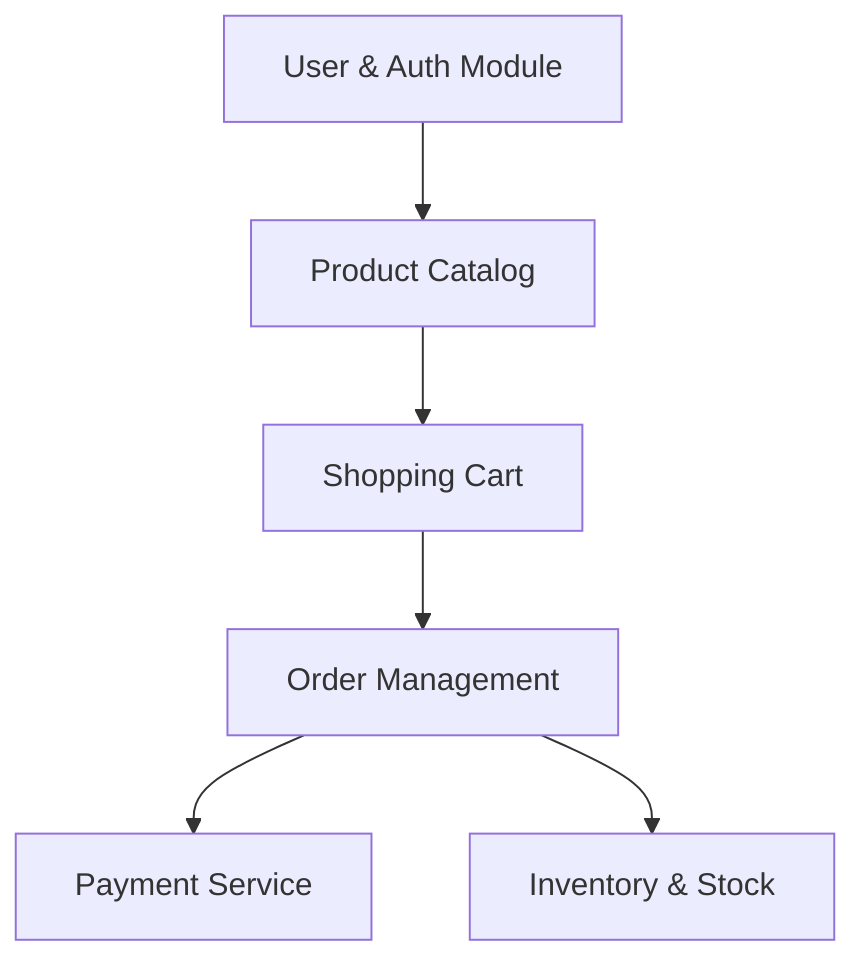

# E-commerce System Architecture & Ideas

This document outlines the high-level functional ideas and system architecture for the E-commerce system, serving as a roadmap for development.

---

## 1. System Modules (Domain Areas)

To build a robust and scaleable E-commerce platform, we divide it into key functional modules:

### Module Breakdown

| Module | Core Features | Key Entities |
| :--- | :--- | :--- |
| **User & Auth** | Registration, login, role-based access, JWT validation, refresh tokens. | `User`, `Role`, `RefreshToken` |
| **Product Catalog** | Categories, product management, search, filtering, price, dynamic attributes. | `Product`, `Category`, `ProductImage` |
| **Cart & Ordering** | Adding items to cart, checkout, order summary, tracking, order history. | `Cart`, `CartItem`, `Order`, `OrderItem` |
| **Payment** | Checkout integration (Stripe, PayPal), webhook handling, transaction logging. | `Payment`, `Transaction` |
| **Inventory** | Stock tracking, reservations during checkout, low stock alerts. | `Inventory`, `StockMovement` |

---

## 2. Technical Stack & Patterns

- **Framework**: .NET 10.0 (ASP.NET Core Web API)
- **Database**: PostgreSQL (relational database suited for transaction consistency)
- **Architecture**: Clean Architecture (Domain-Centric)
- **Design Patterns**:
  - **CQRS (Command Query Responsibility Segregation)**: Separating write operations (Commands) from read operations (Queries) using **MediatR**.
  - **Repository Pattern**: Abstracting data access.
  - **Fluent Validation**: For request validation in the Application layer.
  - **Mapster or AutoMapper**: For mapping between Entities and DTOs.

---

## 3. Recommended Roadmap & Approach

We will build the system iteratively using a feature-first approach within each Clean Architecture layer:

### Phase 1: Core Foundation & Auth (Current)
- [x] Bootstrapping Clean Architecture project structure.
- [x] Spin up local PostgreSQL container using Docker.
- [x] Create User, Role, and RefreshToken domain entities.
- [x] Configure Entity Framework Core with Fluent API configurations.
- [x] Implement UserRepository and configure Dependency Injection.
- [x] Create and apply initial EF Core database migration.
- [ ] Implement Password Hashing and JWT Token services.
- [ ] Implement User Registration and Login flow ([Auth Design Guide](./auth-db-design.md)).

### Phase 2: Product & Catalog
- [ ] Database schema for Products and Categories.
- [ ] CRUD endpoints for managing catalog (Admin).
- [ ] Search and filter endpoints (Customer).

### Phase 3: Cart & Checkout
- [ ] Redis or Database backed Shopping Cart.
- [ ] Order creation logic, calculating totals, state machine for Order Status (Pending, Paid, Shipped, Cancelled).

### Phase 4: Payments & External Integrations
- [ ] Integrating Stripe API.
- [ ] Processing webhooks to update order statuses.
