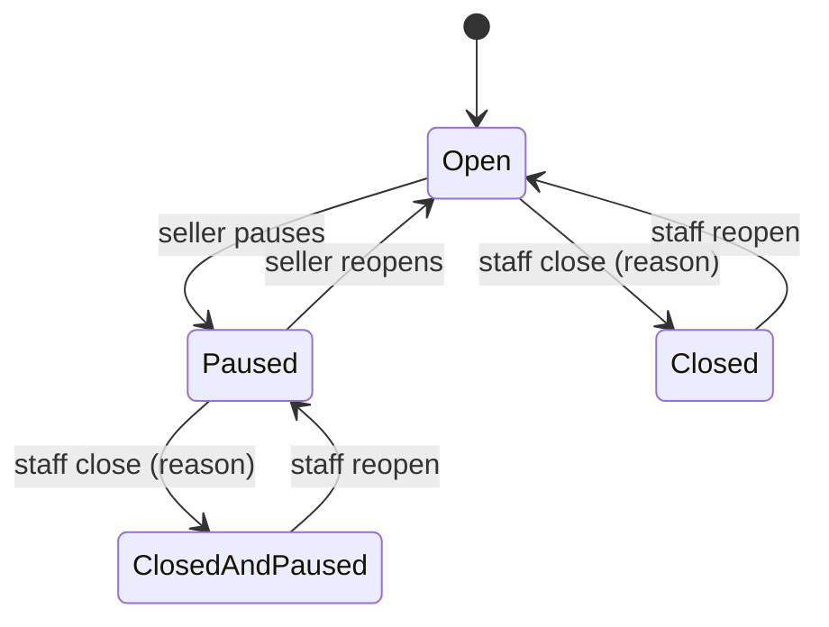

# Data model: A seller pauses their shop, and staff close one

## `sellers` (Catalog) - four nullable columns

| Column | Type | Meaning |
| :-- | :-- | :-- |
| `PausedAt` | `timestamptz` null | When the seller paused. Null means not paused. |
| `ClosedAt` | `timestamptz` null | When staff closed the shop. Null means not closed. |
| `ClosedReason` | `varchar(500)` null | What the seller reads. Set together with `ClosedAt`. |
| `ClosedBy` | `uuid` null | The staff member who closed it. |

Migration `AddShopPauseAndClosure`: add only. Every existing row is open.

## `products.SellerSuspended` (Catalog) - no schema change, a wider meaning

It used to mean "the seller is banned". It now means "the seller's shop is not open": suspended, paused or closed.

- It is written only by `SellerRepository.ApplyShopStateAsync`, which is the single statement in research D2.
- It is also set by the approving `UPDATE` in `TryReviewAsync`.

## States

A ban (`Suspended`) is a third flag, independent of both. The shop is on the shelf only in `Open` with no ban.

## Guarded statements

| Move | Statement guard | Refused as |
| :-- | :-- | :-- |
| Seller pauses | `"PausedAt" IS NULL AND "ClosedAt" IS NULL AND "ShopName" <> ''` | 404 unknown / 409 closed / 409 already paused |
| Seller reopens | `"PausedAt" IS NOT NULL AND "ClosedAt" IS NULL` | 404 / 409 closed / 409 not paused |
| Staff close | `"ClosedAt" IS NULL AND "ShopName" <> ''` | 404 / 409 already closed |
| Staff reopen | `"ClosedAt" IS NOT NULL` | 404 / 409 not closed |

Each move runs in one transaction, in this order:

1. The guarded `UPDATE` on `sellers`.
2. `ApplyShopStateAsync`.
3. The staged audit entry, notices and saver notices.
4. `SaveChanges`, which writes the outbox.
5. Commit.
