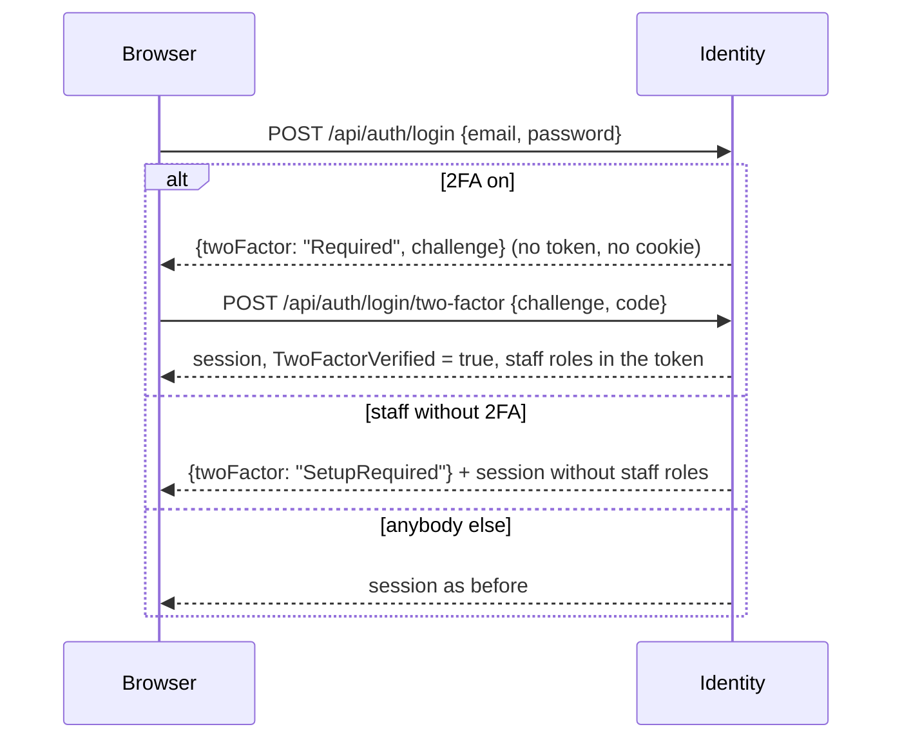

# Data model: Staff sign in with a second factor

All changes are in `ecommerce_identity_db`, in migration `AddTwoFactor`. It only adds: an earlier image ignores the
new columns and tables.

## `users` - three nullable columns

| Column | Type | Meaning |
| :-- | :-- | :-- |
| `TwoFactorSecret` | `text` null | AES-GCM `nonce‖ciphertext‖tag`, base64. Set by setup; kept after confirmation. |
| `TwoFactorEnabledAt` | `timestamptz` null | Set by confirmation. While null, a stored secret is a setup in progress. |
| `TwoFactorLastStep` | `bigint` null | The 30-second window of the last code accepted (replay guard). |

## `refresh_tokens` - one column

| Column | Type | Meaning |
| :-- | :-- | :-- |
| `TwoFactorVerified` | `boolean` not null default `false` | The session was established with a second factor. Staff roles are issued only from such a session. Rotation copies it. |

## `two_factor_recovery_codes` (new)

| Column | Type | Notes |
| :-- | :-- | :-- |
| `Id` | `uuid` | PK |
| `UserId` | `uuid` | FK `users`, cascade; indexed |
| `CodeHash` | `varchar(64)` | SHA-256 hex of the normalised code |
| `CreatedAt` | `timestamptz` | |
| `UsedAt` | `timestamptz` null | Spent by `UPDATE ... WHERE "UsedAt" IS NULL` |

## `two_factor_challenges` (new)

| Column | Type | Notes |
| :-- | :-- | :-- |
| `Id` | `uuid` | PK |
| `UserId` | `uuid` | FK `users`, cascade |
| `TokenHash` | `varchar(64)` | SHA-256 hex; unique |
| `ExpiresAt` | `timestamptz` | 5 minutes after the right password |
| `FailedAttempts` | `int` | Refused at 5 |
| `UsedAt` | `timestamptz` null | Claimed once |

## States of an account's second factor

```mermaid
stateDiagram-v2
    [*] --> Off
    Off --> SettingUp: setup (secret stored, EnabledAt null)
    SettingUp --> SettingUp: setup again (new secret)
    SettingUp --> On: confirm with a code (recovery codes issued, other sessions end)
    On --> Off: owner turns it off (password + code; not staff)
    On --> Off: an administrator resets it (staff; sessions end, owner emailed)
```

## Sign-in

